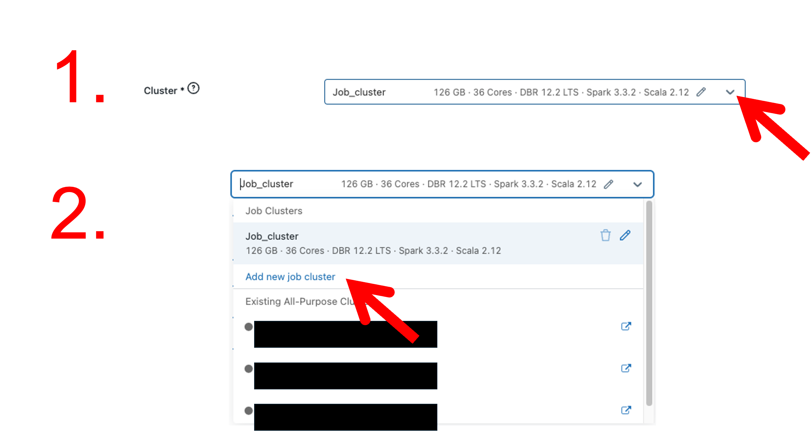
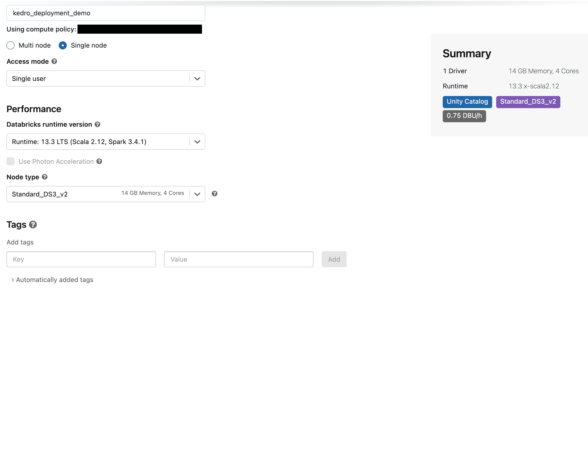
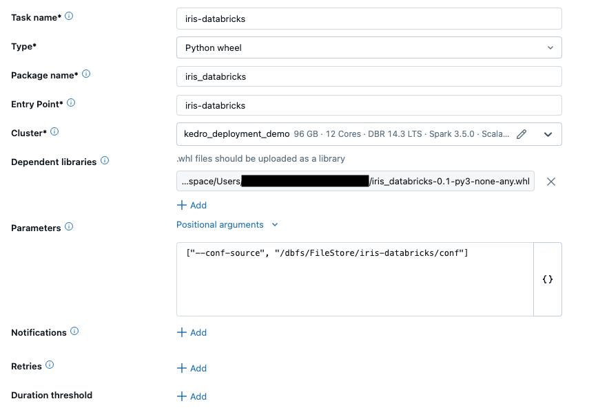

# Use a Databricks job to deploy a Kedro project

Databricks jobs are a way to execute code on Databricks clusters, allowing you to run data processing tasks, ETL jobs, or machine learning workflows. In this guide, we explain how to package and run a Kedro project as a job on Databricks.

## What are the advantages of packaging a Kedro project to run on Databricks?

Packaging your Kedro project and running it on Databricks enables you to execute your pipeline without a notebook. This approach is particularly well-suited for production, as it provides a structured and reproducible way to run your code.

Here are some typical use cases for running a packaged Kedro project as a Databricks job:

- **Data engineering pipeline**: the output of your Kedro project is a file or set of files containing cleaned and processed data.
- **Machine learning with MLflow**: your Kedro project runs an ML model; metrics about your experiments are tracked in MLflow.
- **Automated and scheduled runs**: your Kedro project should be [run on Databricks automatically](https://docs.databricks.com/workflows/jobs/schedule-jobs.html#add-a-job-schedule).
- **CI/CD integration**: you have a CI/CD pipeline that produces a packaged Kedro project.

Running your packaged project as a Databricks job is very different from running it from a Databricks notebook. The Databricks job cluster has to be provisioned and started for each run, which is significantly slower than running it as a notebook on a cluster that has already been started. In addition, there is no way to change your project's code once it has been packaged. Instead, you must change your code, create a new package, and then upload it to Databricks again.

For those reasons, the packaging approach is unsuitable for development projects where rapid iteration is necessary. For guidance on developing a Kedro project for Databricks in a rapid build-test loop, see the [development workflow guide](./databricks_ide_development_workflow.md).

## What this page covers

- [Set up your Kedro project for deployment on Databricks](#set-up-your-project-for-deployment-to-databricks).
- [Run your project as a job using the Databricks workspace UI](#deploy-and-run-your-kedro-project-using-the-workspace-ui).
- [Resources for automating your Kedro deployments to Databricks](#resources-for-automatically-deploying-to-databricks).

## Prerequisites

- An active [Databricks deployment](https://docs.databricks.com/getting-started/index.html).
- [`conda` installed](https://docs.conda.io/projects/conda/en/latest/user-guide/install/index.html) on your local machine in order to create a virtual environment with a specific version of Python (>= 3.7 is required). If you have Python >= 3.7 installed, you can use other software to create a virtual environment.

## Set up your project for deployment to Databricks

The sequence of steps described in this section is as follows:

1. [Note your Databricks username and host](#note-your-databricks-username-and-host)
2. [Install Kedro and the Databricks CLI in a new virtual environment](#install-kedro-and-the-databricks-cli-in-a-new-virtual-environment)
3. [Authenticate the Databricks CLI](#authenticate-the-databricks-cli)
4. [Create a new Kedro project](#create-a-new-kedro-project)
5. [Create an entry point for Databricks](#create-an-entry-point-for-databricks)
6. [Package your project](#package-your-project)
7. [Upload project data and configuration to DBFS](#upload-project-data-and-configuration-to-dbfs)

### Note your Databricks username and host

Note your Databricks **username** and **host** as you will need it for the remainder of this guide.

Find your Databricks username in the top right of the workspace UI and the host in the browser's URL bar, up to the first slash (e.g., `https://adb-123456789123456.1.azuredatabricks.net/`):


```{note}
Your Databricks host must include the protocol (`https://`).
```

### Install Kedro and the Databricks CLI in a new virtual environment

The following commands will create a new `conda` environment, activate it, and then install Kedro and the Databricks CLI.

In your local development environment, create a virtual environment for this tutorial using `conda`:

```bash
conda create --name iris-databricks python=3.10
```

Once it is created, activate it:

```bash
conda activate iris-databricks
```

With your `conda` environment activated, install Kedro and the Databricks CLI:

```bash
pip install kedro databricks-cli
```

### Authenticate the Databricks CLI

**Now, you must authenticate the Databricks CLI with your Databricks instance.**

[Refer to the Databricks documentation](https://docs.databricks.com/en/dev-tools/cli/authentication.html) for a complete guide on how to authenticate your CLI. The key steps are:

1. Create a personal access token for your user on your Databricks instance.
2. Run `databricks configure --token`.
3. Enter your token and Databricks host when prompted.
4. Run `databricks fs ls dbfs:/` at the command line to verify your authentication.

### Create a new Kedro project

Create a Kedro project by using the following command in your local environment:

```bash
kedro new --starter=databricks-iris
```

This command creates a new Kedro project using the `databricks-iris` starter template. Name your new project `iris-databricks` for consistency with the rest of this guide.

 ```{note}
 If you are not using the `databricks-iris` starter to create a Kedro project, **and** you are working with a version of Kedro **earlier than 0.19.0**, then you should [disable file-based logging](https://docs.kedro.org/en/0.18.14/logging/logging.html#disable-file-based-logging) to prevent Kedro from attempting to write to the read-only file system.
 ```

### Create an entry point for Databricks

The default entry point of a Kedro project uses a Click command line interface (CLI), which is not compatible with Databricks. To run your project as a Databricks job, you must define a new entry point specifically for use on Databricks.

The `databricks-iris` starter has this entry point pre-built, so there is no extra work to do here, but generally you must **create an entry point manually for your own projects using the following steps**:

1. **Create an entry point script**: Create a new file in `<project_root>/src/iris_databricks` named `databricks_run.py`. Copy the following code to this file:

```python
import argparse
import logging

from kedro.framework.project import configure_project
from kedro.framework.session import KedroSession


def main():
    parser = argparse.ArgumentParser()
    parser.add_argument("--env", dest="env", type=str)
    parser.add_argument("--conf-source", dest="conf_source", type=str)
    parser.add_argument("--package-name", dest="package_name", type=str)

    args = parser.parse_args()
    env = args.env
    conf_source = args.conf_source
    package_name = args.package_name

    # https://kb.databricks.com/notebooks/cmd-c-on-object-id-p0.html
    logging.getLogger("py4j.java_gateway").setLevel(logging.ERROR)
    logging.getLogger("py4j.py4j.clientserver").setLevel(logging.ERROR)

    configure_project(package_name)
    with KedroSession.create(env=env, conf_source=conf_source) as session:
        session.run()


if __name__ == "__main__":
    main()
```

2. **Define a new entry point**: Open `<project_root>/pyproject.toml` in a text editor or IDE and add a new line in the `[project.scripts]` section, so that it becomes:

```python
[project.scripts]
databricks_run = "<package_name>.databricks_run:main"
```

Remember to replace <package_name> with the correct package name for your project.

This process adds an entry point to your project which can be used to run it on Databricks.

```{note}
Because you are no longer using the default entry-point for Kedro, you will not be able to run your project with the options it usually provides. Instead, the `databricks_run` entry point in the above code and in the `databricks-iris` starter contains a simple implementation of two options:
- `--package_name` (required): the package name (defined in `pyproject.toml`) of your packaged project.
- `--env`: specifies a [Kedro configuration environment](../../configuration/configuration_basics.md#configuration-environments) to load for your run.
- `--conf-source`: specifies the location of the `conf/` directory to use with your Kedro project.
```

### Package your project

To package your Kedro project for deployment on Databricks, you must create a Wheel (`.whl`) file, which is a binary distribution of your project. In the root directory of your Kedro project, run the following command:

```bash
kedro package
```

This command generates a `.whl` file in the `dist` directory within your project's root directory.

### Upload project data and configuration to DBFS

```{note}
A Kedro project's configuration and data do not get included when it is packaged. They must be stored somewhere accessible to allow your packaged project to run.
```

Your packaged Kedro project needs access to data and configuration in order to run. Therefore, you will need to upload your project's data and configuration to a location accessible to Databricks. In this guide, we will store the data on the Databricks File System (DBFS).

The `databricks-iris` starter contains a [catalog](../../data/data_catalog.md) that is set up to access data stored in DBFS (`<project_root>/conf/`). You will point your project to use configuration stored on DBFS using the `--conf-source` option when you create your job on Databricks.

There are several ways to upload data to DBFS: you can use the [DBFS API](https://learn.microsoft.com/en-us/azure/databricks/dev-tools/api/latest/dbfs), the [`dbutils` module](https://docs.databricks.com/dev-tools/databricks-utils.html) in a Databricks notebook or the [Databricks CLI](https://docs.databricks.com/archive/dev-tools/cli/dbfs-cli.html). In this guide, it is recommended to use the Databricks CLI because of the convenience it offers.

- **Upload your project's data and config**: at the command line in your local environment, use the following Databricks CLI commands to upload your project's locally stored data and configuration to DBFS:

```bash
databricks fs cp --recursive <project_root>/data/ dbfs:/FileStore/iris-databricks/data
databricks fs cp --recursive <project_root>/conf/ dbfs:/FileStore/iris-databricks/conf
```

The `--recursive` flag ensures that the entire folder and its contents are uploaded. You can list the contents of the destination folder in DBFS using the following command:

```bash
databricks fs ls dbfs:/FileStore/iris-databricks/data
```

You should see the contents of the project's `data/` directory printed to your terminal:

```bash
01_raw
02_intermediate
03_primary
04_feature
05_model_input
06_models
07_model_output
08_reporting
```

## Deploy and run your Kedro project using the workspace UI

To run your packaged project on Databricks, login to your Databricks account and perform the following steps in the workspace:

1. [Create a new job](#create-a-new-job)
2. [Create a new job cluster specific to your job](#create-a-new-job-cluster-specific-to-your-job)
3. [Configure the job](#configure-the-job)
4. [Run the job](#run-the-job)

### Create a new job

In the Databricks workspace, navigate to the `Workflows` tab and click `Create Job` **or** click the `New` button, then `Job`:


### Create a new job cluster specific to your job

Create a dedicated [job cluster](https://docs.databricks.com/clusters/index.html) to run your job by clicking on the drop-down menu in the `Cluster` field and then clicking `Add new job cluster`:

**Do not use the default `Job_cluster`, it has not been configured to run this job.**



Once you click `Add new job cluster`, the configuration page for this cluster appears.

Configure the job cluster with the following settings:

- In the `name` field enter `kedro_deployment_demo`.
- Select the radio button for `Single node`.
- Select the runtime `13.3 LTS` in the `Databricks runtime version` field.
- In the `Advanced options` section, under the `Spark` tab, locate the `Environment variables` field. Add the following line:
`KEDRO_LOGGING_CONFIG="/dbfs/FileStore/iris-databricks/conf/logging.yml"`
Here, ensure you specify the correct path to your custom logging configuration. This step is crucial because the default Kedro logging configuration incorporates the rich library, which is incompatible with Databricks jobs. In the `databricks-iris` Kedro starter, the `rich` handler in `logging.yml` is altered to a `console` handler for compatibility. For additional information about logging configurations, refer to the [Kedro Logging Manual](https://docs.kedro.org/en/stable/logging/index.html).
- Leave all other settings with their default values in place.

The final configuration for the job cluster should look the same as the following:



### Configure the job

Configure the job with the following settings:

- Enter `iris-databricks` in the `Name` field.
- In the dropdown menu for the `Type` field, select `Python wheel`.
- In the `Package name` field, enter `iris_databricks`. This is the name of your package as defined in your project's `src/setup.py` file.
- In the `Entry Point` field, enter `databricks_run`. This is the name of the [entry point](#create-an-entry-point-for-databricks) to run your package from.
- Ensure the job cluster you created in step two is selected in the dropdown menu for the `Cluster` field.
- In the `Dependent libraries` field, click `Add` and upload [your project's `.whl` file](#package-your-project), making sure that the radio buttons for `Upload` and `Python Whl` are selected for the `Library Source` and `Library Type` fields.
- In the `Parameters` field, enter the following list of runtime options:

```bash
["--conf-source", "/dbfs/FileStore/iris-databricks/conf", "--package-name", "iris_databricks"]
```

The final configuration for your job should look the same as the following:



Click `Create` and then `Confirm and create` in the following pop-up asking you to name the job.

### Run the job

Click `Run now` in the top-right corner of your new job's page to start a run of the job. The status of your run can be viewed in the `Runs` tab of your job's page. Navigate to the `Runs` tab and track the progress of your run:


This page also shows an overview of all past runs of your job. As you only just started your job run, it's status will be `Pending`. A status of `Pending` indicates that the cluster is being started and your code is waiting to run.

The following things happen when you run your job:

- The job cluster is provisioned and started (job status: `Pending`).
- The packaged Kedro project and all its dependencies are installed (job status: `Pending`)
- The packaged Kedro project is run from the specified `databricks_run` entry point (job status: `In Progress`).
- The packaged code finishes executing and the job cluster is stopped (job status: `Succeeded`).

A run will take roughly six to seven minutes.

When the status of your run is `Succeeded`, your job has successfully finished executing. You can view the logging output created by the run by clicking on the link with the text `Go to the latest successful run` to take you to the `main run` view. You should see logs similar to the following:

```bash
...
2023-06-06 12:56:14,399 - iris_databricks.nodes - INFO - Model has an accuracy of 0.972 on test data.
2023-06-06 12:56:14,403 - kedro.runner.sequential_runner - INFO - Completed 3 out of 3 tasks
2023-06-06 12:56:14,404 - kedro.runner.sequential_runner - INFO - Pipeline execution completed successfully.
```

By following these steps, you packaged your Kedro project and manually ran it as a job on Databricks using the workspace UI.

## Resources for automatically deploying to Databricks

Up to this point, this page has described a manual workflow for deploying and running a project on Databricks. The process can be automated in two ways:

- [Use the Databricks API](#how-to-use-the-databricks-api-to-automatically-deploy-a-kedro-project).
- [Use the Databricks CLI](#how-to-use-the-databricks-cli-to-automatically-deploy-a-kedro-project).

Both of these methods enable you to store information about your job declaratively in the same version control system as the rest of your project. For each method, the information stored declaratively is the same as what is entered manually in the [above section on creating and running a job in Databricks](#deploy-and-run-your-kedro-project-using-the-workspace-ui).

These methods can be integrated into a CI/CD pipeline to automatically deploy a packaged Kedro project to Databricks as a job.

### How to use the Databricks API to automatically deploy a Kedro project

The Databricks API enables you to programmatically interact with Databricks services, including job creation and execution. You can use the Jobs API to automate the deployment of your Kedro project to Databricks. The following steps outline how to use the Databricks API to do this:

1. [Set up your Kedro project for deployment on Databricks](#set-up-your-project-for-deployment-to-databricks)
2. Create a JSON file containing your job's configuration.
3. Use the Jobs API's [`/create` endpoint](https://docs.databricks.com/workflows/jobs/jobs-api-updates.html#create) to create a new job.
4. Use the Jobs API's [`/runs/submit` endpoint](https://docs.databricks.com/workflows/jobs/jobs-api-updates.html#runs-submit) to run your newly created job.

### How to use the Databricks CLI to automatically deploy a Kedro project

The Databricks Command Line Interface (CLI) is another way to automate deployment of your Kedro project. The following steps outline how to use the Databricks CLI to automate the deployment of a Kedro project:

1. [Set up your Kedro project for deployment on Databricks.](#set-up-your-project-for-deployment-to-databricks)
2. Install the Databricks CLI and authenticate it with your workspace.
3. Create a JSON file containing your job's configuration.
4. Use the [`jobs create` command](https://docs.databricks.com/archive/dev-tools/cli/jobs-cli.html#create-a-job) to create a new job.
5. Use the [`jobs run-now` command](https://docs.databricks.com/archive/dev-tools/cli/jobs-cli.html#run-a-job) to run your newly created job.

## Summary

This guide demonstrated how to deploy a packaged Kedro project on Databricks. This is a structured and reproducible way to run your Kedro projects on Databricks that can be automated and integrated into CI/CD pipelines.
