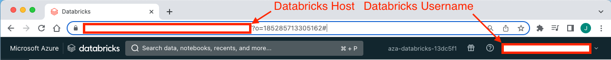
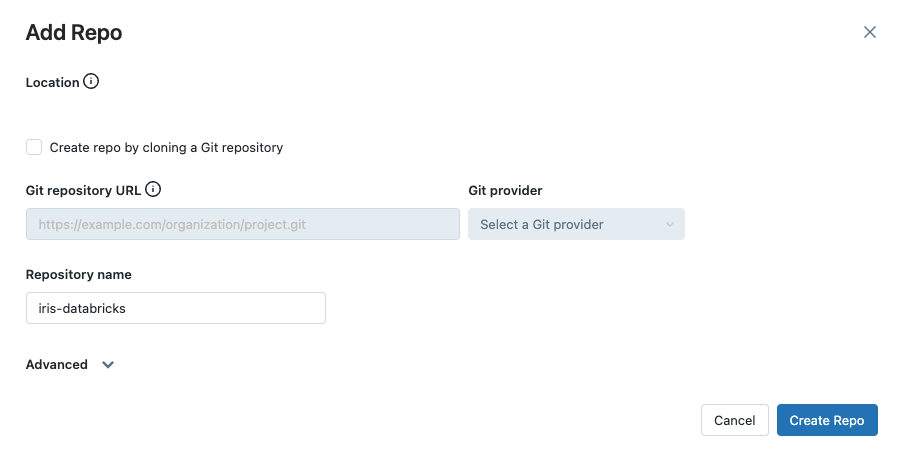
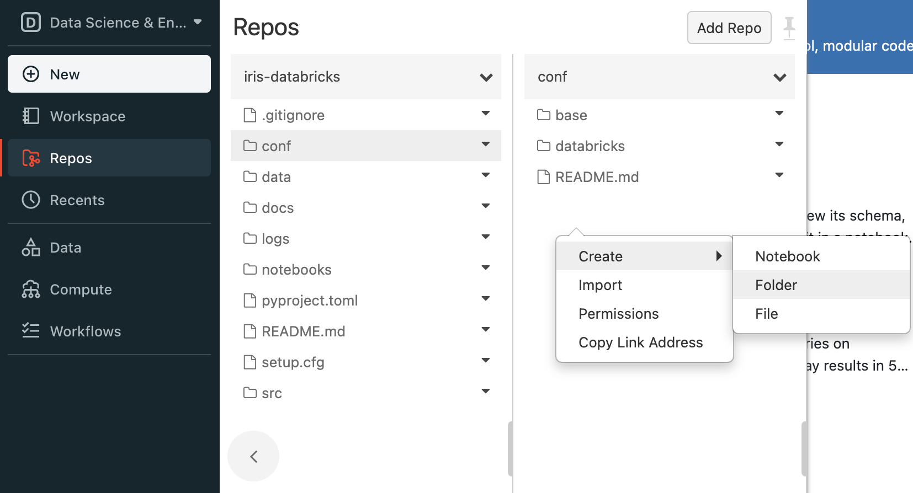
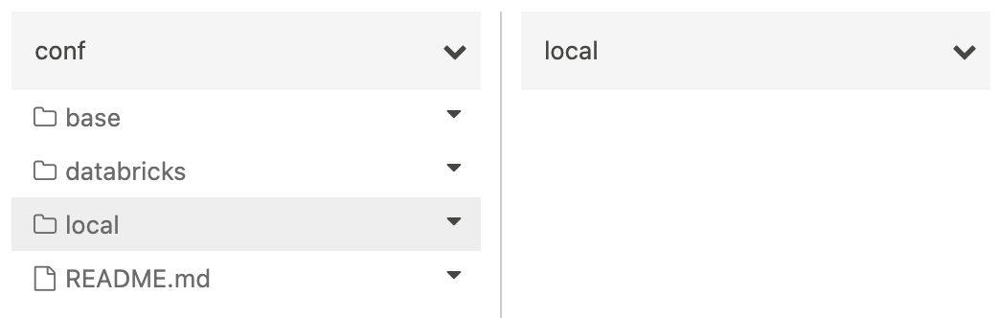
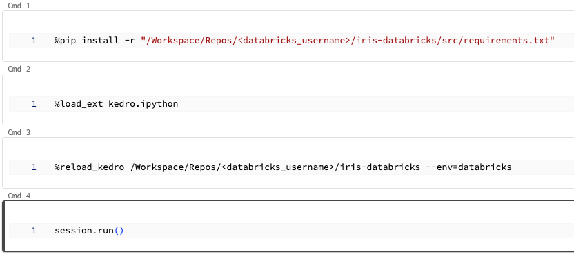

# Use an IDE, dbx and Databricks Repos to develop a Kedro project

This guide demonstrates a workflow for developing Kedro projects on Databricks using your local environment for development, then using dbx and Databricks Repos to sync code for testing on Databricks.

By working in your local environment, you can take advantage of features within an IDE that are not available on Databricks notebooks:

- Auto-completion and suggestions for code, improving your development speed and accuracy.
- Linters like [Ruff](https://docs.astral.sh/ruff) can be integrated to catch potential issues in your code.
- Static type checkers like Mypy can check types in your code, helping to identify potential type-related issues early in the development process.

To set up these features, look for instructions specific to your IDE (for instance, [VS Code](https://code.visualstudio.com/docs/python/linting)).

If you prefer to develop a projects in notebooks rather than an in an IDE, you should follow our guide on [how to develop a Kedro project within a Databricks workspace](./databricks_notebooks_development_workflow.md) instead.

## What this page covers

The main steps in this tutorial are as follows:

- [Create a virtual environment and install and configure dbx.](#install-kedro-and-dbx-in-a-new-virtual-environment)
- [Create a new Kedro project using the `databricks-iris` starter.](#create-a-new-kedro-project)
- [Create a Repo on Databricks and sync your project using dbx.](#create-a-repo-on-databricks)
- [Upload project data to a location accessible by Kedro when run on Databricks (such as DBFS).](#upload-project-data-to-dbfs)
- [Create a Databricks notebook to run your project.](#create-a-new-databricks-notebook)
- [Modify your project in your local environment and test the changes on Databricks in an iterative loop.](#modify-your-project-and-test-the-changes)

## Prerequisites

- An active [Databricks deployment](https://docs.databricks.com/getting-started/index.html).
- A [Databricks cluster](https://docs.databricks.com/clusters/configure.html) configured with a recent version (>= 11.3 is recommended) of the Databricks runtime.
- [Conda installed](https://docs.conda.io/projects/conda/en/latest/user-guide/install/index.html) on your local machine in order to create a virtual environment with a specific version of Python (>= 3.8 is required). If you have Python >= 3.8 installed, you can use other software to create a virtual environment.

## Set up your project

### Note your Databricks username and host

Note your Databricks **username** and **host** as you will need it for the remainder of this guide.

Find your Databricks username in the top right of the workspace UI and the host in the browser's URL bar, up to the first slash (e.g., `https://adb-123456789123456.1.azuredatabricks.net/`):



```{note}
Your databricks host must include the protocol (`https://`).
```

### Install Kedro and dbx in a new virtual environment

In your local development environment, create a virtual environment for this tutorial using Conda:

```bash
conda create --name iris-databricks python=3.10
```

Once it is created, activate it:

```bash
conda activate iris-databricks
```

With your Conda environment activated, install Kedro and dbx:

```bash
pip install kedro dbx --upgrade
```

### Authenticate the Databricks CLI

**Now, you must authenticate the Databricks CLI with your Databricks instance.**

[Refer to the Databricks documentation](https://docs.databricks.com/en/dev-tools/cli/authentication.html) for a complete guide on how to authenticate your CLI. The key steps are:

1. Create a personal access token for your user on your Databricks instance.
2. Run `databricks configure --token`.
3. Enter your token and Databricks host when prompted.
4. Run `databricks fs ls dbfs:/` at the command line to verify your authentication.

```{note}
dbx is an extension of the Databricks CLI, a command-line program for interacting with Databricks without using its UI. You will use dbx to sync your project's code with Databricks. While Git can sync code to Databricks Repos, dbx is preferred for development as it avoids creating new commits for every change, even if those changes do not work.
```

### Create a new Kedro project

Create a Kedro project with the `databricks-iris` starter using the following command in your local environment:

```bash
kedro new --starter=databricks-iris
```

Name your new project `iris-databricks` for consistency with the rest of this guide. This command creates a new Kedro project using the `databricks-iris` starter template.

### Create a Repo on Databricks

Create a new Repo on Databricks by navigating to `New` tab in the Databricks workspace UI side bar and clicking `Repo` in the drop-down menu that appears.

In this guide, you will not sync your project with a remote Git provider, so uncheck `Create repo by cloning a Git repository` and enter `iris-databricks` as the name of your new repository:



### Sync code with your Databricks Repo using dbx

The next step is to use dbx to sync your project to your Repo.

**Open a new terminal instance**, activate your conda environment, and navigate to your project directory and start `dbx sync`:

```bash
conda activate iris-databricks
cd <project_root>
dbx sync repo --dest-repo iris-databricks --source .
```

This command will sync your local directory (`--source .`) with your Repo (`--dest-repo iris-databricks`) on Databricks. When started for the first time, `dbx sync` will write output similar to the following to your terminal:

```bash
...
[dbx][2023-04-13 21:59:48.148] Putting /Repos/<databricks_username>/iris-databricks/src/tests/__init__.py
[dbx][2023-04-13 21:59:48.168] Putting /Repos/<databricks_username>/iris-databricks/src/tests/test_pipeline.py
[dbx][2023-04-13 21:59:48.189] Putting /Repos/<databricks_username>/iris-databricks/src/tests/test_run.py
[dbx][2023-04-13 21:59:48.928] Done. Watching for changes...
```

**Keep the second terminal (running dbx sync) alive during development; closing it stops syncing new changes.**

`dbx sync` will automatically sync any further changes made in your local project directory with your Databricks Repo while it runs.

```{note}
Syncing with dbx is one-way only, meaning changes you make using the Databricks Repos code editor will not be reflected in your local environment. Only make changes to your project in your local environment while syncing, not in the editor that Databricks Repos provides.
```

### Create a `conf/local` directory in your Databricks Repo

Kedro requires your project to have a `conf/local` directory to exist to successfully run, even if it is empty. `dbx sync` does not copy the contents of your local `conf/local` directory to your Databricks Repo, so you must create it manually.

Open the Databricks workspace UI and using the panel on the left, navigate to `Repos -> <databricks_username> -> iris-databricks -> conf`, right click and select `Create -> Folder` as in the image below:



Name the new folder `local`. In this guide, we have no local credentials to store and so we will leave the newly created folder empty. Your `conf/local` and `local` directories should now look like the following:



### Upload project data to DBFS

When run on Databricks, Kedro cannot access data stored in your project's directory. Therefore, you will need to upload your project's data to an accessible location. In this guide, we will store the data on the Databricks File System (DBFS).

The `databricks-iris` starter contains a [catalog](../../data/data_catalog.md) that is set up to access data stored in DBFS (`<project_root>/conf/`). You will point your project to use configuration stored on DBFS using the `--conf-source` option when you create your job on Databricks.

There are several ways to upload data to DBFS. In this guide, it is recommended to use [Databricks CLI](https://docs.databricks.com/dev-tools/cli/dbfs-cli.html) because of the convenience it offers. At the command line in your local environment, use the following Databricks CLI command to upload your locally stored data to DBFS:

```bash
databricks fs cp --recursive <project_root>/data/ dbfs:/FileStore/iris-databricks/data
```

The `--recursive` flag ensures that the entire folder and its contents are uploaded. You can list the contents of the destination folder in DBFS using the following command:

```bash
databricks fs ls dbfs:/FileStore/iris-databricks/data
```

You should see the contents of the project's `data/` directory printed to your terminal:

```bash
01_raw
02_intermediate
03_primary
04_feature
05_model_input
06_models
07_model_output
08_reporting
```

### Create a new Databricks notebook

Now that your project is available on Databricks, you can run it on a cluster using a notebook.

To run the Python code from your Databricks Repo, [create a new Python notebook](https://docs.databricks.com/notebooks/notebooks-manage.html#create-a-notebook) in your workspace. Name it `iris-databricks` for traceability and attach it to your cluster:


### Run your project

Open your newly-created notebook and create **four new cells** inside it. You will fill these cells with code that runs your project. When copying the following code snippets, remember to replace `<databricks_username>` with your username on Databricks such that `project_root` correctly points to your project's location.

1. Before you import and run your Python code, you'll need to install your project's dependencies on the cluster attached to your notebook. Your project has a `requirements.txt` file for this purpose. Add the following code to the first new cell to install the dependencies:

```ipython
%pip install -r "/Workspace/Repos/<databricks_username>/iris-databricks/requirements.txt"
```

2. To run your project in your notebook, you must load the Kedro IPython extension. Add the following code to the second new cell to load the IPython extension:

```ipython
%load_ext kedro.ipython
```

3. Loading the extension allows you to use the `%reload_kedro` line magic to load your Kedro project. Add the following code to the third new cell to load your Kedro project:

```ipython
%reload_kedro /Workspace/Repos/<databricks_username>/iris-databricks
```

4. Loading your Kedro project with the `%reload_kedro` line magic will define four global variables in your notebook: `context`, `session`, `catalog` and `pipelines`. You will use the `session` variable to run your project. Add the following code to the fourth new cell to run your Kedro project:

```ipython
session.run()
```

After completing these steps, your notebook should match the following image:



Run the completed notebook using the `Run All` bottom in the top right of the UI:


On your first run, you will be prompted to consent to analytics, type `y` or `N` in the field that appears and press `Enter`:


You should see logging output while the cell is running. After execution finishes, you should see output similar to the following:

```bash
...
2023-06-06 17:21:53,221 - iris_databricks.nodes - INFO - Model has an accuracy of 0.960 on test data.
2023-06-06 17:21:53,222 - kedro.runner.sequential_runner - INFO - Completed 3 out of 3 tasks
2023-06-06 17:21:53,224 - kedro.runner.sequential_runner - INFO - Pipeline execution completed successfully.
```

## Modify your project and test the changes

Now that your project has run successfully once, you can make changes using the convenience and power of your local development environment. In this section, you will modify the project to use a different ratio of training data to test data and check the effect of this change on Databricks.

### Modify the training / test split ratio

The `databricks-iris` starter uses a default 80-20 ratio of training data to test data when training the classifier. In this section, you will change this ratio to 70-30 by editing your project in your local environment, then sync it with the Databricks Repo using `dbx`, and then run the modified project on Databricks to observe the different result.

Open the file `<project_root>/conf/base/parameters.yml` in your local environment. Edit the line `train_fraction: 0.8` to `train_fraction: 0.7` and save your changes. Look in the terminal where `dbx sync` is running, you should see it automatically sync your changes with your Databricks Repo:

```bash
...
[dbx][2023-04-14 18:29:39.235] Putting /Repos/<databricks_username>/iris-databricks/conf/base/parameters.yml
[dbx][2023-04-14 18:29:40.820] Done
```

### Re-run your project

Return to your Databricks notebook. Re-run the third and fourth cells in your notebook (containing the code `%reload_kedro ...` and `session.run()`). The project will now run again, producing output similar to the following:

```bash
...
2023-06-06 17:23:19,561 - iris_databricks.nodes - INFO - Model has an accuracy of 0.972 on test data.
2023-06-06 17:23:19,562 - kedro.runner.sequential_runner - INFO - Completed 3 out of 3 tasks
2023-06-06 17:23:19,564 - kedro.runner.sequential_runner - INFO - Pipeline execution completed successfully.
```

You can see that your model's accuracy has changed now that you are using a different classifier to produce the result.

```{note}
If your cluster terminates, you must re-run your entire notebook, as libraries installed using `%pip install ...` are ephemeral. If not, repeating this step is only necessary if your project's requirements change.
```

## Summary

This guide demonstrated a development workflow on Databricks, using your local development environment, dbx, and Databricks Repos to sync code. This approach improves development efficiency and provides access to powerful development features, such as auto-completion, linting, and static type checking, that are not available when working exclusively with Databricks notebooks.
