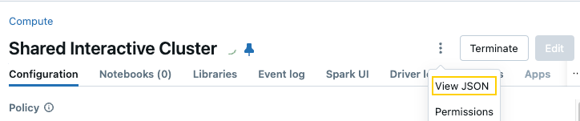
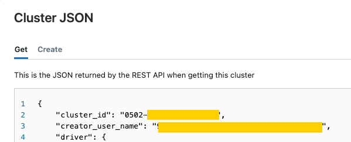
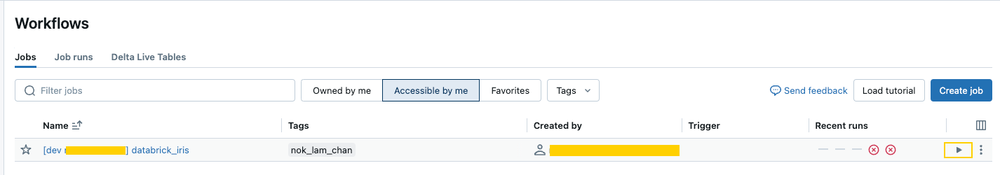

# Use Databricks Asset Bundles to deploy a Kedro project

```{note}
The `dbx` package is deprecated by Databricks, and dbx workflow documentation is moved to a [new page](./databricks_dbx_workflow.md).
```

This guide demonstrates a workflow for developing a Kedro Project on Databricks using Databricks Asset Bundles. You will learn how to develop your project using a local environment, then use `kedro-databricks` and Databricks Asset Bundle to package your code for running pipelines on Databricks. To learn more about Databricks Asset Bundles and customization, read [What are Databricks Asset Bundles](https://docs.databricks.com/en/dev-tools/bundles/index.html).

## Benefits of local development

By working in your local environment, you can take advantage of features within an IDE that are not available on Databricks notebooks:

- Auto-completion and suggestions for code, improving your development speed and accuracy.
- Linters like [Ruff](https://docs.astral.sh/ruff) can be integrated to catch potential issues in your code.
- Static type checkers like Mypy can check types in your code, helping to identify potential type-related issues early in the development process.

To set up these features, look for instructions specific to your IDE (for instance, [VS Code](https://code.visualstudio.com/docs/python/linting)).

```{note}
If you prefer to develop projects in notebooks rather than in an IDE, you should follow our guide on [how to develop a Kedro project within a Databricks workspace](./databricks_notebooks_development_workflow.md) instead.
```

## What this page covers

The main steps in this tutorial are as follows:

- [Prerequisites](#prerequisites)
- [Set up your project](#set-up-your-project)
- [Create the Databricks Asset Bundles](#create-the-databricks-asset-bundles-using-kedro-databricks)
- [Deploy Databricks Job](#deploy-databricks-job-using-databricks-asset-bundles)
- [Run Databricks Job](#how-to-run-the-deployed-job)

## Prerequisites

- An active [Databricks deployment](https://docs.databricks.com/getting-started/index.html).
- A [Databricks cluster](https://docs.databricks.com/clusters/configure.html) configured with a recent version (>= 11.3 is recommended) of the Databricks runtime.
- [Conda installed](https://docs.conda.io/projects/conda/en/latest/user-guide/install/index.html) on your local machine to create a virtual environment with Python >= 3.9.

## Set up your project

### Note your Databricks username and host
Note your Databricks **username** and **host** as you will need it for the remainder of this guide.

Find your Databricks username in the top right of the workspace UI and the host in the browser's URL bar, up to the first slash (e.g., `https://adb-123456789123456.1.azuredatabricks.net/`):


```{note}
Your databricks host must include the protocol (`https://`).
```
### Install Kedro and Databricks CLI in a new virtual environment
In your local development environment, create a virtual environment for this tutorial using Conda:

```bash
conda create --name databricks-iris python=3.10
```

Once it is created, activate it:

```bash
conda activate databricks-iris
```


### Authenticate the Databricks CLI
**Now, you must authenticate the Databricks CLI with your Databricks instance.**

[Refer to the Databricks documentation](https://docs.databricks.com/en/dev-tools/cli/authentication.html) for a complete guide on how to authenticate your CLI. The key steps are:

1. Create a personal access token for your user on your Databricks instance.
2. Run `databricks configure --token`.
3. Enter your token and Databricks host when prompted.
4. Run `databricks fs ls dbfs:/` at the command line to verify your authentication.


### Create a new Kedro Project
Create a Kedro project with the `databricks-iris` starter using the following command in your local environment:

```bash
kedro new --starter=databricks-iris
```

Name your new project `iris-databricks` for consistency with the rest of this guide. This command creates a new Kedro project using the `databricks-iris` starter template.

 ```{note}
If you are not using the `databricks-iris` starter to create a Kedro project, **and** you are working with a version of Kedro **earlier than 0.19.0**, then you should [disable file-based logging](https://docs.kedro.org/en/0.18.14/logging/logging.html#disable-file-based-logging) to prevent Kedro from attempting to write to the read-only file system.
 ```

## Create the Databricks Asset Bundles using `kedro-databricks`

`kedro-databricks` is a wrapper around the `databricks` CLI. It's the simplest way to get started without getting stuck with configuration.
1. Install `kedro-databricks`:

```bash
pip install kedro-databricks
```

2. Initialise the Databricks configuration:

```bash
kedro databricks init
```

This generates a `databricks.yml` file in the `conf` folder, which sets the default cluster type. You can override these configurations if needed.

3. Create Databricks Asset Bundles:

```bash
kedro databricks bundle
```

This command reads the configuration from `conf/databricks.yml` (if it exists) and generates the Databricks job configuration inside a `resource` folder.

### Use Existing Cluster to run Databricks Job
By default Databricks creates new job cluster for each job. Sometimes you may want to use existing cluster due to:
1. You do not have permission to create a cluster
2. You want to get started quickly with an all-purpose cluster


 It is [not recommended to use `all-purpose Compute`](https://docs.databricks.com/en/jobs/compute.html#should-all-purpose-compute-ever-be-used-for-jobs) to run job, but it is possible to configure Databricks Job for testing purpose.

First, you need to find what is the `cluster_id`. Click the `Compute` tab, then click the `View Json` options.



You will see the cluster configuration in JSON format, copy the `cluster_id`


Next, update `conf/databricks.yml`
```diff
    tasks:
        - task_key: default
-          job_cluster_key: default
+          existing_cluster_id: 0502-***********
```

Then generate the bundle definition again with the `overwrite` options.
```
kedro databricks bundle --overwrite
```
## Deploy Databricks Job using Databricks Asset Bundles

Once you have all the resources generated, deploy the Databricks Asset Bundles to Databricks:

```bash
kedro databricks deploy
```

You should see output similar to:

```
Uploading databrick_iris-0.1-py3-none-any.whl...
Uploading bundle files to /Workspace/Users/xxxxxxx.com/.bundle/databrick_iris/local/files...
Deploying resources...
Updating deployment state...
Deployment complete!
```

## How to run the Deployed job?

There are two options to run Databricks Jobs:

### Run Databricks Job with `databricks` CLI

```bash
databricks bundle run
```

This will shows all the job that you have created. Select the job and run it.
```bash
? Resource to run:
  Job: [dev] databricks-iris (databricks-iris)
```
You should see similar output like this:
```
databricks bundle run
Run URL: https://<host>/?*********#job/**************/run/**********
```

Copy that URL into your browser or go to the `Jobs Run` UI to see the run status.

### Run Databricks Job with Databricks UI
Alternatively, you can go to the `Workflow` tab and select the desired job to run directly:

```
