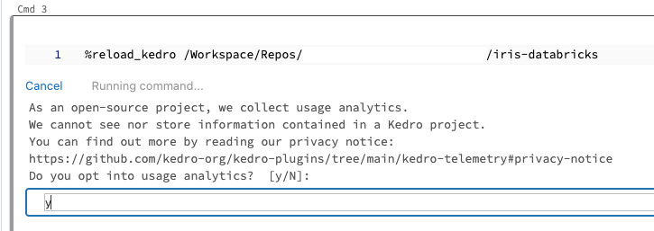

# Developing Kedro projects on Databricks using notebooks

This guide demonstrates a workflow for developing Kedro projects on Databricks using only a Databricks Repo and a Databricks notebook. The approach explained on this page enables you to develop and test your Kedro projects entirely within the Databricks workspace.

This method of developing a Kedro project for use on Databricks is ideal for developers who prefer developing their projects in notebooks rather than an in an IDE. It also avoids the overhead of setting up and syncing a local environment with Databricks. If you want to take advantage of the powerful features of an IDE to develop your project, consider following the [guide for developing a Kedro project for Databricks using your local environment](./databricks_ide_development_workflow.md).

In this guide, you will store your project's code in a repository on [GitHub](https://github.com/). Databricks integrates with many [Git providers](https://docs.databricks.com/repos/index.html#supported-git-providers), including GitLab and Azure Devops. The steps in this guide to create and sync a Git repository with Databricks also apply to these Git providers, though the exact details may vary.

## What this page covers

This tutorial introduces a project development workflow for Kedro projects using only the Databricks workspace. The main steps in this workflow are:

- [Create a new Kedro project using the `databricks-iris` starter.](#create-a-new-kedro-project)
- [Create a Databricks notebook to run your project.](#create-a-new-databricks-notebook)
- [Copy project data to DBFS.](#copy-project-data-to-dbfs-using-dbutils)
- [Modify your project in the Databricks workspace](#modify-your-project-and-test-the-changes)

## Prerequisites

- An active [Databricks deployment](https://docs.databricks.com/getting-started/index.html).
- A [Databricks cluster](https://docs.databricks.com/clusters/configure.html) configured with a recent version (>= 11.3 is recommended) of the Databricks runtime.
- Python >= 3.7 installed.
- Git installed.
- A [GitHub](https://github.com/) account.

## Set up your project

### Note your Databricks username and host

Note your Databricks **username** and **host** as you will need it for the remainder of this guide.

Find your Databricks username in the top right of the workspace UI and the host in the browser's URL bar, up to the first slash (e.g., `https://adb-123456789123456.1.azuredatabricks.net/`):


```{note}
Your databricks host must include the protocol (`https://`).
```

### Install Kedro in a new virtual environment

In your local development environment, create a virtual environment for this tutorial. Any environment management system can be used, though the following commands use [Conda](https://docs.conda.io/en/latest/):

```bash
conda create --name iris-databricks python=3.10
```

Once it is created, activate it:

```bash
conda activate iris-databricks
```

### Create a new Kedro project

Create a Kedro project with the `databricks-iris` starter using the following command in your local environment:

```bash
kedro new --starter=databricks-iris
```

Name your new project `iris-databricks` for consistency with the rest of this guide. This command creates a new Kedro project using the `databricks-iris` starter template.

### Create a GitHub personal access token

To synchronise your project between your local development environment and Databricks, you will use a private GitHub repository, which you will create in the next step. For authentication, you will need to create a GitHub personal access token. [Create this token in your GitHub developer settings](https://docs.github.com/en/github/authenticating-to-github/creating-a-personal-access-token).

```{note}
Make sure that `repo` scopes are enabled for your token.
```

### Create a GitHub repository

Now you should [create a new repository in GitHub](https://docs.github.com/en/github/getting-started-with-github/create-a-repo) using the official guide. You can keep the repository private and you don't need to commit to it just yet.

To connect to the newly created repository, use one of two options:

- **SSH:** If you choose to connect with SSH, you will also need to configure [the SSH connection to GitHub](https://docs.github.com/en/github/authenticating-to-github/connecting-to-github-with-ssh), unless you already have [an existing SSH key configured for GitHub](https://docs.github.com/en/github/authenticating-to-github/checking-for-existing-ssh-keys)
- **HTTPS:** If using HTTPS, you will be asked for your GitHub username and password when you push your first commit. Use your GitHub username and your [personal access token](#create-a-github-personal-access-token) generated in the previous step as the password, [do _not_ use your original GitHub password](https://docs.github.com/en/rest/overview/authenticating-to-the-rest-api#authenticating-with-username-and-password).

### Push your Kedro project to the GitHub repository

At the command line, initialise Git in your project root directory:

```bash
# change the directory to the project root
cd iris-databricks/
# initialise git
git init
```

Then, create the first commit:

```bash
# add all files to git staging area
git add .
# create the first commit
git commit -m "first commit"
```

Finally, push the commit to GitHub:

```bash
# configure a new remote
# for HTTPS run:
git remote add origin https://github.com/<username>/<repo-name>.git
# or for SSH run:
git remote add origin git@github.com:<username>/<repo-name>.git

# verify the new remote URL
git remote -v

# push the first commit
git push --set-upstream origin main
```

### Create a repo on Databricks

Create a new repo on Databricks by navigating to `New` tab in the Databricks workspace UI side bar and clicking `Repo` in the drop-down menu that appears.

In this guide, you sync your project with a remote Git provider. Enter `iris-databricks` as the name of your new repository:


### Create a `conf/local` directory in your Databricks repo

Kedro requires your project to have a `conf/local` directory to exist to successfully run, even if it is empty. `dbx sync` does not copy the contents of your local `conf/local` directory to your Databricks repo, so you must create it manually.

Open the Databricks workspace UI and using the panel on the left, navigate to `Repos -> <databricks_username> -> iris-databricks -> conf`, right click and select `Create -> Folder` as in the image below:


Name the new folder `local`. In this guide, we have no local credentials to store and so we will leave the newly created folder empty. Your `conf/local` and `local` directories should now look like the following:


### Create a new Databricks notebook

Now that your project is available on Databricks, you can run it on a cluster using a notebook.

To run the Python code from your Databricks repo, [create a new Python notebook](https://docs.databricks.com/notebooks/notebooks-manage.html#create-a-notebook) in your workspace. Name it `iris-databricks` for traceability and attach it to your cluster:


### Copy project data to DBFS using dbutils

On Databricks, Kedro cannot access data stored directly in your project's directory. As a result, you'll need to move your project's data to a location accessible by Databricks. You can store your project's data in the Databricks File System (DBFS), where it is accessible.

A number of methods exist for moving data to DBFS. However, in this guide, you will use your new notebook and `dbutils`.

To move your locally stored data to DBFS, open your `iris-databricks` notebook and in the first cell enter the following python code:

```python
dbutils.fs.cp(
    "/Workspace/Repos/<databricks_username>/iris-databricks/data/",
    "dbfs:/FileStore/iris-databricks/data",
    recurse=True,
)
```

Run this cell to copy the complete directory and its contents from your Repo to DBFS.

To ensure that your data was copied correctly, you can list the contents of the destination directory in DBFS. Create a new cell underneath the first cell and enter the following code:

```python
display(dbutils.fs.ls("dbfs:/FileStore/iris-databricks/data"))
```

Run this command to displays the contents of your project's `data/` directory. You can expect to see the following structure:

```bash
[FileInfo(path='dbfs:/FileStore/iris-databricks/data/01_raw', name='01_raw', size=...),
 FileInfo(path='dbfs:/FileStore/iris-databricks/data/02_intermediate', name='02_intermediate', size=...),
 FileInfo(path='dbfs:/FileStore/iris-databricks/data/03_primary', name='03_primary', size=...),
 FileInfo(path='dbfs:/FileStore/iris-databricks/data/04_feature', name='04_feature', size=...),
 FileInfo(path='dbfs:/FileStore/iris-databricks/data/05_model_input', name='05_model_input', size=...),
 FileInfo(path='dbfs:/FileStore/iris-databricks/data/06_models', name='06_models', size=...),
 FileInfo(path='dbfs:/FileStore/iris-databricks/data/07_model_output', name='07_model_output', size=...),
 FileInfo(path='dbfs:/FileStore/iris-databricks/data/08_reporting', name='08_reporting', size=...)]
```

### Run your project

Create **four new cells** inside your notebook. You will fill these cells with code that runs your project. When copying the following code snippets, remember to replace `<databricks_username>` with your username on Databricks such that `project_root` correctly points to your project's location.

1. Before you import and run your Python code, you'll need to install your project's dependencies on the cluster attached to your notebook. Your project has a `requirements.txt` file for this purpose. Add the following code to the first new cell to install the dependencies:

```ipython
%pip install -r "/Workspace/Repos/<databricks_username>/iris-databricks/src/requirements.txt"
```

2. To run your project in your notebook, you must load the Kedro IPython extension. Add the following code to the second new cell to load the IPython extension:

```ipython
%load_ext kedro.ipython
```

3. Loading the extension allows you to use the `%reload_kedro` line magic to load your Kedro project. Add the following code to the third new cell to load your Kedro project:

```ipython
%reload_kedro /Workspace/Repos/<databricks_username>/iris-databricks
```

4. Loading your Kedro project with the `%reload_kedro` line magic will define four global variables in your notebook: `context`, `session`, `catalog` and `pipelines`. You will use the `session` variable to run your project. Add the following code to the fourth new cell to run your Kedro project:

```ipython
session.run()
```

After completing these steps, your notebook should match the following image:


Run the completed notebook using the `Run All` bottom in the top right of the UI:


On the first run of your Kedro project, you will be prompted to consent to analytics, type `y` or `N` in the field that appears and press `Enter`:



You should see logging output while the cell is running. After execution finishes, you should see output similar to the following:

```bash
...
[08/09/22 11:23:30] INFO     Model has accuracy of 0.960 on test data.                                        nodes.py:74
                    INFO     Saving data to 'metrics' (MetricsDataSet)...                             data_catalog.py:382
                    INFO     Completed 3 out of 3 tasks                                           sequential_runner.py:85
                    INFO     Pipeline execution completed successfully.                                      runner.py:89
```

## Modify your project and test the changes

Now that your project has run successfully once, you can make changes using the Databricks UI. In this section, you will modify the project to use a different ratio of training data to test data and check the effect of this change on Databricks.

### Modify the training / test split ratio

The `databricks-iris` starter uses a default 80-20 ratio of training data to test data when training the classifier. You will edit this ratio to 70-30 and re-run your project to view the different result.

In the Databricks workspace, click on the `Repos` tab in the side bar and navigate to `<databricks_username>/iris-databricks/conf/base/`. Open the the file `<project_root>/conf/base/parameters.yml` by double-clicking it. This will take you to a built-in file editor. Edit the line `train_fraction: 0.8` to `train_fraction: 0.7`, your changes will automatically be saved.


### Re-run your project

Return to your Databricks notebook. Re-run the third and fourth cells in your notebook (containing the code `%reload_kedro ...` and `session.run()`). The project will now run again, producing output similar to the following:

```bash
...
[08/09/22 11:23:30] INFO     Model has accuracy of 0.953 on test data.                                        nodes.py:74
                    INFO     Saving data to 'metrics' (MetricsDataSet)...                             data_catalog.py:382
                    INFO     Completed 3 out of 3 tasks                                           sequential_runner.py:85
                    INFO     Pipeline execution completed successfully.                                      runner.py:89
```

You can see that your model's accuracy has changed now that you are using a different classifier to produce the result.

```{note}
If your cluster terminates, you must re-run your entire notebook, as libraries installed using `%pip install ...` are ephemeral. If not, repeating this step is only necessary if your project's dependencies change.
```

## Summary

This guide demonstrated a development workflow on Databricks using only the Databricks workspace. This approach is ideal for users who prefer to develop using notebooks and avoids having to set up and sync a local environment with Databricks.
