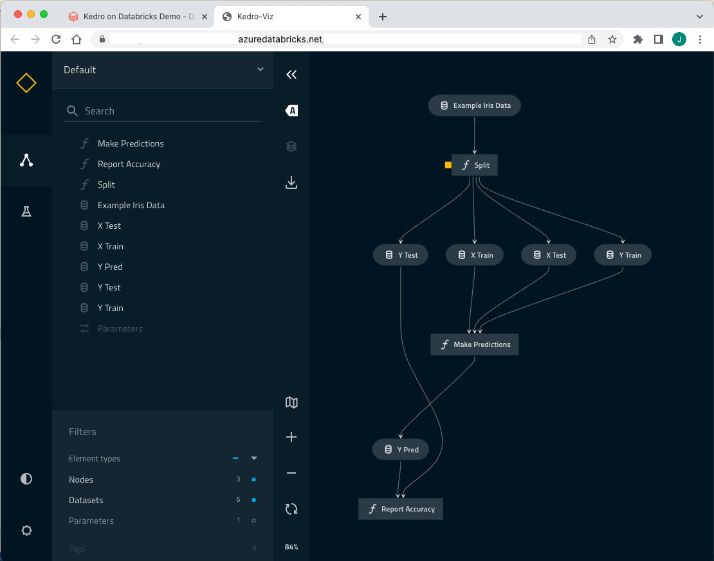

# Visualise a Kedro project in Databricks notebooks

{doc}`Kedro-Viz <kedro-viz:kedro-viz_visualisation>` is a tool that enables you to visualise your Kedro pipeline and metrics generated from your data science experiments. It is a standalone web application that runs on a web browser, it can be run on a local machine or in a Databricks notebook.

For Kedro-Viz to run with your Kedro project, you need to ensure that both the packages are installed in the same scope (notebook-scoped vs. cluster library). This means that if you `%pip install kedro` from inside your notebook then you should also `%pip install kedro-viz` from inside your notebook.
If your cluster comes with Kedro installed on it as a library already then you should also add Kedro-Viz as a [cluster library](https://docs.microsoft.com/en-us/azure/databricks/libraries/cluster-libraries).

To run Kedro-Viz in a Databricks notebook you must first launch the Kedro IPython extension:

```ipython
%load_ext kedro.ipython
```

And load your Kedro project from where it is stored in either the Databricks workspace or in a Repo:

```ipython
%reload_kedro <project_root>/iris-databricks
```

Kedro-Viz can then be launched in a new browser tab with the `%run_viz` line magic:

```ipython
%run_viz
```

This command presents you with a link to the Kedro-Viz web application.


Clicking this link opens a new browser tab running Kedro-Viz for your project.


