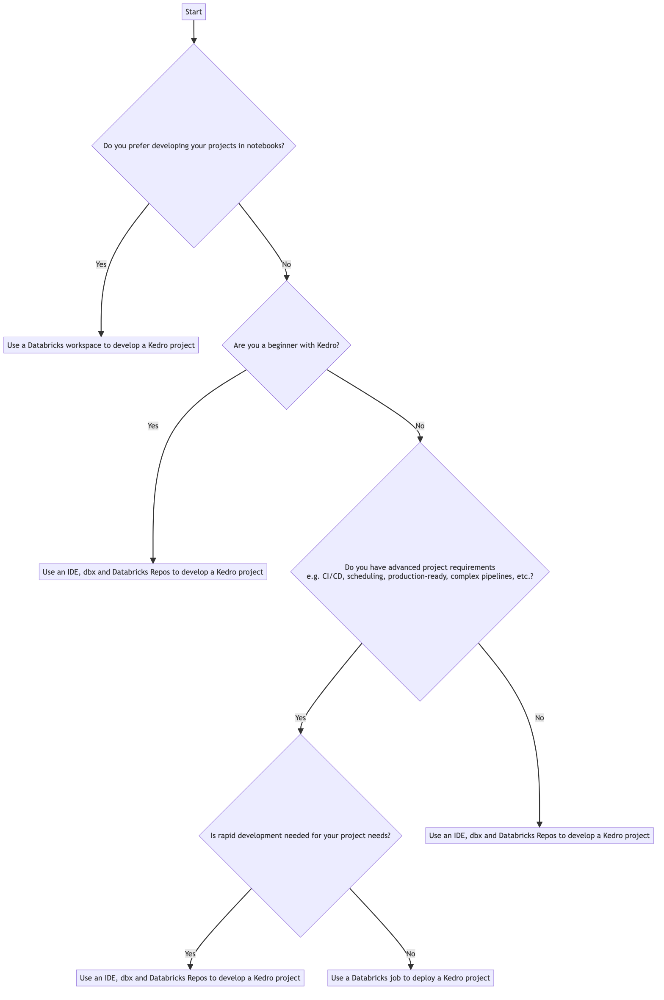

# Databricks

Databricks offers integration with Kedro through three principal workflows, which range across a spectrum and combine local development with Databricks.

Let's break down the advantages and use cases of each workflow to help you make an informed decision and choose the workflow that best fits your project's needs.

**I want to work within a Databricks workspace**

The workflow documented in ["Use a Databricks workspace to develop a Kedro project"](./databricks_notebooks_development_workflow.md) is for those who prefer to develop and test their projects directly within Databricks notebooks.

To avoid the overhead of setting up and syncing a local development environment with Databricks, choose this as your workflow. You gain the flexibility for quick iteration, although switching to a [job-based deployment workflow](./databricks_deployment_workflow.md) might be necessary when you transition into a production deployment.

**I want a hybrid workflow model combining local IDE with Databricks**


The workflow documented in ["Use Databricks Connect to develop a Kedro project"](./databricks_ide_development_workflow.md) is for those that prefer to work in a local IDE.

If you're in the early stages of learning Kedro, or your project requires constant testing and adjustments, choose this workflow. You can use your IDE's capabilities for faster, error-free development, while testing on Databricks. Later you can make the transition into a production deployment with this approach, although you may prefer to switch to use [job-based deployment](./databricks_deployment_workflow.md) and fully optimise your workflow for production.

**I want to deploy a packaged Kedro project to Databricks**

The workflow documented in ["Use databricks asset bundles and jobs to deploy a Kedro project"](./databricks_deployment_workflow.md) is the go-to choice when dealing with complex project requirements that need a high degree of structure and reproducibility. It's your best bet for a production setup, given its support for CI/CD, automated/scheduled runs and other advanced use cases. It might not be the ideal choice for projects requiring quick iterations due to its relatively rigid nature.

---
Here's a flowchart to guide your choice of workflow:



% Mermaid code, see https://github.com/kedro-org/kedro/wiki/Render-Mermaid-diagrams
% flowchart TD
%   A[Start] --> B{Do you prefer developing your projects in notebooks?}
%   B -->|Yes| C[Use a Databricks workspace to develop a Kedro project]
%   B -->|No| D{Are you a beginner with Kedro?}
%   D -->|Yes| E[Use Databricks Connect to develop a Kedro project]
%   D -->|No| F{Do you have advanced project requirements<br>e.g. CI/CD, scheduling, production-ready, complex pipelines, etc.?}
%   F -->|Yes| G{Is rapid development needed for your project needs?}
%   F -->|No| H[Use Databricks Connect to develop a Kedro project]
%   G -->|Yes| I[Use Databricks Connect to develop a Kedro project]
%   G -->|No| J[Use a Databricks job to deploy a Kedro project]


Remember, the best choice of workflow is the one that aligns best with your project's requirements, whether that's quick development, notebook-based coding, or a production-ready setup. Make sure to consider these factors alongside your comfort level with Kedro when making your decision.


```{toctree}
:maxdepth: 1

databricks_notebooks_development_workflow.md
databricks_ide_development_workflow.md
databricks_deployment_workflow
databricks_visualisation
```
