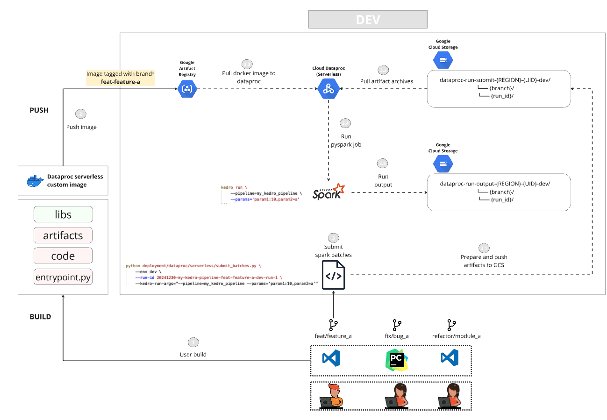
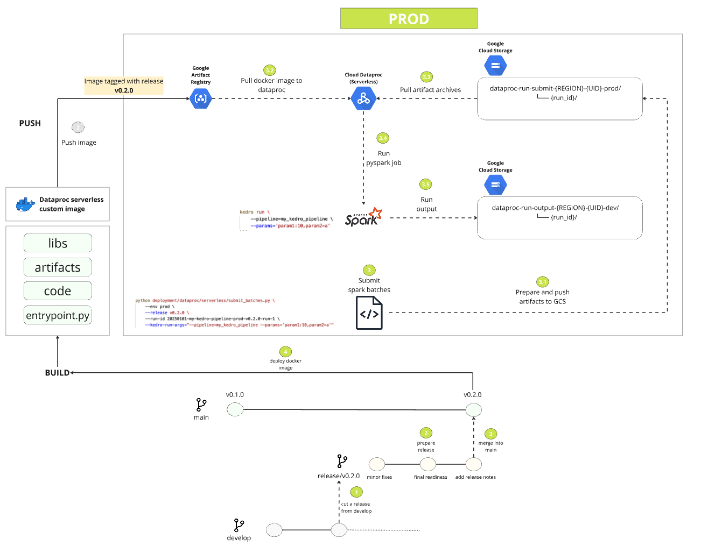

# GCP Dataproc

`Dataproc serverless` lets you run Spark workloads without requiring you to provision and manage your own Dataproc cluster. An advantage over `Dataproc compute engine` is that `Dataproc serverless` supports custom containers allowing you to package your dependencies at build time. Refer to [the Dataproc serverless documentation](https://cloud.google.com/dataproc-serverless/docs/overview#s8s-compared) for the official comparison between Dataproc serverless and compute engine.

The guide details kedro pipeline deployment steps for `Dataproc serverless`.

## Overview

The below diagram details the dataproc serverless dev and prod deployment workflows. 


### DEV deployment (and experimentation)

The following are the steps:

1. **User build**: Each developer branches out from develop, pulls the latest develop dataproc image, and builds their own custom docker image (if required). Note the following:
  - `libraries` - Packaged: This includes any python dependencies + any other libraries
  - `artifacts` - NOT Packaged
  - `code` - NOT Packaged
  - `entrypoint.py` - NOT Packaged
2. **Push image**: After successful manual build, the developer pushes it to artifact registry with a custom tag (default: branch_name)
3. **Submit spark batches**: The developer triggers an experimental run with dataproc batches submission python script with parameters
   - `--env=dev`
   - `--run-id=...`
   - `--kedro-run-args=...`
3.1. **Prepare and push artifacts to GCS**: The script packages the active code changes in the branch into an archive, prepares any necessary artifacts and pushes to GCS in `{branch}/{run_id}` namespace.
3.2. **Pull docker image to dataproc**: Dataproc pulls the custom docker image tagged with the branch name from artifact registry
3.3. **Pull artifact archives**: Dataproc pulls the archives containing the artifacts and unzips them on master and all workers in the working directory
3.4. **Run pyspark job**: The main file then triggers the pyspark job as the standard kedro cli command: `kedro run --pipeline=... --params=...`
3.5. *(Optional)* **Run output**: It is recommended to segregate the experimental run outputs into `{branch}/{run_id}` namespace.
 



### PROD deployment

The following are the steps:

1. **Cut a release from develop**: A release branch is cut from the `develop` branch as `release/v0.2.0`
2. **Prepare release**: Minor fixes, final readiness and release notes are added to prepare the release.
3. **Merge into main**: After all checks passes and necessary approvals, the release branch is merged into main, and the commit is tagged with the version
4. **Deploy docker image**: The docker image is built with release tag version `v0.2.0` and pushed to prod artifact registry. Note the following:
  - `libraries` - Packaged
  - `artifacts` - Packaged
  - `code` - Packaged
  - `entrypoint.py` - Packaged
5.1. **Prepare and push artifacts to GCS**: The script prepares any necessary artifacts and pushes to GCS in `{branch}/{run_id}` namespace.
5.2. **Pull docker image to dataproc**: Dataproc pulls the custom docker image tagged with the branch name from artifact registry
5.3. **Pull artifact archives**: Dataproc pulls the archives containing the artifacts and unzips them on master and all workers in the working directory
5.4. **Run pyspark job**: The main file then triggers the pyspark job as the standard kedro cli command: `kedro run --pipeline=... --params=...`
5.5. *(Optional)* **Run output**: It is recommended to segregate the experimental run outputs into `{branch}/{run_id}` namespace.




**NOTE**: The above describes a simple reference deployment pattern. Please adapt it for your usecase.

## Prerequisite Setup

### Create service accounts

NOTE:

> 1. The service account creation method below assigns all permissions needed for this walkthrough in one service account. 
> 2. Different teired environments may have their own GCP Projects.
> 3. This does not indicate best practice, and you should create multiple service accounts with fine grained permissions to services and resources in different tiered environments.

Create service account:

```bash
gcloud iam service-accounts create sa-dataproc-runner --display-name "Dataproc spark pipeline runner service account"
```

Assign roles:

```bash

#!/bin/bash

PROJECT_ID="xxxx"

# Define the service account email, change the xxxxx
SERVICE_ACCOUNT_EMAIL="sa-dataproc-runner@${PROJECT_ID}"

# Define the roles that you want in an array
roles=(
    "roles/dataproc.admin"
    "roles/artifactregistry.admin"
    "roles/artifactregistry.repoAdmin"
    "roles/dataproc.admin"
    "roles/storage.admin"
)

# Loop through each role and assign it to the service account
for role in "${roles[@]}"; do
    gcloud iam service-accounts add-iam-policy-binding $SERVICE_ACCOUNT_EMAIL \
        --role="$role" \
        --member="serviceAccount:$SERVICE_ACCOUNT_EMAIL"
done

```

Create and download service account JSON key:

```bash
gcloud iam service-accounts keys create ${KEY_FILE} \
    --iam-account=sa-dataproc-runner@${PROJECT_ID}.iam.gserviceaccount.com
```

> NOTE: The service account JSON keys can be stored as secrets, and can be made accessible to CI in your custom workflows.

### Create GCS Buckets

The following GCS Buckets are created for development (`env=dev`) and production (`env=prod`) workflows.

#### Dataproc temporary staging bucket


```bash
gcloud storage buckets create gs://dataproc-staging-${REGION}-${UID}-${ENV} --location ${REGION}
```


#### Dataproc run submit artifacts bucket

```bash
gcloud storage buckets create gs://dataproc-run-submit-${REGION}-${UID}-${ENV} --location ${REGION}
```

```bash
dataproc-run-submit-{REGION}-{UID}-dev/
└── {branch}/
    └── {run_id}/
```

```bash
dataproc-run-submit-{REGION}-{UID}-prod/
└── release/
    └── {version}/ # for e.g. v.2.0 
```

#### Dataproc run output bucket

```bash
gcloud storage buckets create gs://dataproc-run-output-${REGION}-${UID}-${ENV} --location {REGION}
```

```bash
dataproc-run-output-{REGION}-{UID}-dev/
└── {branch}/
    └── {run_id}/
```

```bash
dataproc-run-output-{REGION}-{UID}-prod/
└── release/
    └── {version}/ # for e.g. v.2.0 
        └── {run_id}
```


#### Authorize with service account


```bash
gcloud auth activate-service-account --key-file=${KEY_FILE}
```

#### Define entrypoint script

`deployment/dataproc/entrypoint.py`

```python
import os
import argparse
import sys
import re

def dequote(s: str):
    return re.sub(r"^['\"]|['\"]$", '', s)


parser = argparse.ArgumentParser()
parser.add_argument("--kedro-run-args", type=str, default='', help="Arguments for kedro run")

args = parser.parse_args()

KEDRO_RUN_ARGS = dequote(args.KEDRO_RUN_ARGS)

folders = os.listdir()

# If code folder is not present, then we must be passing it as an archive on job submission
if 'code' not in folders:
    subprocess.run([
        "unzip", "code.zip", "-d", "code"
    ])

# Change to code directory
os.chdir("code")

kedro_cmd = "kedro run"
if KEDRO_RUN_ARGS:
    kedro_cmd += " " + KEDRO_RUN_ARGS

subprocess.run(kedro_cmd, check=True, shell=True)
```

## Dataproc Serverless

Dataproc Serverless allows you to run Spark jobs without needing to manage the underlying infrastructure. It automatically scales resources up and down based on the job requirements.
Also, refer to the github repo on [kedro pyspark dataproc demo](https://github.com/getindata/kedro-pyspark-dataproc-demo) by getindata.

### Repo structure


```bash
.
├── conf
├── deployment/
│   └── dataproc/
│       └── serverless/
│           ├── build_push_docker.sh
│           ├── Dockerfile
│           └── submit_batches.py
└── src
```

### Build Docker Image

`deployment/dataproc/serverless/Dockerfile`

```docker
ARG BASE_IMAGE=python:3.9-buster

FROM ${BASE_IMAGE}

# overwrite default Dataproc PYSPARK_PYTHON path
ENV PYSPARK_PYTHON /usr/local/bin/python
ENV PYSPARK_DRIVER_PYTHON /usr/local/bin/python

# Add extra jars.
ENV SPARK_EXTRA_JARS_DIR="/opt/spark/jars/"
ENV SPARK_EXTRA_CLASSPATH="/opt/spark/jars/*"
RUN mkdir -p "${SPARK_EXTRA_JARS_DIR}"


# (Required) Install utilities required by Spark scripts.
RUN apt update && apt install -y procps tini openjdk-11-jre-headless


# add kedro user
ARG KEDRO_UID=999
ARG KEDRO_GID=0


RUN groupadd -f -g ${KEDRO_GID} kedro_group && \
useradd -d /home/kedro -s /bin/bash -g ${KEDRO_GID} -u ${KEDRO_UID} kedro

# (Required) Create the 'spark' group/user.
# The GID and UID must be 1099. Home directory is required.
RUN groupadd -g 1099 spark
RUN useradd -u 1099 -g 1099 -d /home/spark -m spark

# copy the whole project except what is in .dockerignore
WORKDIR /home/kedro

# Install and setup uv
RUN pip install --upgrade pip uv build
ENV UV_INDEX_STRATEGY=unsafe-any-match

# Install dependencies
COPY src/requirements.txt /tmp/requirements.txt
RUN uv pip install --system \
    -r /tmp/requirements.txt \
    && rm /tmp/requirements.txt
    

RUN chown -R kedro:${KEDRO_GID} /home/kedro

USER kedro

# development image
FROM base as dev

# production image
FROM base as prod

# copy source code
COPY . /code

RUN chmod -R a+w /home/kedro

```


### Configure Artifact registry

This creates your repository in the artifact registry.

```bash
gcloud artifacts repositories create ${ARTIFACT_REPOSITORY} \
    --repository-format=docker \
    --location=${REGION} \
    --description="Kedro project docker repository"
```

#### Gcloud configure docker auth

This configures gcloud authentication with the artifact registry.

```bash
gcloud auth configure-docker ${ARTIFACT_REGISTRY}
```

#### Push Image to Artifact Registry

`deployment/dataproc/serverless/build_push_docker.sh`

- This script builds and pushes the docker image for user dev workflows by tagging each custom build with the branch name (or a custom tag).
- The developer can experiment with any customizations to the docker image in their feature branches.
- It also allows to build and push the docker image for prod workflows by tagging it with the release version.

```bash
#!/usr/bin/env bash

set -ex

# NOTE: Specify or fetch project level details here
PROJECT_ID=xxxx
ARTIFACT_REPOSITORY=xxxx
ARTIFACT_REPOSITORY=xxxx

CONTAINER_IMAGE_NAME="dataproc-serverless"
BRANCH_NAME=$(git rev-parse --abbrev-ref HEAD)
BRANCH_NAME_CLEAN=$(echo ${BRANCH_NAME} | sed 's/[^a-zA-Z0-9]/-/g')

# Parse arguments
while [[ "$#" -gt 0 ]]; do
    case $1 in
        --custom-tag) CUSTOM_TAG="$2"; shift ;;
        --env) ENV="$2"; shift ;;
        --release) RELEASE="$2"; shift ;;
        *) echo "Unknown parameter passed: $1"; exit 1 ;;
    esac
    shift
done

if [ "$CUSTOM_TAG" ]; then
    CONTAINER_IMAGE_TAG=${CUSTOM_TAG}
elif [ "$ENV" == "dev" ]; then
    CONTAINER_IMAGE_TAG=${BRANCH_NAME_CLEAN}
elif [ "$ENV" == "prod" ]; then
    CONTAINER_IMAGE_TAG=${RELEASE}
else
    echo "Unknown environment: $ENV"
    exit 1
fi

CONTAINER_IMAGE=${ARTIFACT_REGISTRY}/${PROJECT_ID}/${ARTIFACT_REPOSITORY}/${CONTAINER_IMAGE_NAME}:${CONTAINER_IMAGE_TAG}

docker build -f deployment/dataproc/serverless/Dockerfile -t ${CONTAINER_IMAGE} . --platform="linux/amd64"
docker push ${CONTAINER_IMAGE}
```

In dev workflow:

```bash
deployment/dataproc/serverless/build_push_docker.sh --env dev
```

In prod workflow:

```bash
deployment/dataproc/serverless/build_push_docker.sh --env prod --release v.2.0
```

#### Submit pyspark batches

`deployment/dataproc/serverless/submit_batches.py`

```python
import argparse
import subprocess
import sys
from datetime import datetime

# NOTE: Suggested pattern => Define your own project_utils module to store common functions
from project_utils import load_project_config

import re


def run_subprocess_commands(commands):
    for command in commands:
        print(f"Running command: {command}")
        try:
            subprocess.run(command, check=True)
        except subprocess.CalledProcessError as e:
            print(f"An error occurred: {e}")
            sys.exit(1)


parser = argparse.ArgumentParser(description='Submit Kedro job to Dataproc')
parser.add_argument('--env', choices=['dev', 'prod'])
parser.add_argument('--release', type=str, help='Release version', required=False)
parser.add_argument('--run-id', type=str, help='run id', required=False)
parser.add_argument('--no-prepare-artifacts', action="store_true", help='whether to prepare run submit artifacts. Default: True', required=False)
parser.add_argument('--no-run-trigger', action="store_true", help='whether to trigger run. Default: True', required=False)
parser.add_argument('--kedro-run-args', type=str, help='kedro pipeline run args', required=False)

args = parser.parse_args()

if args.env == 'dev' and args.release:
    parser.error("--release should not be provided when env is 'dev'")
if args.env == 'dev' and not args.run_id:
    parser.error("--run-id must be provided when env is 'dev'")
if args.env == 'prod' and not args.release:
    parser.error("--release must be provided when env is 'prod'")
if args.env == 'prod' and args.run_id:
    parser.error("--run-id should not be provided when env is 'prod'")

ENV = args.env
RELEASE = args.release
RUN_ID = args.run_id
PREPARE_ARTIFACTS = not args.no_prepare_artifacts
TRIGGER_RUN = not args.no_run_trigger
KEDRO_RUN_ARGS = args.kedro_run_args

proc = subprocess.Popen(["git", "rev-parse", "--abbrev-ref", "HEAD"], stdout=subprocess.PIPE)
BRANCH_NAME, err = proc.communicate()
BRANCH_NAME = BRANCH_NAME.decode().strip()
BRANCH_NAME_CLEAN = re.sub(r'[^a-zA-Z0-9]', '-', BRANCH_NAME)

PROJECT_CONFIG = load_project_config()[ENV]

PROJECT_ID = PROJECT_CONFIG["PROJECT_ID"]
REGION = PROJECT_CONFIG["REGION"]
RUN_SUBMIT_BUCKET = PROJECT_CONFIG["DATAPROC"]["RUN_SUBMIT_BUCKET"]
RUN_SERVICE_ACCOUNT = PROJECT_CONFIG["DATAPROC"]["RUN_SERVICE_ACCOUNT"]
DATAPROC_RUNTIME_VERSION = PROJECT_CONFIG["DATAPROC"]["SERVERLESS"]["RUNTIME_VERSION"]
DATAPROC_DOCKER_IMAGE_NAME = PROJECT_CONFIG["DATAPROC"]["SERVERLESS"]["IMAGE_NAME"]

if ENV == 'dev':
    GCS_RUN_SUBMIT_DIR = f'gs://{RUN_SUBMIT_BUCKET}/{BRANCH_NAME_CLEAN}/{RUN_ID}'
elif ENV == 'prod':
    GCS_RUN_SUBMIT_DIR = f'gs://{RUN_SUBMIT_BUCKET}/{RELEASE}'


if ENV == 'dev':
    MAIN_ENTRYPOINT_PY = f"{GCS_RUN_SUBMIT_DIR}/entrypoint.py"
elif ENV == 'prod':
    MAIN_ENTRYPOINT_PY = "file://home/kedro/code/deployment/dataproc/entrypoint.py"

GCS_CODE_ARCHIVE_URI = f'{GCS_RUN_SUBMIT_DIR}/code.zip'

LOCAL_DATAPROC_RUN_SUBMIT_STAGING_DIR = "dataproc_runs"

if ENV == 'dev':
    CONTAINER_IMAGE_URI = f"{REGION}-docker.pkg.dev/{PROJECT_ID}/{USECASE}/dataproc-serverless:{BRANCH_NAME_CLEAN}"
elif ENV == 'prod':
    CONTAINER_IMAGE_URI = f"{REGION}-docker.pkg.dev/{PROJECT_ID}/{USECASE}/dataproc-serverless:{RELEASE}"


if PREPARE_ARTIFACTS: 
    commands = [
        # create staging directory
        ['mkdir', '-p', f'{LOCAL_DATAPROC_RUN_SUBMIT_STAGING_DIR}']
    ]


    # For dev workflows, we create a new branch for each run with all changes auto-committed 
    if ENV == 'dev':

        commands += [
        # Stash uncommited changes, checkout new branch, apply stash, commit changes
        ["git", "stash"],
        ["git", "checkout", '-B', f"pipeline-run/{RUN_ID}"],
        ["git", "stash", "apply"],
        ["git", "add", "."],
        ["git", "commit", '-m', f"pipeline run: {RUN_ID}"]
    ]

    commands += [
        # Archive code
        ['git', 'archive', '-o', f'{LOCAL_DATAPROC_RUN_SUBMIT_STAGING_DIR}/code.zip', 'HEAD'],

        # Copy run submit artifacts to GCS
        ['gsutil', 'cp', '-r', 'scripts/dataproc/main.py', MAIN_ENTRYPOINT_PY],
        ['gsutil', 'cp', '-r', f'{LOCAL_DATAPROC_RUN_SUBMIT_STAGING_DIR}/code.zip', GCS_CODE_ARCHIVE_URI],

        # Return back to original git changes
        ["git", "checkout", "-"],
        ["git", "stash", "pop"]
    ]

if TRIGGER_RUN:

    trigger_command = [
        'gcloud', 'dataproc', 'batches', 'submit', 'pyspark', MAIN_ENTRYPOINT_PY,
        '--region', REGION,
        '--container-image', CONTAINER_IMAGE_URI,
        '--service-account', RUN_SERVICE_ACCOUNT, 
        '--properties', 'spark.executor.instances=10' # Add more spark conf here
        '--version', DATAPROC_RUNTIME_VERSION,
    ]

    if ENV == 'dev':
        trigger_command += [
            '--archives', f'{GCS_CODE_ARCHIVE_URI}#code'
        ]

    if KEDRO_RUN_ARGS:
        trigger_command += [
            '--', f'--kedro-run-args={KEDRO_RUN_ARGS}'
        ]

    commands += [trigger_command]

run_subprocess_commands(commands)
```

For dev workflow:

```bash
python deployment/dataproc/serverless/submit_batches.py \
    --env dev \
    --run-id 20241230-my-kedro-pipeline-feat-feature-a-dev-run-1 \
    --kedro-run-args="--pipeline=my_kedro_pipeline --params='param1:10,param2=a'"
```

For prod workflow:

During release (one time):

```bash
python deployment/dataproc/serverless/submit_batches.py \
    --env prod \
    --release v0.2.0 \
    --no-run-trigger
```

In subsequent run triggers:

```bash
python deployment/dataproc/serverless/submit_batches.py \
    --env prod \
    --release v0.2.0 \
    --no-prepare-artifacts \
    --run-id 20250101-my-kedro-pipeline-v0.2.0-prod-run-1 \
    --kedro-run-args="--pipeline=my_kedro_pipeline --params='param1:10,param2=a'"
```

NOTE
> 1. It is recommended to automate release workflows in the CI/CD pipeline using CI Framework native docker build steps which can benefit from caching.
> 2. The pipeline deployment depicted here is a simplified example. In real world workflows, the pipeline deployment will have a lot more nuances.