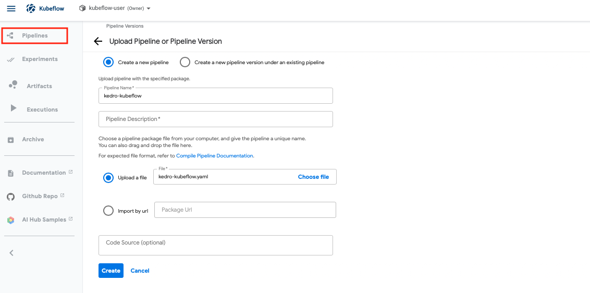
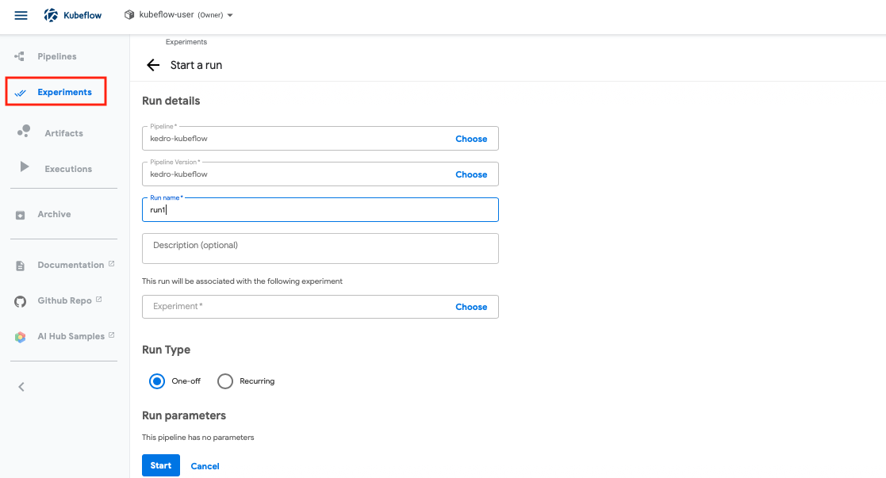
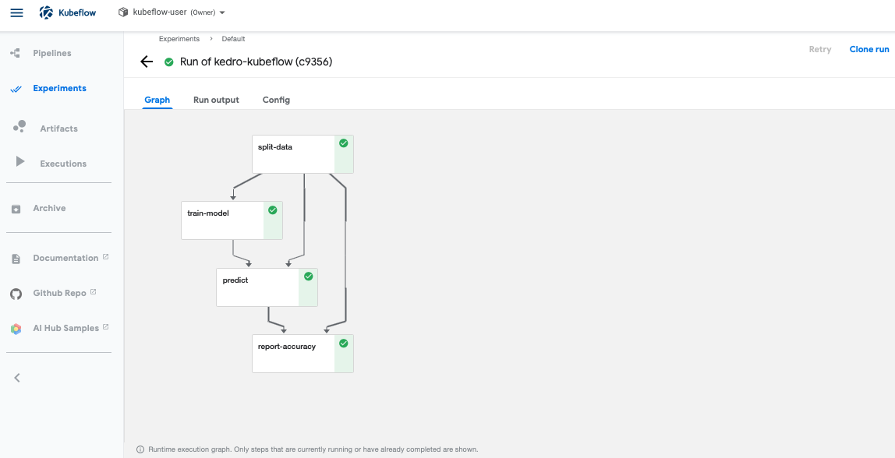

# Deployment with Kubeflow Pipelines

This page explains how to convert your Kedro pipeline to use [Kubeflow Pipelines](https://github.com/kubeflow/pipelines), an open-source toolkit for machine learning (ML). You can use it to deploy ML workflows onto [Kubernetes](https://kubernetes.io/).

## Why would you use Kubeflow Pipelines?
Kubeflow Pipelines is an end-to-end (E2E) orchestration tool to deploy, scale and manage your machine learning systems within Docker containers. You can schedule and compare runs, and examine detailed reports on each run.

Here are the main reasons to use Kubeflow Pipelines:

- It is cloud-agnostic and can run on any Kubernetes cluster
- Kubeflow is tailored towards machine learning workflows for model deployment, experiment tracking, and hyperparameter tuning
- You can re-use components and pipelines to create E2E solutions

## Prerequisites

To use Kubeflow Pipelines, ensure you have the following prerequisites in place:

- [Kubeflow Pipelines is installed](https://www.kubeflow.org/docs/started/getting-started/) on your Kubernetes cluster
- [Kubeflow Pipelines SDK is installed](https://www.kubeflow.org/docs/pipelines/sdk/install-sdk/) locally
- A `name` attribute is set for each [Kedro node](/kedro.pipeline.node), since it is used to trigger runs
- [All node input/output DataSets must be configured in `catalog.yml`](../data/data_catalog.md#use-the-data-catalog-with-the-yaml-api) and refer to an external location (e.g. AWS S3); you cannot use the `MemoryDataSet` in your workflow

```{note}
Each node runs in its own container.
```

## How to run your Kedro pipeline using Kubeflow Pipelines

### Containerise your Kedro project

First, you need to containerise your Kedro project, using any preferred container solution (e.g. [`Docker`](https://www.docker.com/)), to build an image to use in Kubeflow Pipelines.

For the purpose of this walk-through, we are going to assume a `Docker` workflow. We recommend the [`Kedro-Docker`](https://github.com/kedro-org/kedro-plugins/tree/main/kedro-docker) plugin to streamline the process. [Instructions for Kedro-Docker are in the plugin's README.md](https://github.com/kedro-org/kedro-plugins/blob/main/README.md).

After you’ve built the Docker image for your project locally, [transfer the image to a container registry](./single_machine.md#how-to-use-container-registry).

### Create a workflow spec

A workflow spec is a yaml file specifying the description of deployment in Kubernetes. In order to build a workflow spec for your Kedro pipeline programmatically you can use the following Python script that should be stored in your project’s root directory:

```python
# <project_root>/build_kubeflow_pipeline.py
import re
from pathlib import Path
from typing import Dict, Set

import click

from kfp import aws, dsl
from kfp.compiler.compiler import Compiler

from kedro.framework.project import pipelines
from kedro.framework.startup import bootstrap_project
from kedro.pipeline.node import Node

_PIPELINE = None
_IMAGE = None


@click.command()
@click.argument("image", required=True)
@click.option("-p", "--pipeline", "pipeline_name", default=None)
@click.option("--env", "-e", type=str, default=None)
def generate_kfp(image: str, pipeline_name: str, env: str) -> None:
    """Generates a workflow spec yaml file from a Kedro pipeline.

    Args:
        image: container image name.
        pipeline_name: pipeline name to build a workflow spec.
        env: Kedro configuration environment name.

    """
    global _PIPELINE
    global _IMAGE
    _IMAGE = image

    project_path = Path.cwd()
    metadata = bootstrap_project(project_path)
    project_name = metadata.project_name

    pipeline_name = pipeline_name or "__default__"
    _PIPELINE = pipelines.get(pipeline_name)

    Compiler().compile(convert_kedro_pipeline_to_kfp, project_name + ".yaml")


@dsl.pipeline(name="Kedro pipeline", description="Kubeflow pipeline for Kedro project")
def convert_kedro_pipeline_to_kfp() -> None:
    """Convert from a Kedro pipeline into a kfp container graph."""
    node_dependencies = _PIPELINE.node_dependencies
    kfp_ops = _build_kfp_ops(node_dependencies)
    for node, dependencies in node_dependencies.items():
        for dependency in dependencies:
            kfp_ops[node.name].after(kfp_ops[dependency.name])


def _build_kfp_ops(
    node_dependencies: Dict[Node, Set[Node]]
) -> Dict[str, dsl.ContainerOp]:
    """Build kfp container graph from Kedro node dependencies."""
    kfp_ops = {}

    for node in node_dependencies:
        name = clean_name(node.name)
        kfp_ops[node.name] = dsl.ContainerOp(
            name=name,
            image=_IMAGE,
            command=["kedro"],
            arguments=["run", "--node", node.name],
        ).apply(
            # Configure the container to use AWS credentials.
            aws.use_aws_secret(
                "aws-secrets", "AWS_ACCESS_KEY_ID", "AWS_SECRET_ACCESS_KEY"
            )
        )
    return kfp_ops


def clean_name(name: str) -> str:
    """Reformat a name.

    Returns:
        name: formatted name.

    """
    return re.sub(r"[\W_]+", "-", name).strip("-")


if __name__ == "__main__":
    generate_kfp()
```

The script accepts one required argument:

- `image`: image transferred to the container registry

You can also specify two optional arguments:

- `--pipeline`: pipeline name for which you want to build a workflow spec
- `--env`: Kedro configuration environment name, defaults to `local`

For the purpose of this walk-through, we will use AWS S3 bucket for datasets, therefore `AWS_ACCESS_KEY_ID` and `AWS_SECRET_ACCESS_KEY` environment variables must be set to have an ability to communicate with S3. The `AWS_ACCESS_KEY_ID` and `AWS_SECRET_ACCESS_KEY` values should be stored in [Kubernetes Secrets](https://kubernetes.io/docs/concepts/configuration/secret/) ([an example Kubernetes Secrets spec is given below](#authenticate-kubeflow-pipelines)).


Finally, run the helper script from project's directory to build the workflow spec (the spec will be saved to `<project_root>/<project_name>.yaml` file).

```console
$ cd <project_root>
$ python build_kubeflow_pipeline.py <project_image>
```

### Authenticate Kubeflow Pipelines

Before submitting the workflow spec you need to deploy your AWS credentials to Kubernetes Secrets. You should also ensure that the credentials you are going to use have all necessary [permissions to the relevant S3 resources](https://docs.aws.amazon.com/AmazonS3/latest/dev/using-with-s3-actions.html).

Here's an example Secrets spec:

```yaml
# secret.yml
apiVersion: v1
kind: Secret
metadata:
  name: aws-secrets
  namespace: kubeflow
data:
  AWS_ACCESS_KEY_ID: <AWS_ACCESS_KEY_ID value encoded with base64>
  AWS_SECRET_ACCESS_KEY: <AWS_SECRET_ACCESS_KEY value encoded with base64>
type: Opaque
```

```{note}
Kubeflow uses `kubeflow` as the default namespace.
```

You can use the following command to encode AWS keys to base64:

```console
$ echo -n <original_key> | base64
```

Run the following commands to deploy the Kubernetes Secrets to the `kubeflow` namespace and check that it was created:

```console
$ kubectl create -f secret.yml
$ kubectl get secrets aws-secrets -n kubeflow
```

You can find more information about AWS configuration in [the Kubeflow Pipelines documentation](https://awslabs.github.io/kubeflow-manifests/docs/component-guides/pipelines/).

### Upload workflow spec and execute runs

Once a Kubernetes Secrets is deployed, upload the workflow spec `<project_name>.yaml` to Kubeflow. Below is the example of how to upload and execute the Kubeflow Pipelines through the UI (see [how to open the pipelines dashboard](https://www.kubeflow.org/docs/components/pipelines/pipelines-quickstart/#deploy-kubeflow-and-open-the-kubeflow-pipelines-ui)).

First, go to "Pipelines" on the left panel, and click "Upload pipeline", and you will see the following page to upload your workflow spec.


Once you have uploaded the workflow spec, go to "Experiments", and select the pipeline you want to run in the following page.


Once the run execution is complete, you can see the status of your pipeline graph.


In order to clean up your Kubeflow pipelines, go to "Pipelines" on the left panel, select the pipeline you want to delete, and delete the pipeline.

A Kubernetes Secrets can be removed with the following command.
```console
kubectl delete secrets aws-secrets -n kubeflow
```

[You can find more information about Kubeflow Pipelines in the official documentation](https://www.kubeflow.org/docs/pipelines/).
