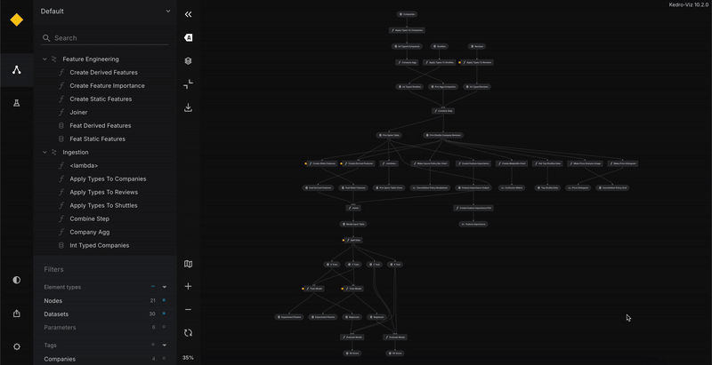
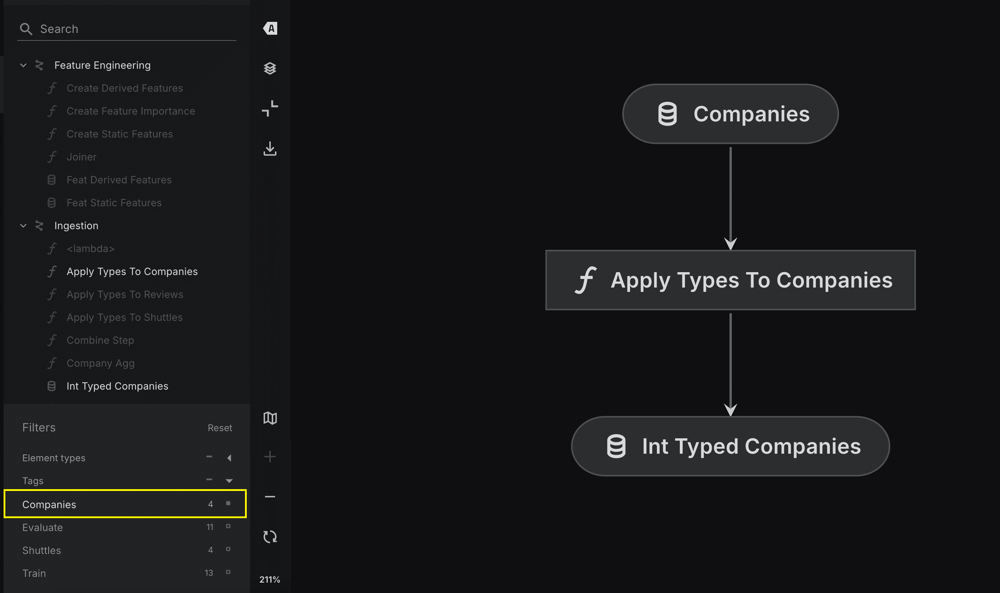
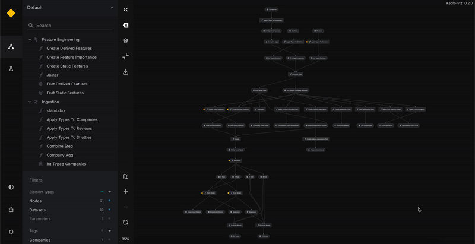

# Nodes grouping in Kedro: pipelines, tags, and namespaces

Effectively grouping nodes in deployment is crucial for maintainability, debugging, and execution control. This document provides an overview of three key grouping methods: pipelines, tags, and namespaces, along with their strengths, limitations, best uses, and relevant documentation links.

## Grouping by pipelines

If your project contains different pipelines, you can use them as predefined node groupings for deployment. Pipelines can be executed separately in the deployment environment. With the visualisation in Kedro Viz, you can switch to see different pipelines in an isolated view.
<br>


If you want to group nodes differently from the existing pipeline structure, you can use tags or namespaces instead of creating a new pipeline. The `kedro run --pipeline` command allows running one pipeline at a time, so multiple pipelines cannot be executed in a single step. While you can switch between pipelines in Kedro Viz, the flowchart view does not support collapsing or expanding them.

**Best used when**
- You have already separated your logic into different pipelines, and your project is structured to execute them independently in the deployment environment.

**Not to use when**
- You need to run more than one pipeline at a time.
- You want to use the expand and collapse functionality in Kedro Viz.

**How to use**

  ```bash
  kedro run --pipeline=<your_pipeline_name>
  ```
More information: [Run a pipeline by name](https://docs.kedro.org/en/stable/nodes_and_pipelines/run_a_pipeline.html#run-a-pipeline-by-name)

---

## Grouping by tags

You can tag individual nodes or the entire pipeline, allowing flexible execution of specific sections without modifying the pipeline structure. Kedro-Viz provides a clear visualisation of tagged nodes, making it easier to understand.
<br>


Please note that nodes with the same tag can exist in different pipelines, making debugging and maintaining the codebase more challenging, and tags do not enforce structure like pipelines or namespaces.

**Best used when**
- You need to run specific nodes that don’t belong to the same pipeline.
- You want to rerun a subset of nodes in a large pipeline.

**Not to use when**
- The tagged nodes have strong dependencies, which might cause execution failures.
- Tags are not hierarchical, so tracking groups of nodes can become difficult.

**How to use**

  ```bash
  kedro run --tags=<your_tag_name>
  ```
More information: [How to tag a node](https://docs.kedro.org/en/stable/nodes_and_pipelines/nodes.html#how-to-tag-a-node)

---

## Grouping by namespaces

Namespaces allow you to group nodes, ensuring clear dependencies and separation within a pipeline while maintaining a consistent structure. Like with pipelines or tags, you can enable selective execution using namespaces, and you cannot run more than one namespace simultaneously—Kedro allows executing one namespace at a time. Kedro Viz allows expanding and collapsing namespace pipelines in the visualisation.
<br>


Using namespaces comes with a few challenges:
- **Defining namespace at Pipeline-level:** When applying a namespace at the pipeline level, Kedro automatically renames all inputs, outputs, and parameters within that pipeline. You will need to update your catalog accordingly. If you don't want to change the names of your inputs, outputs, or parameters with the `namespace_name.` prefix while using a namespace, you should list these objects inside the corresponding parameters of the `pipeline()` creation function. For example:

```
return pipeline(
    base_pipeline,
    namespace = "new_namespaced_pipeline", # With that namespace, "new_namespaced_pipeline" prefix will be added to inputs, outputs, params, and node names
    inputs={"the_original_input_name"}, # Inputs remain the same, without namespace prefix
)
```
- **Defining namespace at Node-level:** Defining namespaces at node level is not recommended for grouping your nodes. The node level definition of namespaces should be used for creating collapsible views on Kedro-Viz for high level representation of your nodes. If you define namespaces at the node level, they behave similarly to tags and do not guarantee execution consistency.


**Best used when**
- You want to organise nodes logically within a pipeline while keeping a structured execution flow. You can also nest namespaced pipelines within each other for visualisation.
- Your pipeline structure is well-defined, and using namespaces improves visualisation in Kedro-Viz.

**Not to use when**
- In small and simple projects, using namespaces can introduce unnecessary complexity, making pipeline grouping a more suitable choice.
- Namespaces require additional effort, such as updating catalog names, since namespace prefixes are automatically applied to all the elements unless explicitly overridden in the namespaced pipeline parameters.

**How to use**

  ```bash
  kedro run --namespaces=< namespace1,namespace2 >
  ```
More information: [Namespaces](https://docs.kedro.org/en/stable/nodes_and_pipelines/namespaces.html)

---

**Summary table**

| Aspect | Pipelines | Tags | Namespaces |
|--------|-----------|------|-----------|
| **What Works** | If you're happy with how the nodes are structured in your existing pipeline, or your pipeline is low complexity and a new grouping view is not required then you don't have to use any alternatives | Tagging individual nodes or the entire pipeline allows flexible execution of specific sections without altering the pipeline structure, and Kedro-Viz offers clear visualisation of these tagged nodes for better understanding. | Namespaces group nodes to ensure clear dependencies and separation within a pipeline, allow selective execution, and can be visualised using Kedro-Viz. |
| **What Doesn't Work** | If you want to group nodes differently from the current pipeline structure, instead of creating a new pipeline, you can use alternative grouping methods such as tags or namespaces. | Lack of hierarchical structure, using tags makes debugging and maintaining the codebase more challenging | Defining namespaces at the node level behaves like tags without ensuring execution consistency, while defining them at the pipeline level helps with modularisation by renaming inputs, outputs, and parameters but can introduce naming conflicts if the pipeline is connected elsewhere or parameters are referenced outside the pipeline. |
| **Syntax** | `kedro run --pipeline=<your_pipeline_name>` | `kedro run --tags=<your_tag_name>` | `kedro run --namespaces=< namespace1,namespace2 >` |
