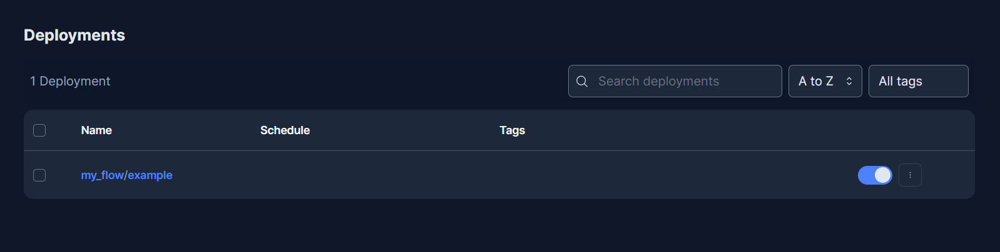
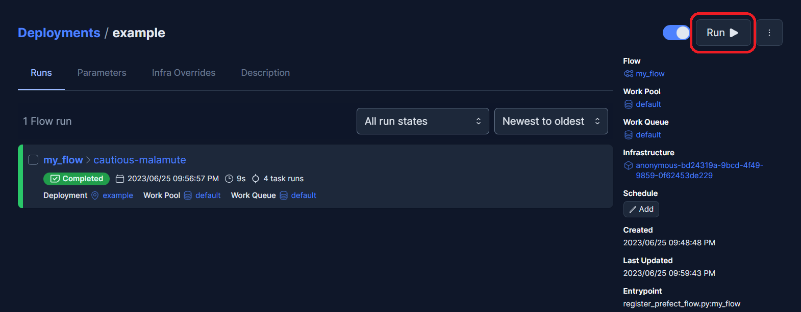

# Prefect

This page explains how to run your Kedro pipeline using [Prefect 2.0](https://www.prefect.io/opensource), an open-source workflow management system.

The scope of this documentation is the deployment to a self hosted [Prefect Server](https://docs.prefect.io/2.10.17/host/), which is an open-source backend that makes it easy to monitor and execute your Prefect flows and automatically extends Prefect 2.0. We will use an [Agent that dequeues submitted flow runs from a Work Queue](https://docs.prefect.io/2.10.17/tutorial/deployments/#why-workpools-and-workers).

```{note}
This deployment has been tested using Kedro 0.18.10 with Prefect version 2.10.17. If you want to deploy with Prefect 1.0, we recommend you review [earlier versions of Kedro's Prefect deployment documentation](https://docs.kedro.org/en/0.18.9/deployment/prefect.html).
```

## Prerequisites

To use Prefect 2.0 and Prefect Server, ensure you have the following prerequisites in place:

- [Prefect 2.0 is installed](https://docs.prefect.io/2.10.17/getting-started/installation/#installing-the-latest-version) on your machine

## Setup

Configure your `PREFECT_API_URL` to point to your local Prefect instance:

```bash
prefect config set PREFECT_API_URL="http://127.0.0.1:4200/api"
```

For each new Kedro project you create, you need to decide whether to opt into [usage analytics](https://github.com/kedro-org/kedro-plugins/tree/main/kedro-telemetry). Your decision is recorded in the `.telemetry` file stored in the project root.

```{important}
When you run a Kedro project locally, you are asked on the first `kedro` command for the project, but in this use case, the project will hang unless you follow these instructions.
```

Create a `.telemetry` file manually and put it in the **root of your Kedro project** and add your preference to give or decline consent. To do this, specify either `true` (to give consent) or `false`. The example given below accepts Kedro's usage analytics.

```text
consent: true
```

Run a Prefect Server instance:

```bash
prefect server start
```

In a separate terminal, [create a work pool](https://docs.prefect.io/2.10.17/concepts/work-pools/#work-pool-configuration) to organize the work and [create a work queue](https://docs.prefect.io/2.10.17/concepts/work-pools/#work-queues) for your agent to pull from:

```bash
prefect work-pool create --type prefect-agent <work_pool_name>
prefect work-queue create --pool <work_pool_name> <work_queue_name>
```

Now run a Prefect Agent that subscribes to a work queue inside the work pool you created:

```bash
prefect agent start --pool <work_pool_name> --work-queue <work_queue_name>
```

## How to run your Kedro pipeline using Prefect 2.0

### Convert your Kedro pipeline to Prefect 2.0 flow

To build a [Prefect flow](https://docs.prefect.io/core/concepts/flows.html) for your Kedro pipeline programmatically and register it with the Prefect API, use the following Python script, which should be stored in your project’s **root directory**:

```python
# <project_root>/register_prefect_flow.py
import click
from pathlib import Path
from typing import Dict, List, Union, Callable

from kedro.framework.hooks.manager import _create_hook_manager
from kedro.framework.project import pipelines
from kedro.framework.session import KedroSession
from kedro.framework.startup import bootstrap_project
from kedro.io import DataCatalog, MemoryDataset
from kedro.pipeline.node import Node
from kedro.runner import run_node

from prefect import flow, task, get_run_logger
from prefect.deployments import Deployment


@click.command()
@click.option("-p", "--pipeline", "pipeline_name", default="__default__")
@click.option("--env", "-e", type=str, default="base")
@click.option("--deployment_name", "deployment_name", default="example")
@click.option("--work_pool_name", "work_pool_name", default="default")
@click.option("--work_queue_name", "work_queue_name", default="default")
@click.option("--version", "version", default="1.0")
def prefect_deploy(
    pipeline_name, env, deployment_name, work_pool_name, work_queue_name, version
):
    """Register a Kedro pipeline as a Prefect flow."""

    # Pipeline name to execute
    pipeline_name = pipeline_name or "__default__"

    # Use standard deployment configuration for local execution. If you require a different
    # infrastructure, check the API docs for Deployments at: https://docs.prefect.io/latest/api-ref/prefect/deployments/
    deployment = Deployment.build_from_flow(
        flow=my_flow,
        name=deployment_name,
        path=str(Path.cwd()),
        version=version,
        parameters={
            "pipeline_name": pipeline_name,
            "env": env,
        },
        infra_overrides={"env": {"PREFECT_LOGGING_LEVEL": "DEBUG"}},
        work_pool_name=work_pool_name,
        work_queue_name=work_queue_name,
    )

    deployment.apply()


@flow(name="my_flow")
def my_flow(pipeline_name: str, env: str):
    logger = get_run_logger()
    project_path = Path.cwd()

    metadata = bootstrap_project(project_path)
    logger.info("Project name: %s", metadata.project_name)

    logger.info("Initializing Kedro...")
    execution_config = kedro_init(
        pipeline_name=pipeline_name, project_path=project_path, env=env
    )

    logger.info("Building execution layers...")
    execution_layers = init_kedro_tasks_by_execution_layer(
        pipeline_name, execution_config
    )

    for layer in execution_layers:
        logger.info("Running layer...")
        for node_task in layer:
            logger.info("Running node...")
            node_task()


@task()
def kedro_init(
    pipeline_name: str,
    project_path: Path,
    env: str,
):
    """
    Initializes a Kedro session and returns the DataCatalog and
    KedroSession
    """
    # bootstrap project within task / flow scope

    logger = get_run_logger()
    logger.info("Bootstrapping project")
    bootstrap_project(project_path)

    session = KedroSession.create(
        project_path=project_path,
        env=env,
    )
    # Note that for logging inside a Prefect task logger is used.
    logger.info("Session created with ID %s", session.session_id)
    pipeline = pipelines.get(pipeline_name)
    logger.info("Loading context...")
    context = session.load_context()
    catalog = context.catalog
    logger.info("Registering datasets...")
    unregistered_ds = pipeline.datasets() - set(catalog.list())  # NOQA
    for ds_name in unregistered_ds:
        catalog.add(ds_name, MemoryDataset())
    return {"catalog": catalog, "sess_id": session.session_id}


def init_kedro_tasks_by_execution_layer(
    pipeline_name: str,
    execution_config: Union[None, Dict[str, Union[DataCatalog, str]]] = None,
) -> List[List[Callable]]:
    """
    Inits the Kedro tasks ordered topologically in groups, which implies that an earlier group
    is the dependency of later one.

    Args:
        pipeline_name (str): The pipeline name to execute
        execution_config (Union[None, Dict[str, Union[DataCatalog, str]]], optional):
        The required execution config for each node. Defaults to None.

    Returns:
        List[List[Callable]]: A list of topologically ordered task groups
    """

    pipeline = pipelines.get(pipeline_name)

    execution_layers = []

    # Return a list of the pipeline nodes in topologically ordered groups,
    #  i.e. if node A needs to be run before node B, it will appear in an
    #  earlier group.
    for layer in pipeline.grouped_nodes:
        execution_layer = []
        for node in layer:
            # Use a function for task instantiation which avoids duplication of
            # tasks
            task = instantiate_task(node, execution_config)
            execution_layer.append(task)
        execution_layers.append(execution_layer)

    return execution_layers


def kedro_task(
    node: Node, task_dict: Union[None, Dict[str, Union[DataCatalog, str]]] = None
):
    run_node(
        node,
        task_dict["catalog"],
        _create_hook_manager(),
        task_dict["sess_id"],
    )


def instantiate_task(
    node: Node,
    execution_config: Union[None, Dict[str, Union[DataCatalog, str]]] = None,
) -> Callable:
    """
    Function that wraps a Node inside a task for future execution

    Args:
        node: Kedro node for which a Prefect task is being created.
        execution_config: The configurations required for the node to execute
        that includes catalogs and session id

    Returns: Prefect task for the passed node

    """
    return task(lambda: kedro_task(node, execution_config)).with_options(name=node.name)


if __name__ == "__main__":
    prefect_deploy()
```

Then, run the deployment script in other terminal:

```bash
python register_prefect_flow.py --work_pool_name <work_pool_name> --work_queue_name <work_queue_name>
```

```{note}
Be sure that your Prefect Server is up and running. Verify that the deployment script arguments match the work pool and work queue names.
```

### Run Prefect flow

Now, having the flow registered, you can use [Prefect Server UI](https://docs.prefect.io/2.10.17/host/) to orchestrate and monitor it.

Navigate to http://localhost:4200/deployments to see your registered flow.



Click on the flow to open it and then trigger your flow using the "RUN" > "QUICK RUN" button and leave the parameters by default. If you want to run a specific pipeline you can replace the `__default__` value.

```{note}
Be sure that both your Prefect Server and Agent are up and running.
```


