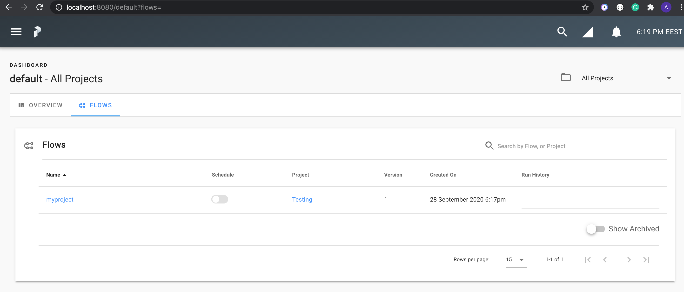
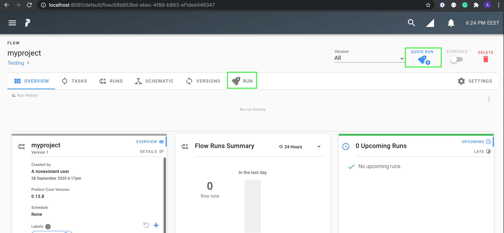

# Deployment with Prefect

This page explains how to run your Kedro pipeline using [Prefect Core](https://www.prefect.io/products/core/), an open-source workflow management system.

In scope of this deployment, we are interested in [Prefect Server](https://docs.prefect.io/orchestration/server/overview.html#what-is-prefect-server), an open-source backend that makes it easy to monitor and execute your Prefect flows and automatically extends the Prefect Core.

```{note}
Prefect Server ships out-of-the-box with a fully featured user interface.
```

## Prerequisites

To use Prefect Core and Prefect Server, ensure you have the following prerequisites in place:

- [Prefect Core is installed](https://docs.prefect.io/core/getting_started/install.html) on your machine
- [Docker](https://www.docker.com/) and [Docker Compose](https://docs.docker.com/compose/) are installed and Docker Engine is running
- [Prefect Server is up and running](https://docs.prefect.io/orchestration/Server/deploy-local.html)
- `PREFECT__LOGGING__EXTRA_LOGGERS` environment variable is set (this is required to get Kedro logs published):

```console
export PREFECT__LOGGING__EXTRA_LOGGERS="['kedro']"
```

## How to run your Kedro pipeline using Prefect

### Convert your Kedro pipeline to Prefect flow

To build a [Prefect flow](https://docs.prefect.io/core/concepts/flows.html) for your Kedro pipeline programmatically and register it with the Prefect API, use the following Python script, which should be stored in your project’s root directory:

```python
# <project_root>/register_prefect_flow.py
from pathlib import Path

import click

from prefect import Client, Flow, Task
from prefect.exceptions import ClientError

from kedro.framework.project import pipelines
from kedro.framework.session import KedroSession
from kedro.framework.startup import bootstrap_project
from kedro.io import DataCatalog, MemoryDataSet
from kedro.pipeline.node import Node
from kedro.runner import run_node


class KedroTask(Task):
    """Kedro node as a Prefect task."""

    def __init__(self, node: Node, catalog: DataCatalog) -> None:
        self._node = node
        self._catalog = catalog
        super().__init__(name=node.name, tags=node.tags)

    def run(self):
        run_node(self._node, self._catalog)


@click.command()
@click.option("-p", "--pipeline", "pipeline_name", default=None)
@click.option("--env", "-e", type=str, default=None)
def build_and_register_flow(pipeline_name, env):
    """Register a Kedro pipeline as a Prefect flow."""
    project_path = Path.cwd()
    metadata = bootstrap_project(project_path)

    session = KedroSession.create(project_path=project_path, env=env)
    context = session.load_context()

    catalog = context.catalog
    pipeline_name = pipeline_name or "__default__"
    pipeline = pipelines.get(pipeline_name)

    unregistered_ds = pipeline.data_sets() - set(catalog.list())
    for ds_name in unregistered_ds:
        catalog.add(ds_name, MemoryDataSet())

    flow = Flow(metadata.project_name)

    tasks = {}
    for node, parent_nodes in pipeline.node_dependencies.items():
        if node._unique_key not in tasks:
            node_task = KedroTask(node, catalog)
            tasks[node._unique_key] = node_task
        else:
            node_task = tasks[node._unique_key]

        parent_tasks = []

        for parent in parent_nodes:
            if parent._unique_key not in tasks:
                parent_task = KedroTask(parent, catalog)
                tasks[parent._unique_key] = parent_task
            else:
                parent_task = tasks[parent._unique_key]

            parent_tasks.append(parent_task)

        flow.set_dependencies(task=node_task, upstream_tasks=parent_tasks)

    client = Client()
    try:
        client.create_project(project_name=metadata.project_name)
    except ClientError:
        # `metadata.project_name` project already exists
        pass

    # Register the flow with the server
    flow.register(project_name=metadata.project_name)

    # Start a local agent that can communicate between the server
    # and your flow code
    flow.run_agent()


if __name__ == "__main__":
    build_and_register_flow()
```

```{note}
The script launches a [local agent](https://docs.prefect.io/orchestration/agents/local.html). Remember to stop the agent with Ctrl-C when you complete.
```


### Run Prefect flow

Now, having the flow registered, you can use [Prefect UI](https://docs.prefect.io/orchestration/ui/dashboard.html) to orchestrate and monitor it.

Navigate to http://localhost:8080/default?flows= to see your registered flow.



Click on the flow to open it and then trigger your flow using the "RUN"/"QUICK RUN" button.


