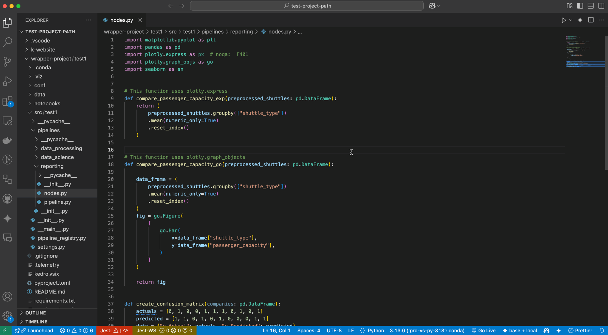
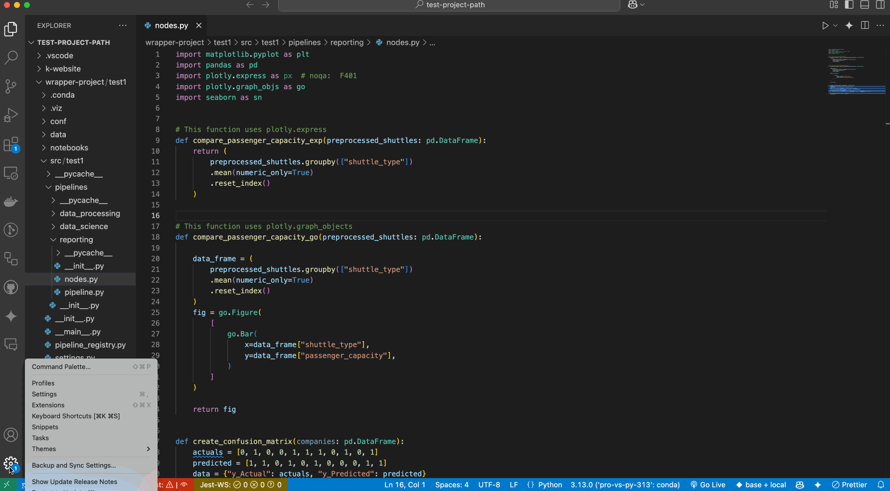
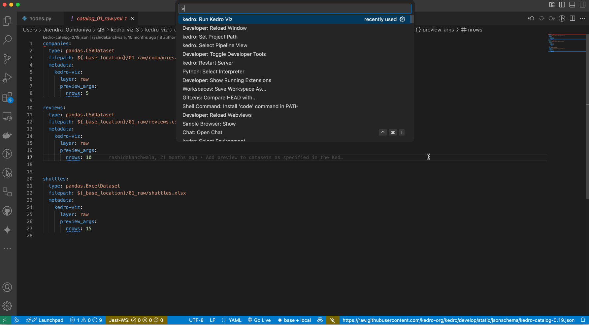
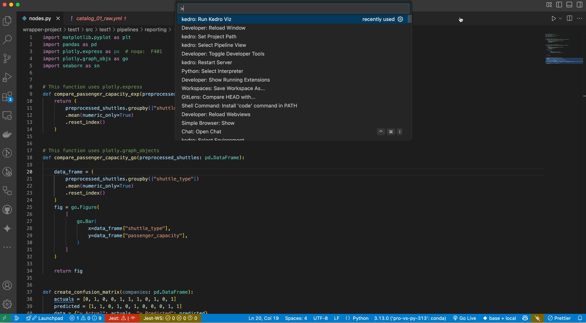

# Set up Visual Studio Code

Start by opening a new project directory in VS Code and installing the Python plugin under **Tools and languages**:


Python is an interpreted language; to run Python code you must tell VS Code which interpreter to use. From within VS Code, select a Python 3 interpreter by opening the **Command Palette** (`Cmd + Shift + P` for macOS), start typing the **Python: Select Interpreter** command to search, then select the command.

At this stage, you should be able to see the `conda` environment that you have created. Select the environment:


## Kedro VS Code Extension
[Kedro VS Code extension](https://marketplace.visualstudio.com/items?itemName=kedro.Kedro) supports Kedro 0.19+. It helps you navigate around your Kedro project by finding the definition of your datasets, find references to them in your code, and more.


## Setting up `venv` / `virtualenv` in VS Code

We're going to show you how to get your virtual environments to show up in your Python interpreter in VS Code. You do this by opening [`settings.json`](https://code.visualstudio.com/docs/getstarted/settings#_settings-file-locations) and adding the following:

```console
"python.venvPath": "/path/containing/your/venvs/"
```

It is useful to note that if you create a `venv` / `virtualenv` in your project directory named `venv`, VS Code (much like PyCharm) automatically loads it as the Python interpreter (unless you manually define your Python interpreter to something else as described above).


## Setting up tasks

Here we will show you how to setup tasks for such Kedro CLI commands as `run`, `test`, `install`, `package`, etc.

You'll start by finding the path of your Kedro CLI script in the terminal:

```console
# macOS / Linux
which kedro

# Windows (in **Anaconda Command Prompt**)
where kedro
```

We're going to need you to modify your `tasks.json`. To do this, go to **Terminal > Configure Tasks...** on your menu and open up `tasks.json` in the editor. Modify it with the following:

```
{
    // See https://go.microsoft.com/fwlink/?LinkId=733558
    // Kedro tasks
    "version": "2.0.0",
    "tasks": [
        {
            "label": "Install",
            "type": "shell",
            "command": "/path/to/kedro/script",
            "args": [
                "install"
            ]
        },
        {
            "label": "Test",
            "group": "test",
            "type": "shell",
            "command": "/path/to/kedro/script",
            "args": [
                "test"
            ]
        },
        {
            "label": "Run",
            "type": "shell",
            "command": "/path/to/kedro/script",
            "args": [
                "run"
            ]
        },

        // This is the default build task
        {
            "label": "Package",
            "group": {
                "kind": "build",
                "isDefault": true
            },
            "type": "shell",
            "command": "/path/to/kedro/script",
            "args": [
                "package"
            ],
            // Will run `Test` before packaging
            "dependsOn": [
                "Test"
            ]
        }
    ]
}
```

To start a build, go to **Terminal > Run Build Task...** or press `Cmd + Shift + B` for macOS. You can run other tasks by going to **Terminal > Run** and choosing which task you want to run.


## Setting a custom Kedro project path

Starting with Kedro VS Code extension version 0.3.0, you can now specify a custom path to your Kedro project. This is useful when:

- Your Kedro project is not at the root of your workspace
- You want to work with a Kedro project that is outside your current workspace
- You have multiple Kedro projects and want to switch between them


### Set up a custom path using the command palette

1. Open the Command Palette by pressing `Cmd + Shift + P` (macOS) or `Ctrl + Shift + P` (Windows/Linux)
2. Type `Kedro: Set Project Path` and select it
3. Enter the absolute path to your Kedro project (for example, `/Users/username/projects/my-kedro-project`)



### Set up a custom path using the VSCode settings UI

1. Open VS Code settings by pressing `Cmd + ,` (macOS) or `Ctrl + ,` (Windows/Linux)
2. Search for `kedro` in the settings search bar
3. Find the `Kedro: Project Path` setting
4. Enter the absolute path to your Kedro project in the field



### Multi-root workspace integration

If the Kedro project path you specify is not part of your current workspace, the extension will automatically add it to your workspace as part of a multi-root workspace. This allows you to:

- See the project files in the Explorer
- Navigate the project structure
- Use all Kedro extension features with the specified project

### Example directory structure

If your Kedro project is nested within other folders, setting a custom project path can help the extension locate it. For example:

```
root
│   file001.txt
│
└───folder1
│   │   file011.txt
│   │   file012.txt
│   │
│   └───kedroProject  <-- Set this path
│       │   pyproject.toml
│       │   README.md
│       │   ...
│
└───folder2
    │   file020.txt
    │   file021.txt
```

In this case, you would set the Kedro project path to the absolute path of the `kedroProject` directory, such as `/Users/username/root/folder1/kedroProject`.

### Switching between multiple projects

If you work with multiple Kedro projects, you can switch between them by updating the project path setting. The extension will automatically detect the change and reconfigure itself to work with the newly specified project.

### Troubleshooting

If the extension doesn't recognise your Kedro project after setting a custom path:

1. Ensure the path points to a valid Kedro project (containing `pyproject.toml` with Kedro dependencies)
2. Check that the path is an absolute path, not a relative one
3. Reload VS Code if the changes don’t take effect.


## Real time catalog validation with Kedro LSP

With the latest **Kedro VS Code extension**, you can automatically check your `catalog*.yml` or `catalog*.yaml` files without installing additional YAML plugins or schemas. The extension now uses a **Language Server Protocol (LSP)** approach to catch configuration issues as you edit.

### How it works

- **Parsing & Dataset Checks**: The extension reads your catalog file and tries to load each dataset to ensure the configuration is correct.
- **Immediate Feedback**: If any dataset has an invalid type or missing dependency, you’ll see red underlines in the editor and an entry in VS Code’s **Problems** panel.
- **Incremental & Periodic Validation**: The extension re-checks your catalogs whenever you open or edit a file, and it can also run in the background, so you’re always up-to-date on any potential issues.

### Viewing errors in the problems panel

VS Code’s **Problems** panel provides a convenient overview of all catalog issues:

1. Go to **View > Problems** or press `Ctrl+Shift+M` (or `Cmd+Shift+M` on macOS).
2. Expand any reported errors to see details about what’s wrong (for example, “Class not found.”).
3. **Click** an error to jump directly to the problematic line in the catalog file.


This simplifies fixing dataset errors caused by things such as typos in your dataset type or missing modules before running any Kedro pipelines.

## Visualise the pipeline with Kedro-Viz

To visualize your Kedro project using Kedro-Viz in Visual Studio Code, follow these steps:

1. **Open the Command Palette**:
Press `Cmd` + `Shift` + `P` (on macOS) or `Ctrl` + `Shift` + `P` (on Windows/Linux).

2. **Run Kedro-Viz**:
Type `kedro: Run Kedro Viz` and select the command.
This will launch Kedro-Viz and display your pipeline visually within the extension.

**Note:** To update the Kedro-Viz flowchart after making any changes to your Kedro project, please hit `Cmd` + `Shift` + `P` to open the VSCode command and look for `kedro: restart server`.

Navigate to Node Functions:
Click on a node in the Kedro-Viz flowchart, and it will automatically navigate to the corresponding node function in your code.


Navigate to DataCatalog:
Clicking on a data node in the flowchart will open the corresponding dataset in the Data Catalog.


## Debugging

To debug, you _may_ need to create an `.env` file in your project root. Add the full path to the `./src/` folder to the *PYTHONPATH* environment variable in the `.env` file:

```console
# In macOS / Linux:
PYTHONPATH=/path/to/project/src:$PYTHONPATH

# In Windows
PYTHONPATH=C:/path/to/project/src;%PYTHONPATH%
```

You can find [more information about setting up environmental variables in the VS Code documentation](https://code.visualstudio.com/docs/python/environments#_environment-variable-definitions-file).

Click on the **Run and Debug** icon on the left activity bar (press `Cmd + Shift + D` for macOS). If there is no existing configuration, click on **create a launch.json file** else click on the dropdown arrow in the top-left (shown below) and click **Add Configuration** .


```{note}
If you encounter the following error: `Cannot read property 'openConfigFile' of undefined`, you can manually create `launch.json` file in `.vscode` directory and paste the configuration from below.
```

Edit the `launch.json` that opens in the editor with:

```
{
    // Use IntelliSense to learn about possible attributes.
    // Hover to view descriptions of existing attributes.
    // For more information, visit: https://go.microsoft.com/fwlink/?linkid=830387
    "version": "0.2.0",
    "configurations": [
        {
            "name": "Python: Kedro Run",
            "type": "python",
            "request": "launch",
            "console": "integratedTerminal",
            "module": "kedro",
            "args": ["run"]
            // Any other arguments should be passed as a comma-seperated-list
            // e.g "args": ["run", "--pipeline", "pipeline_name"]
        }
    ]
}
```

To add a breakpoint in your `pipeline.py` script, for example, click on the left hand side of the line of code:


Click on **Debug** button on the left pane:


Then select the debug config **Python: Kedro Run** and click **Debug** (the green play button):


Execution should stop at the breakpoint:


### Advanced: Remote interpreter debugging

It is possible to debug remotely using VS Code. The following example assumes SSH access is available on the remote computer (running a Unix-like OS) running the code that will be debugged.

First install the `ptvsd` Python library on both the local and remote computer using the following command (execute it on both computers in the appropriate `conda` environment):

```console
python -m pip install --upgrade ptvsd
```

[Go to the Debugger Configurations as described in the debugging section above](#debugging). Add the following to the `configurations` array in `launch.json`:

```
{
    "name": "Kedro Remote Debugger",
    "type": "python",
    "request": "attach",
    "pathMappings": [
        {
            // You may also manually specify the directory containing your source code.
            "localRoot": "${workspaceFolder}",
            "remoteRoot": "/path/to/your/project"
        }
    ],
    "port": 3000,  // Set to the remote port.
    "host": "127.0.0.1"  // Set to your remote host's public IP address.
}
```

Change the `remoteRoot` path to the path of your project on the remote computer. Open the file `src/<package_name>/__main__.py` and enter the following near the top:

```python
import ptvsd

# Allow other computers to attach to ptvsd at this IP address and port.
ptvsd.enable_attach(address=("127.0.0.1", 3000), redirect_output=True)

# Pause the program until a remote debugger is attached
print("Waiting for debugger to attach...")
ptvsd.wait_for_attach()
```

Ensure both computers (the computer you are working on and the remote computer executing your code) have the same source code. For example, you can use `scp` to sync your code:

```console
scp -r <project_root> <your_username>@<remote_server>:projects/
```

❗The example above assumes there is a directory called `projects` in the home directory of the user account on the remote computer. This is where the project will be copied to. This can be set up as a deploy task as described above:

```
// Add to `tasks` array in `tasks.json`
{
    "label": "Deploy",
    "type": "shell",
    "command": "scp -r <project_root> <your_username>@<remote_server>:projects/",
}
```


```{note}
[There is also a third-party plugin for VS Code that supports remote workspaces.](https://marketplace.visualstudio.com/items?itemName=Liveecommerce.vscode-remote-workspace)
```

Start executing the pipeline on your remote computer:

```console
while :; do kedro run; done
```

You should see the following message in the terminal and execution will stop:

```console
Waiting for debugger to attach...
```

Open a new terminal session and create an SSH tunnel from your local computer to the remote one (leave this process running):

```console
ssh -vNL 3000:127.0.0.1:3000 <your_username>@<remote_server>
```

Go to the **Debugging** section in VS Code and select the newly created remote debugger profile:


You must [set a breakpoint in VS Code as described in the debugging section above](#debugging) and start the debugger by clicking the green play triangle:

[Find more information on debugging in VS Code](https://code.visualstudio.com/docs/python/debugging).
