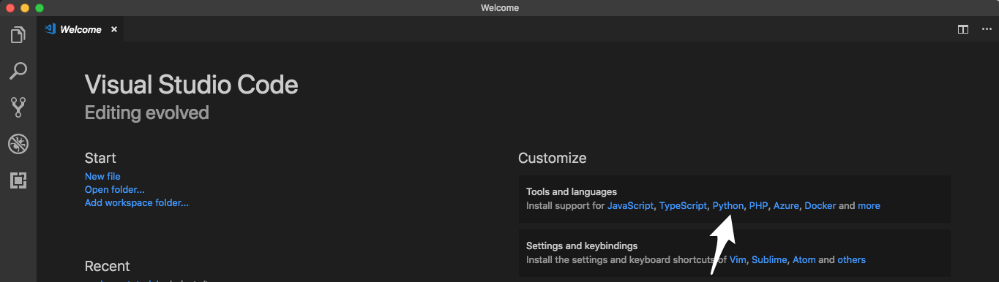
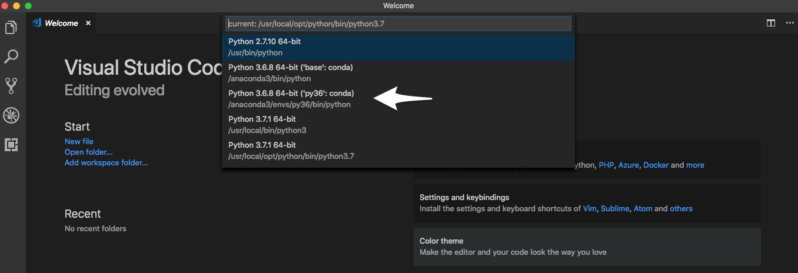
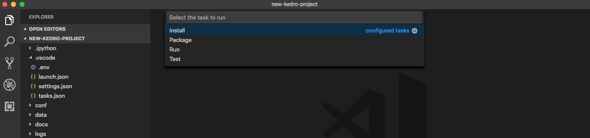
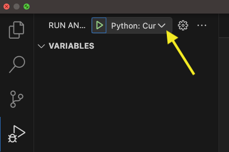
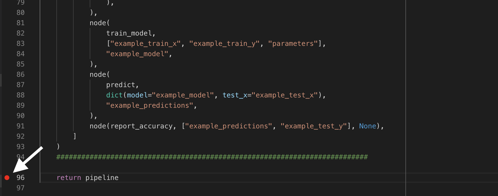
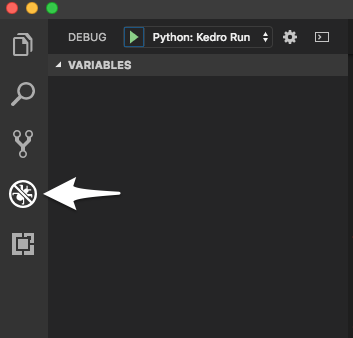
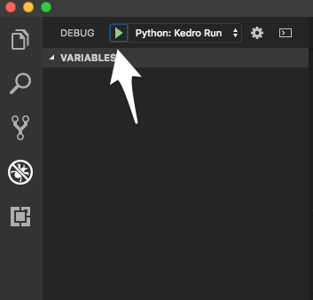
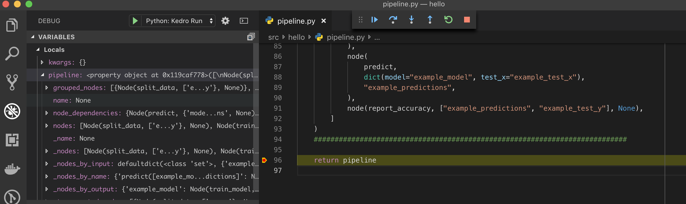
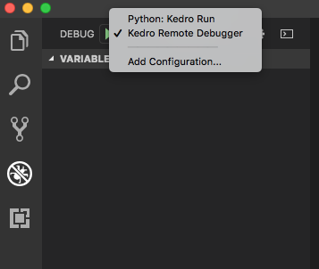

# Set up Visual Studio Code

Start by opening a new project directory in VS Code and installing the Python plugin under **Tools and languages**:



Python is an interpreted language; to run Python code you must tell VS Code which interpreter to use. From within VS Code, select a Python 3 interpreter by opening the **Command Palette** (`Cmd + Shift + P` for macOS), start typing the **Python: Select Interpreter** command to search, then select the command.

At this stage, you should be able to see the `conda` environment that you have created. Select the environment:



## Advanced: For those using `venv` / `virtualenv`

We're going to show you how to get your virtual environments to show up in your Python interpreter in VS Code. You do this by opening [`settings.json`](https://code.visualstudio.com/docs/getstarted/settings#_settings-file-locations) and adding the following:

```console
"python.venvPath": "/path/containing/your/venvs/"
```

It is useful to note that if you create a `venv` / `virtualenv` in your project directory named `venv`, VS Code (much like PyCharm) automatically loads it as the Python interpreter (unless you manually define your Python interpreter to something else as described above).


## Setting up tasks

Here we will show you how to setup tasks for such Kedro CLI commands as `run`, `test`, `install`, `package`, etc.

You'll start by finding the path of your Kedro CLI script in the terminal:

```console
# macOS / Linux
which kedro

# Windows (in **Anaconda Command Prompt**)
python -c 'import sys, os.path; print(os.path.join(os.path.dirname(sys.executable), "kedro"))'
```

We're going to need you to modify your `tasks.json`. To do this, go to **Terminal > Configure Tasks...** on your menu and open up `tasks.json` in the editor. Modify it with the following:

```
{
    // See https://go.microsoft.com/fwlink/?LinkId=733558
    // Kedro tasks
    "version": "2.0.0",
    "tasks": [
        {
            "label": "Install",
            "type": "shell",
            "command": "/path/to/kedro/script",
            "args": [
                "install"
            ]
        },
        {
            "label": "Test",
            "group": "test",
            "type": "shell",
            "command": "/path/to/kedro/script",
            "args": [
                "test"
            ]
        },
        {
            "label": "Run",
            "type": "shell",
            "command": "/path/to/kedro/script",
            "args": [
                "run"
            ]
        },

        // This is the default build task
        {
            "label": "Package",
            "group": {
                "kind": "build",
                "isDefault": true
            },
            "type": "shell",
            "command": "/path/to/kedro/script",
            "args": [
                "package"
            ],
            // Will run `Test` before packaging
            "dependsOn": [
                "Test"
            ]
        }
    ]
}
```

To start a build, go to **Terminal > Run Build Task...** or press `Cmd + Shift + B` for macOS. You can run other tasks by going to **Terminal > Run** and choosing which task you want to run.




## Debugging

To debug, you _may_ need to create an `.env` file in your project root. Add the full path to the `./src/` folder to the *PYTHONPATH* environment variable in the `.env` file:

```console
# In macOS / Linux:
PYTHONPATH=/path/to/project/src:$PYTHONPATH

# In Windows
PYTHONPATH=C:/path/to/project/src;%PYTHONPATH%
```

You can find [more information about setting up environmental variables in the VSCode documentation](https://code.visualstudio.com/docs/python/environments#_environment-variable-definitions-file).

Click on the **Run and Debug** icon on the left activity bar (press `Cmd + Shift + D` for macOS). If there is no existing configuration, click on **create a launch.json file** else click on the dropdown arrow in the top-left (shown below) and click **Add Configuration** .


```{note}
If you encounter the following error: `Cannot read property 'openConfigFile' of undefined`, you can manually create `launch.json` file in `.vscode` directory and paste the configuration from below.
```

Edit the `launch.json` that opens in the editor with:

```
{
    // Use IntelliSense to learn about possible attributes.
    // Hover to view descriptions of existing attributes.
    // For more information, visit: https://go.microsoft.com/fwlink/?linkid=830387
    "version": "0.2.0",
    "configurations": [
        {
            "name": "Python: Kedro Run",
            "type": "python",
            "request": "launch",
            "console": "integratedTerminal",
            "module": "kedro",
            "args": ["run"]
            // Any other arguments should be passed as a comma-seperated-list
            // e.g "args": ["run", "--pipeline", "pipeline_name"]
        }
    ]
}
```

To add a breakpoint in your `pipeline.py` script, for example, click on the left hand side of the line of code:



Click on **Debug** button on the left pane:



Then select the debug config **Python: Kedro Run** and click **Debug** (the green play button):



Execution should stop at the breakpoint:



### Advanced: Remote Interpreter / Debugging

It is possible to debug remotely using VS Code. The following example assumes SSH access is available on the remote computer (running a Unix-like OS) running the code that will be debugged.

First install the `ptvsd` Python library on both the local and remote computer using the following command (execute it on both computers in the appropriate `conda` environment):

```console
python -m pip install --upgrade ptvsd
```

[Go to the Debugger Configurations as described in the debugging section above](#debugging). Add the following to the `configurations` array in `launch.json`:

```
{
    "name": "Kedro Remote Debugger",
    "type": "python",
    "request": "attach",
    "pathMappings": [
        {
            // You may also manually specify the directory containing your source code.
            "localRoot": "${workspaceFolder}",
            "remoteRoot": "/path/to/your/project"
        }
    ],
    "port": 3000,  // Set to the remote port.
    "host": "127.0.0.1"  // Set to your remote host's public IP address.
}
```

Change the `remoteRoot` path to the path of your project on the remote computer. Open the file `src/<package_name>/__main__.py` and enter the following near the top:

```python
import ptvsd

# Allow other computers to attach to ptvsd at this IP address and port.
ptvsd.enable_attach(address=("127.0.0.1", 3000), redirect_output=True)

# Pause the program until a remote debugger is attached
print("Waiting for debugger to attach...")
ptvsd.wait_for_attach()
```

Ensure both computers (the computer you are working on and the remote computer executing your code) have the same source code. For example, you can use `scp` to sync your code:

```console
scp -r <project_root> <your_username>@<remote_server>:projects/
```

❗The example above assumes there is a directory called `projects` in the home directory of the user account on the remote computer. This is where the project will be copied to. This can be set up as a deploy task as described above:

```
// Add to `tasks` array in `tasks.json`
{
    "label": "Deploy",
    "type": "shell",
    "command": "scp -r <project_root> <your_username>@<remote_server>:projects/",
}
```


```{note}
[There is also a third-party plugin for VS Code that supports remote workspaces.](https://marketplace.visualstudio.com/items?itemName=Liveecommerce.vscode-remote-workspace)
```

Start executing the pipeline on your remote computer:

```console
while :; do kedro run; done
```

You should see the following message in the terminal and execution will stop:

```console
Waiting for debugger to attach...
```

Open a new terminal session and create an SSH tunnel from your local computer to the remote one (leave this process running):

```console
ssh -vNL 3000:127.0.0.1:3000 <your_username>@<remote_server>
```

Go to the **Debugging** section in VS Code and select the newly created remote debugger profile:



You must [set a breakpoint in VS Code as described in the debugging section above](#debugging) and start the debugger by clicking the green play triangle:

[Find more information on debugging in VS Code](https://code.visualstudio.com/docs/python/debugging).

## Configuring the Kedro catalog validation schema

You can enable the Kedro catalog validation schema in your VSCode IDE to enable real-time validation, autocompletion and see information about the different fields in your `catalog` as you write it. To enable this, make sure you have the [YAML plugin](https://marketplace.visualstudio.com/items?itemName=redhat.vscode-yaml) installed.

Enter the following in your `settings.json` file:

```json
{
  "yaml.schemas": {
    "https://raw.githubusercontent.com/kedro-org/kedro/develop/static/jsonschema/kedro-catalog-0.18.json": "conf/**/*catalog*"
  }
}
```

and start editing your `catalog` files.

> [Different schemas for different Kedro versions can be found in the Kedro repository](https://github.com/kedro-org/kedro/tree/main/static/jsonschema).
