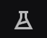
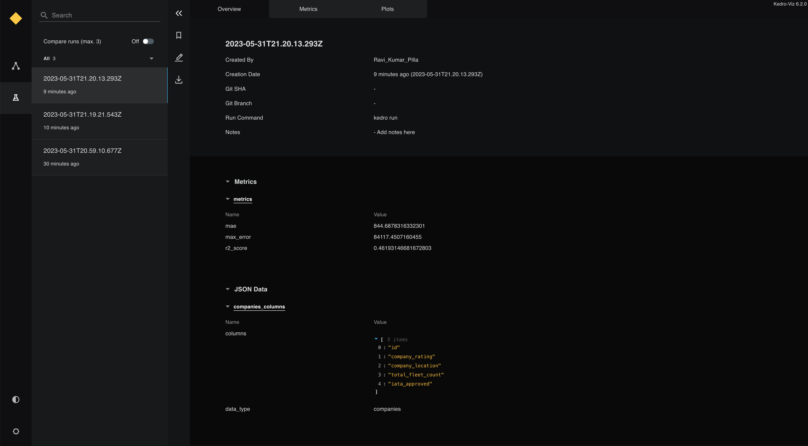
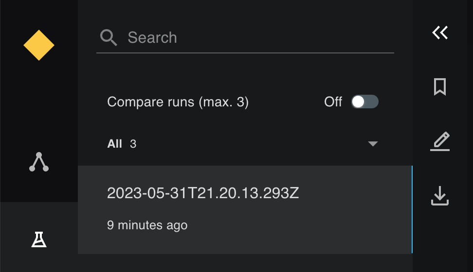
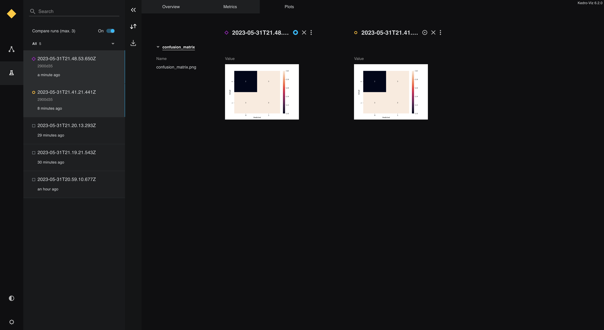
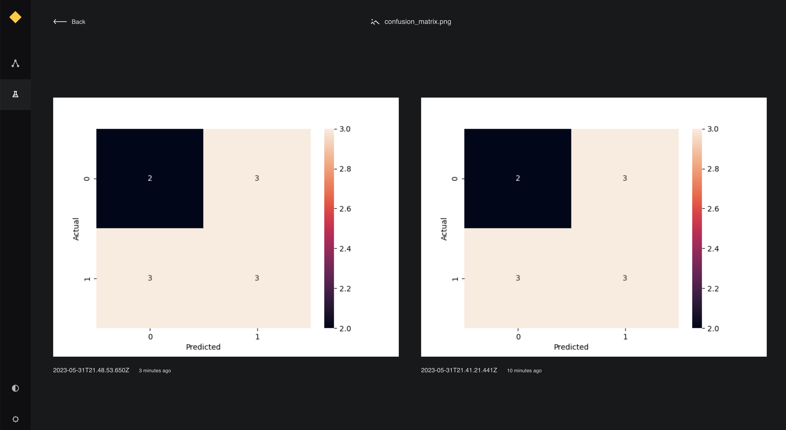
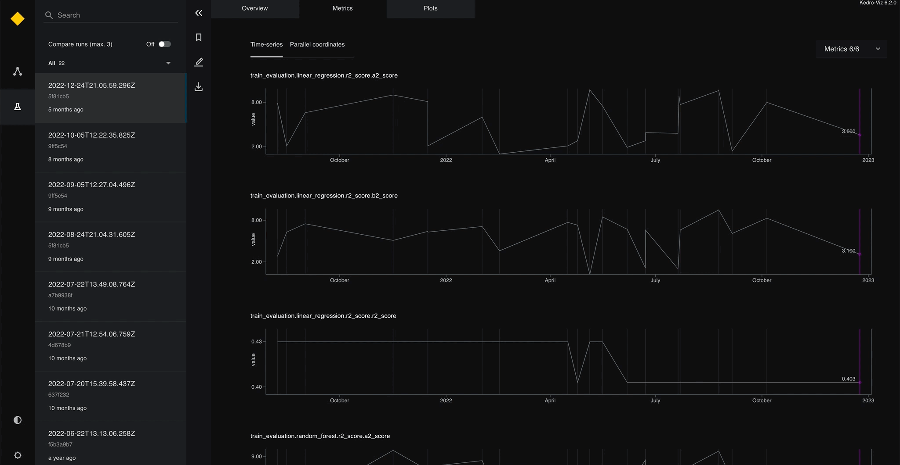
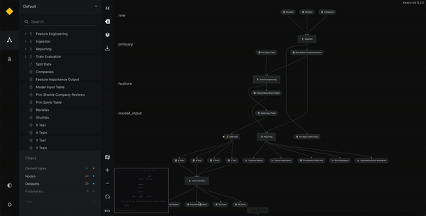

# Experiment tracking in Kedro-Viz


Experiment tracking is the process of saving all the metadata related to an experiment each time you run it. It enables you to compare different runs of a machine-learning model as part of the experimentation process.

The metadata you store may include:

* Scripts used for running the experiment
* Environment configuration files
* Versions of the data used for training and evaluation
* Evaluation metrics
* Model weights
* Plots and other visualisations

You can use Kedro-Viz experiment tracking to store and access results, and to share them with others for comparison. Storage can be local or remote, such as cloud storage on AWS S3.

Kedro's [experiment tracking demo](https://demo.kedro.org/experiment-tracking) enables you to explore the experiment tracking capabilities of Kedro-Viz.


## Kedro versions supporting experiment tracking
Kedro has always supported parameter versioning (as part of your codebase with a version control system like `git`) and Kedro’s dataset versioning capabilities enabled you to [snapshot models, datasets and plots](../data/data_catalog.md#dataset-versioning).

Kedro-Viz version 4.1.1 introduced metadata capture, visualisation, discovery and comparison, enabling you to access, edit and [compare your experiments](#access-run-data-and-compare-runs) and additionally [track how your metrics change over time](#view-and-compare-metrics-data).

Kedro-Viz version 5.0 also supports the [display and comparison of plots, such as Plotly and Matplotlib](../visualisation/visualise_charts_with_plotly.md). Support for metric plots (timeseries and parellel coords) was added to Kedro-Viz version 5.2.1.

Kedro-Viz version 6.2 includes support for collaborative experiment tracking using a cloud storage solution. This means that multiple users can store their experiment data in a centralized remote storage, such as AWS S3, and access it through Kedro-Viz.

## When should I use experiment tracking in Kedro?

The choice of experiment tracking tool depends on your use case and choice of complementary tools, such as MLflow and Neptune:

- **Kedro** - If you need experiment tracking, are looking for improved metrics visualisation and want a lightweight tool to work alongside existing functionality in Kedro. Kedro does not support a model registry.
- **MLflow** - You can combine MLflow with Kedro by using [`kedro-mlflow`](https://kedro-mlflow.readthedocs.io/en/stable/) if you require experiment tracking, model registry and/or model serving capabilities or have access to Managed MLflow within the Databricks ecosystem.
- **Neptune** - If you require experiment tracking and model registry functionality, improved visualisation of metrics and support for collaborative data science, you may consider [`kedro-neptune`](https://docs.neptune.ai/integrations/kedro/) for your workflow.

[We support a growing list of integrations](../extend_kedro/plugins.md).

## Set up a project

This section describes the steps necessary to set up experiment tracking and access logged metrics, using the [spaceflights tutorial](../tutorial/spaceflights_tutorial.md) with a version of Kedro equal to or higher than 0.18.4, and a version of Kedro-Viz equal to or higher than 5.2.

There are three steps to enable experiment tracking features with Kedro-Viz. We illustrate how to:

- [Set up a session store to capture experiment metadata](#set-up-the-session-store)
- [Set up experiment tracking datasets to list the metrics to track](#set-up-experiment-tracking-datasets)
- [Modify your nodes and pipelines to output those metrics](#modify-your-nodes-and-pipelines-to-log-metrics)

### Install Kedro and Kedro-Viz
To use this tutorial code, you must already have [installed Kedro](../get_started/install.md) and [Kedro-Viz](../visualisation/kedro-viz_visualisation.md). You can confirm the versions you have installed by running `kedro info`

```{note}
The example code uses a version of Kedro-Viz `>6.2.0`.
```

Create a new project using the spaceflights starter. From the terminal run:

```bash
kedro new --starter=spaceflights-pandas
```

Feel free to name your project as you like, but this guide assumes the project is named `Spaceflights`.

### Install the dependencies for the project

Once you have created the project, to run project-specific Kedro commands, you must navigate to the directory in which it has been created:

```bash
cd spaceflights
```
Install the project's dependencies:

```bash
pip install -r requirements.txt
```

## Set up the session store

In the domain of experiment tracking, each pipeline run is considered a session. A session store records all related metadata for each pipeline run, from logged metrics to other run-related data such as timestamp, `git` username and branch. The session store is a [SQLite](https://www.sqlite.org/index.html) database that is generated during your first pipeline run after it has been set up in your project.

### Local storage
To set up the session store locally, go to the `src/spaceflights/settings.py` file and add the following:

```python
from kedro_viz.integrations.kedro.sqlite_store import SQLiteStore
from pathlib import Path

SESSION_STORE_CLASS = SQLiteStore
SESSION_STORE_ARGS = {"path": str(Path(__file__).parents[2] / "data")}
```

This specifies the creation of the `SQLiteStore` under the `data` subfolder, using the `SQLiteStore` setup from your installed Kedro-Viz plugin

This step is crucial to enable experiment tracking features on Kedro-Viz, as it is the database used to serve all run data to the Kedro-Viz front-end. Once this step is complete, you can either proceed to [set up the tracking datasets](#set-up-experiment-tracking-datasets) or [set up your nodes and pipelines to log metrics](#modify-your-nodes-and-pipelines-to-log-metrics); these two activities are interchangeable, but both should be completed to get a working experiment tracking setup.


## Collaborative experiment tracking

```{note}
To use collaborative experiment tracking, ensure that your installed version of Kedro-Viz is `>=6.2.0`.
```

For collaborative experiment tracking, Kedro-Viz saves your experiments as SQLite database files on a central cloud storage. To ensure that all users have a unique filename, set up your `KEDRO_SQLITE_STORE_USERNAME` in the environment variables. By default, Kedro-Viz will take your computer user name if this is not specified.

> Note: In Kedro-Viz version 6.2, the only way to set up credentials for accessing your cloud storage is through environment variables.

```bash
export KEDRO_SQLITE_STORE_USERNAME="your_unique__username"

```

Now specify a remote path in the `SESSION_STORE_ARGS` variable, which links to your cloud storage.


```python
from kedro_viz.integrations.kedro.sqlite_store import SQLiteStore
from pathlib import Path

SESSION_STORE_CLASS = SQLiteStore
SESSION_STORE_ARGS = {
    "path": str(Path(__file__).parents[2] / "data"),
    "remote_path": "s3://my-bucket-name/path/to/experiments",
}
```

Finally, ensure you have the necessary credentials set up as shown below:

```bash
export AWS_ACCESS_KEY_ID="your_access_key_id"
export AWS_SECRET_ACCESS_KEY="your_secret_access_key"
export AWS_REGION="your_aws_region"

```

## Set up experiment tracking datasets

There are two types of tracking datasets: [`tracking.MetricsDataset`](/kedro_datasets.tracking.MetricsDataset) and [`tracking.JSONDataset`](/kedro_datasets.tracking.JSONDataset). The `tracking.MetricsDataset` should be used for tracking numerical metrics, and the `tracking.JSONDataset` can be used for tracking any other JSON-compatible data like boolean or text-based data.

Set up two datasets to log the columns used in the companies dataset (`companies_columns`) and experiment metrics for the data science pipeline (`metrics`) like the coefficient of determination (`r2 score`), max error (`me`) and mean absolute error (`mae`) by adding the following in the `conf/base/catalog.yml` file:

```yaml
metrics:
  type: tracking.MetricsDataset
  filepath: data/09_tracking/metrics.json

companies_columns:
  type: tracking.JSONDataset
  filepath: data/09_tracking/companies_columns.json
```

## Modify your nodes and pipelines to log metrics

Now that you have set up the tracking datasets to log experiment tracking data, next ensure that the data is returned from your nodes.

Set up the data to be logged for the metrics dataset - under `nodes.py` of your `data_science` pipeline (`src/spaceflights/pipelines/data_science/nodes.py`), add three different metrics to your `evaluate_model` function to log `r2_score`, `mae` and `me` and return these 3 metrics as key-value pairs.

The new `evaluate_model` function should look like this:

```python
from sklearn.metrics import mean_absolute_error, max_error


def evaluate_model(
    regressor: LinearRegression, X_test: pd.DataFrame, y_test: pd.Series
) -> Dict[str, float]:
    """Calculates and logs the coefficient of determination.

    Args:
        regressor: Trained model.
        X_test: Testing data of independent features.
        y_test: Testing data for price.
    """
    y_pred = regressor.predict(X_test)
    score = r2_score(y_test, y_pred)
    mae = mean_absolute_error(y_test, y_pred)
    me = max_error(y_test, y_pred)
    logger = logging.getLogger(__name__)
    logger.info("Model has a coefficient R^2 of %.3f on test data.", score)
    return {"r2_score": score, "mae": mae, "max_error": me}
```

Next, ensure that the dataset is also specified as an output of your `evaluate_model` node. In the `src/spaceflights/pipelines/data_science/pipeline.py` file, specify the `output` of your `evaluate_model` to be the `metrics` dataset. Note that the output dataset must exactly match the name of the tracking dataset specified in the catalog file.

The node of the `evaluate_model` on the pipeline should look like this:

```python
node(
    func=evaluate_model,
    inputs=["regressor", "X_test", "y_test"],
    name="evaluate_model_node",
    outputs="metrics",
)
```

Repeat the same steps to set up the `companies_column` dataset. For this dataset, log the column that contains the list of companies as outlined in the `companies.csv` file under the `data/01_raw` directory. Modify the `preprocess_companies` node under the `data_processing` pipeline (`src/spaceflights/pipelines/data_processing/nodes.py`) to return the data under a key-value pair, as shown below:

```python
from typing import Tuple, Dict


def preprocess_companies(companies: pd.DataFrame) -> Tuple[pd.DataFrame, Dict]:
    """Preprocesses the data for companies.

    Args:
        companies: Raw data.
    Returns:
        Preprocessed data, with `company_rating` converted to a float and
        `iata_approved` converted to boolean.
    """
    companies["iata_approved"] = _is_true(companies["iata_approved"])
    companies["company_rating"] = _parse_percentage(companies["company_rating"])
    return companies, {"columns": companies.columns.tolist(), "data_type": "companies"}
```

Again, you must ensure that the dataset is also specified as an output on the `pipeline.py` file under the `data_processing` pipeline (`src/spaceflights/pipelines/data_processing/pipeline.py`), as follows:

```python
node(
    func=preprocess_companies,
    inputs="companies",
    outputs=["preprocessed_companies", "companies_columns"],
    name="preprocess_companies_node",
)
```

Having set up both datasets, you can now generate your first set of experiment tracking data!

## Generate the run data

The beauty of native experiment tracking in Kedro is that all tracked data is generated and stored each time you do a Kedro run. Hence, to generate the data, you need only execute:

```bash
kedro run
```

After the run completes, under `data/09_tracking`, you can now see two folders, `companies_column.json` and `metrics.json`. On performing a pipeline run after setting up the tracking datasets, Kedro generates a folder with the dataset name for each tracked dataset. Each folder of the tracked dataset contains folders named by the timestamp of each pipeline run to store the saved metrics of the dataset, and each future pipeline run generates a new timestamp folder with the JSON file of the saved metrics under the folder of its subsequent tracked dataset.

You can also see the `session_store.db` generated from your first pipeline run after enabling experiment tracking, which is used to store all the generated run metadata, alongside the tracking dataset, to be used for exposing experiment tracking to Kedro-Viz.


Execute `kedro run` a few times in a row to generate a larger set of experiment data. You can also play around with setting up different tracking datasets, and check the logged data via the generated JSON data files.

## Access run data and compare runs

Here comes the fun part of accessing your run data on Kedro-Viz. Having generated some run data, execute the following command:

```bash
kedro viz
```

When you open the Kedro-Viz web app, you see an experiment tracking icon on the left-hand side of the screen.



Click the icon to go to the experiment tracking page (you can also access the page from your browser at `http://127.0.0.1:4141/experiment-tracking`), where you can see the sets of experiment data generated from all previous runs:



You can now access, compare and pin your runs by toggling the `Compare runs` button:



## View and compare plots

In this section, we illustrate how to compare Matplotlib plots across experimental runs (functionality available since Kedro-Viz version 5.0).

### Update the dependencies

Update the `requirements.txt` file in your Kedro project by adding the following dataset to enable Matplotlib for your project:

```text
kedro-datasets[matplotlib.MatplotlibWriter]~=1.1
seaborn~=0.12.1
```

And install the requirements with:

```bash
pip install -r requirements.txt
```

### Add a plotting node

Add a new node to the `data_processing` nodes (`src/spaceflights/pipelines/data_processing/nodes.py`):

```python
import matplotlib.pyplot as plt
import seaborn as sn


def create_confusion_matrix(companies: pd.DataFrame):
    actuals = [0, 1, 0, 0, 1, 1, 1, 0, 1, 0, 1]
    predicted = [1, 1, 0, 1, 0, 1, 0, 0, 0, 1, 1]
    data = {"y_Actual": actuals, "y_Predicted": predicted}
    df = pd.DataFrame(data, columns=["y_Actual", "y_Predicted"])
    confusion_matrix = pd.crosstab(
        df["y_Actual"], df["y_Predicted"], rownames=["Actual"], colnames=["Predicted"]
    )
    sn.heatmap(confusion_matrix, annot=True)
    return plt
```

And now add this node to the `data_processing` pipeline (`src/spaceflights/pipelines/data_processing/pipeline.py`):

```python
from .nodes import create_confusion_matrix

node(
    func=create_confusion_matrix,
    inputs="companies",
    outputs="confusion_matrix",
),
```

In the catalog (`conf/base/catalog.yml`) add the `confusion_matrix` data definition, making sure to set the versioned flag to `true` within the project catalog to include the plot in experiment tracking:

```yaml
confusion_matrix:
  type: matplotlib.MatplotlibWriter
  filepath: data/09_tracking/confusion_matrix.png
  versioned: true
```

After running the pipeline with `kedro run`, the plot is saved and you can see it in the experiment tracking panel when you execute `kedro viz`. Clicking on a plot expands it. When in comparison view, expanding a plot shows all the plots in that view for side-by-side comparison.





## View and compare metrics data

From Kedro-Viz `>=5.2.1` experiment tracking also supports the display and comparison of metrics data through two chart types: time series and parallel coordinates.

Time series displays one metric per graph, showing how the metric value has changed over time.

Parallel coordinates displays all metrics on a single graph, with each vertical line representing one metric with its own scale. The metric values are positioned along those vertical lines and connected across each axis.

When in comparison view, comparing runs highlights your selections on the respective chart types, improving readability even in the event there is a multitude of data points.

```{note}
The following graphic is taken from the [Kedro-Viz experiment tracking demo](https://demo.kedro.org/experiment-tracking) (it is not a visualisation from the example code you created above).
```



Additionally, you can monitor the changes to metrics over time from the pipeline visualisation tab which you can access by following the icon on the left-hand side of the screen.


Clicking on any `MetricsDataset` node opens a side panel displaying how the metric value has changed over time:


