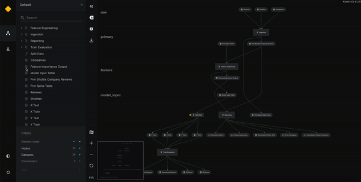

# Experiment tracking with Kedro-Viz


Experiment tracking is the process of saving all the metadata related to an experiment each time you run it. It enables you to compare different runs of a machine-learning model as part of the experimentation process.

The metadata you store may include:

* Scripts used for running the experiment
* Environment configuration files
* Versions of the data used for training and evaluation
* Evaluation metrics
* Model weights
* Plots and other visualisations

You can use Kedro-Viz experiment tracking to store and access results, and to share them with others for comparison. Storage can be local or remote, such as cloud storage on AWS S3.

Kedro's [experiment tracking demo](https://demo.kedro.org/experiment-tracking) enables you to explore the experiment tracking capabilities of Kedro-Viz.




```{toctree}
:maxdepth: 1

experiment_tracking
```
