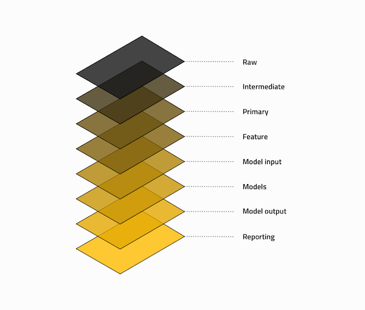

# FAQs

This is a growing set of technical FAQs. The [product FAQs on the Kedro website](https://kedro.org/#faq) explain how Kedro can answer the typical use cases and requirements of data scientists, data engineers, machine learning engineers and product owners.

## Visualisation

* [Can I annotate a Kedro-Viz visualisation to show different data layers](../visualisation/kedro-viz_visualisation.md#visualise-layers)?

## Working with Jupyter

* [How can I convert functions from Jupyter Notebooks into Kedro nodes](../notebooks_and_ipython/kedro_and_notebooks.md#how-to-use-tags-to-convert-functions-from-jupyter-notebooks-into-kedro-nodes)?
* [How do I connect a Kedro project kernel to other Jupyter clients like JupyterLab](../notebooks_and_ipython/kedro_and_notebooks.md#ipython-jupyterlab-and-other-jupyter-clients)?

## Kedro project development

* [How do I write my own Kedro starter projects](../kedro_project_setup/starters.md#how-to-create-a-kedro-starter)?

## Configuration

* [How do I change the setting for a configuration source folder](../configuration/configuration_basics.md#how-to-change-the-setting-for-a-configuration-source-folder)?
* [How do I change the configuration source folder at run time](../configuration/configuration_basics.md#how-to-change-the-configuration-source-folder-at-runtime)?
* [How do I specify parameters at run time](../configuration/parameters.md#how-to-specify-parameters-at-runtime)?
* [How do I read configuration from a compressed file](../configuration/configuration_basics.md#how-to-read-configuration-from-a-compressed-file)?
* [How do I access configuration in code](../configuration/configuration_basics.md#how-to-access-configuration-in-code)?
* [How do I load credentials in code](../configuration/credentials.md#how-to-load-credentials-in-code)?
* [How do I load parameters in code](../configuration/parameters.md#how-to-load-parameters-in-code)?
* [How do I specify additional configuration environments](../configuration/configuration_basics.md#how-to-specify-additional-configuration-environments)?
* [How do I change the default overriding configuration environment](../configuration/configuration_basics.md#how-to-change-the-default-overriding-environment)?
* [How do I use only one configuration environment](../configuration/configuration_basics.md#how-to-use-only-one-configuration-environment)?

### Advanced topics

* [How do I change which configuration files are loaded](../configuration/advanced_configuration.md#how-to-change-which-configuration-files-are-loaded)?
* [How do I ensure non default configuration files get loaded](../configuration/advanced_configuration.md#how-to-ensure-non-default-configuration-files-get-loaded)?
* [How do I bypass the configuration loading rules](../configuration/advanced_configuration.md#how-to-bypass-the-configuration-loading-rules)?
* [How do I use Jinja2 syntax in configuration](../configuration/advanced_configuration.md#how-to-use-jinja2-syntax-in-configuration)?
* [How do I do templating with the `OmegaConfigLoader`](../configuration/advanced_configuration.md#how-to-do-templating-with-the-omegaconfigloader)?
* [How to use global variables with the `OmegaConfigLoader`](../configuration/advanced_configuration.md#how-to-use-global-variables-with-the-omegaconfigloader)?
* [How do I use resolvers in the `OmegaConfigLoader`](../configuration/advanced_configuration.md#how-to-use-resolvers-in-the-omegaconfigloader)?
* [How do I load credentials through environment variables](../configuration/advanced_configuration.md#how-to-load-credentials-through-environment-variables)?

## Nodes and pipelines

* [How do I create a modular pipeline](../nodes_and_pipelines/modular_pipelines.md#how-do-i-create-a-modular-pipeline)?

* [Can I use generator functions in a node](../nodes_and_pipelines/nodes.md#how-to-use-generator-functions-in-a-node)?

## What is data engineering convention?

[Bruce Philp](https://github.com/bruceaphilp) and [Guilherme Braccialli](https://github.com/gbraccialli-qb) are the
brains behind a layered data-engineering convention as a model of managing data. You can find an [in-depth walk through of their convention](https://towardsdatascience.com/the-importance-of-layered-thinking-in-data-engineering-a09f685edc71) as a blog post on Medium.

Refer to the following table below for a high level guide to each layer's purpose

> **Note**:The data layers don’t have to exist locally in the `data` folder within your project, but we recommend that you structure your S3 buckets or other data stores in a similar way.

| Folder in data | Description                                                                                                                                                                                                                                                                                                                                                       |
| -------------- | ----------------------------------------------------------------------------------------------------------------------------------------------------------------------------------------------------------------------------------------------------------------------------------------------------------------------------------------------------------------- |
| Raw            | Initial start of the pipeline, containing the sourced data model(s) that should never be changed, it forms your single source of truth to work from. These data models are typically un-typed in most cases e.g. csv, but this will vary from case to case                                                                                                        |
| Intermediate   | Optional data model(s), which are introduced to type your `raw` data model(s), e.g. converting string based values into their current typed representation                                                                                                                                                                                                  |
| Primary        | Domain specific data model(s) containing cleansed, transformed and wrangled data from either `raw` or `intermediate`, which forms your layer that you input into your feature engineering                                                                                                                                                                         |
| Feature        | Analytics specific data model(s) containing a set of features defined against the `primary` data, which are grouped by feature area of analysis and stored against a common dimension                                                                                                                                                                             |
| Model input    | Analytics specific data model(s) containing all `feature` data against a common dimension and in the case of live projects against an analytics run date to ensure that you track the historical changes of the features over time                                                                                                                          |
| Models         | Stored, serialised pre-trained machine learning models                                                                                                                                                                                                                                                                                                            |
| Model output   | Analytics specific data model(s) containing the results generated by the model based on the `model input` data                                                                                                                                                                                                                                                    |
| Reporting      | Reporting data model(s) that are used to combine a set of `primary`, `feature`, `model input` and `model output` data used to drive the dashboard and the views constructed. It encapsulates and removes the need to define any blending or joining of data, improve performance and replacement of presentation layer without having to redefine the data models |
