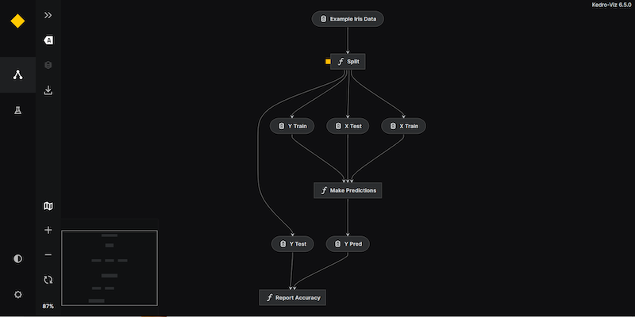

# Create a new Kedro project

## Summary

There are a few ways to create a new project once you have [set up Kedro](install.md):

* You can use `kedro new` to [create a basic Kedro project](#create-a-new-empty-project) containing project directories and basic code, but empty to extend as you need.
* You can use `kedro new` and [pass in a configuration file](#create-a-new-project-from-a-configuration-file) to manually control project details such as the name, folder and package name.
* You can [create a Kedro project populated with template code](#create-a-new-project-containing-example-code) that acts as a starter example. This guide illustrates with the `pandas-iris` starter, and there is a [range of Kedro starter projects](../kedro_project_setup/starters.md#list-of-official-starters).


Once you've created a project:

* You need to **navigate to its project folder** and **install its dependencies**: `pip install -r requirements.txt`
* **To run the project**: `kedro run`
* **To visualise the project**: `kedro viz`

## Create a new empty project

The simplest way to create a default Kedro project is to navigate to your preferred directory and type:

```bash
kedro new
```

Enter a name for the project, which can be human-readable and may contain alphanumeric symbols, spaces, underscores and hyphens. It must be at least two characters long.

It's best to keep the name simple because the choice is set as the value of `project_name` and is also used to generate the folder and package names for the project automatically.

So, if you enter "Get Started", the folder for the project (`repo_name`) is automatically set to be `get-started`, and the Python package name (`python_package`) for the project is set to be `get_started`.

| Description                                                     | Setting          | Example       |
| --------------------------------------------------------------- | ---------------- | ------------- |
| A human-readable name for the new project                      | `project_name`   | `Get Started` |
| Local directory to store the project                           | `repo_name`      | `get-started` |
| The Python package name for the project (short, all-lowercase) | `python_package` | `get_started` |


The output of `kedro new` is a directory containing all the project files and subdirectories required for a basic Kedro project, ready to extend with the code.

## Create a new project from a configuration file

To customise a new project's directory and package name, use a configuration file to specify those values. The configuration file must contain:

-   `output_dir` The path in which to create the project directory
-   `project_name`
-   `repo_name`
-   `python_package`

The `output_dir` can be set to customised. For example, `~` for the home directory or `.` for the current working directory. Here is an example `config.yml`, which assumes that a directory named `~/code` already exists:

```yaml
output_dir: ~/code
project_name: My First Kedro Project
repo_name: testing-kedro
python_package: test_kedro
```

To create this new project:

```bash
kedro new --config=<path>/config.yml
```

## Create a new project containing example code

Use a [Kedro starter](../kedro_project_setup/starters.md) to create a project containing template code, to run as-is or to adapt and extend.

The following illustrates a project created with example code based on the familiar [Iris dataset](https://www.kaggle.com/uciml/iris).

The first step is to create the Kedro project using a starter to add the example code and data.

```bash
kedro new --starter=pandas-iris
```

## Run the project

However you create a Kedro project, once `kedro new` has completed, the next step is to navigate to the project folder (`cd <project-name>`) and install dependencies with `pip` as follows:

```bash
pip install -r requirements.txt
```

Now run the project:

```bash
kedro run
```

```{note}
The first time you type a `kedro` command in a new project, you will be asked whether you wish to opt into [usage analytics](https://github.com/kedro-org/kedro-plugins/tree/main/kedro-telemetry). Your decision is recorded in the `.telemetry` file so that subsequent calls to `kedro` in this project do not ask this question again.
```

## Visualise a Kedro project

This section swiftly introduces project visualisation using Kedro-Viz. See the [visualisation documentation](../visualisation/kedro-viz_visualisation) for more detail.

The Kedro-Viz package needs to be installed into your virtual environment separately as it is not part of the standard Kedro installation:

```bash
pip install kedro-viz
```

To start Kedro-Viz, enter the following in your terminal:

```bash
kedro viz
```

This command automatically opens a browser tab to serve the visualisation at `http://127.0.0.1:4141/`.

To exit the visualisation, close the browser tab. To regain control of the terminal, enter `^+c` on Mac or `Ctrl+c` on Windows or Linux machines.

## Where next?
You have completed the section on Kedro project creation for new users. Now choose how to learn more:

* Understand more about Kedro: The following page explains the [fundamental Kedro concepts](./kedro_concepts.md).

* Learn hands-on: If you prefer to learn hands-on, move on to the [spaceflights tutorial](../tutorial/spaceflights_tutorial.md). The tutorial illustrates how to set up a working project, add dependencies, create nodes, register pipelines, set up the Data Catalog, add documentation, and package the project.

* How-to guides: The documentation sections following the tutorial explain [how to visualise a Kedro project](../visualisation/kedro-viz_visualisation.md) and [how to combine Kedro with a Jupyter notebook](../notebooks_and_ipython/kedro_and_notebooks.md).

If you've worked through the documentation listed and are unsure where to go next, review the [Kedro repositories on GitHub](https://github.com/kedro-org) and [Kedro's Slack channels](https://slack.kedro.org).


## More information about the `pandas-iris` example project

If you used the `pandas-iris` starter to create an example project, the rest of this page gives further information.

<details>
<summary>Expand for more details.</summary>

### Background information
The Iris dataset was generated in 1936 by the British statistician and biologist Ronald Fisher. The dataset contains 150 samples, comprising 50 each of 3 different species of Iris plant (*Iris Setosa*, *Iris Versicolour* and *Iris Virginica*). For each sample, the flower measurements are recorded for the sepal length, sepal width, petal length and petal width.


A machine learning model can use the Iris dataset to illustrate classification (a method used to determine the type of an object by comparison with similar objects that have previously been categorised). Once trained on known data, the machine learning model can make a predictive classification by comparing a test object to the output of its training data.

The Kedro starter contains a single [pipeline](../resources/glossary.md#pipeline) comprising three [nodes](../resources/glossary.md#node) responsible for splitting the data into training and testing samples, running a 1-nearest neighbour classifier algorithm to make predictions and accuracy-reporting.

The nodes are stored in `src/get_started/nodes.py`:

| Node            | Description                                                                         |
| --------------- | ----------------------------------------------------------------------------------- |
| `split_data`      | Splits the example Iris dataset into train and test samples                       |
| `make_predictions`| Makes class predictions (using 1-nearest neighbour classifier and train-test set) |
| `report_accuracy` | Reports the accuracy of the predictions performed by the previous node.           |

### Iris example: visualisation

If you [visualise your project with Kedro-Viz](#visualise-a-kedro-project) you should see the following:


</details>
