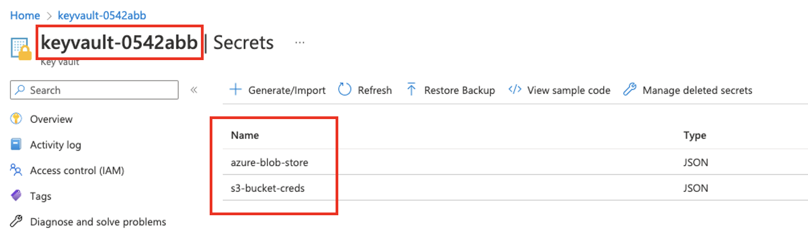

# Common use cases

## Use Hooks to extend a node's behaviour

You can use the [`before_node_run` and `after_node_run` Hooks](/kedro.framework.hooks.specs.NodeSpecs) to add extra behavior before and after a node's execution. Furthermore, you can apply extra behavior to not only an individual node or an entire Kedro pipeline, but also to a _subset_ of nodes, based on their tags or namespaces: for example, suppose we want to add the following extra behavior to a node:

```python
from kedro.pipeline.node import Node


def say_hello(node: Node):
    """An extra behaviour for a node to say hello before running."""
    print(f"Hello from {node.name}")
```

Then you can either add it to a single node based on the node's name:

```python
# src/<package_name>/hooks.py

from kedro.framework.hooks import hook_impl
from kedro.pipeline.node import Node


class ProjectHooks:
    @hook_impl
    def before_node_run(self, node: Node):
        # adding extra behaviour to a single node
        if node.name == "hello":
            say_hello(node)
```

Or add it to a group of nodes based on their tags:


```python
# src/<package_name>/hooks.py

from kedro.framework.hooks import hook_impl
from kedro.pipeline.node import Node


class ProjectHooks:
    @hook_impl
    def before_node_run(self, node: Node):
        if "hello" in node.tags:
            say_hello(node)
```

Or add it to all nodes in the entire pipeline:

```python
# src/<package_name>/hooks.py

from kedro.framework.hooks import hook_impl
from kedro.pipeline.node import Node


class ProjectHooks:
    @hook_impl
    def before_node_run(self, node: Node):
        # adding extra behaviour to all nodes in the pipeline
        say_hello(node)
```

If your use case takes advantage of a decorator, for example to retry a node's execution using a library such as [tenacity](https://tenacity.readthedocs.io/en/latest/), you can still decorate the node's function directly:

```python
from tenacity import retry


@retry
def my_flaky_node_function():
    ...
```

Or applying it in the `before_node_run` Hook as follows:

```python
# src/<package_name>/hooks.py
from tenacity import retry

from kedro.framework.hooks import hook_impl
from kedro.pipeline.node import Node


class ProjectHooks:
    @hook_impl
    def before_node_run(self, node: Node):
        # adding retrying behaviour to nodes tagged as flaky
        if "flaky" in node.tags:
            node.func = retry(node.func)
```
## Use Hooks to customise the dataset load and save methods
We recommend using the `before_dataset_loaded`/`after_dataset_loaded` and `before_dataset_saved`/`after_dataset_saved` Hooks to customise the dataset `load` and `save` methods where appropriate.

For example, you can add logging about the dataset load runtime as follows:

```python
import logging
import time
from typing import Any

from kedro.framework.hooks import hook_impl
from kedro.pipeline.node import Node


class LoggingHook:
    """A hook that logs how many time it takes to load each dataset."""

    def __init__(self):
        self._timers = {}

    @property
    def _logger(self):
        return logging.getLogger(__name__)

    @hook_impl
    def before_dataset_loaded(self, dataset_name: str, node: Node) -> None:
        start = time.time()
        self._timers[dataset_name] = start

    @hook_impl
    def after_dataset_loaded(self, dataset_name: str, data: Any, node: Node) -> None:
        start = self._timers[dataset_name]
        end = time.time()
        self._logger.info(
            "Loading dataset %s before node '%s' takes %0.2f seconds",
            dataset_name,
            node.name,
            end - start,
        )
```

## Use Hooks to load external credentials
We recommend using the `after_context_created` Hook to add credentials to the session's config loader instance from any external credentials manager. In this example we show how to load credentials from [Azure KeyVault](https://learn.microsoft.com/en-us/azure/key-vault/general/).

Here is the example KeyVault instance, note the KeyVault and secret names:



These credentials will be used to access these datasets in the data catalog:

```yaml
weather:
 type: spark.SparkDataset
 filepath: s3a://your_bucket/data/01_raw/weather*
 file_format: csv
 credentials: s3_creds

cars:
 type: pandas.CSVDataset
 filepath: https://your_data_store.blob.core.windows.net/data/01_raw/cars.csv
 file_format: csv
 credentials: abs_creds
```

We can then use the following hook implementation to fetch and inject these credentials:

```python
# hooks.py

from kedro.framework.hooks import hook_impl
from azure.keyvault.secrets import SecretClient
from azure.identity import DefaultAzureCredential


class AzureSecretsHook:
    @hook_impl
    def after_context_created(self, context) -> None:
        keyVaultName = "keyvault-0542abb"  # or os.environ["KEY_VAULT_NAME"] if you would like to provide it through environment variables
        KVUri = f"https://{keyVaultName}.vault.azure.net"

        my_credential = DefaultAzureCredential()
        client = SecretClient(vault_url=KVUri, credential=my_credential)

        secrets = {
            "abs_creds": "azure-blob-store",
            "s3_creds": "s3-bucket-creds",
        }
        azure_creds = {
            cred_name: client.get_secret(secret_name).value
            for cred_name, secret_name in secrets.items()
        }

        context.config_loader["credentials"] = {
            **context.config_loader["credentials"],
            **azure_creds,
        }
```

Finally, [register the Hook](./introduction.md#registering-the-hook-implementation-with-kedro) in `settings.py`:

```python
from my_project.hooks import AzureSecretsHook

HOOKS = (AzureSecretsHook(),)
```

```{note}
Note: `DefaultAzureCredential()` is Azure's recommended approach to authorise access to data in your storage accounts. For more information, consult the [documentation about how to authenticate to Azure and authorize access to blob data](https://learn.microsoft.com/en-us/azure/storage/blobs/storage-quickstart-blobs-python).
```

## Use a Hook to read `metadata` from `DataCatalog`
Use the `after_catalog_created` Hook to access `metadata` to extend Kedro.

```python
class MetadataHook:
    @hook_impl
    def after_catalog_created(
        self,
        catalog: DataCatalog,
    ):
        for dataset_name, dataset in catalog.datasets.__dict__.items():
            print(f"{dataset_name} metadata: \n  {str(dataset.metadata)}")
```
