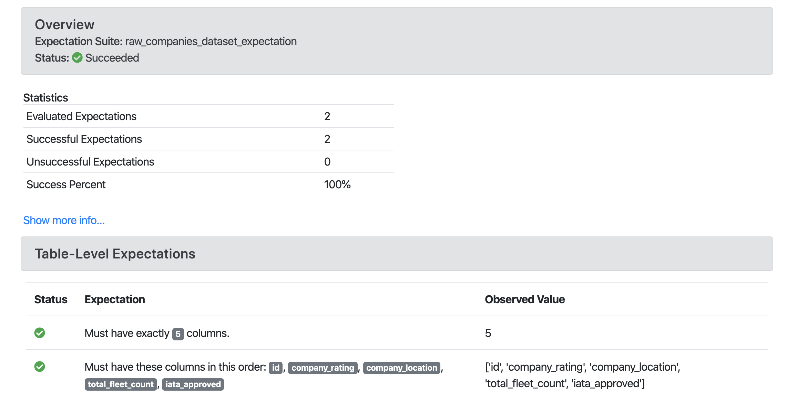
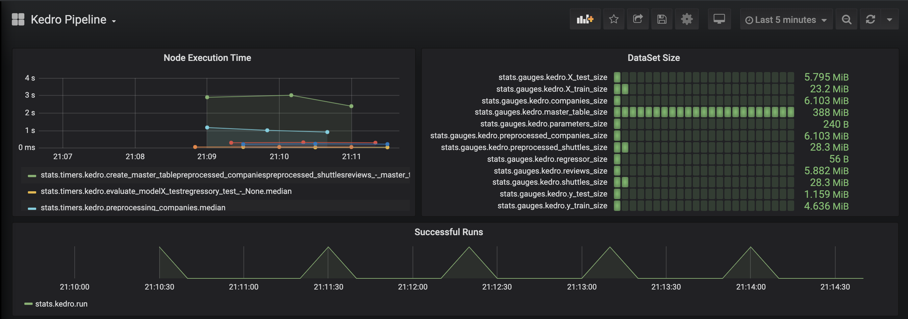
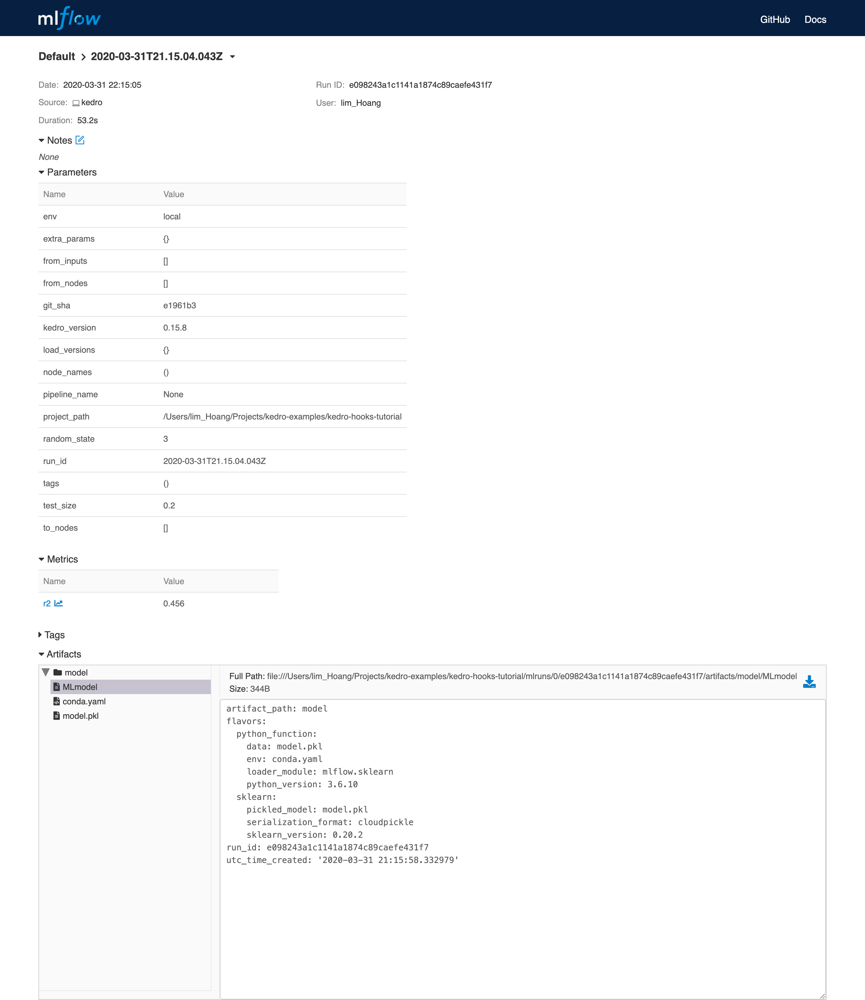

# Hooks examples

## Add memory consumption tracking

This example illustrates how to track memory consumption using `memory_profiler`.

* Install dependencies:

```console
pip install memory_profiler
```

* Implement `before_dataset_loaded` and `after_dataset_loaded`

```python
# src/<package_name>/hooks.py
import logging

from kedro.framework.hooks import hook_impl
from memory_profiler import memory_usage


def _normalise_mem_usage(mem_usage):
    # memory_profiler < 0.56.0 returns list instead of float
    return mem_usage[0] if isinstance(mem_usage, (list, tuple)) else mem_usage


class MemoryProfilingHooks:
    def __init__(self):
        self._mem_usage = {}

    @hook_impl
    def before_dataset_loaded(self, dataset_name: str) -> None:
        before_mem_usage = memory_usage(
            -1,
            interval=0.1,
            max_usage=True,
            retval=True,
            include_children=True,
        )
        before_mem_usage = _normalise_mem_usage(before_mem_usage)
        self._mem_usage[dataset_name] = before_mem_usage

    @hook_impl
    def after_dataset_loaded(self, dataset_name: str) -> None:
        after_mem_usage = memory_usage(
            -1,
            interval=0.1,
            max_usage=True,
            retval=True,
            include_children=True,
        )
        # memory_profiler < 0.56.0 returns list instead of float
        after_mem_usage = _normalise_mem_usage(after_mem_usage)

        logging.getLogger(__name__).info(
            "Loading %s consumed %2.2fMiB memory",
            dataset_name,
            after_mem_usage - self._mem_usage[dataset_name],
        )
```

* Register Hooks implementation by updating the `HOOKS` variable in `settings.py` as follows:

```python
HOOKS = (MemoryProfilingHooks(),)
```

Then re-run the pipeline:

```console
$ kedro run
```

The output should look similar to the following:

```
...
[01/25/23 21:38:23] INFO     Loading data from 'example_iris_data' (CSVDataset)...                                                                                                                                                                                    data_catalog.py:343
                    INFO     Loading example_iris_data consumed 0.99MiB memory                                                                                                                                                                                                hooks.py:67
                    INFO     Loading data from 'parameters' (MemoryDataset)...                                                                                                                                                                                        data_catalog.py:343
                    INFO     Loading parameters consumed 0.48MiB memory                                                                                                                                                                                                       hooks.py:67
                    INFO     Running node: split: split_data([example_iris_data,parameters]) -> [X_train,X_test,y_train,y_test]                                                                                                                                               node.py:327
                    INFO     Saving data to 'X_train' (MemoryDataset)...                                                                                                                                                                                              data_catalog.py:382
                    INFO     Saving data to 'X_test' (MemoryDataset)...                                                                                                                                                                                               data_catalog.py:382
                    INFO     Saving data to 'y_train' (MemoryDataset)...                                                                                                                                                                                              data_catalog.py:382
                    INFO     Saving data to 'y_test' (MemoryDataset)...                                                                                                                                                                                               data_catalog.py:382
                    INFO     Completed 1 out of 3 tasks                                                                                                                                                                                                           sequential_runner.py:85
                    INFO     Loading data from 'X_train' (MemoryDataset)...                                                                                                                                                                                           data_catalog.py:343
                    INFO     Loading X_train consumed 0.49MiB memory                                                                                                                                                                                                          hooks.py:67
                    INFO     Loading data from 'X_test' (MemoryDataset)...
...
```

## Add data validation

This example adds data validation to node inputs and outputs using [Great Expectations](https://docs.greatexpectations.io/en/latest/).

* Install dependencies:

```console
pip install great-expectations
```

* Implement `before_node_run` and `after_node_run` Hooks to validate inputs and outputs data respectively leveraging `Great Expectations`:

### V2 API
```python
# src/<package_name>/hooks.py
from typing import Any, Dict

from kedro.framework.hooks import hook_impl
from kedro.io import DataCatalog

import great_expectations as ge


class DataValidationHooks:

    # Map expectation to dataset
    DATASET_EXPECTATION_MAPPING = {
        "companies": "raw_companies_dataset_expectation",
        "preprocessed_companies": "preprocessed_companies_dataset_expectation",
    }

    @hook_impl
    def before_node_run(
        self, catalog: DataCatalog, inputs: Dict[str, Any], session_id: str
    ) -> None:
        """Validate inputs data to a node based on using great expectation
        if an expectation suite is defined in ``DATASET_EXPECTATION_MAPPING``.
        """
        self._run_validation(catalog, inputs, session_id)

    @hook_impl
    def after_node_run(
        self, catalog: DataCatalog, outputs: Dict[str, Any], session_id: str
    ) -> None:
        """Validate outputs data from a node based on using great expectation
        if an expectation suite is defined in ``DATASET_EXPECTATION_MAPPING``.
        """
        self._run_validation(catalog, outputs, session_id)

    def _run_validation(
        self, catalog: DataCatalog, data: Dict[str, Any], session_id: str
    ):
        for dataset_name, dataset_value in data.items():
            if dataset_name not in self.DATASET_EXPECTATION_MAPPING:
                continue

            dataset = catalog._get_dataset(dataset_name)
            dataset_path = str(dataset._filepath)
            expectation_suite = self.DATASET_EXPECTATION_MAPPING[dataset_name]

            expectation_context = ge.data_context.DataContext()
            batch = expectation_context.get_batch(
                {"path": dataset_path, "datasource": "files_datasource"},
                expectation_suite,
            )
            expectation_context.run_validation_operator(
                "action_list_operator",
                assets_to_validate=[batch],
                session_id=session_id,
            )
```

* Register Hooks implementation, as described in the [hooks documentation](introduction.md#registering-the-hook-implementation-with-kedro) and run Kedro.

`Great Expectations` example report:



### V3 API
* Create new checkpoint:

```bash
great_expectations checkpoint new raw_companies_dataset_checkpoint
```

* Remove `data_connector_query` from the `batch_request` in the checkpoint config file:

```python
yaml_config = f"""
name: {my_checkpoint_name}
config_version: 1.0
class_name: SimpleCheckpoint
run_name_template: "%Y%m%d-%H%M%S-my-run-name-template"
validations:
  - batch_request:
      datasource_name: {my_datasource_name}
      data_connector_name: default_runtime_data_connector_name
      data_asset_name: my_runtime_asset_name
      data_connector_query:
        index: -1
    expectation_suite_name: {my_expectation_suite_name}
"""
```

```python
# src/<package_name>/hooks.py
from typing import Any, Dict

from kedro.framework.hooks import hook_impl
from kedro.io import DataCatalog

import great_expectations as ge


class DataValidationHooks:

    # Map checkpoint to dataset
    DATASET_CHECKPOINT_MAPPING = {
        "companies": "raw_companies_dataset_checkpoint",
    }

    @hook_impl
    def before_node_run(
        self, catalog: DataCatalog, inputs: Dict[str, Any], session_id: str
    ) -> None:
        """Validate inputs data to a node based on using great expectation
        if an expectation suite is defined in ``DATASET_EXPECTATION_MAPPING``.
        """
        self._run_validation(catalog, inputs, session_id)

    @hook_impl
    def after_node_run(
        self, catalog: DataCatalog, outputs: Dict[str, Any], session_id: str
    ) -> None:
        """Validate outputs data from a node based on using great expectation
        if an expectation suite is defined in ``DATASET_EXPECTATION_MAPPING``.
        """
        self._run_validation(catalog, outputs, session_id)

    def _run_validation(
        self, catalog: DataCatalog, data: Dict[str, Any], session_id: str
    ):
        for dataset_name, dataset_value in data.items():
            if dataset_name not in self.DATASET_CHECKPOINT_MAPPING:
                continue

            data_context = ge.data_context.DataContext()

            data_context.run_checkpoint(
                checkpoint_name=self.DATASET_CHECKPOINT_MAPPING[dataset_name],
                batch_request={
                    "runtime_parameters": {
                        "batch_data": dataset_value,
                    },
                    "batch_identifiers": {
                        "runtime_batch_identifier_name": dataset_name
                    },
                },
                run_name=session_id,
            )
```

## Add observability to your pipeline

This example adds observability to your pipeline using [statsd](https://statsd.readthedocs.io/en/v3.3/configure.html) and makes it possible to visualise dataset size and node execution time using [Grafana](https://grafana.com/).

* Install dependencies:

```console
pip install statsd
```

* Implement `before_node_run` and `after_node_run` Hooks to collect metrics (Dataset size and node execution time):

```python
# src/<package_name>/hooks.py
import sys
from typing import Any, Dict

import statsd
from kedro.framework.hooks import hook_impl
from kedro.pipeline.node import Node


class PipelineMonitoringHooks:
    def __init__(self):
        self._timers = {}
        self._client = statsd.StatsClient(prefix="kedro")

    @hook_impl
    def before_node_run(self, node: Node) -> None:
        node_timer = self._client.timer(node.name)
        node_timer.start()
        self._timers[node.short_name] = node_timer

    @hook_impl
    def after_node_run(self, node: Node, inputs: Dict[str, Any]) -> None:
        self._timers[node.short_name].stop()
        for dataset_name, dataset_value in inputs.items():
            self._client.gauge(dataset_name + "_size", sys.getsizeof(dataset_value))

    @hook_impl
    def after_pipeline_run(self):
        self._client.incr("run")
```

* Register the Hook implementation, as described in the [Hooks documentation](./introduction.md#registering-the-hook-implementation-with-kedro) and run Kedro.

`Grafana` example page:



## Add metrics tracking to your model

This examples adds metrics tracking using [MLflow](https://mlflow.org/).

* Install dependencies:

```console
pip install mlflow
```

* Implement `before_pipeline_run`, `after_pipeline_run` and `after_node_run` Hooks to collect metrics using `MLflow`:

```python
# src/<package_name>/hooks.py
from typing import Any, Dict

import mlflow
import mlflow.sklearn
from kedro.framework.hooks import hook_impl
from kedro.pipeline.node import Node


class ModelTrackingHooks:
    """Namespace for grouping all model-tracking hooks with MLflow together."""

    @hook_impl
    def before_pipeline_run(self, run_params: Dict[str, Any]) -> None:
        """Hook implementation to start an MLflow run
        with the session_id of the Kedro pipeline run.
        """
        mlflow.start_run(run_name=run_params["session_id"])
        mlflow.log_params(run_params)

    @hook_impl
    def after_node_run(
        self, node: Node, outputs: Dict[str, Any], inputs: Dict[str, Any]
    ) -> None:
        """Hook implementation to add model tracking after some node runs.
        In this example, we will:
        * Log the parameters after the data splitting node runs.
        * Log the model after the model training node runs.
        * Log the model's metrics after the model evaluating node runs.
        """
        if node._func_name == "split_data":
            mlflow.log_params(
                {"split_data_ratio": inputs["params:example_test_data_ratio"]}
            )

        elif node._func_name == "train_model":
            model = outputs["example_model"]
            mlflow.sklearn.log_model(model, "model")
            mlflow.log_params(inputs["parameters"])

    @hook_impl
    def after_pipeline_run(self) -> None:
        """Hook implementation to end the MLflow run
        after the Kedro pipeline finishes.
        """
        mlflow.end_run()
```

* Register the Hook implementation, as described in the [Hooks documentation](./introduction.md#registering-the-hook-implementation-with-kedro) and run Kedro.

`MLflow` example page:



## Modify node inputs using `before_node_run` hook

If the `before_node_run` hook is implemented _and_ returns a dictionary, that dictionary is used to update the corresponding node inputs.

For example, if a pipeline contains a node named `my_node`, which takes 2 inputs: `first_input` and `second_input`, to overwrite the value of `first_input` that is passed to `my_node`, we can implement the following hook:

```python
# src/<package_name>/hooks.py
from typing import Any, Dict, Optional

from kedro.framework.hooks import hook_impl
from kedro.pipeline.node import Node
from kedro.io import DataCatalog


class NodeInputReplacementHook:
    @hook_impl
    def before_node_run(
        self, node: Node, catalog: DataCatalog
    ) -> Optional[Dict[str, Any]]:
        """Replace `first_input` for `my_node`"""
        if node.name == "my_node":
            # return the string filepath to the `first_input` dataset
            # instead of the underlying data
            dataset_name = "first_input"
            filepath = catalog._get_dataset(dataset_name)._filepath
            return {"first_input": filepath}  # `second_input` is not affected
        return None
```

Node input overwrites implemented in `before_node_run` affect only a specific node and do not modify the corresponding datasets in the `DataCatalog`.


```{note}
In the example above, the `before_node_run` hook implementation must return datasets present in the `inputs` dictionary. If they are not in `inputs`, the node fails with the following error: `Node <name> expected X input(s) <expected_inputs>, but got the following Y input(s) instead: <actual_inputs>`.
```


Once you have implemented a new Hook you must register it as described in the [Hooks documentation](./introduction.md#registering-the-hook-implementation-with-kedro), and then run Kedro.
