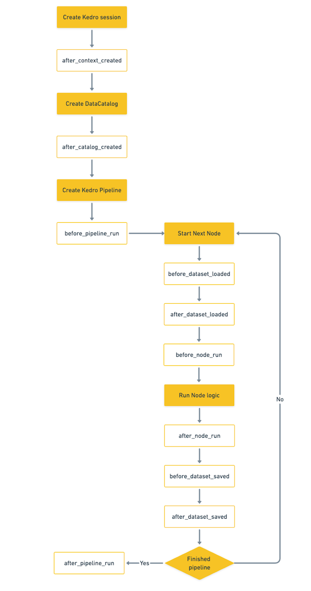

# Hooks


## Concepts

A Hook consists of a Hook specification, and Hook implementation.

## Hook specifications

Kedro defines Hook specifications for particular execution points where users can inject additional behaviour. Currently, the following Hook specifications are provided in [kedro.framework.hooks](/kedro.framework.hooks):

* `after_context_created`
* `after_catalog_created`
* `before_pipeline_run`
* `before_dataset_loaded`
* `after_dataset_loaded`
* `before_node_run`
* `after_node_run`
* `before_dataset_saved`
* `after_dataset_saved`
* `after_pipeline_run`
* `on_node_error`
* `on_pipeline_error`

The naming convention for non-error Hooks is `<before/after>_<noun>_<past_participle>`, in which:

* `<before/after>` and `<past_participle>` refers to when the Hook executed, e.g. `before <something> was run` or `after <something> was created`.
* `<noun>` refers to the relevant component in the Kedro execution timeline for which this Hook adds extra behaviour, e.g. `catalog`, `node` and `pipeline`.

The naming convention for error hooks is `on_<noun>_error`, in which:

* `<noun>` refers to the relevant component in the Kedro execution timeline that throws the error.

[kedro.framework.hooks](/kedro.framework.hooks) lists the full specifications for which you can inject additional behaviours by providing an implementation.

This diagram illustrate the execution order of hooks during `kedro run`:


### CLI Hooks

Kedro defines a small set of CLI hooks that inject additional behaviour around execution of a Kedro CLI command:

* `before_command_run`
* `after_command_run`

This is what the [`kedro-telemetry` plugin](https://github.com/kedro-org/kedro-plugins/tree/main/kedro-telemetry) relies on under the hood in order to be able to collect CLI usage statistics.

## Hook implementation

To add Hooks to your Kedro project, you must:

* Create or modify the file `src/<package_name>/hooks.py` to define a Hook implementation for the particular Hook specification that describes the point at which you want to inject additional behaviour
* Register that Hook implementation in the [`src/<package_name>/settings.py`](../kedro_project_setup/settings.md) file under the `HOOKS` key

### Define the Hook implementation
The Hook implementation should have the same name as the specification. The Hook must provide a concrete implementation with a subset of the corresponding specification's parameters (you do not need to use them all).

To declare a Hook implementation, use the `@hook_impl` decorator.

For example, the full signature of the [`after_data_catalog_created`](/kedro.framework.hooks.specs.DataCatalogSpecs) Hook specification is:

```python
@hook_spec
def after_catalog_created(
    self,
    catalog: DataCatalog,
    conf_catalog: Dict[str, Any],
    conf_creds: Dict[str, Any],
    save_version: str,
    load_versions: Dict[str, str],
) -> None:
    pass
```

However, if you just want to use this Hook to list the contents of a data catalog after it is created, your Hook implementation can be as simple as:

```python
# src/<package_name>/hooks.py
import logging

from kedro.framework.hooks import hook_impl
from kedro.io import DataCatalog


class DataCatalogHooks:
    @property
    def _logger(self):
        return logging.getLogger(self.__class__.__name__)

    @hook_impl
    def after_catalog_created(self, catalog: DataCatalog) -> None:
        self._logger.info(catalog.list())
```

```{note}
The name of a module that contains Hooks implementation is arbitrary and is not restricted to `hooks.py`.
```

We recommend that you group related Hook implementations under a namespace, preferably a class, within a `hooks.py` file that you create in your project.

### Registering the Hook implementation with Kedro

Hook implementations should be registered with Kedro using the [`src/<package_name>/settings.py`](../kedro_project_setup/settings.md) file under the `HOOKS` key.

You can register more than one implementation for the same specification. They will be called in LIFO (last-in, first-out) order.

The following example sets up a Hook so that the `after_data_catalog_created` implementation is called, every time, after a data catalog is created.

```python
# src/<package_name>/settings.py
from <package_name>.hooks import ProjectHooks, DataCatalogHooks

HOOKS = (ProjectHooks(), DataCatalogHooks())
```

Kedro also has auto-discovery enabled by default. This means that any installed plugins that declare a Hooks entry-point will be registered. To learn more about how to enable this for your custom plugin, see our [plugin development guide](../extend_kedro/plugins.md#hooks).

```{note}
Auto-discovered Hooks will run *first*, followed by the ones specified in `settings.py`.
```

#### Auto-registered Hook with plugin
You can auto-register a Hook (pip-installable) by creating a [Kedro plugin](https://docs.kedro.org/en/stable/extend_kedro/plugins.html#hooks). Kedro provides `kedro.hooks` entrypoints to extend this easily.


#### Disable auto-registered plugins' Hooks

Auto-registered plugins' Hooks can be disabled via `settings.py` as follows:

```python
# src/<package_name>/settings.py

DISABLE_HOOKS_FOR_PLUGINS = ("<plugin_name>",)
```

where `<plugin_name>` is the name of an installed plugin for which the auto-registered Hooks must be disabled.

## Hook execution order
Hooks follow a Last-In-First-Out (LIFO) order, which means the first registered Hook will be executed last.

Hooks are registered in the following order:

1. Project Hooks in `settings.py` - If you have `HOOKS = (hook_a, hook_b,)`, `hook_b` will be executed before `hook_a`
2. Plugin Hooks registered in `kedro.hooks`, which follows alphabetical order

In general, Hook execution order is not guaranteed and you should not rely on it. If you need to make sure a particular Hook is executed first or last, you can use the [`tryfirst` or `trylast` argument](https://pluggy.readthedocs.io/en/stable/index.html#call-time-order) for `hook_impl`.

## Under the hood

Under the hood, we use [pytest's pluggy](https://pluggy.readthedocs.io/en/latest/) to implement Kedro's Hook mechanism. We recommend reading their documentation to find out more about the underlying implementation.

### Plugin Hooks
Plugin Hooks are registered using [`importlib_metadata`'s `EntryPoints` API](https://docs.python.org/3/library/importlib.metadata.html).
