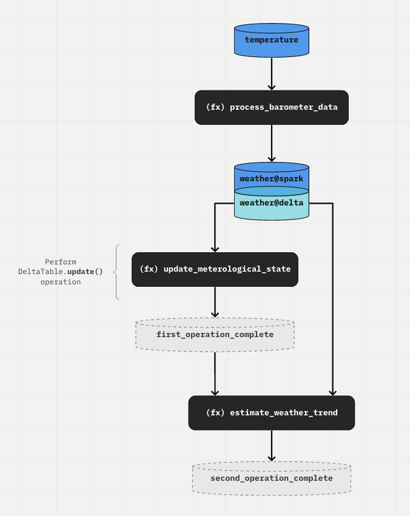

# Data versioning with Delta Lake

[Delta Lake](https://delta.io/) is an open-source storage layer that brings reliability to data lakes by adding a transactional storage layer on top of the data stored in cloud storage. It allows for ACID transactions, data versioning, and rollback capabilities. Delta table is the default table format in Databricks, and it can be used outside of it as well. It is typically used for data lakes, where data is ingested either incrementally or in batch.

This tutorial explores how to use Delta tables in your Kedro workflow and how to leverage the data versioning capabilities of Delta Lake.

## Prerequisites

In this example, you will use the `spaceflights-pandas` starter project which has example pipelines and datasets to work with. If you haven't already, you can create a new Kedro project using the following command:

```bash
kedro new --starter spaceflights-pandas
```

Kedro offers various connectors in the `kedro-datasets` package to interact with Delta tables: [`pandas.DeltaTableDataset`](https://github.com/kedro-org/kedro-plugins/blob/main/kedro-datasets/kedro_datasets/pandas/deltatable_dataset.py), [`spark.DeltaTableDataset`](https://github.com/kedro-org/kedro-plugins/blob/main/kedro-datasets/kedro_datasets/spark/deltatable_dataset.py), [`spark.SparkDataset`](https://github.com/kedro-org/kedro-plugins/blob/main/kedro-datasets/kedro_datasets/spark/spark_dataset.py), [`databricks.ManagedTableDataset`](https://github.com/kedro-org/kedro-plugins/blob/main/kedro-datasets/kedro_datasets/databricks/managed_table_dataset.py), and [`ibis.FileDataset`](https://github.com/kedro-org/kedro-plugins/blob/main/kedro-datasets/kedro_datasets/ibis/file_dataset.py) support the delta table format. In this tutorial, we will use the `pandas.DeltaTableDataset` connector to interact with Delta tables using Pandas DataFrames. To install `kedro-datasets` alongwith dependencies required for Delta Lake, add the following line to your `requirements.txt`:

```bash
kedro-datasets[pandas-deltatabledataset]
```

Now, you can install the project dependencies by running:

```bash
pip install -r requirements.txt
```

## Using Delta tables in catalog

### Save dataset as a Delta table

To use Delta tables in your Kedro project, you can update the `base/catalog.yml` to use `type: pandas.DeltaTableDataset` for the datasets you want to save as Delta tables. For this example, let us update the `model_input_table` dataset in the `base/catalog.yml` file:

```yaml
model_input_table:
  type: pandas.DeltaTableDataset
  filepath: data/03_primary/model_input_table
  save_args:
    mode: overwrite
```

You can add `save_args` to the configuration to specify the mode of saving the Delta table. The `mode` parameter can be "overwrite" or "append" depending on whether you want to overwrite the existing Delta table or append to it. You can also specify [additional saving options that are accepted by the `write_deltalake` function in the `delta-rs` library](https://delta-io.github.io/delta-rs/python/api_reference.html#writing-deltatables) which is used by `pandas.DeltaTableDataset` to interact with the Delta table format.

When you run the Kedro project with `kedro run` command, the Delta table will be saved to the location specified in the `filepath` argument as a folder of `parquet` files. This folder also contains a `_delta_log` directory which stores the transaction log of the Delta table. The following runs of the pipeline will create new versions of the Delta table in the same location and new entries in the `_delta_log` directory. You can run the Kedro project with the following command to generate the `model_input_table` dataset:

```bash
kedro run
```

Suppose the upstream datasets `companies`, `shuttles`, or `reviews` is updated. You can run the following command to generate a new version of the `model_input_table` dataset:

```bash
kedro run --to-outputs=model_input_table
```
To inspect the updated dataset and logs:
```bash
$ tree data/03_primary
data/03_primary
└── model_input_table
    ├── _delta_log
    │   ├── 00000000000000000000.json
    │   └── 00000000000000000001.json
    ├── part-00001-0d522679-916c-4283-ad06-466c27025bcf-c000.snappy.parquet
    └── part-00001-42733095-97f4-46ef-bdfd-3afef70ee9d8-c000.snappy.parquet
```

### Load a specific version

To load a specific version of the dataset, you can specify the version number in the `load_args` parameter in the catalog entry:

```yaml
model_input_table:
  type: pandas.DeltaTableDataset
  filepath: data/03_primary/model_input_table
  load_args:
    version: 1
```

## Inspect the dataset in interactive mode

You can inspect the history and the metadata of the Delta table in an interactive Python session. To start the IPython session with Kedro components loaded, run:

```bash
kedro ipython
```

You can load the Delta table using the `catalog.load` method and inspect the dataset:

```python
In [1]: model_input_table = catalog.datasets['model_input_table']
```
You can inspect the history of the Delta table by accessing the `history` attribute:
```python
In [2]: model_input_table.history
Out [2]:
[
    {
        'timestamp': 1739891304488,
        'operation': 'WRITE',
        'operationParameters': {'mode': 'Overwrite'},
        'operationMetrics': {
            'execution_time_ms': 8,
            'num_added_files': 1,
            'num_added_rows': 6027,
            'num_partitions': 0,
            'num_removed_files': 1
        },
        'clientVersion': 'delta-rs.0.23.1',
        'version': 1
    },
    {
        'timestamp': 1739891277424,
        'operation': 'WRITE',
        'operationParameters': {'mode': 'Overwrite'},
        'clientVersion': 'delta-rs.0.23.1',
        'operationMetrics': {
            'execution_time_ms': 48,
            'num_added_files': 1,
            'num_added_rows': 6027,
            'num_partitions': 0,
            'num_removed_files': 0
        },
        'version': 0
    }
]
```

You can also inspect the loaded version of the table with the following method:

```python
In [3]: model_input_table.get_loaded_version()
Out [3]: 1
```

## Using Delta tables with Spark

You can also use [`PySpark`](https://spark.apache.org/docs/latest/api/python/index.html) to interact with Delta tables in your Kedro project. To set up Delta tables with Spark, consult the [documentation on the integration of Spark with Kedro](./pyspark_integration.md#spark-and-delta-lake-interaction).

We recommend the following workflow, which makes use of the [transcoding feature in Kedro](../data/data_catalog_yaml_examples.md#read-the-same-file-using-different-datasets-with-transcoding):

* To create a Delta table, use a `spark.SparkDataset` with `file_format="delta"`. You can also use this type of dataset to read from a Delta table or overwrite it.
* To perform [Delta table deletes, updates, and merges](https://docs.delta.io/latest/delta-update.html#language-python), load the data using a `DeltaTableDataset` and perform the write operations within the node function.

As a result, we end up with a catalog that looks like this:

```yaml
temperature:
  type: spark.SparkDataset
  filepath: data/01_raw/data.csv
  file_format: "csv"
  load_args:
    header: True
    inferSchema: True
  save_args:
    sep: '|'
    header: True

weather@spark:
  type: spark.SparkDataset
  filepath: s3a://my_bucket/03_primary/weather
  file_format: "delta"
  save_args:
    mode: "overwrite"
    versionAsOf: 0

weather@delta:
  type: spark.DeltaTableDataset
  filepath: s3a://my_bucket/03_primary/weather
```

```{note}
The `DeltaTableDataset` does not support `save()` operation. Instead, pick the operation you want to perform (`DeltaTable.update()`, `DeltaTable.delete()`, `DeltaTable.merge()`) and write it in your node code instead.
```


```{note}
If you have defined an implementation for the Kedro `before_dataset_saved`/`after_dataset_saved` hook, the hook will not be triggered. This is because the save operation happens within the `node` itself, via the DeltaTable API.
```

```python
pipeline(
    [
        node(
            func=process_barometer_data, inputs="temperature", outputs="weather@spark"
        ),
        node(
            func=update_meterological_state,
            inputs="weather@delta",
            outputs="first_operation_complete",
        ),
        node(
            func=estimate_weather_trend,
            inputs=["first_operation_complete", "weather@delta"],
            outputs="second_operation_complete",
        ),
    ]
)
```

`first_operation_complete` is a `MemoryDataset` and it signals that any Delta operations which occur "outside" the Kedro DAG are complete. This can be used as input to a downstream node, to preserve the shape of the DAG. Otherwise, if no downstream nodes need to run after this, the node can simply not return anything:

```python
pipeline(
    [
        node(func=..., inputs="temperature", outputs="weather@spark"),
        node(func=..., inputs="weather@delta", outputs=None),
    ]
)
```

The following diagram is the visual representation of the workflow explained above:



```{note}
This pattern of creating "dummy" datasets to preserve the data flow also applies to other "out of DAG" execution operations such as SQL operations within a node.
```
