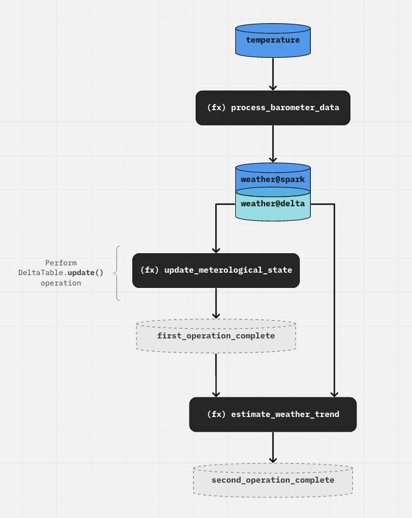

# PySpark integration

This page outlines some best practices when building a Kedro pipeline with [`PySpark`](https://spark.apache.org/docs/latest/api/python/index.html). It assumes a basic understanding of both Kedro and `PySpark`.

## Centralise Spark configuration in `conf/base/spark.yml`

Spark allows you to specify many different [configuration options](https://spark.apache.org/docs/latest/configuration.html). We recommend storing all of these options in a file located at `conf/base/spark.yml`. Below is an example of the content of the file to specify the `maxResultSize` of the Spark's driver and to use the `FAIR` scheduler:

```yaml
spark.driver.maxResultSize: 3g
spark.scheduler.mode: FAIR
```

```{note}
Optimal configuration for Spark depends on the setup of your Spark cluster.
```

## Initialise a `SparkSession` using a hook

Before any `PySpark` operations are performed, you should initialise your [`SparkSession`](https://spark.apache.org/docs/latest/sql-getting-started.html#starting-point-sparksession) using an `after_context_created` [hook](../hooks/introduction). This ensures that a `SparkSession` has been initialised before the Kedro pipeline is run.

Below is an example implementation to initialise the `SparkSession` in `src/<package_name>/hooks.py` by reading configuration from the `spark.yml` configuration file created in the previous section:

```python
from kedro.framework.hooks import hook_impl
from pyspark import SparkConf
from pyspark.sql import SparkSession


class SparkHooks:
    @hook_impl
    def after_context_created(self, context) -> None:
        """Initialises a SparkSession using the config
        defined in project's conf folder.
        """

        # Load the spark configuration in spark.yaml using the config loader
        parameters = context.config_loader.get("spark*", "spark*/**")
        spark_conf = SparkConf().setAll(parameters.items())

        # Initialise the spark session
        spark_session_conf = (
            SparkSession.builder.appName(context.project_path.name)
            .enableHiveSupport()
            .config(conf=spark_conf)
        )
        _spark_session = spark_session_conf.getOrCreate()
        _spark_session.sparkContext.setLogLevel("WARN")
```

You should modify this code to adapt it to your cluster's setup, e.g. setting master to `yarn` if you are running Spark on [YARN](https://spark.apache.org/docs/latest/running-on-yarn.html).

Call `SparkSession.builder.getOrCreate()` to obtain the `SparkSession` anywhere in your pipeline. `SparkSession.builder.getOrCreate()` is a global [singleton](https://python-3-patterns-idioms-test.readthedocs.io/en/latest/Singleton.html).

We don't recommend storing Spark session on the context object, as it cannot be serialised and therefore prevents the context from being initialised for some plugins.

You will also need to register `SparkHooks` by updating the `HOOKS` variable in `src/<package_name>/settings.py` as follows:

```python
from <package_name>.hooks import SparkHooks

HOOKS = (SparkHooks(),)
```

## Use Kedro's built-in Spark datasets to load and save raw data

We recommend using Kedro's built-in Spark datasets to load raw data into Spark's [DataFrame](https://spark.apache.org/docs/latest/api/python/reference/pyspark.sql/dataframe.html), as well as to write them back to storage. Some of our built-in Spark datasets include:

* [spark.DeltaTableDataset](/kedro_datasets.spark.DeltaTableDataset)
* [spark.SparkDataset](/kedro_datasets.spark.SparkDataset)
* [spark.SparkJDBCDataset](/kedro_datasets.spark.SparkJDBCDataset)
* [spark.SparkHiveDataset](/kedro_datasets.spark.SparkHiveDataset)

The example below illustrates how to use `spark.SparkDataset` to read a CSV file located in S3 into a `DataFrame` in `conf/base/catalog.yml`:

```yaml
weather:
  type: spark.SparkDataset
  filepath: s3a://your_bucket/data/01_raw/weather*
  file_format: csv
  load_args:
    header: True
    inferSchema: True
  save_args:
    sep: '|'
    header: True
```

Or using the Python API:

```python
import pyspark.sql
from kedro.io import DataCatalog
from kedro_datasets.spark import SparkDataset

spark_ds = SparkDataset(
    filepath="s3a://your_bucket/data/01_raw/weather*",
    file_format="csv",
    load_args={"header": True, "inferSchema": True},
    save_args={"sep": "|", "header": True},
)
catalog = DataCatalog({"weather": spark_ds})

df = catalog.load("weather")
assert isinstance(df, pyspark.sql.DataFrame)
```

## Spark and Delta Lake interaction

[Delta Lake](https://delta.io/) is an open-source project that enables building a Lakehouse architecture on top of data lakes. It provides ACID transactions and unifies streaming and batch data processing on top of existing data lakes, such as S3, ADLS, GCS, and HDFS.
To setup PySpark with Delta Lake, have a look at [the recommendations in Delta Lake's documentation](https://docs.delta.io/latest/quick-start.html#python).

We recommend the following workflow, which makes use of the [transcoding feature in Kedro](../data/data_catalog_yaml_examples.md#read-the-same-file-using-two-different-datasets):

* To create a Delta table, use a `SparkDataset` with `file_format="delta"`. You can also use this type of dataset to read from a Delta table and/or overwrite it.
* To perform [Delta table deletes, updates, and merges](https://docs.delta.io/latest/delta-update.html#language-python), load the data using a `DeltaTableDataset` and perform the write operations within the node function.

As a result, we end up with a catalog that looks like this:

```yaml
temperature:
  type: spark.SparkDataset
  filepath: data/01_raw/data.csv
  file_format: "csv"
  load_args:
    header: True
    inferSchema: True
  save_args:
    sep: '|'
    header: True

weather@spark:
  type: spark.SparkDataset
  filepath: s3a://my_bucket/03_primary/weather
  file_format: "delta"
  save_args:
    mode: "overwrite"
    versionAsOf: 0

weather@delta:
  type: spark.DeltaTableDataset
  filepath: s3a://my_bucket/03_primary/weather
```

The `DeltaTableDataset` does not support `save()` operation, as the updates happen in place inside the node function, i.e. through `DeltaTable.update()`, `DeltaTable.delete()`, `DeltaTable.merge()`.


```{note}
If you have defined an implementation for the Kedro `before_dataset_saved`/`after_dataset_saved` hook, the hook will not be triggered. This is because the save operation happens within the `node` itself, via the DeltaTable API.
```

```python
pipeline(
    [
        node(
            func=process_barometer_data, inputs="temperature", outputs="weather@spark"
        ),
        node(
            func=update_meterological_state,
            inputs="weather@delta",
            outputs="first_operation_complete",
        ),
        node(
            func=estimate_weather_trend,
            inputs=["first_operation_complete", "weather@delta"],
            outputs="second_operation_complete",
        ),
    ]
)
```

`first_operation_complete` is a `MemoryDataset` and it signals that any Delta operations which occur "outside" the Kedro DAG are complete. This can be used as input to a downstream node, to preserve the shape of the DAG. Otherwise, if no downstream nodes need to run after this, the node can simply not return anything:

```python
pipeline(
    [
        node(func=..., inputs="temperature", outputs="weather@spark"),
        node(func=..., inputs="weather@delta", outputs=None),
    ]
)
```

The following diagram is the visual representation of the workflow explained above:



```{note}
This pattern of creating "dummy" datasets to preserve the data flow also applies to other "out of DAG" execution operations such as SQL operations within a node.
```

## Use `MemoryDataset` for intermediary `DataFrame`

For nodes operating on `DataFrame` that doesn't need to perform Spark actions such as writing the `DataFrame` to storage, we recommend using the default `MemoryDataset` to hold the `DataFrame`. In other words, there is no need to specify it in the `DataCatalog` or `catalog.yml`. This allows you to take advantage of Spark's optimiser and lazy evaluation.

## Use `MemoryDataset` with `copy_mode="assign"` for non-`DataFrame` Spark objects

Sometimes, you might want to use Spark objects that aren't `DataFrame` as inputs and outputs in your pipeline. For example, suppose you have a `train_model` node to train a classifier using Spark ML's [`RandomForrestClassifier`](https://spark.apache.org/docs/latest/ml-classification-regression.html#random-forest-classifier) and a `predict` node to make predictions using this classifier. In this scenario, the `train_model` node will output a `RandomForestClassifier` object, which then becomes the input for the `predict` node. Below is the code for this pipeline:

```python
from typing import Any, Dict

from kedro.pipeline import node, pipeline
from pyspark.ml.classification import RandomForestClassifier
from pyspark.sql import DataFrame


def train_model(training_data: DataFrame) -> RandomForestClassifier:
    """Node for training a random forest model to classify the data."""
    classifier = RandomForestClassifier(numTrees=10)
    return classifier.fit(training_data)


def predict(model: RandomForestClassifier, testing_data: DataFrame) -> DataFrame:
    """Node for making predictions given a pre-trained model and a testing dataset."""
    predictions = model.transform(testing_data)
    return predictions


def create_pipeline(**kwargs) -> Pipeline:
    return pipeline(
        [
            node(train_model, inputs=["training_data"], outputs="example_classifier"),
            node(
                predict,
                inputs=dict(model="example_classifier", testing_data="testing_data"),
                outputs="example_predictions",
            ),
        ]
    )
```

To make the pipeline work, you will need to specify `example_classifier` as follows in the `catalog.yml`:

```yaml
example_classifier:
  type: MemoryDataset
  copy_mode: assign
```

The `assign` copy mode ensures that the `MemoryDataset` will be assigned the Spark object itself, not a [deep copy](https://docs.python.org/3/library/copy.html) version of it, since deep copy doesn't work with Spark object generally.

## Tips for maximising concurrency using `ThreadRunner`

Under the hood, every Kedro node that performs a Spark action (e.g. `save`, `collect`) is submitted to the Spark cluster as a Spark job through the same `SparkSession` instance. These jobs may be running concurrently if they were submitted by different threads. In order to do that, you will need to run your Kedro pipeline with the [ThreadRunner](/kedro.runner.ThreadRunner):

```bash
kedro run --runner=ThreadRunner
```

To further increase the concurrency level, if you are using Spark >= 0.8, you can also give each node a roughly equal share of the Spark cluster by turning on fair sharing and therefore giving them a roughly equal chance of being executed concurrently. By default, they are executed in a FIFO manner, which means if a job takes up too much resources, it could hold up the execution of other jobs. In order to turn on fair sharing, put the following in your `conf/base/spark.yml` file, which was created in the [Initialise a `SparkSession`](#initialise-a-sparksession-using-a-hook) section:

```yaml
spark.scheduler.mode: FAIR
```

For more information, please visit Spark documentation on [jobs scheduling within an application](https://spark.apache.org/docs/latest/job-scheduling.html#scheduling-within-an-application).
