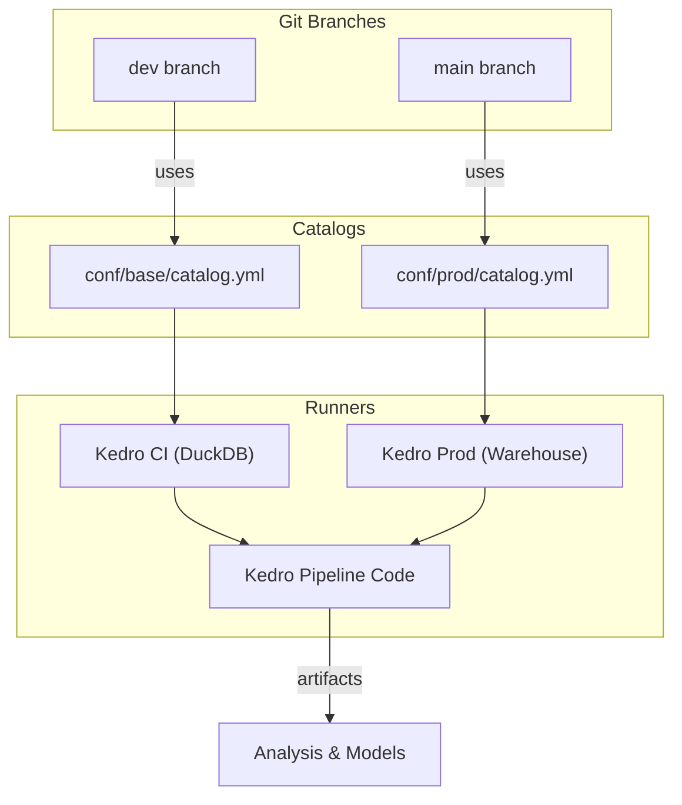

# Working with SQL in Kedro

This page outlines the various approaches and recommended practices when building a Kedro pipeline with SQL databases.

## Key concepts and assumptions

When working with SQL databases in Kedro, it's helpful to keep the following concepts front of mind.

### 1. Storage vs. Execution

- You can treat a SQL database purely as a data sink/source, or
- Leverage the database engine’s compute power whenever possible.

### 2. CRUD Scope

- Kedro handles the parts of CRUD which do not require some concept of “state.”
- Kedro’s genesis centred around reproducible science, not operational concepts like [backfills](https://www.ssp.sh/brain/backfill/).

| Operation | Supported? | Notes                                                   |
|-----------|------------|---------------------------------------------------------|
| Create    | ✅          | Writing new tables (or views)                           |
| Read      | ✅          | Loading data into DataFrames or Ibis expressions        |
| Update    | ❌          | Requires custom SQL outside Kedro’s DAG; breaks lineage |
| Delete    | ❌          | Same as Update—avoid for full reproducibility           |

### 3. DataFrame-centric

- Kedro’s DAG and built-in datasets are optimised around Python DataFrames.
- Embedding complex SQL scripts reduces visibility into dependencies and hinders reproducibility. See [Delta Lake integration guide](./deltalake_versioning.md) for more on handling `UPSERT`/`MERGE` like operations.

### 4. Reproducibility & injection risk

- Raw SQL strings can bypass Kedro’s topological sorting and introduce SQL-injection vulnerabilities.
- Prefer testable, Pythonic expression APIs (Ibis, Spark) over raw SQL queries.

## Approaches

| Approach       | Status    | Setup Complexity   |
|----------------|--------|--------------------|
| **Pandas SQL** | Legacy | Minimal            |
| **Spark-JDBC** | Legacy | High (JVM/cluster) |
| **Ibis**       | Modern | Low                |

---

### 1. Pandas SQL (legacy)

```yaml
events_data:
  type: pandas.SQLQueryDataSet
  sql: SELECT * FROM events WHERE date > '2025-01-01'
  credentials: sql_creds
```

- **Mechanism**
  Wraps `pd.read_sql_query/table` and `pd.DataFrame.to_sql`.
- **Pros**

  - No extra services or JVM
  - Pandas-native
- **Cons**

  - Loads full tables in memory
  - Bypasses database optimizations
  - Hard to parameterise/test
  - Potential cost/security on large dumps

---

### 2. Spark-JDBC (legacy)

```yaml
sales_data:
  type: spark.JDBCDataset
  table: sales
  credentials: jdbc_creds
```

- **Mechanism**
  Spark’s DataFrame API over JDBC. Leverages predicate pushdown so filters/projections occur in-database.

- **Pros**

  - Distributed, lazy compute
  - Leverages cluster power
- **Cons**

  - JVM + Spark cluster required
  - Overkill for smaller workloads

---

### 3. Ibis (modern)

```{tip}
Please also check out our [blog on building scalable data pipelines with Kedro and Ibis](https://kedro.org/blog/building-scalable-data-pipelines-with-kedro-and-ibis), [SQL data processing in Kedro ML pipelines](https://kedro.org/blog/sql-data-processing-in-kedro-ml-pipelines), and our [PyData London talk](https://www.youtube.com/watch?v=ffDHdtz_vKc).
```

```yaml
ibis_orders:
  type: ibis.TableDataset
  backend: snowflake
  credentials: snowflake_creds
  table: orders
  save_args:
    materialized: table
    database: my_db.DEV
```

- **Mechanism**
  Python expression trees → compiled SQL at runtime.
- **Key highlights**

  - [SQLGlot](https://github.com/tobymao/sqlglot) translation across 20+ engines
  - Support for extensions (DuckDB geospatial, PostGIS, Snowflake UDFs and more)
  - Full lazy push-down (filters, joins, aggregates)
  - Pluggable materialization (table/view/CTE)
  - No JVM/Spark overhead
  - In-memory/mock backends for testing
- **Pros**

  - Consistent API everywhere
  - Retains engine optimizations
  - Excellent testability & reproducibility
- **Cons**

  - Some backends may miss niche SQL operations
  - Migration effort for legacy pipelines may not justify moving functional code, prioritise new pipelines / projects

```{warning}
Consult the [Ibis support matrix](https://ibis-project.org/backends/support/matrix) to verify that needed SQL functions are available. You can still write raw SQL for missing features.
```

### Recommended Ibis development workflow

<details>
<summary>Iterate locally for instant, low cost feedback. Deploy to production your warehouse for scale—ensuring consistency, testability, and zero drift between environments.</summary>

#### DuckDB (or SQLlite) for Development & [CI](https://en.wikipedia.org/wiki/Continuous_integration)

- In-memory, zero-config engine
- Fast startup for local iteration and unit tests
   ```yaml
   # conf/base/catalog.yml
   orders:
     type: ibis.TableDataset
     backend: duckdb
     filepath: data/03_primary/dev.duckdb
     table: orders
   ```

#### Warehouse Backend for Production & [CD](https://en.wikipedia.org/wiki/Continuous_delivery) (for example Snowflake or BigQuery)**

- Simply swap your catalog’s backend and credentials
- Same Ibis expressions compile to your warehouse’s SQL
- Leverage scale, governance, cost controls
   ```yaml
   # conf/prod/catalog.yml
   orders:
     type: ibis.TableDataset
     backend: snowflake         # or bigquery and more.
     credentials: warehouse_creds
     table: analytics.orders
   ```

Example pattern:


</details>

## Limitations and key design decisions

More broadly, there are some wider limitations to be aware of when working with Kedro & SQL:

- **No conditional branching**
Kedro does not support conditional nodes, making UPSERT logic difficult. Kedro favors reproducibility with append & overwrite modes over in-place updates/deletes.

- **When to seek SQL-first alternatives**
If your workflow is entirely SQL, tools like [dbt](https://github.com/dbt-labs/dbt-core) or [SQLMesh](https://github.com/TobikoData/sqlmesh) offer richer lineage and transformation management than Kedro’s Python-centric approach.
