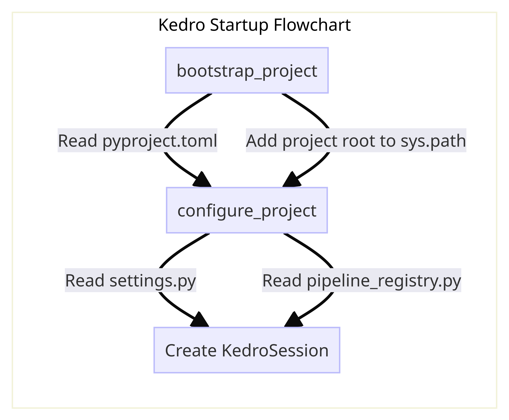

# Lifecycle management with `KedroSession`

## Overview
A `KedroSession` allows you to:

* Manage the lifecycle of a Kedro run
* Persist runtime parameters with corresponding session IDs
* Traceback runtime parameters, such as CLI command flags and environment variables

`KedroSession` decouples Kedro's library components, managed by `KedroContext`, and any session data (both static and dynamic data). As a result, Kedro components and plugins can access session data without the need to import the `KedroContext` object and library components.

The main methods and properties of `KedroSession` are:

- `create()`: Create a new instance of ``KedroSession`` with  session data
- `load_context()`: Instantiate `KedroContext` object
- `close()`: Close the current session — although we recommend that you [use the session object as a context manager](#create-a-session), which will call `close()` automatically, as opposed to calling the method explicitly
- `run()`: Run the pipeline with the arguments provided; see  [Running pipelines](../nodes_and_pipelines/run_a_pipeline) for details

## Create a session

The following code creates a `KedroSession` object as a context manager and runs a pipeline inside the context, with session data provided. The session automatically closes after exit:

```python
from kedro.framework.session import KedroSession
from kedro.framework.startup import bootstrap_project
from pathlib import Path

bootstrap_project(Path.cwd())
with KedroSession.create() as session:
    session.run()
```

You can provide the following optional arguments in `KedroSession.create()`:

- `project_path`: Path to the project root directory
- `save_on_close`: A boolean value to indicate whether or not to save the session to disk when it's closed
- `env`: Environment for the `KedroContext`
- `extra_params`: Optional dictionary containing extra project parameters
for the underlying **`KedroContext`**; if specified, this will update (and therefore take precedence over) parameters retrieved from the project configuration

## `bootstrap_project` and `configure_project`



% Mermaid code, see https://github.com/kedro-org/kedro/wiki/Render-Mermaid-diagrams
% graph LR
%  subgraph Kedro Startup Flowchart
%    A[bootstrap_project] -->|Read pyproject.toml| B
%    A -->|Add project root to sys.path| B[configure_project]
%    C[Initialize KedroSession]
%    B --> |Read settings.py| C
%    B --> |Read pipeline_registry.py| C
%  end

Both `bootstrap_project` and `configure_project` handle the setup of a Kedro project, but there are subtle differences: `bootstrap_project` is used for project mode, and `configure_project` is used for packaged mode.

Kedro's CLI runs the functions at startup as part of `kedro run` so in most cases you don't need to call these functions. If you want to [interact with a Kedro project programatically in an interactive session such as Notebook](../notebooks_and_ipython/kedro_and_notebooks.md#reload_kedro-line-magic), use `%reload_kedro` line magic with Jupyter or IPython. Only use these functions directly if none of these methods work.

### `bootstrap_project`

This function uses `configure_project`, and additionally reads metadata from `pyproject.toml` and adds the project root to `sys.path` so the project can be imported as a Python package. It is typically used to work directly with the source code of a Kedro project.

### `configure_project`

This function reads `settings.py` and `pipeline_registry.py` and registers the configuration before Kedro's run starts. If you have a packaged Kedro project, you only need to run `configure_project` before executing your pipeline.

#### ValueError: Package name not found
> ValueError: Package name not found. Make sure you have configured the project using 'bootstrap_project'. This should happen automatically if you are using Kedro command line interface.

If you are using `multiprocessing`, you need to be careful about this. Depending on your Operating System, you may have [different default](https://docs.python.org/3/library/multiprocessing.html#contexts-and-start-methods). If the processes are `spawn`, Python will re-import all the modules in each process and thus you need to run `configure_project` again at the start of the new process. For example, this is how Kedro handle this in `ParallelRunner`(https://github.com/kedro-org/kedro/blob/9e883e6a0ba40e3db4497b234dcb3801258e8396/kedro/runner/parallel_runner.py#L84-L85)
