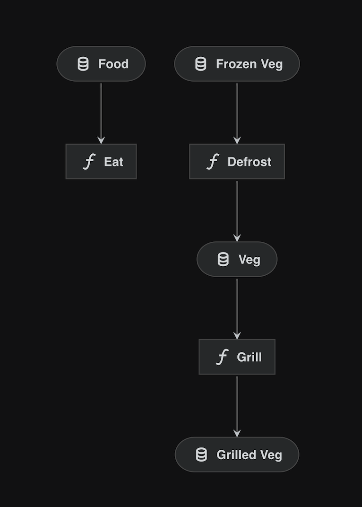

# Modular pipelines

## What are modular pipelines?

In many typical Kedro projects, a single (“main”) pipeline increases in complexity as the project evolves. To keep your project fit for purpose, we recommend that you create modular pipelines, which are logically isolated and can be reused. Modular pipelines are easier to develop, test and maintain, and are portable so they can be copied and reused between projects.

Modular pipelines allow you to instantiate pipelines multiple times, while allowing the user to override inputs/outputs/parameters. They are reusable within the same codebase, and shareable across projects via [micro-packaging](micro_packaging.md). This is the modern way to use Kedro, and will change the way you think about your pipelines.

```{note}
The Kedro project visualised below is representative of one that might be seen in the real world. It takes full advantage of modular pipelines for `Data Ingestion`, `Feature Engineering`, `Reporting` and `Train Evaluation` (which even includes nested instances).
```

### Key concepts

In this section, you will learn about how to take advantage of modular pipelines. The key points are listed below:

1. **A modular pipeline is defined by its folder structure**

   * You can generate this file structure with the CLI command ``kedro pipeline create <pipeline_name>``.
   * The folder structure keeps things isolated and encourages portability.

2. **Modular pipelines are designed to be portable and reusable**

   * It's possible to re-use the same pipeline multiple times within the same project (with different inputs/outputs or parameters).
   * You can also share pipelines across codebases via [micro-packaging](micro_packaging.md).

3. **The `kedro.pipeline.modular_pipeline.pipeline` wrapper method unlocks the real power of modular pipelines**

   * Applying [namespaces](https://en.wikipedia.org/wiki/Namespace) allows you to simplify your mental model and isolate 'within pipeline' processing steps.
   * [Kedro-Viz](https://demo.kedro.org) accelerates development by rendering namespaced pipelines as collapsible 'super nodes'.


## How do I create a modular pipeline?

You can use a [project-specific CLI command](../development/commands_reference.md#kedro-commands) to create a modular pipeline. The pipeline name must adhere to [Python convention](https://realpython.com/python-pep8/#naming-conventions).

```bash
kedro pipeline create <pipeline_name>
```

```{note}
For the full list of available CLI options, you can always run `kedro pipeline create --help` for more information.
```

### What does `kedro pipeline create` do?

Running the `kedro pipeline create` command adds boilerplate folders and files for the designated pipeline to your project. For your convenience, Kedro gives you a pipeline-specific `nodes.py`, `pipeline.py`, parameters file and appropriate `tests` structure. It also adds the appropriate `__init__.py` files. You can see the generated folder structure below:

<details>
<summary><b>Click to see the generated folder structure</b></summary>

```text
├── conf
│   └── base
│       └── parameters_{{pipeline_name}}.yml  <-- Pipeline-specific parameters
└── src
    ├── my_project
    │   ├── __init__.py
    │   └── pipelines
    │       ├── __init__.py
    │       └── {{pipeline_name}}      <-- This folder defines the modular pipeline
    │           ├── __init__.py        <-- So that Python treats this pipeline as a module
    │           ├── nodes.py           <-- To declare your nodes
    │           └── pipeline.py        <-- To structure the pipeline itself
    └── tests
        ├── __init__.py
        └── pipelines
            ├── __init__.py
            └── {{pipeline_name}}      <-- Pipeline-specific tests
                ├── __init__.py
                └── test_pipeline.py

```

</details>

If you want to do the reverse and remove a modular pipeline, you can use ``kedro pipeline delete <pipeline_name>`` to do so.

### Custom templates

If you want to generate a pipeline with a custom Cookiecutter template, you can save it in `<project_root>/templates/pipeline`.
The `kedro pipeline create` command will pick up the custom template in your project as the default. You can also specify the path to your custom
Cookiecutter pipeline template with the `--template` flag like this:
```bash
kedro pipeline create <pipeline_name> --template <path_to_template>
```
A template folder passed to `kedro pipeline create` using the `--template` argument will take precedence over any local templates.
Kedro supports having a single pipeline template in your project. If you need to have multiple pipeline templates, consider saving them in a
separate folder and pointing to them with the `--template` flag.

#### Creating custom templates

It is your responsibility to create functional Cookiecutter templates for custom modular pipelines. Please ensure you understand the
basic structure of a modular pipeline. Your template should render to a valid, importable Python module containing a
`create_pipeline` function at the top level that returns a `Pipeline` object. You will also need appropriate
`config` and `tests` subdirectories that will be copied to the project `config` and `tests` directories when the pipeline is created.
The `config` and `tests` directories need to follow the same layout as in the default template and cannot
be customised, although the contents of the parameters and actual test file can be changed. File and folder names or structure
do not matter beyond that and can be customised according to your needs. You can use [the
default template that Kedro](https://github.com/kedro-org/kedro/tree/main/kedro/templates/pipeline) uses as a starting point.

Pipeline templates are rendered using [Cookiecutter](https://cookiecutter.readthedocs.io/), and must also contain a `cookiecutter.json`
See the [`cookiecutter.json` file in the Kedro default template](https://github.com/kedro-org/kedro/tree/main/kedro/templates/pipeline/cookiecutter.json) for an example.
It is important to note that if you are embedding your custom pipeline template within a
Kedro starter template, you must tell Cookiecutter not to render this template when creating a new project from the starter. To do this,
you must add [`_copy_without_render: ["templates"]`](https://cookiecutter.readthedocs.io/en/stable/advanced/copy_without_render.html) to the `cookiecutter.json` file for the starter
and not the `cookiecutter.json` for the pipeline template.

### Ensuring portability

Modular pipelines are shareable between Kedro codebases via [micro-packaging](micro_packaging.md), but you must follow a couple of rules to ensure portability:

* Modular pipelines should **not** depend on the main Python package, as this would break portability to another project.
* Catalog references are not packaged when sharing/consuming modular pipelines, i.e. the `catalog.yml` file is not packaged.
* Kedro will only look for top-level configuration in `conf/`; placing a configuration folder within the pipeline folder will have no effect.
* We recommend that you document the configuration required (parameters and catalog) in the local `README.md` file for any downstream consumers.

### Providing modular pipeline specific dependencies

* A modular pipeline **might** have external dependencies specified in a local `requirements.txt` file.
* Pipeline specific dependencies are scooped up during the [micro-packaging](micro_packaging.md) process.
* These dependencies are _not_ currently installed by the [`kedro install`](../development/commands_reference.md#install-all-package-dependencies) command, and must be manually installed.

## Using the modular `pipeline()` wrapper to provide overrides

This wrapper really unlocks the power of modular pipelines.

* It allows you to start instantiating the same pipeline multiple times.
* These will be static in terms of structure, but dynamic in terms of `inputs`/`outputs`/`parameters`.
* It also allows you to simplify both your mental models, and Kedro-Viz visualisations via `namespaces`.

```python
from kedro.pipeline.modular_pipeline import pipeline
```

The `pipeline()` wrapper method takes the following arguments:

| Keyword argument | Description                                                                         |
| ---------------- | ----------------------------------------------------------------------------------- |
| `pipe`           | The `Pipeline` object you want to wrap                                              |
| `inputs`         | Any overrides provided to this instance of the underlying wrapped `Pipeline` object |
| `outputs`        | Any overrides provided to this instance of the underlying wrapped `Pipeline` object |
| `parameters`     | Any overrides provided to this instance of the underlying wrapped `Pipeline` object |
| `namespace`      | The namespace that will be encapsulated by this pipeline instance                   |

## Combining disconnected pipelines

Sometimes two pipelines must be connected, but do not share any catalog dependencies. The wrapper can be used to solve that.

<details>
<summary>Click here to see a worked example</summary>

In this example, there is a `lunch_pipeline`, which makes us lunch. The 'verbs', `defrost` and `eat`, are Python functions and the inputs/outputs are food at different points of the process (`frozen`, `thawed` and `food`).

```python
cook_pipeline = pipeline(
    [
        node(func=defrost, inputs="frozen_veg", outputs="veg"),
        node(func=grill, inputs="veg", outputs="grilled_veg"),
    ]
)

lunch_pipeline = pipeline([node(func=eat, inputs="food", outputs=None)])

cook_pipeline + lunch_pipeline
```

This combination will visualise since it's valid pre-runtime, but it will not run since `food` is not an output of the `cook_pipeline` because the output of the `cook_pipeline` is `grilled_veg`:



* Combining `cook_pipeline + lunch_pipeline` will not work since `food` doesn't exist as an output of the `cook_pipeline`.
* In this case, we will need to map `grilled_veg` to the expected input of `food`.

The wrapper allows us to provide a mapping and fix this disconnect.

```python
from kedro.pipeline.modular_pipeline import pipeline

prep_pipeline = pipeline(pipe=cook_pipeline, outputs={"grilled_veg": "food"})

meal_pipeline = prep_pipeline + lunch_pipeline
```

Providing this input/output override will join up the pipeline nicely:


```{note}
In this example we have used the `+` operator to join two pipelines. You can also use `sum()` or pass a list of pipelines to the `pipe` argument.
```

</details>

## Using a modular pipeline multiple times

Reusing pipelines for slightly different purposes can be a real accelerator for teams and organisations when they reach a certain scale. In the real world, one could imagine pipelines with responsibilities like profiling or feature engineering being reused within the same project or even across projects via [micro-packaging](micro_packaging.md).

* In an ideal world, we would like to use the `cook_pipeline` twice as you would `defrost` and `grill` multiple meals beyond the `veg` currently hard-coded.
* Namespaces allow you to instantiate the same pipeline multiple times and keep operations isolated.
* Like one provides arguments to a class' constructor, you can provide overriding inputs/outputs/parameters to the `pipeline()` wrapper.

```{note}
The set of overriding inputs and outputs must be a subset of the reused pipeline's "free" inputs and outputs, respectively. A free input is an input that isn't generated by a node in the pipeline, while a free output is an output that isn't consumed by a node in the pipeline. {py:meth}`Pipeline.inputs() <kedro.pipeline.Pipeline.inputs>` and {py:meth}`Pipeline.outputs() <kedro.pipeline.Pipeline.outputs>` can be used to list a pipeline's free inputs and outputs, respectively.
```

<details>
<summary>Click here to see a worked example</summary>

```python
cook_pipeline = pipeline(
    [
        node(func=defrost, inputs="frozen_veg", outputs="veg", name="defrost_node"),
        node(func=grill, inputs="veg", outputs="grilled_veg"),
    ]
)

eat_breakfast_pipeline = pipeline(
    [node(func=eat_breakfast, inputs="breakfast_food", outputs=None)]
)
eat_lunch_pipeline = pipeline([node(func=eat_lunch, inputs="lunch_food", outputs=None)])

cook_pipeline + eat_breakfast_pipeline + eat_lunch_pipeline
```

If we visualise the snippet above, we see a disjointed pipeline:

* We need to "defrost" two different types of food via different pipelines.
* We cannot use the `cook_pipeline` twice because the internal dataset names will conflict.
* Mapping all datasets via the `pipeline()`  wrapper will also cause conflicts.


Adding namespaces solves this issue:

```python
cook_breakfast_pipeline = pipeline(
    pipe=cook_pipeline,
    inputs="frozen_veg",  # inputs stay the same, don't namespace
    outputs={"grilled_veg": "breakfast_food"},
    namespace="breakfast",
)
cook_lunch_pipeline = pipeline(
    pipe=cook_pipeline,
    inputs="frozen_veg",  # inputs stay the same, don't namespace
    outputs={"grilled_veg": "lunch_food"},
    namespace="lunch",
)

final_pipeline = (
    cook_breakfast_pipeline
    + eat_breakfast_pipeline
    + cook_lunch_pipeline
    + eat_lunch_pipeline
)
```

* `namespace="lunch"` renames all datasets and nodes, prefixing them with `"lunch."`.
* The datasets that we explicitly "freeze" (`frozen_veg`) or remap (`grilled_veg`) are not affected/prefixed.
* Remapping free outputs is required since "breakfast_food" and "lunch_food" are the names expected by the `eat_breakfast_pipeline` and `eat_lunch_pipeline` respectively.
* The resulting pipeline now has two separate nodes, `breakfast.defrost_node` and `lunch.defrost_node`.
* Also two separate datasets `breakfast.veg` and `lunch.veg` connect the nodes inside the pipelines, causing no confusion between them.


* Visualising the `final_pipeline` highlights how namespaces become 'super nodes' which encapsulate the wrapped pipeline.
* This example demonstrates how we can reuse the same `cook_pipeline` with slightly different arguments.
* Namespaces can also be arbitrarily nested with the `.` character.
* `kedro run --namespace=<namespace>` could be used to only run nodes with a specific namespace.

```{note}
`parameters` references will not be namespaced, but `params:` references will.
```
</details>

## How to use a modular pipeline with different parameters

 Mapping parameter values is very similar to the way we map inputs and outputs.

<details>
<summary>Click here to see a worked example</summary>

* We instantiate the `template_pipeline` twice, but pass in different parameters.
* `input1` and `input2` are 'frozen' and thus shared in both instances.
* `params:override_me` does not actually exist and is designed to be overridden in both cases.
* Providing a namespace isolates the intermediate operation and visualises nicely.

```python
template_pipeline = pipeline(
    [
        node(
            func=node_func1,
            inputs=["input1", "input2", "params:override_me"],
            outputs="intermediary_output",
        ),
        node(
            func=node_func2,
            inputs="intermediary_output",
            outputs="output",
        ),
    ]
)

alpha_pipeline = pipeline(
    pipe=template_pipeline,
    inputs={"input1", "input2"},
    parameters={"params:override_me": "params:alpha"},
    namespace="alpha",
)

beta_pipeline = pipeline(
    pipe=template_pipeline,
    inputs={"input1", "input2"},
    parameters={"params:override_me": "params:beta"},
    namespace="beta",
)

final_pipeline = alpha_pipeline + beta_pipeline
```

</details>


