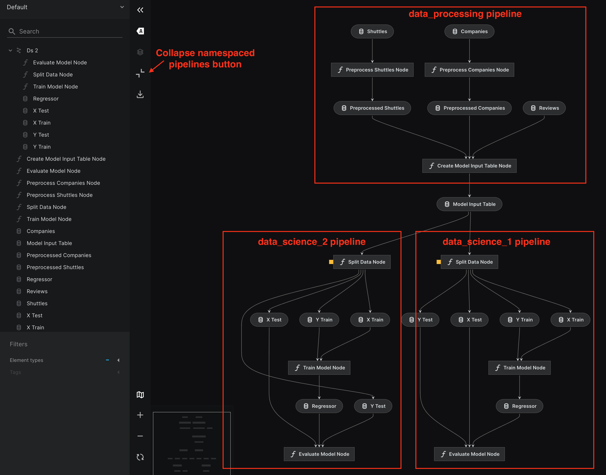
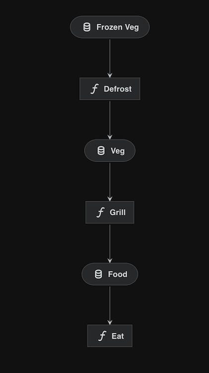
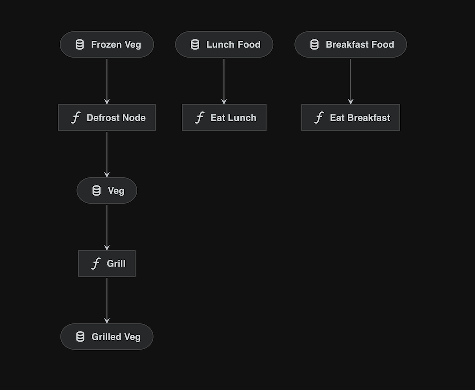
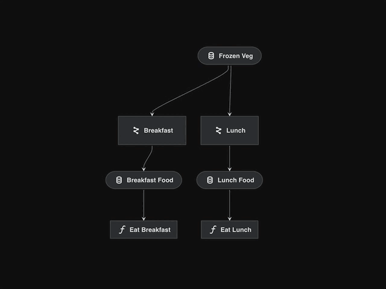

# Reuse pipelines with namespaces

## How to reuse your pipelines

If you want to create a new pipeline that performs similar tasks with different inputs/outputs/parameters as your `existing_pipeline`, you can use the same `pipeline()` creation function as described in [How to structure your pipeline creation](modular_pipelines.md#how-to-structure-your-pipeline-creation). This function allows you to overwrite inputs, outputs, and parameters. Your new pipeline creation code should look like this:

```python
def create_new_pipeline(**kwargs) -> Pipeline:
    return pipeline(
    [existing_pipeline], # Name of the existing pipeline
    inputs = {"old_input_df_name" : "new_input_df_name"},  # Mapping old input to new input
    outputs = {"old_output_df_name" : "new_output_df_name"},  # Mapping old output to new output
    parameters = {"params: model_options": "params: new_model_options"},  # Updating parameters
    )
```

This means you can easily create multiple pipelines based on the `existing_pipeline` pipeline to test different approaches with various input datasets and model training parameters. For example, for the `data_science` pipeline from our [Spaceflights tutorial](../tutorial/add_another_pipeline.md#data-science-pipeline), you can restructure the `src/project_name/pipelines/data_science/pipeline.py` file by separating the `data_science` pipeline creation code into a separate `base_data_science` Pipeline object, then reusing it inside the `create_pipeline()` function:

```python
#src/project_name/pipelines/data_science/pipeline.py

from kedro.pipeline import Pipeline, node, pipeline
from .nodes import evaluate_model, split_data, train_model

base_data_science = pipeline(
        [
            node(
                func=split_data,
                inputs=["model_input_table", "params:model_options"],
                outputs=["X_train", "X_test", "y_train", "y_test"],
                name="split_data_node",
            ),
            node(
                func=train_model,
                inputs=["X_train", "y_train"],
                outputs="regressor",
                name="train_model_node",
            ),
            node(
                func=evaluate_model,
                inputs=["regressor", "X_test", "y_test"],
                outputs=None,
                name="evaluate_model_node",
            ),
        ]
    )  # Creating a base data science pipeline that will be reused with different model training parameters


def create_pipeline(**kwargs) -> Pipeline:
    return pipeline(
        [base_data_science],  # Creating a new data_science pipeline based on base_data_science pipeline
        parameters={"params:model_options": "params:model_options_1"},  # Using a new set of parameters to train model
    )
```

To use a new set of parameters, we need to previously save them inside `conf/base/parameters.yml` of our kedro project. I copied `model_options` from `conf/base/parameters_data_science.yml` and slightly modified it to try new model training parameters: test size and different features set, and called it `model_options_1`:

```python
#conf/base/parameters.yml
model_options_1:
  test_size: 0.15
  random_state: 3
  features:
    - passenger_capacity
    - crew
    - d_check_complete
    - moon_clearance_complete
    - company_rating
```

> **Warning**: In Kedro, you cannot run pipelines with the same node names. In this example, both pipelines have nodes with the same names, so it's impossible to execute them together. However, `base_data_science` is not registered and will not be executed with the `kedro run` command. The `data_science` pipeline created inside the `create_pipeline()` function, based on `base_data_science`, will be executed during `kedro run` because it will be autodiscovered by Kedro.

If you want to execute `base_data_science` and `data_science` pipelines together or reuse `base_data_science` a few more times, you need to modify the node names. The easiest way to do this is by using namespaces.

## What is a namespace

A namespace is a way to isolate nodes, inputs, outputs, and parameters inside your pipeline. If you put `namespace="namespace_name"` attribute inside the `pipeline()` creation function, it will add the `namespace_name.` prefix to all nodes, inputs, outputs, and parameters inside your new pipeline.

Let's extend our previous example and try to reuse the `base_data_science` pipeline one more time by creating another pipeline based on it. First, we should use the `kedro pipeline create` command to create a new blank pipeline named `data_science_2`:

```python
kedro pipeline create data_science_2
```
Then, we need to modify the `src/project_name/pipelines/data_science_2/pipeline.py` file to create a pipeline in a similar way to the example above. We will import `base_data_science` from the code above and use a namespace to isolate our nodes:

```python
#src/project_name/pipelines/data_science_2/pipeline.py
from kedro.pipeline import Pipeline, pipeline
from ..data_science.pipeline import base_data_science  # Import pipeline to create a new one based on it

def create_pipeline(**kwargs) -> Pipeline:
    return pipeline(
        [base_data_science], # Creating a new data_science_2 pipeline based on base_data_science pipeline
        parameters={"params:model_options": "params:model_options_2"}, # Using a new set of parameters to train model
        namespace = "ds_2", # With that namespace, "ds_2." prefix will be added to inputs, outputs, params, and node names
        inputs={"model_input_table"}, # Inputs remain the same, without namespace prefix
    )
```

To use a new set of parameters, copy `model_options` from `conf/base/parameters_data_science.yml` to `conf/base/parameters_data_science_2.yml` and modify it slightly to try new model training parameters, such as test size and a different feature set. Call it `model_options_2`:

```python
#conf/base/parameters.yml
model_options_2:
  test_size: 0.3
  random_state: 3
  features:
    - d_check_complete
    - moon_clearance_complete
    - iata_approved
    - company_rating
```

In this example, all nodes inside the `data_science_2` pipeline will be prefixed with `ds_2`: `ds_2.split_data`, `ds_2.train_model`, `ds_2.evaluate_model`. Parameters will be used from `model_options_2` because we overwrite `model_options` with them. The input for that pipeline will be `model_input_table` as it was previously, because we mentioned that in the inputs parameter (without that, the input would be modified to `ds_2.model_input_table`, but we don't have that table in the pipeline).

Since the node names are unique now, we can run the project with:

```python
kedro run
```

Logs show that `data_science` and `data_science_2` pipelines were executed successfully with different R2 results. Now, we can see how Kedro-viz renders namespaced pipelines in collapsible "super nodes":

```python
kedro viz run
```

After running viz, we can see two equal pipelines: `data_science` and `data_science_2`:



We can collapse all namespaced pipelines (in our case, it's only `data_science_2`) with a special button and see that the `data_science_2` pipeline was collapsed into one super node called `Ds 2`:


> Tip: You can use `kedro run --namespace = namespace_name` to run only the specific namespace


### How make all pipelines in this example fully namespaced

If we want to make all pipelines in this example fully namespaced, we should:

Modify the `data_processing` pipeline by adding to the `pipeline()` creation function in `src/project_name/pipelines/data_processing/pipeline.py` with the following code:
```python
        namespace="data_processing",
        inputs={"companies", "shuttles", "reviews"},  # Inputs remain the same, without namespace prefix
        outputs={"model_input_table"},  # Outputs remain the same, without namespace prefix
```
Modify the `data_science` pipeline by adding namespace and inputs the same way as it was in `data_science_2` pipeline:

```python
def create_pipeline(**kwargs) -> Pipeline:
    return pipeline(
        [base_data_science],
        parameters={"params:model_options": "params:model_options_1"},
        namespace="ds_1",
        inputs={"model_input_table"},
    )
```

After executing the pipeline with `kedro run`, the visualization with `kedro viz run` after collapsing will look like this:


## Providing pipeline specific dependencies

* A pipeline **might** have external dependencies specified in a local `requirements.txt` file.
* Pipeline specific dependencies are scooped up during the [micro-packaging](micro_packaging.md) process.
* These dependencies need to be manually installed using `pip`:
```bash
pip install -r requirements.txt
```

## Example: Combining disconnected pipelines

Sometimes two pipelines must be connected, but do not share any catalog dependencies. In this example, there is a `lunch_pipeline`, which makes us lunch. The 'verbs', `defrost` and `eat`, are Python functions and the inputs/outputs are food at different points of the process (`frozen`, `thawed` and `food`).

```python
cook_pipeline = pipeline(
    [
        node(func=defrost, inputs="frozen_veg", outputs="veg"),
        node(func=grill, inputs="veg", outputs="grilled_veg"),
    ]
)

lunch_pipeline = pipeline([node(func=eat, inputs="food", outputs=None)])

cook_pipeline + lunch_pipeline
```

This combination will visualise since it's valid pre-runtime, but it will not run since `food` is not an output of the `cook_pipeline` because the output of the `cook_pipeline` is `grilled_veg`:


* Combining `cook_pipeline + lunch_pipeline` will not work since `food` doesn't exist as an output of the `cook_pipeline`.
* In this case, we will need to map `grilled_veg` to the expected input of `food`.

The wrapper allows us to provide a mapping and fix this disconnect.

```python
from kedro.pipeline.modular_pipeline import pipeline

prep_pipeline = pipeline(pipe=cook_pipeline, outputs={"grilled_veg": "food"})

meal_pipeline = prep_pipeline + lunch_pipeline
```

Providing this input/output override will join up the pipeline nicely:



```{note}
In this example we have used the `+` operator to join two pipelines. You can also use `sum()` or pass a list of pipelines to the `pipe` argument.
```


## Example: Using a modular pipeline multiple times

Reusing pipelines for slightly different purposes can be a real accelerator for teams and organisations when they reach a certain scale. In the real world, one could imagine pipelines with responsibilities like profiling or feature engineering being reused within the same project or even across projects via [micro-packaging](micro_packaging.md).

* In an ideal world, we would like to use the `cook_pipeline` twice as you would `defrost` and `grill` multiple meals beyond the `veg` currently hard-coded.
* Namespaces allow you to instantiate the same pipeline multiple times and keep operations isolated.
* Like one provides arguments to a class' constructor, you can provide overriding inputs/outputs/parameters to the `pipeline()` wrapper.

```{note}
The set of overriding inputs and outputs must be a subset of the reused pipeline's "free" inputs and outputs, respectively. A free input is an input that isn't generated by a node in the pipeline, while a free output is an output that isn't consumed by a node in the pipeline. {py:meth}`Pipeline.inputs() <kedro.pipeline.Pipeline.inputs>` and {py:meth}`Pipeline.outputs() <kedro.pipeline.Pipeline.outputs>` can be used to list a pipeline's free inputs and outputs, respectively.
```

```python
cook_pipeline = pipeline(
    [
        node(func=defrost, inputs="frozen_veg", outputs="veg", name="defrost_node"),
        node(func=grill, inputs="veg", outputs="grilled_veg"),
    ]
)

eat_breakfast_pipeline = pipeline(
    [node(func=eat_breakfast, inputs="breakfast_food", outputs=None)]
)
eat_lunch_pipeline = pipeline([node(func=eat_lunch, inputs="lunch_food", outputs=None)])

cook_pipeline + eat_breakfast_pipeline + eat_lunch_pipeline
```

If we visualise the snippet above, we see a disjointed pipeline:

* We need to "defrost" two different types of food via different pipelines.
* We cannot use the `cook_pipeline` twice because the internal dataset names will conflict.
* Mapping all datasets via the `pipeline()`  wrapper will also cause conflicts.



Adding namespaces solves this issue:

```python
cook_breakfast_pipeline = pipeline(
    pipe=cook_pipeline,
    inputs="frozen_veg",  # inputs stay the same, don't namespace
    outputs={"grilled_veg": "breakfast_food"},
    namespace="breakfast",
)
cook_lunch_pipeline = pipeline(
    pipe=cook_pipeline,
    inputs="frozen_veg",  # inputs stay the same, don't namespace
    outputs={"grilled_veg": "lunch_food"},
    namespace="lunch",
)

final_pipeline = (
    cook_breakfast_pipeline
    + eat_breakfast_pipeline
    + cook_lunch_pipeline
    + eat_lunch_pipeline
)
```

* `namespace="lunch"` renames all datasets and nodes, prefixing them with `"lunch."`.
* The datasets that we explicitly "freeze" (`frozen_veg`) or remap (`grilled_veg`) are not affected/prefixed.
* Remapping free outputs is required since "breakfast_food" and "lunch_food" are the names expected by the `eat_breakfast_pipeline` and `eat_lunch_pipeline` respectively.
* The resulting pipeline now has two separate nodes, `breakfast.defrost_node` and `lunch.defrost_node`.
* Also two separate datasets `breakfast.veg` and `lunch.veg` connect the nodes inside the pipelines, causing no confusion between them.



* Visualising the `final_pipeline` highlights how namespaces become 'super nodes' which encapsulate the wrapped pipeline.
* This example demonstrates how we can reuse the same `cook_pipeline` with slightly different arguments.
* Namespaces can also be arbitrarily nested with the `.` character.
* `kedro run --namespace=<namespace>` could be used to only run nodes with a specific namespace.

```{note}
`parameters` references will not be namespaced, but `params:` references will.
```

## Example: How to reuse a pipeline with different parameters

 Mapping parameter values is very similar to the way we map inputs and outputs.

* We instantiate the `template_pipeline` twice, but pass in different parameters.
* `input1` and `input2` are 'frozen' and thus shared in both instances.
* `params:override_me` does not actually exist and is designed to be overridden in both cases.
* Providing a namespace isolates the intermediate operation and visualises nicely.

```python
template_pipeline = pipeline(
    [
        node(
            func=node_func1,
            inputs=["input1", "input2", "params:override_me"],
            outputs="intermediary_output",
        ),
        node(
            func=node_func2,
            inputs="intermediary_output",
            outputs="output",
        ),
    ]
)

alpha_pipeline = pipeline(
    pipe=template_pipeline,
    inputs={"input1", "input2"},
    parameters={"params:override_me": "params:alpha"},
    namespace="alpha",
)

beta_pipeline = pipeline(
    pipe=template_pipeline,
    inputs={"input1", "input2"},
    parameters={"params:override_me": "params:beta"},
    namespace="beta",
)

final_pipeline = alpha_pipeline + beta_pipeline
```


