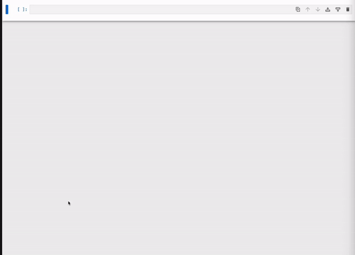

# Debug Kedro Pipeline with `%load_node` magic
The `%load_node`` magic command is a useful tool for debugging Kedro Pipelines. It generates multiple new cells in the notebook, including:

- A script to load datasets and parameters
- Import statements
- Function body


## Example with `spaceflights-pandas`
This example assumes you are working on the spaceflights-pandas project. You can follow the full tutorial using this [Spaceflights tutorial](../tutorial/spaceflights_tutorial.md).

If you don't have a working project, you can quickly create one with the following command:

```bash
kedro new --name=spaceflights-pandas --tools=none --example=yes
cd spaceflights-pandas
```


One way to perceive this is that it attempts to reproduce the context where you encountered the error.

### Why not use a debugger?
While a debugger is the preferred option when you know that you are debugging, `%load_node`` serves as a complementary feature for scenarios where:
- You need to visualize the data (this is where Jupyter shines!)
- A debugger is not available.
- The debugger has significant performance overhead.

The most common scenario where you might need this is when running a pipeline results in an unexpected error. `%load_node` allows you to inspect the data and the code, helping you identify the source of the error.
