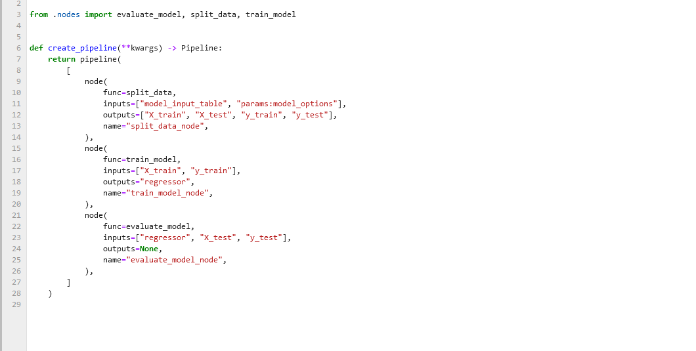
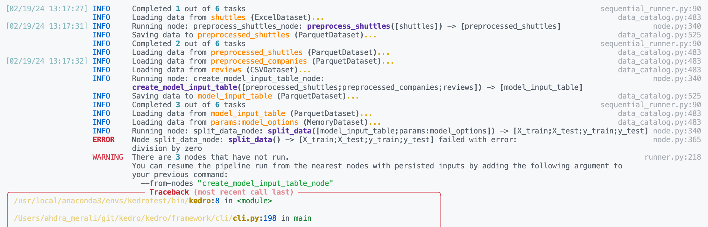

# Use a Jupyter notebook for Kedro project experiments

This page explains how to use a Jupyter notebook to explore elements of a Kedro project. It shows how to use `kedro jupyter notebook` to set up a notebook that has access to the `catalog`, `context`, `pipelines` and `session` variables of the Kedro project so you can query them.

This page also explains how to use line magic to display a Kedro-Viz visualisation of your pipeline directly in your notebook.

## Example project

The example adds a notebook to experiment with the  [`spaceflight-pandas-viz` starter](https://github.com/kedro-org/kedro-starters/tree/main/spaceflights-pandas-viz). As an alternative, you can follow the example using a different starter or just add a notebook to your own project.

We will assume the example project is called `spaceflights`, but you can call it whatever you choose.

To create a project, you can run this command:
```bash
kedro new -n spaceflights --tools=viz --example=yes
```

You can find more options of `kedro new` from [Create a new Kedro Project](../get_started/new_project.md).

## Loading the project with `kedro jupyter notebook`

Navigate to the project directory (`cd spaceflights`) and issue the following command in the terminal to launch Jupyter:

```bash
kedro jupyter notebook
```

You'll be asked if you want to opt into usage analytics on the first run of your new project. Once you've answered the question with `y` or `n`, your browser window will open with a Jupyter page that lists the folders in your project:


You can now create a new Jupyter notebook using the **New** dropdown and selecting the **Kedro (iris)** kernel:


This opens a new browser tab to display the empty notebook:


We recommend that you save your notebook in the `notebooks` folder of your Kedro project.

### What does `kedro jupyter notebook` do?

The `kedro jupyter notebook` command launches a notebook with a customised kernel that has been extended to make the following project variables available:

* `catalog` (type {py:class}`~kedro.io.DataCatalog`): [Data Catalog](../data/data_catalog.md) instance that contains all defined datasets; this is a shortcut for `context.catalog`
* `context` (type {py:class}`~kedro.framework.context.KedroContext`): Kedro project context that provides access to Kedro's library components
* `pipelines` (type `dict[str, Pipeline]`): Pipelines defined in your [pipeline registry](../nodes_and_pipelines/run_a_pipeline.md#run-a-pipeline-by-name)
* `session` (type {py:class}`~kedro.framework.session.session.KedroSession`): [Kedro session](../kedro_project_setup/session.md) that orchestrates a pipeline run

In addtion, it also runs `%load_ext kedro.ipython` automatically when you launch the notebook.

``` {note}
If the Kedro variables are not available within your Jupyter notebook, you could have a malformed configuration file or missing dependencies. The full error message is shown on the terminal used to launch `kedro jupyter notebook` or run `%load_ext kedro.ipython` in a notebook cell.
```

## Loading the project with the `kedro.ipython` extension

A quick way to explore the `catalog`, `context`, `pipelines`, and `session` variables in your project within a IPython compatible environment, such as Databricks notebooks, Google Colab, and more, is to use the `kedro.ipython` extension.
This is tool-independent and useful in situations where launching a Jupyter interactive environment is not possible. You can use the [`%load_ext` line magic](https://ipython.readthedocs.io/en/stable/config/extensions/index.html#using-extensions) to explicitly load the Kedro IPython extension:
```ipython
In [1]: %load_ext kedro.ipython
```

If you have launched your interactive environment from outside your Kedro project, you will need to run a second line magic to set the project path.
This is so that Kedro can load the `catalog`, `context`, `pipelines` and `session` variables:

```ipython
In [2]: %reload_kedro <project_root>
```
The Kedro IPython extension remembers the project path so that future calls to `%reload_kedro` do not need to specify it:

```ipython
In [1]: %load_ext kedro.ipython
In [2]: %reload_kedro <project_root>
In [3]: %reload_kedro
```

## Exploring the Kedro project in a notebook
Here are some examples of how to work with the Kedro variables. To explore the full range of attributes and methods available, see the relevant {doc}`API documentation </api/kedro>` or use the Python {py:func}`dir` function, for example `dir(catalog)`.

### `catalog`

`catalog` can be used to explore your project's [Data Catalog](../data/data_catalog.md) using methods such as {py:meth}`catalog.list <kedro.io.DataCatalog.list>`, {py:meth}`catalog.load <kedro.io.DataCatalog.load>` and {py:meth}`catalog.save <kedro.io.DataCatalog.save>`.

For example, add the following to a cell in your notebook to run `catalog.list`:

```ipython
catalog.list()
```

When you run the cell:

```ipython
[
    'companies',
    'reviews',
    'shuttles',
    'preprocessed_companies',
    'preprocessed_shuttles',
    'model_input_table',
    'regressor',
    'metrics',
    'companies_columns',
    'shuttle_passenger_capacity_plot_exp',
    'shuttle_passenger_capacity_plot_go',
    'dummy_confusion_matrix',
    'parameters',
    'params:model_options',
    'params:model_options.test_size',
    'params:model_options.random_state',
    'params:model_options.features'
]
```

#### Search datasets with regex
If you do not remember the exact name of a dataset, you can provide a regular expression to search datasets.
```ipython
catalog.list("pre*")
```

When you run the cell:

```ipython
['preprocessed_companies', 'preprocessed_shuttles']
```
Next try the following for `catalog.load`:

```ipython
catalog.load("shuttles")
```

The output:

```ipython
[06/05/24 12:50:17] INFO     Loading data from reviews (CSVDataset)...
Out[1]:

       shuttle_id  review_scores_rating  review_scores_comfort  ...  review_scores_price  number_of_reviews  reviews_per_month
0           45163                  91.0                   10.0  ...                  9.0                 26               0.77
1           49438                  96.0                   10.0  ...                  9.0                 61               0.62
2           10750                  97.0                   10.0  ...                 10.0                467               4.66
3            4146                  95.0                   10.0  ...                  9.0                318               3.22

```

Now try the following:

```ipython
catalog.load("parameters")
```
You should see this:

```ipython
INFO     Loading data from 'parameters' (MemoryDataset)...

{
    'model_options': {
        'test_size': 0.2,
        'random_state': 3,
        'features': [
            'engines',
            'passenger_capacity',
            'crew',
            'd_check_complete',
            'moon_clearance_complete',
            'iata_approved',
            'company_rating',
            'review_scores_rating'
        ]
    }
}
```

```{note}
If you enable [versioning](../data/data_catalog.md#dataset-versioning) you can load a particular version of a dataset, e.g. `catalog.load("preprocessed_shuttles", version="2024-06-05T15.08.09.255Z")`.
```

### `context`

`context` enables you to access Kedro's library components and project metadata. For example, if you add the following to a cell and run it:

```ipython
context.project_path
```
You should see output like this, according to your username and path:

```ipython
PosixPath('/Users/username/kedro_projects/spaceflights')
```

You can find out more in the API documentation of {py:class}`~kedro.framework.context.KedroContext`.

### `pipelines`

`pipelines` is a dictionary containing your project's [registered pipelines](../nodes_and_pipelines/run_a_pipeline.md#run-a-pipeline-by-name):

```ipython
pipelines
```

The output will be a listing as follows:

```ipython
{'__default__': Pipeline([
Node(create_confusion_matrix, 'companies', 'dummy_confusion_matrix', None),
Node(preprocess_companies, 'companies', ['preprocessed_companies', 'companies_columns'], 'preprocess_companies_node'),
Node(preprocess_shuttles, 'shuttles', 'preprocessed_shuttles', 'preprocess_shuttles_node'),
...
```

You can use this to explore your pipelines and the nodes they contain:

```ipython
pipelines["__default__"].all_outputs()
```
Should give the output:

```ipython
{
    'X_train',
    'regressor',
    'shuttle_passenger_capacity_plot_exp',
    'y_test',
    'model_input_table',
    'y_train',
    'X_test',
    'metrics',
    'companies_columns',
    'preprocessed_shuttles',
    'preprocessed_companies',
    'shuttle_passenger_capacity_plot_go',
    'dummy_confusion_matrix'
}
```

### `session`

`session.run` allows you to run a pipeline. With no arguments, this will run your `__default__` project pipeline sequentially, much as a call to `kedro run` from the terminal:

```ipython
session.run()
```

You can also specify the following optional arguments for `session.run`:

| Argument name   | Accepted types   | Description                                                                                                                                          |
| --------------- | ---------------- | ---------------------------------------------------------------------------------------------------------------------------------------------------- |
| `tags`          | `Iterable[str]`  | Construct the pipeline using nodes which have this tag attached. A node is included in the resulting pipeline if it contains any of those tags  |
| `runner`        | `AbstractRunner` | An instance of Kedro {py:class}`~kedro.runner.AbstractRunner`. Can be an instance of a {py:class}`~kedro.runner.ParallelRunner`          |
| `node_names`    | `Iterable[str]`  | Run nodes with specified names                                                                                                                  |
| `from_nodes`    | `Iterable[str]`  | A list of node names which should be used as a starting point                                                                                        |
| `to_nodes`      | `Iterable[str]`  | A list of node names which should be used as an end point                                                                                            |
| `from_inputs`   | `Iterable[str]`  | A list of dataset names which should be used as a starting point                                                                                     |
| `to_outputs`    | `Iterable[str]`  | A list of dataset names which should be used as an end point                                                                                         |
| `load_versions` | `Dict[str, str]` | A mapping of a dataset name to a specific dataset version (timestamp) for loading. Applies to versioned datasets                                     |
| `pipeline_name` | `str`            | Name of the modular pipeline to run. Must be one of those returned by the `register_pipelines` function in `src/<package_name>/pipeline_registry.py` |

You can execute one *successful* run per session, as there's a one-to-one mapping between a session and a run. If you wish to do more than one run, you'll have to run `%reload_kedro` line magic to get a new `session`.

## Kedro line magics

{external+ipython:doc}`Line magics <interactive/magics>` are commands that provide a concise way of performing tasks in an interactive session. Kedro provides several line magic commands to simplify working with Kedro projects in interactive environments.

### `%reload_kedro` line magic

You can use `%reload_kedro` line magic within your Jupyter notebook to reload the Kedro variables (for example, if you need to update `catalog` following changes to your Data Catalog).

You don't need to restart the kernel for the `catalog`, `context`, `pipelines` and `session` variables.

`%reload_kedro` accepts optional keyword arguments `env` and `params`. For example, to use configuration environment `prod`:

```ipython
%reload_kedro --env=prod
```

For more details, run `%reload_kedro?`.

### `%load_node` line magic

``` {note}
This is still an experimental feature and is currently only available for Jupyter Notebook (>7.0), Jupyter Lab, IPython, and VS Code Notebook. If you encounter unexpected behaviour or would like to suggest feature enhancements, add it under [this github issue](https://github.com/kedro-org/kedro/issues/3580).
```
You can load the contents of a node in your project into a series of cells using the `%load_node` line magic. To use `%load_node`, the node you want to load needs to fulfil two requirements:
- The node needs to have a name
- The node's inputs need to be persisted

The [section about creating nodes with names](../nodes_and_pipelines/nodes.md#how-to-create-a-node) explains how to ensure your node has a name. By default, Kedro saves data in memory. To persist the data, you need to [declare the dataset in the Data Catalog](../tutorial/create_a_pipeline.md#preprocessed-data-registration).

``` {note}
The node name needs to be unique within the pipeline. In the absence of a user defined name, Kedro generates one using a combination of the function name, inputs and outputs.
```

The line magic will load your node's inputs, imports, and body:

```ipython
%load_node <my-node-name>
```

<details>
<summary>Click to see an example.</summary>



</details>


To be able to access your node's inputs, make sure they are explicitly defined in your project's catalog.

You can then run the generated cells to recreate how the node would run in your pipeline. You can use this to explore your node's inputs, behaviour, and outputs in isolation, or for [debugging](#debugging-a-kedro-project-within-a-notebook).

When using this feature in Jupyter Notebook you will need to have the following requirements and minimum versions installed:
```yaml
ipylab>=1.0.0
notebook>=7.0.0
```

### `%run_viz` line magic

``` {note}
If you have not yet installed [Kedro-Viz](https://github.com/kedro-org/kedro-viz) for the project, run `pip install kedro-viz` in your terminal from within the project directory.
```

You can display an interactive visualisation of your pipeline directly in your notebook using the `%run_viz` line magic from within a cell:

```ipython
%run_viz
```


## Debugging a Kedro project within a notebook

You can use the built-in [`%debug` line magic](https://ipython.readthedocs.io/en/stable/interactive/magics.html#magic-debug) to launch an interactive debugger in your Jupyter notebook. Declare it before a single-line statement to step through the execution in debug mode. You can use the argument `--breakpoint` or `-b` to provide a breakpoint. Alternatively, use the command with no arguments after an error occurs to load the stack trace and begin debugging.

The following sequence occurs when `%debug` runs after an error occurs:

- The stack trace of the last unhandled exception loads.
- The program stops at the point where the exception occurred.
- An interactive shell where the user can navigate through the stack trace opens.

You can then inspect the value of expressions and arguments, or add breakpoints to the code.

Here is example debugging workflow after discovering a node in your pipeline is failing:
1. Inspect the logs to find the name of the failing node. We can see below the problematic node is `split_data_node`.

<details>
<summary>Click to the pipeline failure logs.</summary>



</details>

2. In your notebook, run `%load_node <name-of-failing-node>` to load the contents of the problematic node with the [`%load_node` line magic](#kedro-line-magics).
3. Run the populated cells to examine the node's behaviour in isolation.
4. If the node fails in error, use `%debug` to launch an interactive debugging session in your notebook.

<details>
<summary>Click to see this workflow in action.</summary>


</details>

``` {note}
The `%load_node` line magic is currently only available for Jupyter Notebook (>7.0) and Jupyter Lab. If you are working within a different interactive environment, manually copy over the contents from your project files instead of using `%load_node` to automatically populate your node's contents, and continue from step 2.
```

---

You can also set up the debugger to run automatically when an exception occurs by using the [`%pdb` line magic](https://ipython.readthedocs.io/en/stable/interactive/magics.html#magic-pdb). This automatic behaviour can be enabled with `%pdb 1` or `%pdb on` before executing a program, and disabled with `%pdb 0` or `%pdb off`.

<details>
<summary>Click to see an example.</summary>

 

</details>

---

Some examples of the possible commands that can be used to interact with the ipdb shell are as follows:

| Command           | Description                                           |
| ----------------- | ----------------------------------------------------- |
| `list`            | Show the current location in the file                 |
| `h(elp)`          | Show a list of commands, or find help on a specific command |
| `q(uit)`          | Quit the debugger and the program                     |
| `c(ontinue)`      | Quit the debugger, continue in the program             |
| `n(ext)`          | Go to the next step of the program                     |
| `<enter>`         | Repeat the previous command                            |
| `p(rint)`         | Print variables                                       |
| `s(tep)`          | Step into a subroutine                                |
| `r(eturn)`        | Return out of a subroutine                            |
| `b(reak)`         | Insert a breakpoint                                   |
| `a(rgs)`          | Print the argument list of the current function        |

For more information, use the `help` command in the debugger, or take at the [ipdb repository](https://github.com/gotcha/ipdb) for guidance.

## Useful to know (for advanced users)
Each Kedro project has its own Jupyter kernel so you can switch between Kedro projects from a single Jupyter instance by selecting the appropriate kernel.

To ensure that a Jupyter kernel always points to the correct Python executable, if one already exists with the same name `kedro_<package_name>`, then it is replaced.

You can use the `jupyter kernelspec` set of commands to manage your Jupyter kernels. For example, to remove a kernel, run `jupyter kernelspec remove <kernel_name>`.


### IPython, JupyterLab and other Jupyter clients

You can also connect an IPython shell to a Kedro project kernel as follows:

```bash
kedro ipython
```

The command launches an IPython shell with the extension already loaded and is the same command as  `ipython --ext kedro.ipython`. You first saw this in action in the [spaceflights tutorial](../tutorial/set_up_data.md#test-that-kedro-can-load-the-data).


Similarly, the following creates a custom Jupyter kernel that automatically loads the extension and launches JupyterLab with this kernel selected:

```bash
kedro jupyter lab
```

You can use any other Jupyter client to connect to a Kedro project kernel such as the [Qt Console](https://qtconsole.readthedocs.io/), which can be launched using the `spaceflights` kernel as follows:

```bash
jupyter qtconsole --kernel=spaceflights
```

This will automatically load the Kedro IPython in a console that supports graphical features such as embedded figures:

