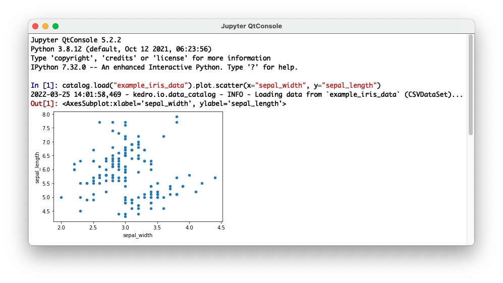

# Kedro and Jupyter Notebooks

This page explains how best to combine Kedro and Jupyter Notebook development and illustrates with an example Notebook that has access to the `catalog`, `context`, `pipelines` and `session` variables for a Kedro project.

## A custom Kedro kernel

Kedro offers a command (`kedro jupyter notebook`) to create a Jupyter kernel named `kedro_<package_name>` that is almost identical to the [default IPython kernel](https://ipython.readthedocs.io/en/stable/install/kernel_install.html) but with a slightly customised [kernel specification](https://jupyter-client.readthedocs.io/en/stable/kernels.html#kernel-specs).

The custom kernel automatically loads `kedro.ipython`, which is an [IPython extension](https://ipython.readthedocs.io/en/stable/config/extensions/) that launches a [Kedro session](../kedro_project_setup/session.md) and makes the following Kedro variables available:

* `catalog` (type `DataCatalog`): [Data Catalog](../data/data_catalog.md) instance that contains all defined datasets; this is a shortcut for `context.catalog`
* `context` (type `KedroContext`): Kedro project context that provides access to Kedro's library components
* `pipelines` (type `Dict[str, Pipeline]`): Pipelines defined in your [pipeline registry](../nodes_and_pipelines/run_a_pipeline.md#run-a-pipeline-by-name)
* `session` (type `KedroSession`): [Kedro session](../kedro_project_setup/session.md) that orchestrates a pipeline run


## Iris dataset example

Create a sample Kedro project with the [`pandas-iris` starter](https://github.com/kedro-org/kedro-starters/tree/main/pandas-iris) as we showed in the [get started documentation](../get_started/new_project.md#create-a-new-project-containing-example-code):

```bash
kedro new --starter=pandas-iris
```

We will assume you call the project `iris`, but you can call it whatever you choose.

Navigate to the project directory and issue the following command in the terminal to launch Jupyter:

```bash
kedro jupyter notebook
```

Your browser window will open, and you can then create a new Jupyter Notebook using the dropdown and selecting the `Kedro (<project_name>)` kernel.


We recommend that you store your Notebooks in the `notebooks` folder of your Kedro project.

We will now give some examples of how to work with the Kedro variables. To explore the full range of attributes and methods available, you might like to consult the relevant [API documentation](/kedro) or use the [Python `dir` function](https://docs.python.org/3/library/functions.html#dir) (e.g. `dir(catalog)`).

``` {note}
If the Kedro variables are not available within your Jupyter Notebook, you could have a malformed configuration file or missing dependencies. The full error message is shown on the terminal used to launch `kedro jupyter notebook`.
```

### `catalog`

`catalog` can be used to explore your [Data Catalog](../data/data_catalog.md), including parameters. Useful methods include `catalog.list`, `catalog.load` and `catalog.save`. For example, add the following to a cell in your Notebook:

```ipython
catalog.list()
```

When you run the cell:

```ipython
['example_iris_data',
 'parameters',
 'params:example_test_data_ratio',
 'params:example_num_train_iter',
 'params:example_learning_rate'
]
```
Next try the following:

```ipython
catalog.load("example_iris_data")
```

The output:

```ipython
INFO     Loading data from 'example_iris_data' (CSVDataSet)...

     sepal_length  sepal_width  petal_length  petal_width    species
0             5.1          3.5           1.4          0.2     setosa
1             4.9          3.0           1.4          0.2     setosa
2             4.7          3.2           1.3          0.2     setosa
3             4.6          3.1           1.5          0.2     setosa
4             5.0          3.6           1.4          0.2     setosa
..            ...          ...           ...          ...        ...
145           6.7          3.0           5.2          2.3  virginica
146           6.3          2.5           5.0          1.9  virginica
147           6.5          3.0           5.2          2.0  virginica
148           6.2          3.4           5.4          2.3  virginica
149           5.9          3.0           5.1          1.8  virginica
```

Finally, try the following:

```ipython
catalog.load("parameters")
```
You should see the following:

```ipython
INFO     Loading data from 'parameters' (MemoryDataSet)...

{'example_test_data_ratio': 0.2,
 'example_num_train_iter': 10000,
 'example_learning_rate': 0.01}
```

```{note}
If you enable [versioning](../data/data_catalog.md#dataset-versioning) you can load a particular version of a dataset, e.g. `catalog.load("example_train_x", version="2021-12-13T15.08.09.255Z")`.
```

### `context`

`context` enables you to access Kedro's library components and project metadata. For example, if you add the following to a cell and run it:

```ipython
context.project_path
```
You should see output similar to the following, according to your username and path:

```ipython
PosixPath('/Users/username/kedro_projects/iris')
```

You can find out more about the `context` in the [API documentation](/kedro.framework.context.KedroContext).

### `pipelines`

`pipelines` is a dictionary containing your project's [registered pipelines](../nodes_and_pipelines/run_a_pipeline.md#run-a-pipeline-by-name):

```ipython
pipelines
```

The output will be a listing as follows:

```ipython
{'__default__': Pipeline([
Node(split_data, ['example_iris_data', 'parameters'], ['X_train', 'X_test', 'y_train', 'y_test'], 'split'),
Node(make_predictions, ['X_train', 'X_test', 'y_train'], 'y_pred', 'make_predictions'),
Node(report_accuracy, ['y_pred', 'y_test'], None, 'report_accuracy')
])}
```

You can use this to explore your pipelines and the nodes they contain:

```ipython
pipelines["__default__"].all_outputs()
```
Should give the output:

```ipython
{'y_pred', 'X_test', 'y_train', 'X_train', 'y_test'}
```

### `session`

`session.run` allows you to run a pipeline. With no arguments, this will run your `__default__` project pipeline sequentially, much as a call to `kedro run` from the terminal:

```ipython
session.run()
```

```{note}
You can only execute one *successful* run per session, as there's a one-to-one mapping between a session and a run. If you wish to do multiple runs, you'll have to run `%reload_kedro` to obtain a new `session` (see below).
```

You can also specify the following optional arguments for `session.run`:

| Argument name   | Accepted types   | Description                                                                                                                                          |
| --------------- | ---------------- | ---------------------------------------------------------------------------------------------------------------------------------------------------- |
| `tags`          | `Iterable[str]`  | Construct the pipeline using only nodes which have this tag attached. A node is included in the resulting pipeline if it contains any of those tags  |
| `runner`        | `AbstractRunner` | An instance of Kedro [AbstractRunner](/kedro.runner.AbstractRunner). Can be an instance of a [ParallelRunner](/kedro.runner.ParallelRunner)          |
| `node_names`    | `Iterable[str]`  | Run only nodes with specified names                                                                                                                  |
| `from_nodes`    | `Iterable[str]`  | A list of node names which should be used as a starting point                                                                                        |
| `to_nodes`      | `Iterable[str]`  | A list of node names which should be used as an end point                                                                                            |
| `from_inputs`   | `Iterable[str]`  | A list of dataset names which should be used as a starting point                                                                                     |
| `to_outputs`    | `Iterable[str]`  | A list of dataset names which should be used as an end point                                                                                         |
| `load_versions` | `Dict[str, str]` | A mapping of a dataset name to a specific dataset version (timestamp) for loading. Applies to versioned datasets only                                |
| `pipeline_name` | `str`            | Name of the modular pipeline to run. Must be one of those returned by the `register_pipelines` function in `src/<package_name>/pipeline_registry.py` |

## `%reload_kedro` line magic

You can use `%reload_kedro` [line magic](https://ipython.readthedocs.io/en/stable/interactive/magics.html) within your Jupyter Notebook to reload the Kedro variables (for example, if you need to update `catalog` following changes to your Data Catalog).

You don't need to restart the kernel to reload the Kedro IPython extension and refresh the `catalog`, `context`, `pipelines` and `session` variables.

`%reload_kedro` accepts optional keyword arguments `env` and `params`. For example, to use configuration environment `prod`:

```ipython
%reload_kedro --env=prod
```

For more details, run `%reload_kedro?`.

## `%run_viz` line magic

If you have [Kedro-Viz](https://github.com/kedro-org/kedro-viz) installed for the project you can display an interactive visualisation of your pipeline directly in your Notebook using the [line magic](https://ipython.readthedocs.io/en/stable/interactive/magics.html) `%run_viz`.


## Convert functions from Jupyter Notebooks into Kedro nodes

If you are writing experimental code in your Notebook and later want to convert functions you've written to Kedro nodes, you can do this using tags.

Say you have the following code in your Notebook:

```ipython
def some_action():
    print("This function came from `notebooks/my_notebook.ipynb`")
```

1. Enable tags toolbar: `View` menu -> `Cell Toolbar` -> `Tags`


2. Add the `node` tag to the cell containing your function


```{note}
The Notebook can contain multiple functions tagged as `node`, each of them will be exported into the resulting Python file
```

3. Save your Jupyter Notebook to `notebooks/my_notebook.ipynb`
4. From your terminal, run `kedro jupyter convert notebooks/my_notebook.ipynb` from the Kedro project directory. The output is a Python file `src/<package_name>/nodes/my_notebook.py` containing the `some_action` function definition
5. The `some_action` function can now be used in your Kedro pipelines

## Useful to know...
Each Kedro project has its own Jupyter kernel so you can switch between multiple Kedro projects from a single Jupyter instance simply by selecting the appropriate kernel.

If a Jupyter kernel with the name `kedro_<package_name>` already exists then it is replaced. This ensures that the kernel always points to the correct Python executable. For example, if you change conda environment in a Kedro project then you should re-run `kedro jupyter notebook` to replace the kernel specification with one that points to the new environment.

You can use the `jupyter kernelspec` set of commands to manage your Jupyter kernels. For example, to remove a kernel, run `jupyter kernelspec remove <kernel_name>`.

### Managed services

If you work within a managed Jupyter service such as a Databricks Notebook you may be unable to execute `kedro jupyter notebook`. You can explicitly load the Kedro IPython extension with the `%load_ext` line magic:

```ipython
In [1]: %load_ext kedro.ipython
```

If you launch your Jupyter instance from outside your Kedro project, you will need to run a second line magic to set the project path so that Kedro can load the `catalog`, `context`, `pipelines` and `session` variables:

```ipython
In [2]: %reload_kedro <project_root>
```
The Kedro IPython extension remembers the project path so that subsequent calls to `%reload_kedro` do not need to specify it:

```ipython
In [1]: %load_ext kedro.ipython
In [2]: %reload_kedro <project_root>
In [3]: %reload_kedro
```

### IPython, JupyterLab and other Jupyter clients

You can also connect an IPython shell to a Kedro project kernel as follows:

```bash
kedro ipython
```

The command launches an IPython shell with the extension already loaded and is equivalent to the command `ipython --ext kedro.ipython`. You first saw this in action in the [spaceflights tutorial](../tutorial/set_up_data.md#test-that-kedro-can-load-the-data).


Similarly, the following creates a custom Jupyter kernel that automatically loads the extension and launches JupyterLab with this kernel selected:

```bash
kedro jupyter lab
```

You can use any other Jupyter client to connect to a Kedro project kernel such as the [Qt Console](https://qtconsole.readthedocs.io/), which can be launched using the `kedro_iris` kernel as follows:

```bash
jupyter qtconsole --kernel=kedro_iris
```

This will automatically load the Kedro IPython in a console that supports graphical features such as embedded figures:



## Find out more

We recommend the following:

* [Power is nothing without control: Don’t break up with Jupyter Notebooks. Just use Kedro too!](https://towardsdatascience.com/power-is-nothing-without-control-aa43523745b6)

* [Two Tricks to Optimize your Kedro Jupyter Flow](https://youtu.be/ZHIqXJEp0-w)

* [Handling Custom Jupyter Data Sources](https://youtu.be/dRnCovp1GRQ)

* [Why transition from vanilla Jupyter Notebooks to Kedro?](https://www.youtube.com/watch?v=JLTYNPoK7nw&ab_channel=PyConUS)
