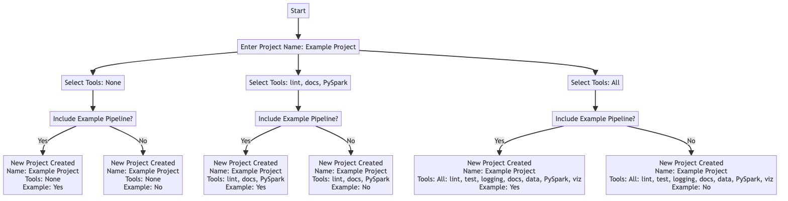

# Tools to customise a new Kedro project

There are several ways to customise your new project with the tools and example code:

* [Specify tools using inputs to `kedro new`](#specify-tools-as-inputs-to-kedro-new)
* [Specify tools using YAML configuration](#specify-tools-using-yaml-configuration)

There is a [flowchart to illustrate the choices available](#flowchart-illustration) at the bottom of the page.

## Specify tools as inputs to `kedro new`

Navigate to the directory in which you would like to create your new Kedro project, and run the following command:

```bash
kedro new
```

This will start the new project creation workflow.

``` {note}
You can also add flags to `kedro new` to skip some or all of the steps in the project creation workflow to skip queries about how you want to customise the project. The flags are described below.
```

### Project name
The first prompt asks you to input a project name.

To skip this step and name the project directly, add it to `kedro new` as follows:

```bash
kedro new --name=spaceflights
```

### Tools
You are then asked to select which tools to include. Choose from the list using comma separated values `(1,2,4)`, ranges of values `(1-3,5-7)`, a combination of the two `(1,3-5,7)`, or the key words `all` or `none`. Skipping the prompt by entering no value will result in the default selection of `none`.

[Further information about each of the tools is described below](#kedro-tools).


```
Project Tools
=============
These optional tools can help you apply software engineering best practices.
To skip this step in future use --tools
To find out more: https://docs.kedro.org/en/stable/starters/new_project_tools.html

Tools
1) Lint: Basic linting with Black and Ruff
2) Test: Basic testing with pytest
3) Log: Additional, environment-specific logging options
4) Docs: A Sphinx documentation setup
5) Data Folder: A folder structure for data management
6) PySpark: Configuration for working with PySpark
7) Kedro-Viz: Kedro's native visualisation tool

Which tools would you like to include in your project? [1-7/1,3/all/none]:
 [none]:
```

A list of available tools can also be accessed by running `kedro new --help`

```
...
-t, --tools TEXT    Select which tools you'd like to include. By default,
                      none are included.

                      Tools

                      1) Linting: Provides a basic linting setup with Black
                      and Ruff

                      2) Testing: Provides basic testing setup with pytest

                      3) Custom Logging: Provides more logging options

                      4) Documentation: Basic documentation setup with Sphinx

                      5) Data Structure: Provides a directory structure for
                      storing data

                      6) PySpark: Provides set up configuration for working
                      with PySpark

                      7) Kedro Viz: Provides Kedro's native visualisation tool

                      Example usage:

                      kedro new --tools=lint,test,log,docs,data,pyspark,viz
                      (or any subset of these options)

                      kedro new --tools=all

                      kedro new --tools=none
...
```
### Shortcut

To skip this step and select tools directly, add the tools selection to `kedro new` as follows:

```bash
kedro new --tools=<your tool selection>
```

To specify your desired tools you must provide them by name as a comma separated list, for example `--tools=lint,test,viz`. The following tools are available for selection: `lint`, `test`, `log`, `docs`, `data`, `pyspark`, and `viz`.

### Example code
In the final step you are asked whether you want to populate the project with an example spaceflights starter pipeline. If you select `yes`, the example code included depends upon your previous choice of tools, as follows:

* [Default spaceflights starter (`spaceflights-pandas`)](https://github.com/kedro-org/kedro-starters/tree/main/spaceflights-pandas): Added if you selected any combination of linting, testing, custom logging, documentation, and data structure, unless you also selected PySpark or Kedro Viz.
* [PySpark spaceflights starter (`spaceflights-pyspark`)](https://github.com/kedro-org/kedro-starters/tree/main/spaceflights-pyspark): Added if you selected PySpark with any other tools, unless you also selected Kedro Viz.
* [Kedro Viz spaceflights starter (`spaceflights-pandas-viz`)](https://github.com/kedro-org/kedro-starters/tree/main/spaceflights-pandas-viz): Added if Kedro Viz was one of your tools choices, unless you also selected PySpark.
* [Full feature spaceflights starter (`spaceflights-pyspark-viz`)](https://github.com/kedro-org/kedro-starters/tree/main/spaceflights-pyspark-viz): Added if you selected all available tools, including PySpark and Kedro Viz.

Each starter example is tailored to demonstrate the capabilities and integrations of the selected tools, offering a practical insight into how they can be utilised in your project.

### Shortcut

To skip this step and make a choice of example code directly, add the your preference to `kedro new` as follows:

```bash
kedro new --example=y
```

## Specify tools using YAML configuration

As an alternative to the interactive project creation workflow, you can also supply values to `kedro new` by providing a YML configuration file to your `kedro new` command. Consider the following file:

```yaml
# config.yml

"project_name":
    "My Project"

"repo_name":
    "my-project"

"python_package":
    "my project"

"tools":
    "2-6"

"example_pipeline":
    "y"
```

To create a new project using the file to supply details to `kedro new`, run the following command:

```bash
kedro new --config=<path/to/config.yml>
```

``` {note}
Note: When using a configuration file to create a new project, you must provide values for the project name, repository name, and package names. Specifying your tools selection is optional, omitting them results in the default selection of `none`.
```

## Kedro tools

Tools in Kedro serve as modular functionalities that enhance a foundational project template. They provide a means to tailor your Kedro project to meet your unique requirements. When creating a new project, you may select one or more of the available tools, or none at all.

The available tools include: [linting](#linting), [testing](#testing), [custom logging](#custom-logging), [documentation](#documentation), [data structure](#data-structure), [PySpark](#pyspark), and [Kedro-Viz](#kedro-viz).

### Linting

The Kedro linting tool introduces [`black`](https://black.readthedocs.io/en/stable/index.html) and [`ruff`](https://docs.astral.sh/ruff/) as dependencies in your new project's requirements. After project creation, make sure these are installed by running the following command from the project root:

```bash
pip install -r requirements.txt
```

The linting tool will configure `ruff` with the following settings by default:
```toml
#pyproject.toml

[tool.ruff]
line-length = 88
show-fixes = true
select = [
    "F",   # Pyflakes
    "W",   # pycodestyle
    "E",   # pycodestyle
    "I",   # isort
    "UP",  # pyupgrade
    "PL",  # Pylint
    "T201", # Print Statement
]
ignore = ["E501"]  # Black takes care of line-too-long
```

With these installed, you can then make use of the following commands to format and lint your code:

```bash
ruff format path/to/project/root
ruff check path/to/project/root
```

Though it has no impact on how your code works, linting is important for code quality because improves consistency, readability, debugging, and maintainability. To learn more about linting your Kedro projects, check our [linting documentation](../development/linting.md).

### Testing

This tool introduces the `tests` directory to the new project's structure, containing the file `test_run.py` with an example unit test. [`Pytest`](https://docs.pytest.org/en/7.4.x/) is added as a dependency in your new project's requirements. After project creation, make sure it is installed by running the following command from your project root:

```bash
pip install -r requirements.txt
```

The tool leverages `pytest` with the following configuration:

```toml
[tool.pytest.ini_options]
addopts = """
--cov-report term-missing \
--cov src/{{ cookiecutter.python_package }} -ra"""

[tool.coverage.report]
fail_under = 0
show_missing = true
exclude_lines = ["pragma: no cover", "raise NotImplementedError"]
```

To run your tests, use the following command:
```bash
pytest path/to/your/project/root/tests
```

Kedro promotes the use of unit tests to achieve high code quality and maintainability in your projects. To read more about unit testing with Kedro, check our [testing documentation](../development/automated_testing.md#set-up-automated-testing-with-pytest)

### Custom logging

Selecting the custom logging tool introduces the file `logging.yml` to your project's `conf` directory. This tool allows you to customise your logging configuration instead of using [Kedro's default logging configuration](https://github.com/kedro-org/kedro/blob/main/kedro/framework/project/default_logging.yml). The populated `conf/logging.yml` provides two additional logging handlers: `console` and `info_file_handler`, as well as `rich` that is available in the default configuration, though only `info_file_handler` and `rich` are used.

To use this provided logging configuration, remember to set the `KEDRO_LOGGING_CONFIG` environment variable to point to `logging.yml` by naviagting to your project root and running the following command:

```bash
export KEDRO_LOGGING_CONFIG=conf/logging.yml
```

To learn more about using logging in your project, or modifying the logging configuration, take a look at our [logging documentation](../logging/index.md).

### Documentation

Including the Documentation tool adds a `docs` directory to your project structure and includes the Sphinx setup files, `conf.py` and `index.rst`, with some added features such as auto generation of HTML documentation.
The aim of this tool reflects Kedro's commitment to best practices in understanding code and facilitating collaboration by helping you create and maintain guides and API docs.

If you did not initially select `docs` and want to implement it later you can do so by following the [official documentation](https://docs.kedro.org/en/stable/tutorial/package_a_project.html#add-documentation-to-a-kedro-project-if-you-have-not-selected-docs-tool) for guidance on adding documentation to a Kedro project.

### Data structure

The Data Structure tool provides a local standardised folder hierarchy for your project data, which includes predefined folders such as raw, intermediate, and processed data, as determined by [data engineering convention](https://docs.kedro.org/en/stable/faq/faq.html#what-is-data-engineering-convention).
This is crucial if you want to include example pipelines during the creation of your project as it can not be omitted from the tool selections.
Kedro's capabilities extend far beyond local data storage. Kedro seamlessly integrates with Data Lakes and various databases through fsspec URIs, catering to the needs of professional teams that store their data in blob/object storage or databases.
We believe a well-organised data structure is key to efficient data management, allowing for scalable and maintainable data pipelines.
You can learn more about Kedro's recommended [project directory structure](https://docs.kedro.org/en/stable/get_started/kedro_concepts.html#kedro-project-directory-structure).

### PySpark

The `PySpark` tool modifies the project's `requirements.txt` to include PySpark dependencies and adjusts the project setup for Spark jobs, this will allow you to process datasets using Apache Spark for scalable data processing.
PySpark aligns with Kedro's scalability principle, as it provides data processing capabilities for large datasets.
See the [PySpark integration documentation](https://docs.kedro.org/en/stable/integrations/pyspark_integration.html) for more information on setup and usage.

### Kedro Viz

The `viz` tool will add visualisation to your project by including Kedro-Viz, which creates an interactive web-app to visualise your pipelines allowing for an intuitive understanding of data on your DAG.
In addition, `viz` will also add setup for experiment tracking and plotting datasets.
See the [Kedro-Viz documentation](https://docs.kedro.org/projects/kedro-viz/en/stable/index.html) for more information on using this tool.

## Flowchart illustration

Here is a flowchart to help illustrate some example choice of tools you can select:



% Mermaid code, see https://github.com/kedro-org/kedro/wiki/Render-Mermaid-diagrams
% flowchart TD
%     A[Start] --> B[Enter Project Name: Example Project];
%     B --> C3[Select Tools: None];
%     B --> C1[Select Tools: lint, docs, PySpark];
%     B --> C2[Select Tools: All];
%
%     C1 --> D1[Include Example Pipeline?];
%     C2 --> D2[Include Example Pipeline?];
%     C3 --> D3[Include Example Pipeline?];
%
%     D1 -->|Yes| E1[New Project Created\nName: Example Project\nTools: lint, docs, PySpark\nExample: Yes];
%     D1 -->|No| E2[New Project Created\nName: Example Project\nTools: lint, docs, PySpark\nExample: No];
%
%     D2 -->|Yes| F1[New Project Created\nName: Example Project\nTools: All: lint, test, logging, docs, data, PySpark, viz \nExample: Yes];
%     D2 -->|No| F2[New Project Created\nName: Example Project\nTools: All: lint, test, logging, docs, data, PySpark, viz \nExample: No];
%
%     D3 -->|Yes| G1[New Project Created\nName: Example Project\nTools: None\nExample: Yes];
%     D3 -->|No| G2[New Project Created\nName: Example Project\nTools: None\nExample: No];
