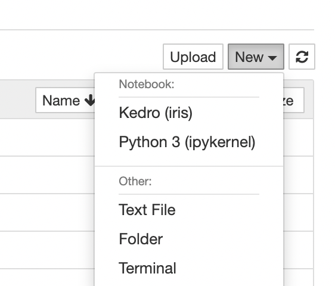
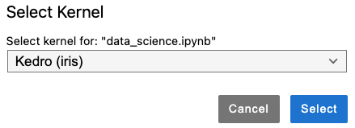
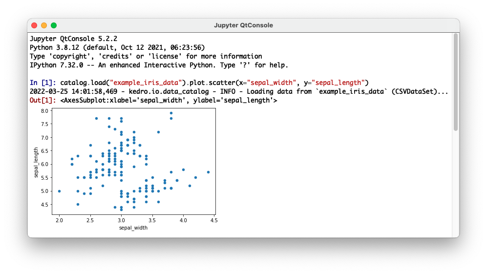
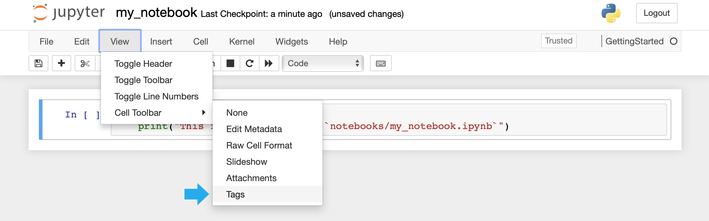
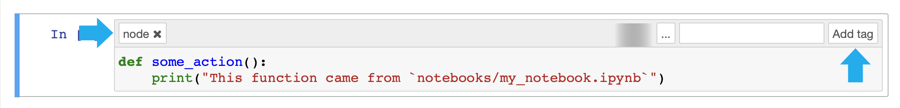

# Use Kedro with IPython and Jupyter

This page demonstrates how to use Kedro with IPython, Jupyter Notebook and JupyterLab. We also recommend [a video by Data Engineer One](https://www.youtube.com/watch?v=dRnCovp1GRQ&t=50s&ab_channel=DataEngineerOne) and [a PyCon presentation by Yetunde Dada](https://www.youtube.com/watch?v=JLTYNPoK7nw&ab_channel=PyConUS) that explain the transition from the use of vanilla Jupyter Notebooks to Kedro.

<iframe width="560" height="315" style="max-width: 100%" src="https://www.youtube.com/embed/dRnCovp1GRQ" frameborder="0" allow="accelerometer; autoplay; clipboard-write; encrypted-media; gyroscope; picture-in-picture" allowfullscreen></iframe>

## Why use a Notebook?
There are reasons why you may want to use a Notebook, although in general, the principles behind Kedro would discourage their use because they have some [drawbacks when used to create production or reproducible code](https://towardsdatascience.com/5-reasons-why-you-should-switch-from-jupyter-notebook-to-scripts-cb3535ba9c95). However, there are occasions when you'd want to put some code into a Notebook, for example:

* To conduct exploratory data analysis
* For experimentation as you create new Python functions (that could become Kedro nodes)
* As a tool for reporting and presentations

## Kedro IPython extension

The recommended way to interact with Kedro in IPython and Jupyter is through the Kedro [IPython extension](https://ipython.readthedocs.io/en/stable/config/extensions/index.html), `kedro.extras.extensions.ipython`. An [IPython extension](https://ipython.readthedocs.io/en/stable/config/extensions/) is an importable Python module that has a couple of special functions to load and unload it.

The Kedro IPython extension launches a [Kedro session](../kedro_project_setup/session.md) and makes available the useful Kedro variables `catalog`, `context`, `pipelines` and `session`. It also provides the `%reload_kedro`  [line magic](https://ipython.readthedocs.io/en/stable/interactive/magics.html) that reloads these variables (for example, if you need to update `catalog` following changes to your Data Catalog).

The simplest way to make use of the Kedro IPython extension is through the following commands:
* `kedro ipython`. This launches an IPython shell with the extension already loaded and is equivalent to the command `ipython --ext kedro.extras.extensions.ipython`.
* `kedro jupyter notebook`. This creates a custom Jupyter kernel that automatically loads the extension and launches Jupyter Notebook with this kernel selected.
* `kedro jupyter lab`. This creates a custom Jupyter kernel that automatically loads the extension and launches JupyterLab with this kernel selected.

Running any of the above from within your Kedro project will make the `catalog`, `context`, `pipelines` and `session` variables immediately accessible to you.

### Managed Jupyter instances

If the above commands are not available to you (e.g. you work in a managed Jupyter service such as a Databricks Notebook) then equivalent behaviour can be achieved by explicitly loading the Kedro IPython extension with the `%load_ext` line magic:
```ipython
In [1]: %load_ext kedro.extras.extensions.ipython
```

If your IPython or Jupyter instance was launched from outside your Kedro project then you will need to run a second line magic to set the project path so that Kedro can load the `catalog`, `context`, `pipelines` and `session` variables:
```ipython
In [2]: %reload_kedro <path_to_project_root>
```
The Kedro IPython extension remembers the project path so that subsequent calls to `%reload_kedro` do not need to specify it:

```ipython
In [1]: %load_ext kedro.extras.extensions.ipython
In [2]: %reload_kedro <path_to_project_root>
In [3]: %reload_kedro
```

```{note}
If you want to pass arguments to the `reload_kedro` line magic, e.g. to specify a configuration environment, you should call it as a normal Python function (`reload_kedro(env=env, extra_params=extra_params)`) rather than using `%reload_kedro` in a Notebook cell (`%reload_kedro(extra_params=extra_params)` wouldn't work). You might have to call `%automagic False` beforehand to make this work.
```

## Kedro variables: `catalog`, `context`, `pipelines` and `session`

The Kedro IPython extension makes the following variables available in your IPython or Jupyter session:

* `catalog` (type `DataCatalog`): [Data Catalog](../data/data_catalog.md) instance that contains all defined datasets; this is a shortcut for `context.catalog`
* `context` (type `KedroContext`): Kedro project context that provides access to Kedro's library components
* `pipelines` (type `Dict[str, Pipeline]`): Pipelines defined in your [pipeline registry](../nodes_and_pipelines/run_a_pipeline.md#run-a-pipeline-by-name)
* `session` (type `KedroSession`): [Kedro session](../kedro_project_setup/session.md) that orchestrates a pipeline run

We will now give some examples of how these variables can be used in the [Iris example project](../get_started/example_project.md). To explore the full range of attributes and methods available, you might like to consult the relevant [API documentation](/kedro) or use the [Python `dir` function](https://docs.python.org/3/library/functions.html#dir) (e.g. `dir(catalog)`).

### `catalog`

`catalog` can be used to explore your [Data Catalog](../data/data_catalog.md), including parameters. Useful methods include `catalog.list`, `catalog.load` and `catalog.save`. For example:

```ipython
In [1]: catalog.list()
Out[1]:
['example_iris_data',
 'parameters',
 'params:example_test_data_ratio',
 'params:example_num_train_iter',
 'params:example_learning_rate']
```

```ipython
In [2]: catalog.load("example_iris_data")
Out[2]:
     sepal_length  sepal_width  petal_length  petal_width    species
0             5.1          3.5           1.4          0.2     setosa
1             4.9          3.0           1.4          0.2     setosa
2             4.7          3.2           1.3          0.2     setosa
3             4.6          3.1           1.5          0.2     setosa
4             5.0          3.6           1.4          0.2     setosa
..            ...          ...           ...          ...        ...
145           6.7          3.0           5.2          2.3  virginica
146           6.3          2.5           5.0          1.9  virginica
147           6.5          3.0           5.2          2.0  virginica
148           6.2          3.4           5.4          2.3  virginica
149           5.9          3.0           5.1          1.8  virginica
```

```ipython
In [3]: catalog.load("parameters")
Out[3]:
{'example_test_data_ratio': 0.2,
 'example_num_train_iter': 10000,
 'example_learning_rate': 0.01}
```

```{note}
If you enable [versioning](../data/data_catalog.md#version-datasets-and-ml-models) then you can load a particular version of a dataset, e.g. `catalog.load("example_train_x", version="2021-12-13T15.08.09.255Z")`.
```

### `context`

`context` enables you to access Kedro's library components and project metadata. For example:

```ipython
In [1]: context.project_path
Out[1]: PosixPath('/Users/username/kedro_projects/iris')
```

### `pipelines`

`pipelines` is a dictionary containing your project's [registered pipelines](../nodes_and_pipelines/run_a_pipeline.md#run-a-pipeline-by-name):

```ipython
In [1]: pipelines
Out[1]:
{'de': Pipeline([
Node(split_data, ['example_iris_data', 'params:example_test_data_ratio'], {'train_x': 'example_train_x', 'train_y': 'example_train_y', 'test_x': 'example_test_x', 'test_y': 'example_test_y'}, 'split')
]), 'ds': Pipeline([
Node(train_model, ['example_train_x', 'example_train_y', 'parameters'], 'example_model', 'train'),
Node(predict, {'model': 'example_model', 'test_x': 'example_test_x'}, 'example_predictions', 'predict'),
Node(report_accuracy, ['example_predictions', 'example_test_y'], None, 'report')
]), '__default__': Pipeline([
Node(split_data, ['example_iris_data', 'params:example_test_data_ratio'], {'train_x': 'example_train_x', 'train_y': 'example_train_y', 'test_x': 'example_test_x', 'test_y': 'example_test_y'}, 'split'),
Node(train_model, ['example_train_x', 'example_train_y', 'parameters'], 'example_model', 'train'),
Node(predict, {'model': 'example_model', 'test_x': 'example_test_x'}, 'example_predictions', 'predict'),
Node(report_accuracy, ['example_predictions', 'example_test_y'], None, 'report')
])}
```

This can be very useful for exploring your pipelines and the nodes they contain:

```ipython
In [2]: pipelines["__default__"].all_outputs()
Out[2]:
{'example_model',
 'example_predictions',
 'example_test_x',
 'example_test_y',
 'example_train_x',
 'example_train_y'}

In [3]: [node.name for node in pipelines["__default__"].nodes]
Out[3]: ['split', 'train', 'predict', 'report']
```

### `session`

`session.run` allows you to run a pipeline. With no arguments, this will run your `__default__` project pipeline in a sequential manner:

```
In [1]: session.run()
2022-03-25 11:20:48,900 - kedro.framework.session.session - INFO - ** Kedro project iris
2022-03-25 11:20:48,911 - kedro.io.data_catalog - INFO - Loading data from `example_iris_data` (CSVDataSet)...
2022-03-25 11:20:48,915 - kedro.io.data_catalog - INFO - Loading data from `params:example_test_data_ratio` (MemoryDataSet)...
2022-03-25 11:20:48,915 - kedro.pipeline.node - INFO - Running node: split: split_data([example_iris_data,params:example_test_data_ratio]) -> [example_train_x,example_train_y,example_test_x,example_test_y]
...
2022-03-25 11:20:49,314 - kedro.runner.sequential_runner - INFO - Completed 4 out of 4 tasks
2022-03-25 11:20:49,314 - kedro.runner.sequential_runner - INFO - Pipeline execution completed successfully.
Out[1]: {}
```

```{note}
You can only execute one *successful* run per session, as there's a one-to-one mapping between a session and a run. If you wish to do multiple runs, you'll have to run `%reload_kedro` to obtain a new `session`.
```

You can also specify the following optional arguments for `session.run`:

| Argument name   | Accepted types   | Description                                                                                                                                         |
| --------------- | ---------------- | --------------------------------------------------------------------------------------------------------------------------------------------------- |
| `tags`          | `Iterable[str]`  | Construct the pipeline using only nodes which have this tag attached. A node is included in the resulting pipeline if it contains any of those tags |
| `runner`        | `AbstractRunner` | An instance of Kedro [AbstractRunner](/kedro.runner.AbstractRunner); can be an instance of a [ParallelRunner](/kedro.runner.ParallelRunner)         |
| `node_names`    | `Iterable[str]`  | Run only nodes with specified names                                                                                                                 |
| `from_nodes`    | `Iterable[str]`  | A list of node names which should be used as a starting point                                                                                       |
| `to_nodes`      | `Iterable[str]`  | A list of node names which should be used as an end point                                                                                           |
| `from_inputs`   | `Iterable[str]`  | A list of dataset names which should be used as a starting point                                                                                    |
| `to_outputs`    | `Iterable[str]`  | A list of dataset names which should be used as an end point                                                                                        |
| `load_versions` | `Dict[str, str]` | A mapping of a dataset name to a specific dataset version (timestamp) for loading - this applies to the versioned datasets only                     |
| `pipeline_name` | `str`            | Name of the modular pipeline to run - must be one of those returned by register_pipelines function from src/<package_name>/pipeline_registry.py     |

## Kedro and Jupyter

We recommend that you store your Jupyter Notebooks in the `notebooks` folder of your Kedro project. If you are using `kedro jupyter notebook` or `kedro jupyter lab` then you should use the default kernel selected for you, which is listed as `Kedro (<project_package_name>)`. This will run the Kedro IPython extension automatically when the kernel is started, so that the `catalog`, `context`, `pipelines` and `session` variables are available immediately to you.

```{note}
Restarting the kernel will reload the Kedro IPython extension and hence refresh the `catalog`, `context`, `pipelines` and `session` variables.
```
For example, to create a new Notebook in the Iris example project use the following button:



From inside a Notebook, the kernel selected appears as follows:



If you are not able to execute `kedro jupyter notebook` or `kedro jupyter lab` then follow the [instructions on managed Jupyter instances](#managed-jupyter-instances) to manually load the Kedro IPython extension.

### Manage Jupyter kernels

Behind the scenes, the `kedro jupyter notebook` and `kedro jupyter lab` commands create a Jupyter kernel named `kedro_<project_package_name>`. This kernel is identical to the [default IPython kernel](https://ipython.readthedocs.io/en/stable/install/kernel_install.html) but with a slightly customised [kernel specification](https://jupyter-client.readthedocs.io/en/stable/kernels.html#kernel-specs) that automatically loads `kedro.extras.extensions.ipython` when the kernel is started. The kernel specification is installed at a user level rather than system-wide.

```{note}
If a Jupyter kernel with the name `kedro_<project_package_name>` already exists then it is replaced. This ensures that the kernel always points to the correct Python executable. For example, if you change conda environment in a Kedro project then you should re-run `kedro jupyter notebook/lab` to replace the kernel specification with one that points to the new environment.
```

As each Kedro project has its own Jupyter kernel, you can switch between multiple Kedro projects from a single Jupyter instance simply by selecting the appropriate kernel.

You can use the `jupyter kernelspec` set of commands to manage your Jupyter kernels. For example, to remove the kernel created as part of the Iris example project, you would run `jupyter kernelspec remove kedro_iris`.

### Use an alternative Jupyter client

In addition to Jupyter Notebook and JupyterLab, you can use any other Jupyter client to connect to a Kedro project kernel. For example, the [Qt Console](https://qtconsole.readthedocs.io/) can be launched using the `kedro_iris` kernel as follows:

```bash
jupyter qtconsole --kernel=kedro_iris
```

This will automatically load the Kedro IPython in a console that supports graphical features such as embedded figures:


### Convert functions from Jupyter Notebooks into Kedro nodes

Built into the Kedro Jupyter workflow is the ability to convert multiple functions defined in the Jupyter Notebook(s) into Kedro nodes. You need a single CLI command.

Here is how it works:

* Start a Jupyter Notebook session: `kedro jupyter notebook`
* Create a new Notebook and paste the following code into the first cell:

```python
def some_action():
    print("This function came from `notebooks/my_notebook.ipynb`")
```

* Enable tags toolbar: `View` menu -> `Cell Toolbar` -> `Tags`


* Add the `node` tag to the cell containing your function


```{note}
The Notebook can contain multiple functions tagged as `node`, each of them will be exported into the resulting Python file
```

* Save your Jupyter Notebook to `notebooks/my_notebook.ipynb`
* Run `kedro jupyter convert notebooks/my_notebook.ipynb` from the terminal to create a Python file `src/<package_name>/nodes/my_notebook.py` containing `some_action` function definition


```{note}
You can also convert all your Notebooks at once by calling `kedro jupyter convert --all`.
```

* The `some_action` function can now be used in your Kedro pipelines

### Kedro-Viz line magic

If you have [Kedro-Viz](https://github.com/kedro-org/kedro-viz) installed then you can display an interactive visualisation of your pipeline directly in your Notebook using the [line magic](https://ipython.readthedocs.io/en/stable/interactive/magics.html) `%run_viz`. You should see a visualisation like the following:


