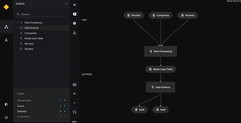

# Create a data science pipeline

This section explains the following:

* How to add a second Kedro pipeline for data science code that extends the default project pipeline
* How to 'slice' the project to run just part of the entire pipeline
* (Optional) How to make a [modular pipeline](../nodes_and_pipelines/modular_pipelines.md)
* (Optional) How to specify the way the pipeline nodes are run: sequentially or in parallel


## Data science nodes

The data science pipeline uses the [`LinearRegression`](https://scikit-learn.org/stable/modules/generated/sklearn.linear_model.LinearRegression.html) implementation from the [scikit-learn](https://scikit-learn.org/stable/) library.

The data science pipeline is made up of the following:

* Two python files within `src/spaceflights/pipelines/data_science`
    * `nodes.py` (for the node functions that form the data processing)
    * `pipeline.py` (to build the pipeline)
* A yaml file: `conf/base/parameters_data_science.yml` to define the parameters used when running the pipeline
* `__init__.py` files in the required folders to ensure that Python can import the pipeline


First, take a look at the functions for the data science nodes in `src/spaceflights/pipelines/data_science/nodes.py`:


<details>
<summary><b>Click to expand</b></summary>

```python
import logging
from typing import Dict, Tuple

import pandas as pd
from sklearn.linear_model import LinearRegression
from sklearn.metrics import r2_score
from sklearn.model_selection import train_test_split


def split_data(data: pd.DataFrame, parameters: Dict) -> Tuple:
    """Splits data into features and targets training and test sets.

    Args:
        data: Data containing features and target.
        parameters: Parameters defined in parameters_data_science.yml.
    Returns:
        Split data.
    """
    X = data[parameters["features"]]
    y = data["price"]
    X_train, X_test, y_train, y_test = train_test_split(
        X, y, test_size=parameters["test_size"], random_state=parameters["random_state"]
    )
    return X_train, X_test, y_train, y_test


def train_model(X_train: pd.DataFrame, y_train: pd.Series) -> LinearRegression:
    """Trains the linear regression model.

    Args:
        X_train: Training data of independent features.
        y_train: Training data for price.

    Returns:
        Trained model.
    """
    regressor = LinearRegression()
    regressor.fit(X_train, y_train)
    return regressor


def evaluate_model(
    regressor: LinearRegression, X_test: pd.DataFrame, y_test: pd.Series
):
    """Calculates and logs the coefficient of determination.

    Args:
        regressor: Trained model.
        X_test: Testing data of independent features.
        y_test: Testing data for price.
    """
    y_pred = regressor.predict(X_test)
    score = r2_score(y_test, y_pred)
    logger = logging.getLogger(__name__)
    logger.info("Model has a coefficient R^2 of %.3f on test data.", score)
```

</details>

## Input parameter configuration

Parameters that are used by the `DataCatalog` when the pipeline executes are stored in `conf/base/parameters_data_science.yml`:

<details>
<summary><b>Click to expand</b></summary>

```yaml
model_options:
  test_size: 0.2
  random_state: 3
  features:
    - engines
    - passenger_capacity
    - crew
    - d_check_complete
    - moon_clearance_complete
    - iata_approved
    - company_rating
    - review_scores_rating
```
</details>

Here, the parameters `test_size` and `random_state` are used as part of the train-test split, and `features` gives the names of columns in the model input table to use as features.

More information about [parameters is available in the configuration documentation](../configuration/parameters.md).

## Model registration

The following definition in `conf/base/catalog.yml` registers the dataset that saves the trained model:

```yaml
regressor:
  type: pickle.PickleDataset
  filepath: data/06_models/regressor.pickle
  versioned: true
```

By setting `versioned` to `true`, versioning is enabled for `regressor`. This means that the pickled output of the `regressor` is saved every time the pipeline runs, which stores the history of the models built using this pipeline. You can learn more in the [later section about dataset and ML model versioning](../data/data_catalog.md#dataset-versioning).


## Data science pipeline

The data science pipeline is defined in `src/spaceflights/pipelines/data_science/pipeline.py`:

<details>
<summary><b>Click to expand</b></summary>

```python
from kedro.pipeline import Pipeline, node, pipeline

from .nodes import evaluate_model, split_data, train_model


def create_pipeline(**kwargs) -> Pipeline:
    return pipeline(
        [
            node(
                func=split_data,
                inputs=["model_input_table", "params:model_options"],
                outputs=["X_train", "X_test", "y_train", "y_test"],
                name="split_data_node",
            ),
            node(
                func=train_model,
                inputs=["X_train", "y_train"],
                outputs="regressor",
                name="train_model_node",
            ),
            node(
                func=evaluate_model,
                inputs=["regressor", "X_test", "y_test"],
                outputs=None,
                name="evaluate_model_node",
            ),
        ]
    )
```
</details>


## Test the pipelines

When you created your project with `kedro new`, one of the files generated was `src/<package_name>/pipeline_registry.py` which constructs a `__default__` pipeline that includes every pipeline in the project.

This means that you do not need to manually instruct Kedro to run each pipeline, but can execute the default pipeline, which consists of the data processing and then data science pipeline in turn.

```bash
kedro run
```

You should see output similar to the following:

<details>
<summary><b>Click to expand</b></summary>

```bash
                    INFO     Loading data from 'companies' (CSVDataset)...                   data_catalog.py:343
                    INFO     Running node: preprocess_companies_node:                                node.py:327
                             preprocess_companies([companies]) -> [preprocessed_companies]
                    INFO     Saving data to 'preprocessed_companies' (MemoryDataset)...      data_catalog.py:382
                    INFO     Completed 1 out of 6 tasks                                  sequential_runner.py:85
                    INFO     Loading data from 'shuttles' (ExcelDataset)...                  data_catalog.py:343
[08/09/22 16:56:15] INFO     Running node: preprocess_shuttles_node: preprocess_shuttles([shuttles]) node.py:327
                             -> [preprocessed_shuttles]
                    INFO     Saving data to 'preprocessed_shuttles' (MemoryDataset)...       data_catalog.py:382
                    INFO     Completed 2 out of 6 tasks                                  sequential_runner.py:85
                    INFO     Loading data from 'preprocessed_shuttles' (MemoryDataset)...    data_catalog.py:343
                    INFO     Loading data from 'preprocessed_companies' (MemoryDataset)...   data_catalog.py:343
                    INFO     Loading data from 'reviews' (CSVDataset)...                     data_catalog.py:343
                    INFO     Running node: create_model_input_table_node:                            node.py:327
                             create_model_input_table([preprocessed_shuttles,preprocessed_companies,
                             reviews]) -> [model_input_table]
[08/09/22 16:56:18] INFO     Saving data to 'model_input_table' (MemoryDataset)...           data_catalog.py:382
[08/09/22 16:56:19] INFO     Completed 3 out of 6 tasks                                  sequential_runner.py:85
                    INFO     Loading data from 'model_input_table' (MemoryDataset)...        data_catalog.py:343
                    INFO     Loading data from 'params:model_options' (MemoryDataset)...     data_catalog.py:343
                    INFO     Running node: split_data_node:                                          node.py:327
                             split_data([model_input_table,params:model_options]) ->
                             [X_train,X_test,y_train,y_test]
                    INFO     Saving data to 'X_train' (MemoryDataset)...                     data_catalog.py:382
                    INFO     Saving data to 'X_test' (MemoryDataset)...                      data_catalog.py:382
                    INFO     Saving data to 'y_train' (MemoryDataset)...                     data_catalog.py:382
                    INFO     Saving data to 'y_test' (MemoryDataset)...                      data_catalog.py:382
                    INFO     Completed 4 out of 6 tasks                                  sequential_runner.py:85
                    INFO     Loading data from 'X_train' (MemoryDataset)...                  data_catalog.py:343
                    INFO     Loading data from 'y_train' (MemoryDataset)...                  data_catalog.py:343
                    INFO     Running node: train_model_node: train_model([X_train,y_train]) ->       node.py:327
                             [regressor]
[08/09/22 16:56:20] INFO     Saving data to 'regressor' (PickleDataset)...                   data_catalog.py:382
                    INFO     Completed 5 out of 6 tasks                                  sequential_runner.py:85
                    INFO     Loading data from 'regressor' (PickleDataset)...                data_catalog.py:343
                    INFO     Loading data from 'X_test' (MemoryDataset)...                   data_catalog.py:343
                    INFO     Loading data from 'y_test' (MemoryDataset)...                   data_catalog.py:343
                    INFO     Running node: evaluate_model_node:                                      node.py:327
                             evaluate_model([regressor,X_test,y_test]) -> None
                    INFO     Model has a coefficient R^2 of 0.462 on test data.                      nodes.py:55
                    INFO     Completed 6 out of 6 tasks                                  sequential_runner.py:85
                    INFO     Pipeline execution completed successfully.                             runner.py:89
```

</details>

As you can see, the `data_processing` and `data_science` pipelines ran successfully, generated a model and evaluated it.


### Slice a pipeline

There may be occasions when you want to run just part of the default pipeline. For example, you could skip `data_processing` execution and run only the `data_science` pipeline to tune the hyperparameters of the price prediction model.

You can 'slice' the pipeline and specify just the portion you want to run by using the `--pipeline` option. For example, to only run the pipeline named `data_science` (as labelled automatically in `register_pipelines`), execute the following command:

```bash
kedro run --pipeline=data_science
```

There are a range of options to run sections of the default pipeline as described in the [pipeline slicing documentation](../nodes_and_pipelines/slice_a_pipeline.md) and the ``kedro run`` [CLI documentation](../development/commands_reference.md#modifying-a-kedro-run).

## Modular pipelines

In many typical Kedro projects, a single (“main”) pipeline increases in complexity as the project evolves. To keep your project fit for purpose, we recommend that you create [modular pipelines](../nodes_and_pipelines/modular_pipelines.md), which are logically isolated and can be reused. You can instantiate a modular pipeline multiple times as a "template" pipeline that can run with different inputs/outputs/parameters.

Modular pipelines are easier to develop, test and maintain. They are reusable within the same codebase but also portable across projects via [micro-packaging](../nodes_and_pipelines/micro_packaging.md) as a scalable way to use Kedro pipelines.

### Optional: Extend the project with namespacing and a modular pipeline
This is optional code so is **not** provided in the spaceflights starter. If you want to see this in action, you need to copy and paste the code as instructed.

First, add namespaces to the modelling component of the data science pipeline to instantiate it as a template with different parameters for an `active_modelling_pipeline` and a `candidate_modelling_pipeline` to test the model using different combinations of features.


1. Update your catalog to add namespaces to the outputs of each instance. Replace the `regressor` key with the following two new dataset keys in the `conf/base/catalog.yml` file:

<details>
<summary><b>Click to expand</b></summary>

```yaml
active_modelling_pipeline.regressor:
  type: pickle.PickleDataset
  filepath: data/06_models/regressor_active.pickle
  versioned: true

candidate_modelling_pipeline.regressor:
  type: pickle.PickleDataset
  filepath: data/06_models/regressor_candidate.pickle
  versioned: true

```
</details><br/>

2. Update the parameters file for the data science pipeline in `conf/base/parameters_data_science.yml` to replace the existing contents for `model_options` with the following for the two instances of the template pipeline:

<details>
<summary><b>Click to expand</b></summary>

```yaml
active_modelling_pipeline:
    model_options:
      test_size: 0.2
      random_state: 3
      features:
        - engines
        - passenger_capacity
        - crew
        - d_check_complete
        - moon_clearance_complete
        - iata_approved
        - company_rating
        - review_scores_rating

candidate_modelling_pipeline:
    model_options:
      test_size: 0.2
      random_state: 8
      features:
        - engines
        - passenger_capacity
        - crew
        - review_scores_rating
```
</details><br/>

3. Replace the code in `pipelines/data_science/pipeline.py` with the snippet below:

<details>
<summary><b>Click to expand</b></summary>

```python
from kedro.pipeline import Pipeline, node
from kedro.pipeline.modular_pipeline import pipeline

from .nodes import evaluate_model, split_data, train_model


def create_pipeline(**kwargs) -> Pipeline:
    pipeline_instance = pipeline(
        [
            node(
                func=split_data,
                inputs=["model_input_table", "params:model_options"],
                outputs=["X_train", "X_test", "y_train", "y_test"],
                name="split_data_node",
            ),
            node(
                func=train_model,
                inputs=["X_train", "y_train"],
                outputs="regressor",
                name="train_model_node",
            ),
            node(
                func=evaluate_model,
                inputs=["regressor", "X_test", "y_test"],
                outputs=None,
                name="evaluate_model_node",
            ),
        ]
    )
    ds_pipeline_1 = pipeline(
        pipe=pipeline_instance,
        inputs="model_input_table",
        namespace="active_modelling_pipeline",
    )
    ds_pipeline_2 = pipeline(
        pipe=pipeline_instance,
        inputs="model_input_table",
        namespace="candidate_modelling_pipeline",
    )

    return ds_pipeline_1 + ds_pipeline_2
```

</details><br/>

4. Execute `kedro run` from the terminal. You should see output as follows:

<details>
<summary><b>Click to expand</b></summary>

```bash
[11/02/22 10:41:08] INFO     Loading data from 'companies' (CSVDataset)...                                             data_catalog.py:343
                    INFO     Running node: preprocess_companies_node: preprocess_companies([companies]) ->                     node.py:327
                             [preprocessed_companies]
                    INFO     Saving data to 'preprocessed_companies' (ParquetDataset)...                               data_catalog.py:382
                    INFO     Completed 1 out of 9 tasks                                                            sequential_runner.py:85
                    INFO     Loading data from 'shuttles' (ExcelDataset)...                                            data_catalog.py:343
[11/02/22 10:41:13] INFO     Running node: preprocess_shuttles_node: preprocess_shuttles([shuttles]) ->                        node.py:327
                             [preprocessed_shuttles]
                    INFO     Saving data to 'preprocessed_shuttles' (ParquetDataset)...                                data_catalog.py:382
                    INFO     Completed 2 out of 9 tasks                                                            sequential_runner.py:85
                    INFO     Loading data from 'preprocessed_shuttles' (ParquetDataset)...                             data_catalog.py:343
                    INFO     Loading data from 'preprocessed_companies' (ParquetDataset)...                            data_catalog.py:343
                    INFO     Loading data from 'reviews' (CSVDataset)...                                               data_catalog.py:343
                    INFO     Running node: create_model_input_table_node:                                                      node.py:327
                             create_model_input_table([preprocessed_shuttles,preprocessed_companies,reviews]) ->
                             [model_input_table]
^[[B[11/02/22 10:41:14] INFO     Saving data to 'model_input_table' (ParquetDataset)...                                    data_catalog.py:382
[11/02/22 10:41:15] INFO     Completed 3 out of 9 tasks                                                            sequential_runner.py:85
                    INFO     Loading data from 'model_input_table' (ParquetDataset)...                                 data_catalog.py:343
                    INFO     Loading data from 'params:active_modelling_pipeline.model_options' (MemoryDataset)...     data_catalog.py:343
                    INFO     Running node: split_data_node:                                                                    node.py:327
                             split_data([model_input_table,params:active_modelling_pipeline.model_options]) ->
                             [active_modelling_pipeline.X_train,active_modelling_pipeline.X_test,active_modelling_pipeline.y_t
                             rain,active_modelling_pipeline.y_test]
                    INFO     Saving data to 'active_modelling_pipeline.X_train' (MemoryDataset)...                     data_catalog.py:382
                    INFO     Saving data to 'active_modelling_pipeline.X_test' (MemoryDataset)...                      data_catalog.py:382
                    INFO     Saving data to 'active_modelling_pipeline.y_train' (MemoryDataset)...                     data_catalog.py:382
                    INFO     Saving data to 'active_modelling_pipeline.y_test' (MemoryDataset)...                      data_catalog.py:382
                    INFO     Completed 4 out of 9 tasks                                                            sequential_runner.py:85
                    INFO     Loading data from 'model_input_table' (ParquetDataset)...                                 data_catalog.py:343
                    INFO     Loading data from 'params:candidate_modelling_pipeline.model_options' (MemoryDataset)...  data_catalog.py:343
                    INFO     Running node: split_data_node:                                                                    node.py:327
                             split_data([model_input_table,params:candidate_modelling_pipeline.model_options]) ->
                             [candidate_modelling_pipeline.X_train,candidate_modelling_pipeline.X_test,candidate_modelling_pip
                             eline.y_train,candidate_modelling_pipeline.y_test]
                    INFO     Saving data to 'candidate_modelling_pipeline.X_train' (MemoryDataset)...                  data_catalog.py:382
                    INFO     Saving data to 'candidate_modelling_pipeline.X_test' (MemoryDataset)...                   data_catalog.py:382
                    INFO     Saving data to 'candidate_modelling_pipeline.y_train' (MemoryDataset)...                  data_catalog.py:382
                    INFO     Saving data to 'candidate_modelling_pipeline.y_test' (MemoryDataset)...                   data_catalog.py:382
                    INFO     Completed 5 out of 9 tasks                                                            sequential_runner.py:85
                    INFO     Loading data from 'active_modelling_pipeline.X_train' (MemoryDataset)...                  data_catalog.py:343
                    INFO     Loading data from 'active_modelling_pipeline.y_train' (MemoryDataset)...                  data_catalog.py:343
                    INFO     Running node: train_model_node:                                                                   node.py:327
                             train_model([active_modelling_pipeline.X_train,active_modelling_pipeline.y_train]) ->
                             [active_modelling_pipeline.regressor]
                    INFO     Saving data to 'active_modelling_pipeline.regressor' (PickleDataset)...                   data_catalog.py:382
                    INFO     Completed 6 out of 9 tasks                                                            sequential_runner.py:85
                    INFO     Loading data from 'candidate_modelling_pipeline.X_train' (MemoryDataset)...               data_catalog.py:343
                    INFO     Loading data from 'candidate_modelling_pipeline.y_train' (MemoryDataset)...               data_catalog.py:343
                    INFO     Running node: train_model_node:                                                                   node.py:327
                             train_model([candidate_modelling_pipeline.X_train,candidate_modelling_pipeline.y_train]) ->
                             [candidate_modelling_pipeline.regressor]
                    INFO     Saving data to 'candidate_modelling_pipeline.regressor' (PickleDataset)...                data_catalog.py:382
                    INFO     Completed 7 out of 9 tasks                                                            sequential_runner.py:85
                    INFO     Loading data from 'active_modelling_pipeline.regressor' (PickleDataset)...                data_catalog.py:343
                    INFO     Loading data from 'active_modelling_pipeline.X_test' (MemoryDataset)...                   data_catalog.py:343
                    INFO     Loading data from 'active_modelling_pipeline.y_test' (MemoryDataset)...                   data_catalog.py:343
                    INFO     Running node: evaluate_model_node:                                                                node.py:327
                             evaluate_model([active_modelling_pipeline.regressor,active_modelling_pipeline.X_test,active_model
                             ling_pipeline.y_test]) -> None
                    INFO     Model has a coefficient R^2 of 0.462 on test data.                                                nodes.py:60
                    INFO     Completed 8 out of 9 tasks                                                            sequential_runner.py:85
                    INFO     Loading data from 'candidate_modelling_pipeline.regressor' (PickleDataset)...             data_catalog.py:343
                    INFO     Loading data from 'candidate_modelling_pipeline.X_test' (MemoryDataset)...                data_catalog.py:343
                    INFO     Loading data from 'candidate_modelling_pipeline.y_test' (MemoryDataset)...                data_catalog.py:343
                    INFO     Running node: evaluate_model_node:                                                                node.py:327
                             evaluate_model([candidate_modelling_pipeline.regressor,candidate_modelling_pipeline.X_test,candid
                             ate_modelling_pipeline.y_test]) -> None
                    INFO     Model has a coefficient R^2 of 0.449 on test data.                                                nodes.py:60
                    INFO     Completed 9 out of 9 tasks                                                            sequential_runner.py:85
                    INFO     Pipeline execution completed successfully.
```
</details> <br />

### How it works: the modular `pipeline()` wrapper

The import you added to the code introduces the pipeline wrapper, which enables you to instantiate multiple instances of pipelines with static structure, but dynamic inputs/outputs/parameters:

```python
from kedro.pipeline.modular_pipeline import pipeline
```

The `pipeline()` wrapper method takes the following arguments:

| Keyword argument | Description                                                                         |
| ---------------- | ----------------------------------------------------------------------------------- |
| `pipe`           | The `Pipeline` object you want to wrap                                              |
| `inputs`         | Any overrides provided to this instance of the underlying wrapped `Pipeline` object |
| `outputs`        | Any overrides provided to this instance of the underlying wrapped `Pipeline` object |
| `parameters`     | Any overrides provided to this instance of the underlying wrapped `Pipeline` object |
| `namespace`      | The namespace that will be encapsulated by this pipeline instance                   |


You can see this snippet as part of the code you added to the example:

<details>
<summary><b>Click to expand</b></summary>

```python
...

ds_pipeline_1 = pipeline(
    pipe=pipeline_instance,
    inputs="model_input_table",
    namespace="active_modelling_pipeline",
)

ds_pipeline_2 = pipeline(
    pipe=pipeline_instance,
    inputs="model_input_table",
    namespace="candidate_modelling_pipeline",
)
```
</details>

The code instantiates the template_pipeline twice but passes in different parameters. The `pipeline_instance` variable is the template pipeline, and `ds_pipeline_1` and `ds_pipeline_2` are the two separately parameterised instantiations.

#### How do namespaces affect parameters?

All `inputs` and `outputs` within the nodes of the `ds_pipeline_1` have the `active_modelling_pipeline` prefix:

- `params:model_options` turns into `active_modelling_pipeline.params:model_options`
- `X_train` turns into `active_modelling_pipeline.X_train`
- `X_test` turns into `active_modelling_pipeline.X_test`, and so on

There are a separate set of parameters for `ds_pipeline_2` with the `candidate_modelling_pipeline` prefix:

- `params:model_options` turns into `candidate_modelling_pipeline.params:model_options`
- `X_train` turns into `candidate_modelling_pipeline.X_train`
- `X_test` turns into `candidate_modelling_pipeline.X_test`, and so on

However, `model_input_table` does not get parameterised as it needs to be shared between instances, so is frozen outside the scope of the namespace wrappers.

This renders as follows using `kedro viz` (hover over the datasets to see their full path) :



## Optional: Kedro runners

There are three different Kedro runners that can run the pipeline:

* `SequentialRunner` - runs nodes sequentially; once a node has completed its task then the next one starts.
* `ParallelRunner` - runs nodes in parallel; independent nodes are able to run at the same time, which is more efficient when there are independent branches in your pipeline and enables you to take advantage of multiple CPU cores.
* `ThreadRunner` - runs nodes in parallel, similarly to `ParallelRunner`, but uses multithreading instead of multiprocessing.

By default, Kedro uses a `SequentialRunner`, which is instantiated when you execute `kedro run` from the terminal. If you decide to use `ParallelRunner`, `ThreadRunner` or a custom runner, you can do so through the `--runner` flag as follows:

```bash
kedro run --runner=ParallelRunner
kedro run --runner=ThreadRunner
kedro run --runner=module.path.to.my.runner
```

`ParallelRunner` performs task parallelisation via multiprocessing, while `ThreadRunner` is intended for use with remote execution engines such as [Spark](../integrations/pyspark_integration.md) and [Dask](/kedro_datasets.dask.ParquetDataset).

You can find out more about the runners Kedro provides, and how to create your own, in the [pipeline documentation about runners](../nodes_and_pipelines/run_a_pipeline.md).
