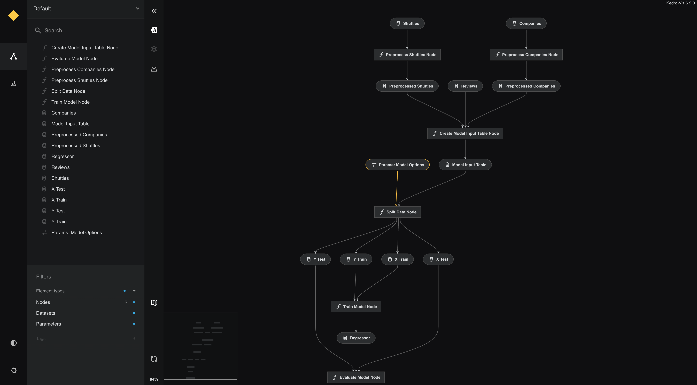

# Create a data science pipeline

This section explains the following:

* How to add a second Kedro pipeline for data science code that extends the default project pipeline
* How to 'slice' the project and run just part of the default pipeline
* How to visualise the default project pipeline
* (Optional) How to specify the way the pipeline nodes are run: sequentially or in parallel
* (Optional) How to make a modular pipeline


## Data science pipeline

The data science pipeline uses the [`LinearRegression`](https://scikit-learn.org/stable/modules/generated/sklearn.linear_model.LinearRegression.html) implementation from the [scikit-learn](https://scikit-learn.org/stable/) library.

### Generate a new pipeline template

Run the following command to create the `data_science` pipeline. If you are using the tutorial created by the spaceflights starter, you can omit this step:


```bash
kedro pipeline create data_science
```

Add the following code to the `src/kedro_tutorial/pipelines/data_science/nodes.py` file:

> If you are using the tutorial created by the spaceflights starter, you can omit the copy/paste, but it's worth reviewing the code for the three nodes.


<details>
<summary><b>Click to expand</b></summary>

```python
import logging
from typing import Dict, Tuple

import pandas as pd
from sklearn.linear_model import LinearRegression
from sklearn.metrics import r2_score
from sklearn.model_selection import train_test_split


def split_data(data: pd.DataFrame, parameters: Dict) -> Tuple:
    """Splits data into features and targets training and test sets.

    Args:
        data: Data containing features and target.
        parameters: Parameters defined in parameters/data_science.yml.
    Returns:
        Split data.
    """
    X = data[parameters["features"]]
    y = data["price"]
    X_train, X_test, y_train, y_test = train_test_split(
        X, y, test_size=parameters["test_size"], random_state=parameters["random_state"]
    )
    return X_train, X_test, y_train, y_test


def train_model(X_train: pd.DataFrame, y_train: pd.Series) -> LinearRegression:
    """Trains the linear regression model.

    Args:
        X_train: Training data of independent features.
        y_train: Training data for price.

    Returns:
        Trained model.
    """
    regressor = LinearRegression()
    regressor.fit(X_train, y_train)
    return regressor


def evaluate_model(
    regressor: LinearRegression, X_test: pd.DataFrame, y_test: pd.Series
):
    """Calculates and logs the coefficient of determination.

    Args:
        regressor: Trained model.
        X_test: Testing data of independent features.
        y_test: Testing data for price.
    """
    y_pred = regressor.predict(X_test)
    score = r2_score(y_test, y_pred)
    logger = logging.getLogger(__name__)
    logger.info("Model has a coefficient R^2 of %.3f on test data.", score)
```

</details>

### Configure the input parameters

You now need to add some parameters that are used by the `DataCatalog` when the pipeline executes. 	
> If you are using the tutorial created by the spaceflights starter, you can omit the copy/paste, but it's worth reviewing the code for the three nodes.

Add the following to `conf/base/parameters/data_science.yml`:

```yaml
model_options:
  test_size: 0.2
  random_state: 3
  features:
    - engines
    - passenger_capacity
    - crew
    - d_check_complete
    - moon_clearance_complete
    - iata_approved
    - company_rating
    - review_scores_rating
```

Here, the parameters `test_size` and `random_state` are used as part of the train-test split, and `features` gives the names of columns in the model input table to use as features.

More information about [parameters](../kedro_project_setup/configuration.md#parameters) is available in later documentation for advanced usage. 

### Assemble the data science pipeline

To create a modular pipeline for the price prediction model, replace the contents of `src/kedro_tutorial/pipelines/data_science/pipeline.py` with the following:

> If you are using the tutorial created by the spaceflights starter, you can omit the copy/paste.

<details>
<summary><b>Click to expand</b></summary>

```python
from kedro.pipeline import Pipeline, node, pipeline

from .nodes import evaluate_model, split_data, train_model


def create_pipeline(**kwargs) -> Pipeline:
    return pipeline(
        [
            node(
                func=split_data,
                inputs=["model_input_table", "params:model_options"],
                outputs=["X_train", "X_test", "y_train", "y_test"],
                name="split_data_node",
            ),
            node(
                func=train_model,
                inputs=["X_train", "y_train"],
                outputs="regressor",
                name="train_model_node",
            ),
            node(
                func=evaluate_model,
                inputs=["regressor", "X_test", "y_test"],
                outputs=None,
                name="evaluate_model_node",
            ),
        ]
    )
```
</details>

### Register the dataset

The next step is to register the dataset that will save the trained model, by adding the following definition to `conf/base/catalog.yml`:

> If you are using the tutorial created by the spaceflights starter, you can omit the copy/paste.

```yaml
regressor:
  type: pickle.PickleDataSet
  filepath: data/06_models/regressor.pickle
  versioned: true
```

By setting `versioned` to `true`, versioning is enabled for `regressor`. This means that the pickled output of the `regressor` is saved every time the pipeline runs, which stores the history of the models built using this pipeline. You can learn more in the [Versioning section](../data/kedro_io.md#versioning).

### Test the pipelines

You can now run the default pipeline, which executes the data processing and then data science pipelines in turn:

```bash
kedro run
```

You should see output similar to the following:

<details>
<summary><b>Click to expand</b></summary>

```bash
[08/09/22 16:56:00] INFO     Kedro project kedro-tutorial                                         session.py:346
                    INFO     Loading data from 'companies' (CSVDataSet)...                   data_catalog.py:343
                    INFO     Running node: preprocess_companies_node:                                node.py:327
                             preprocess_companies([companies]) -> [preprocessed_companies]
                    INFO     Saving data to 'preprocessed_companies' (MemoryDataSet)...      data_catalog.py:382
                    INFO     Completed 1 out of 6 tasks                                  sequential_runner.py:85
                    INFO     Loading data from 'shuttles' (ExcelDataSet)...                  data_catalog.py:343
[08/09/22 16:56:15] INFO     Running node: preprocess_shuttles_node: preprocess_shuttles([shuttles]) node.py:327
                             -> [preprocessed_shuttles]
                    INFO     Saving data to 'preprocessed_shuttles' (MemoryDataSet)...       data_catalog.py:382
                    INFO     Completed 2 out of 6 tasks                                  sequential_runner.py:85
                    INFO     Loading data from 'preprocessed_shuttles' (MemoryDataSet)...    data_catalog.py:343
                    INFO     Loading data from 'preprocessed_companies' (MemoryDataSet)...   data_catalog.py:343
                    INFO     Loading data from 'reviews' (CSVDataSet)...                     data_catalog.py:343
                    INFO     Running node: create_model_input_table_node:                            node.py:327
                             create_model_input_table([preprocessed_shuttles,preprocessed_companies,
                             reviews]) -> [model_input_table]
[08/09/22 16:56:18] INFO     Saving data to 'model_input_table' (MemoryDataSet)...           data_catalog.py:382
[08/09/22 16:56:19] INFO     Completed 3 out of 6 tasks                                  sequential_runner.py:85
                    INFO     Loading data from 'model_input_table' (MemoryDataSet)...        data_catalog.py:343
                    INFO     Loading data from 'params:model_options' (MemoryDataSet)...     data_catalog.py:343
                    INFO     Running node: split_data_node:                                          node.py:327
                             split_data([model_input_table,params:model_options]) ->
                             [X_train,X_test,y_train,y_test]
                    INFO     Saving data to 'X_train' (MemoryDataSet)...                     data_catalog.py:382
                    INFO     Saving data to 'X_test' (MemoryDataSet)...                      data_catalog.py:382
                    INFO     Saving data to 'y_train' (MemoryDataSet)...                     data_catalog.py:382
                    INFO     Saving data to 'y_test' (MemoryDataSet)...                      data_catalog.py:382
                    INFO     Completed 4 out of 6 tasks                                  sequential_runner.py:85
                    INFO     Loading data from 'X_train' (MemoryDataSet)...                  data_catalog.py:343
                    INFO     Loading data from 'y_train' (MemoryDataSet)...                  data_catalog.py:343
                    INFO     Running node: train_model_node: train_model([X_train,y_train]) ->       node.py:327
                             [regressor]
[08/09/22 16:56:20] INFO     Saving data to 'regressor' (PickleDataSet)...                   data_catalog.py:382
                    INFO     Completed 5 out of 6 tasks                                  sequential_runner.py:85
                    INFO     Loading data from 'regressor' (PickleDataSet)...                data_catalog.py:343
                    INFO     Loading data from 'X_test' (MemoryDataSet)...                   data_catalog.py:343
                    INFO     Loading data from 'y_test' (MemoryDataSet)...                   data_catalog.py:343
                    INFO     Running node: evaluate_model_node:                                      node.py:327
                             evaluate_model([regressor,X_test,y_test]) -> None
                    INFO     Model has a coefficient R^2 of 0.462 on test data.                      nodes.py:55
                    INFO     Completed 6 out of 6 tasks                                  sequential_runner.py:85
                    INFO     Pipeline execution completed successfully.                             runner.py:89
```

</details>

#### Slice a pipeline

Sometimes you may want to run just part of the default pipeline. For example, you may could skip data processing execution and run only the data science pipeline to tune the hyperparameters of the price prediction model. 

You can 'slice' the pipeline and specify just the portion you want to run by using the `--pipeline` command line option. For example, to only run the pipeline named `data_science` (as labelled automatically in `register_pipelines`), execute the following command:

```bash
kedro run --pipeline=data_science
```

There are a range of options to run sections of the default pipeline as described in the [pipeline slicing documentation](../nodes_and_pipelines/slice_a_pipeline.md) and the ``kedro run`` [CLI documentation](../development/commands_reference.md#modifying-a-kedro-run).


## Visualise the project

The documentation on [visualisation with Kedro-Viz](../visualisation/kedro-viz_visualisation) discusses this topic in greater detail, so this is a swift introduction on how to use Kedro-Viz to visualise the project. 

In your terminal type the following:

```bash
kedro viz
```

This command automatically opens a browser tab to serve the visualisation at `http://127.0.0.1:4141/`.

You should see the following:



To exit the visualisation, close the browser tab. To regain control of the terminal, enter `Ctrl+C` or `Cmd+C`.


## Optional: Modular pipelines

In many typical Kedro projects, a single (“main”) pipeline increases in complexity as the project evolves. To keep your project fit for purpose, we recommend that you create [modular pipelines](../nodes_and_pipelines/modular_pipelines.md), which are logically isolated and can be reused. You can instantiate a modular pipeline multiple times as a "template" pipeline that can run with different inputs/outputs/parameters. 

Modular pipelines are easier to develop, test and maintain. They are reusable within the same codebase but also portable across projects via [micro-packaging](../nodes_and_pipelines/micro_packaging.md). This is a scalable way to use Kedro, and will change how you think about Kedro pipelines.

### Extend the project with namespacing and a modular pipeline
We first add some namespaces to the modelling component of the data science pipeline to instantiate it as a template with different parameters for an `active_modelling_pipeline` and a `candidate_modelling_pipeline`. 

> This is optional code so is **not** provided in the spaceflights starter. Unlike the rest of the tutorial, if you want to see this in action, you need to copy and paste the code as instructed.

1. Update your catalog to add namespaces to the outputs of each instance. Replace the `regressor` key with the following two new dataset keys in the `conf/base/catalog.yml` file:

```yaml
active_modelling_pipeline.regressor:
  type: pickle.PickleDataSet
  filepath: data/06_models/regressor_active.pickle
  versioned: true

candidate_modelling_pipeline.regressor:
  type: pickle.PickleDataSet
  filepath: data/06_models/regressor_candidate.pickle
  versioned: true

```

2. Update the parameters file for the data science pipeline in `conf/base/parameters/data_science.yml` to replace the existing contents for `model_options` with the following for the two instances of the template pipeline:


```yaml
active_modelling_pipeline:
    model_options:
      test_size: 0.2
      random_state: 3
      features:
        - engines
        - passenger_capacity
        - crew
        - d_check_complete
        - moon_clearance_complete
        - iata_approved
        - company_rating
        - review_scores_rating

candidate_modelling_pipeline:
    model_options:
      test_size: 0.2
      random_state: 8
      features:
        - engines
        - passenger_capacity
        - crew
        - review_scores_rating
```


3. Replace the code in `pipelines/data_science/pipeline.py` with the snippet below:

<details>
<summary><b>Click to expand</b></summary>

```python
from kedro.pipeline import Pipeline, node
from kedro.pipeline.modular_pipeline import pipeline

from .nodes import evaluate_model, split_data, train_model


def create_pipeline(**kwargs) -> Pipeline:
    pipeline_instance = pipeline(
        [
            node(
                func=split_data,
                inputs=["model_input_table", "params:model_options"],
                outputs=["X_train", "X_test", "y_train", "y_test"],
                name="split_data_node",
            ),
            node(
                func=train_model,
                inputs=["X_train", "y_train"],
                outputs="regressor",
                name="train_model_node",
            ),
            node(
                func=evaluate_model,
                inputs=["regressor", "X_test", "y_test"],
                outputs=None,
                name="evaluate_model_node",
            ),
        ]
    )
    ds_pipeline_1 = pipeline(
        pipe=pipeline_instance,
        inputs="model_input_table",
        namespace="active_modelling_pipeline",
    )
    ds_pipeline_2 = pipeline(
        pipe=pipeline_instance,
        inputs="model_input_table",
        namespace="candidate_modelling_pipeline",
    )

    return ds_pipeline_1 + ds_pipeline_2    
```

</details>

You should see output as follows:

<details>
<summary><b>Click to expand</b></summary>


```bash
[11/02/22 10:41:06] WARNING  /Users/jo_stichbury/opt/anaconda3/envs/py38/lib/python3.8/site-packages/plotly/graph_objects/ warnings.py:109
                             __init__.py:288: DeprecationWarning: distutils Version classes are deprecated. Use                           
                             packaging.version instead.                                                                                   
                               if LooseVersion(ipywidgets.__version__) >= LooseVersion("7.0.0"):                                          
                                                                                                                                          
[11/02/22 10:41:07] INFO     Kedro project kedro-tutorial                                                                   session.py:340
[11/02/22 10:41:08] INFO     Loading data from 'companies' (CSVDataSet)...                                             data_catalog.py:343
                    INFO     Running node: preprocess_companies_node: preprocess_companies([companies]) ->                     node.py:327
                             [preprocessed_companies]                                                                                     
                    INFO     Saving data to 'preprocessed_companies' (ParquetDataSet)...                               data_catalog.py:382
                    INFO     Completed 1 out of 9 tasks                                                            sequential_runner.py:85
                    INFO     Loading data from 'shuttles' (ExcelDataSet)...                                            data_catalog.py:343
[11/02/22 10:41:13] INFO     Running node: preprocess_shuttles_node: preprocess_shuttles([shuttles]) ->                        node.py:327
                             [preprocessed_shuttles]                                                                                      
                    WARNING  /Users/jo_stichbury/Documents/kedro-projects/kedro-tutorial/src/kedro_tutorial/pipelines/data warnings.py:109
                             _processing/nodes.py:19: FutureWarning: The default value of regex will change from True to                  
                             False in a future version. In addition, single character regular expressions will *not* be                   
                             treated as literal strings when regex=True.                                                                  
                               x = x.str.replace("$", "").str.replace(",", "")                                                            
                                                                                                                                          
                    INFO     Saving data to 'preprocessed_shuttles' (ParquetDataSet)...                                data_catalog.py:382
                    INFO     Completed 2 out of 9 tasks                                                            sequential_runner.py:85
                    INFO     Loading data from 'preprocessed_shuttles' (ParquetDataSet)...                             data_catalog.py:343
                    INFO     Loading data from 'preprocessed_companies' (ParquetDataSet)...                            data_catalog.py:343
                    INFO     Loading data from 'reviews' (CSVDataSet)...                                               data_catalog.py:343
                    INFO     Running node: create_model_input_table_node:                                                      node.py:327
                             create_model_input_table([preprocessed_shuttles,preprocessed_companies,reviews]) ->                          
                             [model_input_table]                                                                                          
^[[B[11/02/22 10:41:14] INFO     Saving data to 'model_input_table' (ParquetDataSet)...                                    data_catalog.py:382
[11/02/22 10:41:15] INFO     Completed 3 out of 9 tasks                                                            sequential_runner.py:85
                    INFO     Loading data from 'model_input_table' (ParquetDataSet)...                                 data_catalog.py:343
                    INFO     Loading data from 'params:active_modelling_pipeline.model_options' (MemoryDataSet)...     data_catalog.py:343
                    INFO     Running node: split_data_node:                                                                    node.py:327
                             split_data([model_input_table,params:active_modelling_pipeline.model_options]) ->                            
                             [active_modelling_pipeline.X_train,active_modelling_pipeline.X_test,active_modelling_pipeline.y_t            
                             rain,active_modelling_pipeline.y_test]                                                                       
                    INFO     Saving data to 'active_modelling_pipeline.X_train' (MemoryDataSet)...                     data_catalog.py:382
                    INFO     Saving data to 'active_modelling_pipeline.X_test' (MemoryDataSet)...                      data_catalog.py:382
                    INFO     Saving data to 'active_modelling_pipeline.y_train' (MemoryDataSet)...                     data_catalog.py:382
                    INFO     Saving data to 'active_modelling_pipeline.y_test' (MemoryDataSet)...                      data_catalog.py:382
                    INFO     Completed 4 out of 9 tasks                                                            sequential_runner.py:85
                    INFO     Loading data from 'model_input_table' (ParquetDataSet)...                                 data_catalog.py:343
                    INFO     Loading data from 'params:candidate_modelling_pipeline.model_options' (MemoryDataSet)...  data_catalog.py:343
                    INFO     Running node: split_data_node:                                                                    node.py:327
                             split_data([model_input_table,params:candidate_modelling_pipeline.model_options]) ->                         
                             [candidate_modelling_pipeline.X_train,candidate_modelling_pipeline.X_test,candidate_modelling_pip            
                             eline.y_train,candidate_modelling_pipeline.y_test]                                                           
                    INFO     Saving data to 'candidate_modelling_pipeline.X_train' (MemoryDataSet)...                  data_catalog.py:382
                    INFO     Saving data to 'candidate_modelling_pipeline.X_test' (MemoryDataSet)...                   data_catalog.py:382
                    INFO     Saving data to 'candidate_modelling_pipeline.y_train' (MemoryDataSet)...                  data_catalog.py:382
                    INFO     Saving data to 'candidate_modelling_pipeline.y_test' (MemoryDataSet)...                   data_catalog.py:382
                    INFO     Completed 5 out of 9 tasks                                                            sequential_runner.py:85
                    INFO     Loading data from 'active_modelling_pipeline.X_train' (MemoryDataSet)...                  data_catalog.py:343
                    INFO     Loading data from 'active_modelling_pipeline.y_train' (MemoryDataSet)...                  data_catalog.py:343
                    INFO     Running node: train_model_node:                                                                   node.py:327
                             train_model([active_modelling_pipeline.X_train,active_modelling_pipeline.y_train]) ->                        
                             [active_modelling_pipeline.regressor]                                                                        
                    INFO     Saving data to 'active_modelling_pipeline.regressor' (PickleDataSet)...                   data_catalog.py:382
                    INFO     Completed 6 out of 9 tasks                                                            sequential_runner.py:85
                    INFO     Loading data from 'candidate_modelling_pipeline.X_train' (MemoryDataSet)...               data_catalog.py:343
                    INFO     Loading data from 'candidate_modelling_pipeline.y_train' (MemoryDataSet)...               data_catalog.py:343
                    INFO     Running node: train_model_node:                                                                   node.py:327
                             train_model([candidate_modelling_pipeline.X_train,candidate_modelling_pipeline.y_train]) ->                  
                             [candidate_modelling_pipeline.regressor]                                                                     
                    INFO     Saving data to 'candidate_modelling_pipeline.regressor' (PickleDataSet)...                data_catalog.py:382
                    INFO     Completed 7 out of 9 tasks                                                            sequential_runner.py:85
                    INFO     Loading data from 'active_modelling_pipeline.regressor' (PickleDataSet)...                data_catalog.py:343
                    INFO     Loading data from 'active_modelling_pipeline.X_test' (MemoryDataSet)...                   data_catalog.py:343
                    INFO     Loading data from 'active_modelling_pipeline.y_test' (MemoryDataSet)...                   data_catalog.py:343
                    INFO     Running node: evaluate_model_node:                                                                node.py:327
                             evaluate_model([active_modelling_pipeline.regressor,active_modelling_pipeline.X_test,active_model            
                             ling_pipeline.y_test]) -> None                                                                               
                    INFO     Model has a coefficient R^2 of 0.462 on test data.                                                nodes.py:60
                    INFO     Completed 8 out of 9 tasks                                                            sequential_runner.py:85
                    INFO     Loading data from 'candidate_modelling_pipeline.regressor' (PickleDataSet)...             data_catalog.py:343
                    INFO     Loading data from 'candidate_modelling_pipeline.X_test' (MemoryDataSet)...                data_catalog.py:343
                    INFO     Loading data from 'candidate_modelling_pipeline.y_test' (MemoryDataSet)...                data_catalog.py:343
                    INFO     Running node: evaluate_model_node:                                                                node.py:327
                             evaluate_model([candidate_modelling_pipeline.regressor,candidate_modelling_pipeline.X_test,candid            
                             ate_modelling_pipeline.y_test]) -> None                                                                      
                    INFO     Model has a coefficient R^2 of 0.449 on test data.                                                nodes.py:60
                    INFO     Completed 9 out of 9 tasks                                                            sequential_runner.py:85
                    INFO     Pipeline execution completed successfully.            
```
</details>

#### How it works: the modular `pipeline()` wrapper 

The import you added to the code introduces the pipeline wrapper, which enables you to instantiate multiple instances of pipelines with static structure, but dynamic inputs/outputs/parameters:

```python
from kedro.pipeline.modular_pipeline import pipeline
```

The `pipeline()` wrapper method takes the following arguments:

| Keyword argument | Description                                                                         |
| ---------------- | ----------------------------------------------------------------------------------- |
| `pipe`           | The `Pipeline` object you want to wrap                                              |
| `inputs`         | Any overrides provided to this instance of the underlying wrapped `Pipeline` object |
| `outputs`        | Any overrides provided to this instance of the underlying wrapped `Pipeline` object |
| `parameters`     | Any overrides provided to this instance of the underlying wrapped `Pipeline` object |
| `namespace`      | The namespace that will be encapsulated by this pipeline instance                   |


You can see this snippet as part of the code you added to the example:

```python
...

ds_pipeline_1 = pipeline(
    pipe=pipeline_instance,
    inputs="model_input_table",
    namespace="active_modelling_pipeline",
)

ds_pipeline_2 = pipeline(
    pipe=pipeline_instance,
    inputs="model_input_table",
    namespace="candidate_modelling_pipeline",
)
```

We instantiate the template_pipeline twice but pass in different parameters. The `pipeline_instance` variable is our template pipeline, `ds_pipeline_1` and `ds_pipeline_2` are our parameterised instantiations.


This renders as follows:


## Optional: Kedro runners

There are three different Kedro runners that can run the pipeline:

* `SequentialRunner` - runs your nodes sequentially; once a node has completed its task then the next one starts.
* `ParallelRunner` - runs your nodes in parallel; independent nodes are able to run at the same time, which is more efficient when there are independent branches in your pipeline and enables you to take advantage of multiple CPU cores.
* `ThreadRunner` - runs your nodes in parallel, similarly to `ParallelRunner`, but uses multithreading instead of multiprocessing.

By default, Kedro uses a `SequentialRunner`, which is instantiated when you execute `kedro run` from the command line. If you decide to use `ParallelRunner`, `ThreadRunner` or a custom runner, you can do so through the `--runner` flag as follows:

```bash
kedro run --runner=ParallelRunner
kedro run --runner=ThreadRunner
kedro run --runner=module.path.to.my.runner
```

```{note}
`ParallelRunner` performs task parallelisation via multiprocessing, while `ThreadRunner` is intended for use with remote execution engines such as [Spark](../tools_integration/pyspark.md) and [Dask](https://github.com/kedro-org/kedro/blob/develop/kedro/extras/datasets/dask/parquet_dataset.py). 
```

You can find out more about the runners Kedro provides, and how to create your own, in the [pipeline documentation about runners](../nodes_and_pipelines/run_a_pipeline.md).

