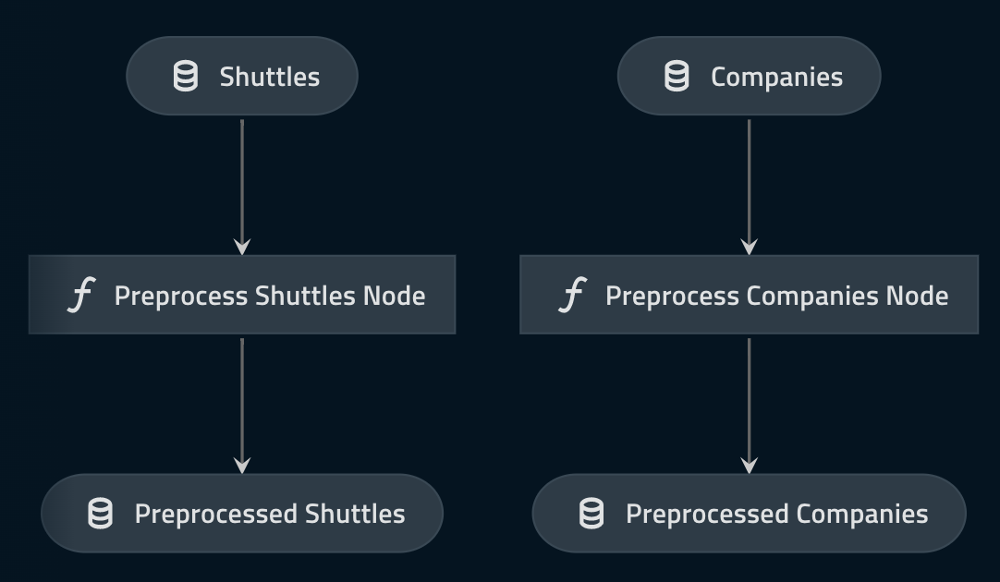

# Create a pipeline

This section covers the third part of the [standard development workflow](./spaceflights_tutorial.md#kedro-project-development-workflow), and covers the following:

* How to create each [node](../resources/glossary.md#node) required by the example
* How to set up a [pipeline](../resources/glossary.md#pipeline)

## Data processing pipeline

You previously registered the raw datasets for your Kedro project, so you can now create nodes to pre-process two of the datasets, [companies.csv](https://github.com/kedro-org/kedro-starters/blob/main/spaceflights/%7B%7B%20cookiecutter.repo_name%20%7D%7D/data/01_raw/companies.csv) and [shuttles.xlsx](https://github.com/kedro-org/kedro-starters/blob/main/spaceflights/%7B%7B%20cookiecutter.repo_name%20%7D%7D/data/01_raw/shuttles.xlsx), to prepare the data for modelling.

### Generate a new pipeline template

In the terminal, run the following command:

```bash
kedro pipeline create data_processing
```

This command generates all the files you need to start to write a `data_processing` pipeline:
* `nodes.py` and `pipeline.py` in the `src/kedro_tutorial/pipelines/data_processing` folder for the main node functions that form your pipeline
* `conf/base/parameters/data_processing.yml` to define the parameters used when running the pipeline
* `src/tests/pipelines/data_processing` for tests for your pipeline
* `__init__.py` files in the required places to ensure that the pipeline can be imported by Python

```bash

├── README.md
├── conf
│   └── base
│       └── parameters
│           └── data_processing.yml
└── src
    ├── kedro_tutorial
    │   ├── __init__.py
    │   └── pipelines
    │       ├── __init__.py
    │       └── data_processing
    │           ├── README.md
    │           ├── __init__.py
    │           ├── nodes.py
    │           └── pipeline.py
    └── tests
        ├── __init__.py
        └── pipelines
            ├── __init__.py
            └── data_processing
                ├── __init__.py
                └── test_pipeline.py
```

### Add node functions

Open `src/kedro_tutorial/pipelines/data_processing/nodes.py` and add the code below, which provides two functions (`preprocess_companies` and `preprocess_shuttles`) that each take a raw DataFrame and output a DataFrame containing pre-processed data:

<details>
<summary><b>Click to expand</b></summary>

```python
import pandas as pd


def _is_true(x: pd.Series) -> pd.Series:
    return x == "t"


def _parse_percentage(x: pd.Series) -> pd.Series:
    x = x.str.replace("%", "")
    x = x.astype(float) / 100
    return x


def _parse_money(x: pd.Series) -> pd.Series:
    x = x.str.replace("$", "").str.replace(",", "")
    x = x.astype(float)
    return x


def preprocess_companies(companies: pd.DataFrame) -> pd.DataFrame:
    """Preprocesses the data for companies.

    Args:
        companies: Raw data.
    Returns:
        Preprocessed data, with `company_rating` converted to a float and
        `iata_approved` converted to boolean.
    """
    companies["iata_approved"] = _is_true(companies["iata_approved"])
    companies["company_rating"] = _parse_percentage(companies["company_rating"])
    return companies


def preprocess_shuttles(shuttles: pd.DataFrame) -> pd.DataFrame:
    """Preprocesses the data for shuttles.

    Args:
        shuttles: Raw data.
    Returns:
        Preprocessed data, with `price` converted to a float and `d_check_complete`,
        `moon_clearance_complete` converted to boolean.
    """
    shuttles["d_check_complete"] = _is_true(shuttles["d_check_complete"])
    shuttles["moon_clearance_complete"] = _is_true(shuttles["moon_clearance_complete"])
    shuttles["price"] = _parse_money(shuttles["price"])
    return shuttles
```

</details>

### Assemble nodes into the data processing pipeline

The next steps are to create a [node](../resources/glossary.md#node) for each function, and to create a [modular pipeline](../resources/glossary.md#modular-pipeline) for data processing:

Add the following to `src/kedro_tutorial/pipelines/data_processing/pipeline.py`, so the `create_pipeline()` function looks as follows:

<details>
<summary><b>Click to expand</b></summary>

```python
def create_pipeline(**kwargs) -> Pipeline:
    return pipeline(
        [
            node(
                func=preprocess_companies,
                inputs="companies",
                outputs="preprocessed_companies",
                name="preprocess_companies_node",
            ),
            node(
                func=preprocess_shuttles,
                inputs="shuttles",
                outputs="preprocessed_shuttles",
                name="preprocess_shuttles_node",
            ),
        ]
    )
```

</details>

```{note}
`companies` and `shuttles` refer to the datasets defined in `conf/base/catalog.yml`. These are inputs to the `preprocess_companies` and `preprocess_shuttles` functions. The named node inputs (and outputs) are used by the pipeline to determine interdependencies between the nodes, and hence, their execution order.
```

Be sure to import `node`, and your functions by adding them to the beginning of `pipeline.py`:

```python
from kedro.pipeline import Pipeline, node, pipeline

from .nodes import preprocess_companies, preprocess_shuttles
```

### Update the project pipeline

Now update the project's pipeline in `src/kedro_tutorial/pipeline_registry.py` to add the [pipeline](../resources/glossary.md#modular-pipeline) for data processing:

<details>
<summary><b>Click to expand</b></summary>

```python
from typing import Dict

from kedro.pipeline import Pipeline

from kedro_tutorial.pipelines import data_processing as dp


def register_pipelines() -> Dict[str, Pipeline]:
    """Register the project's pipeline.

    Returns:
        A mapping from a pipeline name to a ``Pipeline`` object.
    """
    data_processing_pipeline = dp.create_pipeline()

    return {
        "__default__": data_processing_pipeline,
        "dp": data_processing_pipeline,
    }
```

</details>

### Test the example

Run the following command in your terminal window to test the node named `preprocess_companies_node`:

```bash
kedro run --node=preprocess_companies_node
```

You should see output similar to the below:

```bash
2019-08-19 10:44:33,112 - root - INFO - ** Kedro project kedro-tutorial
2019-08-19 10:44:33,123 - kedro.io.data_catalog - INFO - Loading data from `companies` (CSVDataSet)...
2019-08-19 10:44:33,161 - kedro.pipeline.node - INFO - Running node: preprocess_companies_node: preprocess_companies([companies]) -> [preprocessed_companies]
2019-08-19 10:44:33,206 - kedro.io.data_catalog - INFO - Saving data to `preprocess_companies_node` (MemoryDataSet)...
2019-08-19 10:44:33,471 - kedro.runner.sequential_runner - INFO - Completed 1 out of 1 tasks
2019-08-19 10:44:33,471 - kedro.runner.sequential_runner - INFO - Pipeline execution completed successfully.

```

To test the entire data processing pipeline:

```bash
kedro run
```

You should see output similar to the following:

```bash
2019-08-19 10:50:39,950 - root - INFO - ** Kedro project kedro-tutorial
2019-08-19 10:50:39,957 - kedro.io.data_catalog - INFO - Loading data from `shuttles` (ExcelDataSet)...
2019-08-19 10:50:48,521 - kedro.pipeline.node - INFO - Running node: preprocess_shuttles_node: preprocess_shuttles([shuttles]) -> [preprocessed_shuttles]
2019-08-19 10:50:48,587 - kedro.io.data_catalog - INFO - Saving data to `preprocessed_shuttles` (MemoryDataSet)...
2019-08-19 10:50:49,133 - kedro.runner.sequential_runner - INFO - Completed 1 out of 2 tasks
2019-08-19 10:50:49,133 - kedro.io.data_catalog - INFO - Loading data from `companies` (CSVDataSet)...
2019-08-19 10:50:49,168 - kedro.pipeline.node - INFO - Running node: preprocess_companies_node: preprocess_companies([companies]) -> [preprocessed_companies]
2019-08-19 10:50:49,212 - kedro.io.data_catalog - INFO - Saving data to `preprocessed_companies` (MemoryDataSet)...
2019-08-19 10:50:49,458 - kedro.runner.sequential_runner - INFO - Completed 2 out of 2 tasks
2019-08-19 10:50:49,459 - kedro.runner.sequential_runner - INFO - Pipeline execution completed successfully.

```

### Visualise the pipeline

Kedro-Viz at this point will render a visualisation of a very simple, but valid, pipeline. To show the visualisation, run:

```bash
kedro viz
```

This command should open up a visualisation in your browser that looks like the following:



### Persist pre-processed data

The nodes above each output a new dataset (`preprocessed_companies` and `preprocessed_shuttles`). When Kedro ran the pipeline, it determined that neither datasets had been registered in the data catalog (`conf/base/catalog.yml`). If a dataset is not registered, Kedro stores it in memory as a Python object using the [MemoryDataSet](/kedro.io.MemoryDataSet) class. Once all nodes depending on it have been executed, the `MemoryDataSet` is cleared and its memory released by the Python garbage collector.

You can persist the preprocessed data by adding the following to `conf/base/catalog.yml`.:

```yaml
preprocessed_companies:
  type: pandas.ParquetDataSet
  filepath: data/02_intermediate/preprocessed_companies.pq

preprocessed_shuttles:
  type: pandas.ParquetDataSet
  filepath: data/02_intermediate/preprocessed_shuttles.pq
```

The code above declares explicitly that [pandas.ParquetDataSet](/kedro.extras.datasets.pandas.ParquetDataSet) should be used instead of [`MemoryDataSet`](/kedro.io.MemoryDataSet).

The [Data Catalog](../resources/glossary.md#data-catalog) will take care of saving the datasets automatically (in this case as Parquet) to the path specified next time the pipeline is run. There is no need to change any code in your preprocessing functions to accommodate this change.

We choose the [Apache Parquet](https://github.com/apache/parquet-format) format for working with processed and typed data. We recommend getting your data out of CSV as soon as possible. Parquet supports things like compression, partitioning and types out of the box. Whilst you lose the ability to view the file as text, the benefits greatly outweigh the drawbacks.

### Extend the data processing pipeline

The next step in the tutorial is to add another node for a function to join together the three DataFrames into a single model input table. First, add the `create_model_input_table()` function from the snippet below to `src/kedro_tutorial/pipelines/data_processing/nodes.py`.

<details>
<summary><b>Click to expand</b></summary>

```python
def create_model_input_table(
    shuttles: pd.DataFrame, companies: pd.DataFrame, reviews: pd.DataFrame
) -> pd.DataFrame:
    """Combines all data to create a model input table.

    Args:
        shuttles: Preprocessed data for shuttles.
        companies: Preprocessed data for companies.
        reviews: Raw data for reviews.
    Returns:
        model input table.

    """
    rated_shuttles = shuttles.merge(reviews, left_on="id", right_on="shuttle_id")
    model_input_table = rated_shuttles.merge(
        companies, left_on="company_id", right_on="id"
    )
    model_input_table = model_input_table.dropna()
    return model_input_table
```

</details>

Add the function to the data processing pipeline in `src/kedro_tutorial/pipelines/data_processing/pipeline.py` as a node:

```python
node(
    func=create_model_input_table,
    inputs=["preprocessed_shuttles", "preprocessed_companies", "reviews"],
    outputs="model_input_table",
    name="create_model_input_table_node",
),
```

The code above informs Kedro that the function `create_model_input_table` should be called with the data loaded from datasets `preprocessed_shuttles`, `preprocessed_companies`, and `reviews` and the output should be saved to dataset `model_input_table`.

Add an import statement for `create_model_input_table` at the top of the file:

```python
from .nodes import create_model_input_table, preprocess_companies, preprocess_shuttles
```


### Persist the model input table

If you want the model input table data to be saved to file rather than used in-memory, add an entry to `conf/base/catalog.yml`:

```yaml
model_input_table:
  type: pandas.ParquetDataSet
  filepath: data/03_primary/model_input_table.pq
```

### Test the example

To test the progress of the example:

```bash
kedro run
```

You should see output similar to the following:

```bash
2019-08-19 10:55:47,534 - root - INFO - ** Kedro project kedro-tutorial
2019-08-19 10:55:47,541 - kedro.io.data_catalog - INFO - Loading data from `shuttles` (ExcelDataSet)...
2019-08-19 10:55:55,670 - kedro.pipeline.node - INFO - Running node: preprocess_shuttles_node: preprocess_shuttles([shuttles]) -> [preprocessed_shuttles]
2019-08-19 10:55:55,736 - kedro.io.data_catalog - INFO - Saving data to `preprocessed_shuttles` (ParquetDataSet)...
2019-08-19 10:55:56,284 - kedro.runner.sequential_runner - INFO - Completed 1 out of 3 tasks
2019-08-19 10:55:56,284 - kedro.io.data_catalog - INFO - Loading data from `companies` (CSVDataSet)...
2019-08-19 10:55:56,318 - kedro.pipeline.node - INFO - Running node: preprocess_companies_node: preprocess_companies([companies]) -> [preprocessed_companies]
2019-08-19 10:55:56,361 - kedro.io.data_catalog - INFO - Saving data to `preprocessed_companies` (ParquetDataSet)...
2019-08-19 10:55:56,610 - kedro.runner.sequential_runner - INFO - Completed 2 out of 3 tasks
2019-08-19 10:55:56,610 - kedro.io.data_catalog - INFO - Loading data from `preprocessed_shuttles` (ParquetDataSet)...
2019-08-19 10:55:56,715 - kedro.io.data_catalog - INFO - Loading data from `preprocessed_companies` (ParquetDataSet)...
2019-08-19 10:55:56,750 - kedro.io.data_catalog - INFO - Loading data from `reviews` (CSVDataSet)...
2019-08-19 10:55:56,812 - kedro.pipeline.node - INFO - Running node: create_model_input_table_node: create_model_input_table([preprocessed_companies,preprocessed_shuttles,reviews]) -> [model_input_table]
2019-08-19 10:55:58,679 - kedro.io.data_catalog - INFO - Saving data to `model_input_table` (ParquetDataSet)...
2019-08-19 10:56:09,991 - kedro.runner.sequential_runner - INFO - Completed 3 out of 3 tasks
2019-08-19 10:56:09,991 - kedro.runner.sequential_runner - INFO - Pipeline execution completed successfully.
```

### Use `kedro viz --autoreload`

Run the following command:

```bash
kedro viz --autoreload
```

The `autoreload` flag will ensure that changes to your pipeline are automatically reflected in Kedro-Viz. For example, commenting out `create_model_input_table_node` in `pipeline.py` will trigger a re-render of the pipeline:


```{note}
This is also a great time to highlight how Kedro's [topological sorting](https://en.wikipedia.org/wiki/Topological_sorting) works. The actual order of the `node()` calls in the `pipeline` is irrelevant; Kedro works out the execution graph via the inputs/outputs declared, not the order provided by the user. This means that you, as a developer, simply ask Kedro what data you want and it will derive the execution graph automatically.
```

## Data science pipeline

We have created a modular pipeline for data processing, which merges three input datasets to create a model input table. Now we will create the data science pipeline for price prediction, which uses the [`LinearRegression`](https://scikit-learn.org/stable/modules/generated/sklearn.linear_model.LinearRegression.html) implementation from the [scikit-learn](https://scikit-learn.org/stable/) library.

### Create the data science pipeline

Run the following command to create the `data_science` pipeline:
```bash
kedro pipeline create data_science
```

Add the following code to the `src/kedro_tutorial/pipelines/data_science/nodes.py` file:

<details>
<summary><b>Click to expand</b></summary>

```python
import logging
from typing import Dict, Tuple

import pandas as pd
from sklearn.linear_model import LinearRegression
from sklearn.metrics import r2_score
from sklearn.model_selection import train_test_split


def split_data(data: pd.DataFrame, parameters: Dict) -> Tuple:
    """Splits data into features and targets training and test sets.

    Args:
        data: Data containing features and target.
        parameters: Parameters defined in parameters/data_science.yml.
    Returns:
        Split data.
    """
    X = data[parameters["features"]]
    y = data["price"]
    X_train, X_test, y_train, y_test = train_test_split(
        X, y, test_size=parameters["test_size"], random_state=parameters["random_state"]
    )
    return X_train, X_test, y_train, y_test


def train_model(X_train: pd.DataFrame, y_train: pd.Series) -> LinearRegression:
    """Trains the linear regression model.

    Args:
        X_train: Training data of independent features.
        y_train: Training data for price.

    Returns:
        Trained model.
    """
    regressor = LinearRegression()
    regressor.fit(X_train, y_train)
    return regressor


def evaluate_model(
    regressor: LinearRegression, X_test: pd.DataFrame, y_test: pd.Series
):
    """Calculates and logs the coefficient of determination.

    Args:
        regressor: Trained model.
        X_test: Testing data of independent features.
        y_test: Testing data for price.
    """
    y_pred = regressor.predict(X_test)
    score = r2_score(y_test, y_pred)
    logger = logging.getLogger(__name__)
    logger.info("Model has a coefficient R^2 of %.3f on test data.", score)
```

</details>

### Configure the input parameters

Add the following to `conf/base/parameters/data_science.yml`:

```yaml
model_options:
  test_size: 0.2
  random_state: 3
  features:
    - engines
    - passenger_capacity
    - crew
    - d_check_complete
    - moon_clearance_complete
    - iata_approved
    - company_rating
    - review_scores_rating
```

These are the parameters fed into the `DataCatalog` when the pipeline is executed. More information about [parameters](../kedro_project_setup/configuration.md#parameters) is available in later documentation for advanced usage. Here, the parameters `test_size` and `random_state` are used as part of the train-test split, and `features` gives the names of columns in the model input table to use as features.

### Assemble the data science pipeline

To create a modular pipeline for the price prediction model, add the following to the top of `src/kedro_tutorial/pipelines/data_science/pipeline.py`:

```python
from kedro.pipeline import Pipeline, node, pipeline

from .nodes import evaluate_model, split_data, train_model


def create_pipeline(**kwargs) -> Pipeline:
    return pipeline(
        [
            node(
                func=split_data,
                inputs=["model_input_table", "params:model_options"],
                outputs=["X_train", "X_test", "y_train", "y_test"],
                name="split_data_node",
            ),
            node(
                func=train_model,
                inputs=["X_train", "y_train"],
                outputs="regressor",
                name="train_model_node",
            ),
            node(
                func=evaluate_model,
                inputs=["regressor", "X_test", "y_test"],
                outputs=None,
                name="evaluate_model_node",
            ),
        ]
    )
```

### Register the dataset

The next step is to register the dataset that will save the trained model, by adding the following definition to `conf/base/catalog.yml`:

```yaml
regressor:
  type: pickle.PickleDataSet
  filepath: data/06_models/regressor.pickle
  versioned: true
```

Versioning is enabled for `regressor`, which means that the pickled output of the `regressor` will be versioned and saved every time the pipeline is run. This allows us to keep the history of the models built using this pipeline. Further details can be found in the [Versioning](../data/kedro_io.md#versioning) section.

### Update the project pipeline

Add the data science pipeline to the project by replacing the code in `register_pipelines` in `src/kedro_tutorial/pipeline_registry.py` with the following:

```python
def register_pipelines() -> Dict[str, Pipeline]:
    """Register the project's pipeline.

    Returns:
        A mapping from a pipeline name to a ``Pipeline`` object.

    """
    data_processing_pipeline = dp.create_pipeline()
    data_science_pipeline = ds.create_pipeline()

    return {
        "__default__": data_processing_pipeline + data_science_pipeline,
        "dp": data_processing_pipeline,
        "ds": data_science_pipeline,
    }
```

Include the import at the top of the file:

```python
from kedro_tutorial.pipelines import data_science as ds
```

* The two modular pipelines are merged together into a project `__default__` pipeline using the `+` operator.
* The `data_processing_pipeline` will preprocess the data, and `data_science_pipeline` will create features, train and evaluate the model.

```{note}
The order in which you add the pipelines together is not significant (`data_science_pipeline + data_processing_pipeline` would produce the same result), since Kedro automatically detects the data-centric execution order for all the nodes in the resulting pipeline.
```

### Test the pipelines

Execute the default pipeline:

```bash
kedro run
```

You should see output similar to the following:

<details>
<summary><b>Click to expand</b></summary>

```text
2019-08-19 10:51:46,501 - root - INFO - ** Kedro project kedro-tutorial
2019-08-19 10:51:46,510 - kedro.io.data_catalog - INFO - Loading data from `companies` (CSVDataSet)...
2019-08-19 10:51:46,547 - kedro.pipeline.node - INFO - Running node: preprocess_companies_node: preprocess_companies([companies]) -> [preprocessed_companies]
2019-08-19 10:51:46,597 - kedro.io.data_catalog - INFO - Saving data to `preprocessed_companies` (CSVDataSet)...
2019-08-19 10:51:46,906 - kedro.runner.sequential_runner - INFO - Completed 1 out of 6 tasks
2019-08-19 10:51:46,906 - kedro.io.data_catalog - INFO - Loading data from `shuttles` (ExcelDataSet)...
2019-08-19 10:51:55,324 - kedro.pipeline.node - INFO - Running node: preprocess_shuttles_node: preprocess_shuttles([shuttles]) -> [preprocessed_shuttles]
2019-08-19 10:51:55,389 - kedro.io.data_catalog - INFO - Saving data to `preprocessed_shuttles` (CSVDataSet)...
2019-08-19 10:51:55,932 - kedro.runner.sequential_runner - INFO - Completed 2 out of 6 tasks
2019-08-19 10:51:55,932 - kedro.io.data_catalog - INFO - Loading data from `preprocessed_shuttles` (CSVDataSet)...
2019-08-19 10:51:56,042 - kedro.io.data_catalog - INFO - Loading data from `preprocessed_companies` (CSVDataSet)...
2019-08-19 10:51:56,078 - kedro.io.data_catalog - INFO - Loading data from `reviews` (CSVDataSet)...
2019-08-19 10:51:56,139 - kedro.pipeline.node - INFO - Running node: create_model_input_table_node: create_model_input_table([preprocessed_companies,preprocessed_shuttles,reviews]) -> [model_input_table]
2019-08-19 10:51:58,037 - kedro.io.data_catalog - INFO - Saving data to `model_input_table` (CSVDataSet)...
2019-08-19 10:52:09,133 - kedro.runner.sequential_runner - INFO - Completed 3 out of 6 tasks
2019-08-19 10:52:09,133 - kedro.io.data_catalog - INFO - Loading data from `model_input_table` (CSVDataSet)...
2019-08-19 10:52:10,941 - kedro.io.data_catalog - INFO - Loading data from `params:model_options` (MemoryDataSet)...
2019-08-19 10:52:10,941 - kedro.pipeline.node - INFO - Running node: split_data_node: split_data([model_input_table,params:model_options]) -> [X_test,X_train,y_test,y_train]
2019-08-19 10:52:11,343 - kedro.io.data_catalog - INFO - Saving data to `X_train` (MemoryDataSet)...
2019-08-19 10:52:11,372 - kedro.io.data_catalog - INFO - Saving data to `X_test` (MemoryDataSet)...
2019-08-19 10:52:11,380 - kedro.io.data_catalog - INFO - Saving data to `y_train` (MemoryDataSet)...
2019-08-19 10:52:11,381 - kedro.io.data_catalog - INFO - Saving data to `y_test` (MemoryDataSet)...
2019-08-19 10:52:11,443 - kedro.runner.sequential_runner - INFO - Completed 4 out of 6 tasks
2019-08-19 10:52:11,443 - kedro.io.data_catalog - INFO - Loading data from `X_train` (MemoryDataSet)...
2019-08-19 10:52:11,472 - kedro.io.data_catalog - INFO - Loading data from `y_train` (MemoryDataSet)...
2019-08-19 10:52:11,474 - kedro.pipeline.node - INFO - Running node: train_model_node: train_model([X_train,y_train]) -> [regressor]
2019-08-19 10:52:11,704 - kedro.io.data_catalog - INFO - Saving data to `regressor` (PickleDataSet)...
2019-08-19 10:52:11,776 - kedro.runner.sequential_runner - INFO - Completed 5 out of 6 tasks
2019-08-19 10:52:11,776 - kedro.io.data_catalog - INFO - Loading data from `regressor` (PickleDataSet)...
2019-08-19 10:52:11,776 - kedro.io.data_catalog - INFO - Loading data from `X_test` (MemoryDataSet)...
2019-08-19 10:52:11,784 - kedro.io.data_catalog - INFO - Loading data from `y_test` (MemoryDataSet)...
2019-08-19 10:52:11,785 - kedro.pipeline.node - INFO - Running node: evaluate_model_node: evaluate_model([X_test,regressor,y_test]) -> None
2019-08-19 10:52:11,830 - kedro_tutorial.pipelines.data_science.nodes - INFO - Model has a coefficient R^2 of 0.462 on test data.
2019-08-19 10:52:11,869 - kedro.runner.sequential_runner - INFO - Completed 6 out of 6 tasks
2019-08-19 10:52:11,869 - kedro.runner.sequential_runner - INFO - Pipeline execution completed successfully.
```

</details>

## Kedro runners

There are three different Kedro runners that can run the pipeline:

* `SequentialRunner` - runs your nodes sequentially; once a node has completed its task then the next one starts.
* `ParallelRunner` - runs your nodes in parallel; independent nodes are able to run at the same time, which is more efficient when there are independent branches in your pipeline and allows you to take advantage of multiple CPU cores.
* `ThreadRunner` - runs your nodes in parallel, similarly to `ParallelRunner`, but uses multithreading instead of multiprocessing.

By default, Kedro uses a `SequentialRunner`, which is instantiated when you execute `kedro run` from the command line. If you decide to use `ParallelRunner`, `ThreadRunner` or a custom runner, you can do so through the `--runner` flag as follows:

```bash
kedro run --runner=ParallelRunner
kedro run --runner=ThreadRunner
kedro run --runner=module.path.to.my.runner
```

```{note}
`ParallelRunner` performs task parallelisation via multiprocessing. `ThreadRunner` is intended for use with remote execution engines such as [Spark](../tools_integration/pyspark.md) and [Dask](https://github.com/kedro-org/kedro/blob/develop/kedro/extras/datasets/dask/parquet_dataset.py). You can find out more about the runners Kedro provides, and how to create your own, in the [pipeline documentation about runners](../nodes_and_pipelines/run_a_pipeline.md).
```

You can find out more about the runners Kedro provides, and how to create your own, in the [pipeline documentation about runners](../nodes_and_pipelines/run_a_pipeline.md).

## Slice a pipeline

In some cases you may want to run just part of a pipeline. For example, you may need to only run the data science pipeline to tune the hyperparameters of the price prediction model and skip data processing execution. You can 'slice' the pipeline and specify just the portion you want to run by using the `--pipeline` command line option. For example, to only run the pipeline named `ds` (as labelled in `register_pipelines`), execute the following command:

```bash
kedro run --pipeline=ds
```

See the [pipeline slicing documentation](../nodes_and_pipelines/slice_a_pipeline.md) and the ``kedro run`` [CLI documentation](../development/commands_reference.md#modifying-a-kedro-run) for other ways to run sections of your pipeline.

```{warning}
To successfully run the pipeline, you need to make sure that all required input datasets already exist, otherwise you may get an error similar to this:
```

```bash
kedro run --pipeline=ds

2019-10-04 12:36:12,135 - root - INFO - ** Kedro project kedro-tutorial
2019-10-04 12:36:12,158 - kedro.io.data_catalog - INFO - Loading data from `model_input_table` (CSVDataSet)...
2019-10-04 12:36:12,158 - kedro.runner.sequential_runner - WARNING - There are 3 nodes that have not run.
You can resume the pipeline run with the following command:
kedro run
Traceback (most recent call last):
  ...
  File "pandas/_libs/parsers.pyx", line 382, in pandas._libs.parsers.TextReader.__cinit__
  File "pandas/_libs/parsers.pyx", line 689, in pandas._libs.parsers.TextReader._setup_parser_source
FileNotFoundError: [Errno 2] File b'data/03_primary/model_input_table.csv' does not exist: b'data/03_primary/model_input_table.csv'

The above exception was the direct cause of the following exception:

Traceback (most recent call last):
  ...
    raise DataSetError(message) from exc
kedro.io.core.DataSetError: Failed while loading data from data set CSVDataSet(filepath=data/03_primary/model_input_table.csv, save_args={'index': False}).
[Errno 2] File b'data/03_primary/model_input_table.csv' does not exist: b'data/03_primary/model_input_table.csv'
```
