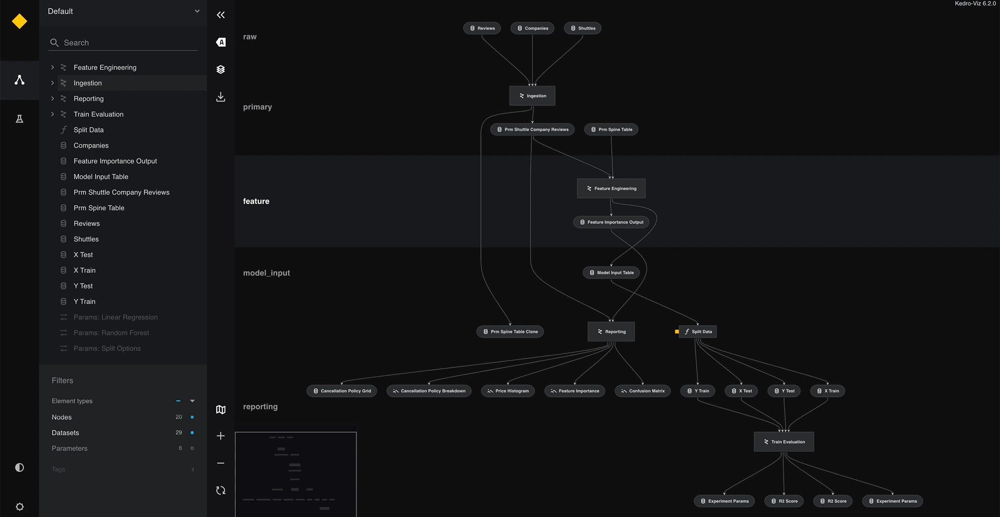
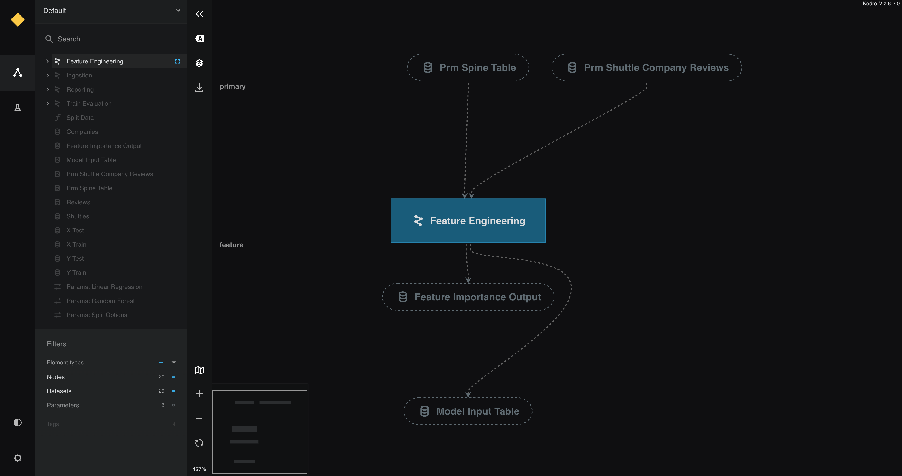

# Namespace pipelines

This section covers the following:

* A brief introduction to namespaces and modular pipelines
* How to convert the existing spaceflights project into a namespaced one

Add namespaces to [modular pipelines](../nodes_and_pipelines/modular_pipelines.md) to unlock some sophisticated functionality in Kedro.

1. You can [instantiate the same pipeline structure multiple times](../nodes_and_pipelines/modular_pipelines.md), but provide different inputs/outputs.
2. You can unlock the full power of [micro-packaging](../nodes_and_pipelines/micro_packaging.md).
3. You can de-clutter your mental model with Kedro-Viz rendering collapsible components.

    

## Adding a namespace to the  `data_processing` pipeline

* Update the code in `src/kedro_tutorial/pipelines/data_processing/pipeline.py` using the snippet below.
* This introduces the lowercase `pipeline()` method imported from `kedro.pipeline.modular_pipeline`.

    <details>
    <summary><b>Click to expand</b></summary>

    ```python
    from kedro.pipeline import Pipeline, node
    from kedro.pipeline.modular_pipeline import pipeline

    from .nodes import (
        preprocess_companies,
        preprocess_shuttles,
        create_model_input_table,
    )


    def create_pipeline(**kwargs) -> Pipeline:
        return pipeline(
            [
                node(
                    func=preprocess_companies,
                    inputs="companies",
                    outputs="preprocessed_companies",
                    name="preprocess_companies_node",
                ),
                node(
                    func=preprocess_shuttles,
                    inputs="shuttles",
                    outputs="preprocessed_shuttles",
                    name="preprocess_shuttles_node",
                ),
                node(
                    func=create_model_input_table,
                    inputs=["preprocessed_shuttles", "preprocessed_companies", "reviews"],
                    outputs="model_input_table",
                    name="create_model_input_table_node",
                ),
            ],
            namespace="data_processing",
            inputs=["companies", "shuttles", "reviews"],
            outputs="model_input_table",
        )
    ```

    </details>

* Append the `data_processing` namespace to the catalog entries for `preprocessed_shuttles` and `preprocessed_companies`. This is to ensure both datasets are still persisted when running the pipeline.

### Why must we provide explicit inputs and outputs?

* When introducing a namespace, you must tell Kedro which inputs/outputs live at the 'edges' of the namespace
* If you fail to do so in this situation, Kedro thinks that `companies` and `data_processing.companies` are two different datasets.
* Highlighting 'focus mode' Kedro-Viz highlights how the **explicitly declared** inputs/outputs live outside of the collapsed part of the namespace. `model_input_table` in particular is shared across both pipelines and thus must be outside of the `Data Processing` namespace.

    

> As an experiment, remove the explicit inputs and outputs from your `namespaced_pipeline` and see how this creates a disjointed pipeline visualisation.

## Adding namespaces to the  `data_science` pipeline

In this section, we want to add some namespaces in the modelling component of the pipeline, and also highlight the power of instantiating the same modular pipeline multiple times with different parameters.

1. Update the parameters file `conf/base/parameters/data_science.yml` with this snippet:

    ```yaml

    active_modelling_pipeline:
        model_options:
          test_size: 0.2
          random_state: 3
          features:
            - engines
            - passenger_capacity
            - crew
            - d_check_complete
            - moon_clearance_complete
            - iata_approved
            - company_rating
            - review_scores_rating

    candidate_modelling_pipeline:
        model_options:
          test_size: 0.2
          random_state: 8
          features:
            - engines
            - passenger_capacity
            - crew
            - review_scores_rating

    ```

2. Update your catalog to reflect the new namespaced outputs. Replace the `regressor` key with the following two new dataset keys in the `conf/base/catalog.yml` file:

    ```yaml

    active_modelling_pipeline.regressor:
      type: pickle.PickleDataSet
      filepath: data/06_models/regressor_active.pickle
      versioned: true
      layer: models

    candidate_modelling_pipeline.regressor:
      type: pickle.PickleDataSet
      filepath: data/06_models/regressor_candidate.pickle
      versioned: true
      layer: models

    ```

3. Update the code in the `pipelines/data_science/pipeline.py` file with the snippet below:

    <details>
    <summary><b>Click to expand</b></summary>

    ```python
    from kedro.pipeline import Pipeline, node
    from kedro.pipeline.modular_pipeline import pipeline

    from .nodes import evaluate_model, split_data, train_model


    def create_pipeline(**kwargs) -> Pipeline:
        pipeline_instance = pipeline(
            [
                node(
                    func=split_data,
                    inputs=["model_input_table", "params:model_options"],
                    outputs=["X_train", "X_test", "y_train", "y_test"],
                    name="split_data_node",
                ),
                node(
                    func=train_model,
                    inputs=["X_train", "y_train"],
                    outputs="regressor",
                    name="train_model_node",
                ),
                node(
                    func=evaluate_model,
                    inputs=["regressor", "X_test", "y_test"],
                    outputs=None,
                    name="evaluate_model_node",
                ),
            ]
        )
        ds_pipeline_1 = pipeline(
            pipe=pipeline_instance,
            inputs="model_input_table",
            namespace="active_modelling_pipeline",
        )
        ds_pipeline_2 = pipeline(
            pipe=pipeline_instance,
            inputs="model_input_table",
            namespace="candidate_modelling_pipeline",
        )

        return ds_pipeline_1 + ds_pipeline_2
    ```

    </details>

### Let's explain what's going on here

Modular pipelines allow you to instantiate multiple instances of pipelines with static structure, but dynamic inputs/outputs/parameters.

```python
pipeline_instance = pipeline(...)

ds_pipeline_1 = pipeline(
    pipe=pipeline_instance,
    inputs="model_input_table",
    namespace="active_modelling_pipeline",
)

ds_pipeline_2 = pipeline(
    pipe=pipeline_instance,
    inputs="model_input_table",
    namespace="candidate_modelling_pipeline",
)
```

> The `pipeline_instance` variable is our 'template' pipeline, `ds_pipeline_1` and `ds_pipeline_2` are our parameterised instantiations.

The table below describes the purpose of each keyword argument in detail:

| Keyword argument | `ds_pipeline_1`                                                                         | `ds_pipeline_2`              |
| ---------------- | --------------------------------------------------------------------------------------- | ---------------------------- |
| `inputs`         | Declaring `model_input_table` as a boundary input will not prefix it with the namespace | Same as `ds_pipeline_1`      |
| `outputs`        | No outputs are at the boundary of this pipeline so nothing to list here                 | Same as `ds_pipeline_1`      |
| `namespace`      | A unique namespace                                                                      | A different unique namespace |

## Nesting modular pipelines

* Modular pipelines can be nested an arbitrary number of times
* This can be an effective pattern for simplifying your mental model, and to reduce visual noise
* Namespaces will be chained using the `.` syntax, just like your `import` modules in Python
* To wrap your two modelling pipeline instances quickly under one 'Data science' namespace, add the following to your `pipelines/data_science/pipeline.py` return statement:

    ```python
    ...
    return pipeline(
        pipe=ds_pipeline_1 + ds_pipeline_2,
        inputs="model_input_table",
        namespace="data_science",
    )
    ```

  * As we've created an outer namespace `data_science`, we'll add the `data_science` prefix to our catalog entries for the `regressor` datasets. Additionally, you must add the `data_science` prefix at the top level of your parameter file `data_science.yml` and indent the other entries. The complete `catalog.yml` and `data_science.yml` parameter files should look like the below:

    <details>
    <summary><b>Click to expand</b></summary>

    `catalog.yml`
    ```yaml
    companies:
      type: pandas.CSVDataSet
      filepath: data/01_raw/companies.csv
      # more about layers in the Data Engineering Convention:
      # https://kedro.readthedocs.io/en/stable/tutorial/visualise_pipeline.html#interact-with-data-engineering-convention
      layer: raw

    reviews:
      type: pandas.CSVDataSet
      filepath: data/01_raw/reviews.csv
      layer: raw

    shuttles:
      type: pandas.ExcelDataSet
      filepath: data/01_raw/shuttles.xlsx
      layer: raw

    data_processing.preprocessed_companies:
      type: pandas.ParquetDataSet
      filepath: data/02_intermediate/preprocessed_companies.pq
      layer: intermediate

    data_processing.preprocessed_shuttles:
      type: pandas.ParquetDataSet
      filepath: data/02_intermediate/preprocessed_shuttles.pq
      layer: intermediate

    model_input_table:
      type: pandas.ParquetDataSet
      filepath: data/03_primary/model_input_table.pq
      layer: primary

    data_science.active_modelling_pipeline.regressor:
      type: pickle.PickleDataSet
      filepath: data/06_models/regressor_active.pickle
      versioned: true
      layer: models

    data_science.candidate_modelling_pipeline.regressor:
      type: pickle.PickleDataSet
      filepath: data/06_models/regressor_candidate.pickle
      versioned: true
      layer: models
    ```

    `parameters/data_science.yml`
    ```yaml
      data_science:
          active_modelling_pipeline:
            model_options:
              test_size: 0.2
              random_state: 3
              features:
                - engines
                - passenger_capacity
                - crew
                - d_check_complete
                - moon_clearance_complete
                - iata_approved
                - company_rating
                - review_scores_rating

          candidate_modelling_pipeline:
            model_options:
              test_size: 0.2
              random_state: 8
              features:
                - engines
                - passenger_capacity
                - crew
                - review_scores_rating
    ```

    </details>

    This renders as follows:

    
