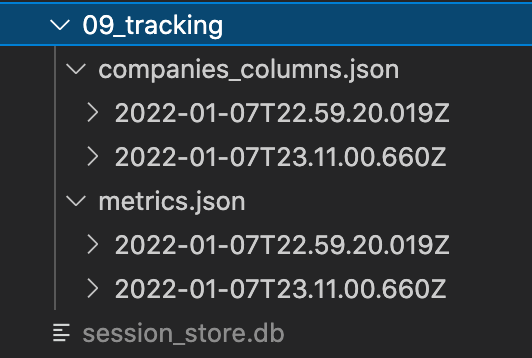
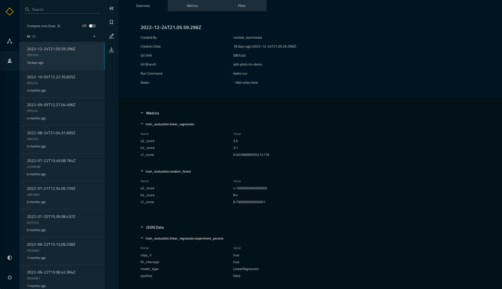

# Set up experiment tracking

Experiment tracking is the process of saving all machine-learning related experiment information so that it is easy to find and compare past runs. [Kedro-Viz](https://github.com/kedro-org/kedro-viz) supports native experiment tracking from [version 4.1.1](https://github.com/kedro-org/kedro-viz/releases/tag/v4.1.1) onwards. When experiment tracking is enabled in your Kedro project, you will be able to access, edit and compare your experiments directly from the Kedro-Viz web app.


Enabling experiment tracking features on Kedro-Viz relies on:
* [setting up a session store to capture experiment metadata](#set-up-the-session-store),
* [experiment tracking datasets to let Kedro know what metrics should be tracked](#set-up-tracking-datasets)
* [modifying your nodes and pipelines to output those metrics](#set-up-your-nodes-and-pipelines-to-log-metrics).

This tutorial will provide a step-by-step process to set up experiment tracking and access your logged metrics from each run on Kedro-Viz. It will use the spaceflights starter project outlined in [this tutorial](../tutorial/spaceflights_tutorial.md) and build on previously discussed topics such as [namespacing](../tutorial/namespace_pipelines.md). You can also jump directly to [this section for direct reference in setting up experiment tracking](../logging/experiment_tracking.md) for your Kedro project.

You can also access a more detailed [demo](https://kedro-viz-live-demo.hfa4c8ufrmn4u.eu-west-2.cs.amazonlightsail.com/).

## Set up a project

```{note}
You can skip this step if you have followed all previous parts of the tutorial.
```

We assume that you have already [installed Kedro](../get_started/install.md) and [Kedro-Viz](../tutorial/visualise_pipeline.md). To set up a new project using the spaceflights starter, run:

```bash
kedro new --starter=spaceflights
```

Feel free to name your project as you like, but this guide will assume the project is named **Kedro Experiment Tracking Tutorial**, and that your project is in a sub-folder in your working directory that was created by `kedro new`, named `kedro-experiment-tracking-tutorial`. To keep the default names for the `repo_name` and `python_package` when prompted, press the enter key.

## Set up the session store

In the domain of experiment tracking, each pipeline run is considered a session. A session store records all related metadata for each pipeline run, from logged metrics to other run-related data such as timestamp, git username and branch. The session store is a [SQLite](https://www.sqlite.org/index.html) database that is generated during your first pipeline run after it has been set up in your project.

To set up the session store, go to the `src/settings.py` file and add the following:

```python
from kedro_viz.integrations.kedro.sqlite_store import SQLiteStore
from pathlib import Path

SESSION_STORE_CLASS = SQLiteStore
SESSION_STORE_ARGS = {"path": str(Path(__file__).parents[2] / "data")}
```

This will specify the creation of the `SQLiteStore` under the `/data` subfolder, using the `SQLiteStore` setup from your installed Kedro-Viz plugin.

Please ensure that your installed version of Kedro-Viz is at least version 4.1.1 onwards. This step is crucial to enable experiment tracking features on Kedro-Viz, as it is the database used to serve all run data to the Kedro-Viz front-end. Once this step is complete, you can either proceed to [set up the tracking datasets](#set-up-tracking-datasets) or [set up your nodes and pipelines to log metrics](#set-up-your-nodes-and-pipelines-to-log-metrics); these two activities are interchangeable.

## Set up tracking datasets

There are two types of tracking datasets: [`tracking.MetricsDataSet`](/kedro.extras.datasets.tracking.MetricsDataSet) and [`tracking.JSONDataSet`](/kedro.extras.datasets.tracking.JSONDataSet). The `tracking.MetricsDataSet` should be used for tracking numerical metrics, and the `tracking.JSONDataSet` can be used for tracking any other JSON-compatible data like boolean or text-based data.

Set up two datasets to log `r2 scores` and `parameters` for each run by adding the following in the `conf/base/catalog.yml` file:

```yaml
data_science.active_modelling_pipeline.metrics:
  type: tracking.MetricsDataSet
  filepath: data/09_tracking/metrics.json

data_processing.companies_columns:
  type: tracking.JSONDataSet
  filepath: data/09_tracking/companies_columns.json
```

```{note}
These two datasets include namespaces to correspond to the pipeline setup. If you have a project without namespaces, you can still use experiment tracking.
```

## Set up your nodes and pipelines to log metrics

Now that you have set up the tracking datasets to log experiment tracking data, next ensure that the data is returned from your nodes.

Set up the data to be logged for the metrics dataset - under `nodes.py` of your `data_science` pipeline (`/src/kedro-experiment-tracking-tutorial/pipelines/data_science/nodes.py`), add three different metrics to your `evaluate_model` function: `score` to log your r2 score, `mae` to log your mean absolute error, and `me` to log your max error, and returning those 3 metrics as a key value pair.

The new `evaluate_model` function would look like this:

```python
from sklearn.metrics import mean_absolute_error, max_error


def evaluate_model(
    regressor: LinearRegression, X_test: pd.DataFrame, y_test: pd.Series
) -> Dict[str, float]:
    """Calculates and logs the coefficient of determination.

    Args:
        regressor: Trained model.
        X_test: Testing data of independent features.
        y_test: Testing data for price.
    """
    y_pred = regressor.predict(X_test)
    score = r2_score(y_test, y_pred)
    mae = mean_absolute_error(y_test, y_pred)
    me = max_error(y_test, y_pred)
    logger = logging.getLogger(__name__)
    logger.info("Model has a coefficient R^2 of %.3f on test data.", score)
    return {"r2_score": score, "mae": mae, "max_error": me}
```

Next, ensure that the dataset is also specified as an output of your `evaluate_model` node. In the `src/kedro-experiment-tracking-tutorial/pipelines/data_science/pipeline.py` file, specify the `output` of your `evaluate_model` to be the `metrics` dataset. Note that the output dataset must exactly match the name of the tracking dataset specified in the catalog file.

The node of the `evaluate_model` on the pipeline should look like this:

```python
node(
    func=evaluate_model,
    inputs=["regressor", "X_test", "y_test"],
    name="evaluate_model_node",
    outputs="metrics",
)
```

Repeat the same steps to set up the `companies_column` dataset. For this dataset, log the column that contains the list of companies as outlined in the `companies.csv` file under the `/data/01_raw` directory. Modify the `preprocess_companies` node under the `data_processing` pipeline (`src/kedro-experiment-tracking-tutorial/pipelines/data_processing/nodes.py`) to return the data under a key value pair, as shown below:

```python
from typing import Tuple, Dict


def preprocess_companies(companies: pd.DataFrame) -> Tuple[pd.DataFrame, Dict]:
    """Preprocesses the data for companies.

    Args:
        companies: Raw data.
    Returns:
        Preprocessed data, with `company_rating` converted to a float and
        `iata_approved` converted to boolean.
    """
    companies["iata_approved"] = _is_true(companies["iata_approved"])
    companies["company_rating"] = _parse_percentage(companies["company_rating"])
    return companies, {"columns": companies.columns.tolist(), "data_type": "companies"}
```

Again, you must ensure that the dataset is also specified as an output on the `pipeline.py` file under the `data_processing` pipeline (`src/kedro-experiment-tracking-tutorial/pipelines/data_processing/pipeline.py`), as follows:

```python
node(
    func=preprocess_companies,
    inputs="companies",
    outputs=["preprocessed_companies", "companies_columns"],
    name="preprocess_companies_node",
)
```

Having set up both datasets, you can now generate your first set of experiment tracking data!

## Generate the Run data

The beauty of native experiment tracking in Kedro is that all tracked data is generated and stored each time you do a Kedro run. Hence, to generate the data, you need only execute:

```bash
kedro run
```

After the run completes, under `data/09_tracking`, you will now see two folders, `companies_column.json` and `metrics.json`. On performing a pipeline run after setting up the tracking datasets, Kedro will generate a folder with the dataset name for each tracked dataset. Each folder of the tracked dataset will contain folders named by the timestamp of each pipeline run to store the saved metrics of the dataset, and each future pipeline run will generate a new timestamp folder with the JSON file of the saved metrics under the folder of its subsequent tracked dataset.

You will also see the `session_store.db` generated from your first pipeline run after enabling experiment tracking, which is used to store all the generated run metadata, alongside the tracking dataset, to be used for exposing experiment tracking to Kedro-Viz.



Try to execute `kedro run` a few times to generate a larger set of experiment data. You can also play around with setting up different tracking datasets, and check the logged data via the generated JSON data files.

## Access run data and compare runs

Here comes the fun part of accessing your run data on Kedro-Viz. Having ensured that you are using Kedro-Viz `>=4.1.1` (you can confirm your Kedro-Viz version by running `kedro info`), run:

```bash
kedro viz
```

When you open the Kedro-Viz web app, you will see an experiment tracking icon  on your left. Click the icon to go to the experiment tracking page (you can also access the page via `http://127.0.0.1:4141/runsList`), where you will now see the set of experiment data generated from your previous runs:



You can now access, compare and pin your runs by toggling the `Compare runs` button:


Keep an eye out on the [Kedro-Viz release page](https://github.com/kedro-org/kedro-viz/releases) for the upcoming releases on this experiment tracking functionality.
