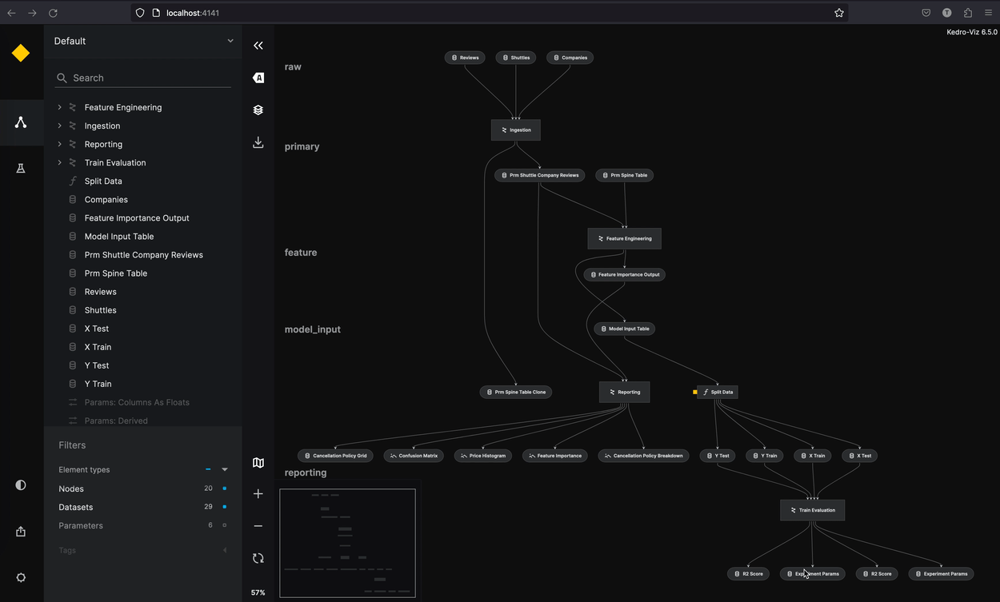

# Deploy Kedro-Viz

This page describes how to generate a deployed, shareable URL with Kedro-Viz. Shareable URLs were introduced in Kedro-Viz version 7.0.0.

We use the [spaceflights tutorial](../tutorial/spaceflights_tutorial.md) to demonstrate how to generate a deployed version of Kedro-Viz. Even if you have not yet worked through the tutorial, you can still follow this example; you'll need to use the [Kedro starter for the spaceflights tutorial](https://github.com/kedro-org/kedro-starters/tree/main/spaceflights) to generate a copy of the project with working code in place.

If you haven't installed Kedro [follow the documentation to get set up](../get_started/install.md).

Then, in your terminal window, navigate to the folder you want to store the project.

Generate a copy of the spaceflights tutorial project with all the code in place by using the [Kedro starter for the spaceflights tutorial](https://github.com/kedro-org/kedro-starters/tree/main/spaceflights):

```bash
kedro new --starter=spaceflights
```

When prompted for a project name, you can enter anything, but we will assume `Spaceflights` throughout.

When your project is ready, navigate to the root directory of the project.

### Update the dependencies

Kedro-Viz requires specific minimum versions of `fsspec` and `kedro` in order to deploy your project.

You can ensure you have these correct versions by updating in the `requirements.txt` file in the `src` folder of the Kedro project to the following:

```text
fsspec>=2023.9.0
kedro>=0.18.2
```

Navigate to the root directory of the project in your terminal and install the dependencies for the tutorial project:

```bash
pip install -r src/requirements.txt
```

## Configure your AWS S3 bucket and set credentials

Currently, Kedro-Viz only supports hosting a deployed URL on Amazon S3. You must first create an S3 bucket and then enable static website hosting. To do so, follow the [AWS tutorial](https://docs.aws.amazon.com/AmazonS3/latest/userguide/HostingWebsiteOnS3Setup.html) to configuring a static website on Amazon S3.

Once that's completed, you'll need to set your AWS credentials as environment variables in your terminal window, as shown below:

```bash
export AWS_ACCESS_KEY_ID="your_access_key_id"
export AWS_SECRET_ACCESS_KEY="your_secret_access_key"
```

For more details on working with credentials, please refer to the [official documentation](https://docs.aws.amazon.com/cli/latest/userguide/cli-configure-envvars.html).

## Deploy Kedro-Viz

You're now ready to deploy your Kedro-Viz project. Start Kedro-Viz by running the following command in your terminal:

```bash
kedro viz
```

Click the **Deploy and share** icon in the lower-left of the application. That will bring up a modal, where you'll need to choose your relevant AWS Bucket Region and enter your Bucket Name.

Once those two form fields are filled, click Deploy. After a few seconds, a hosted, shareable URL will be returned to you.

Here's an example of the flow:


