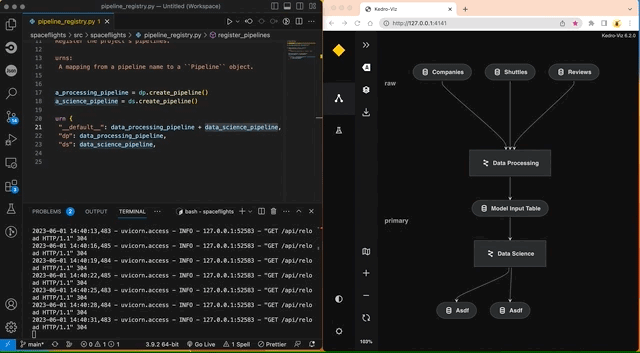
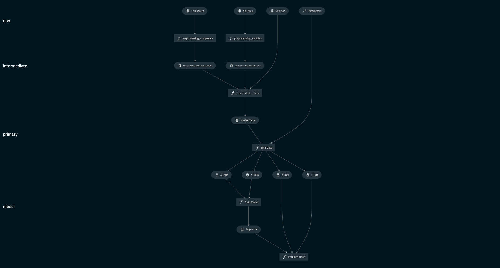

# Visualise the spaceflights project


This section assumes you are familiar with the basic Kedro concepts described in the [spaceflights tutorial](../tutorial/spaceflights_tutorial.md). If you have not yet worked through the tutorial, you can still follow this example.

If you haven't installed Kedro [follow the documentation to get set up](../get_started/install.md).

Then, in your terminal window, navigate to the folder you want to store the project.

Generate a copy of the spaceflights tutorial project with all the code in place by using the [Kedro starter for the spaceflights tutorial](https://github.com/kedro-org/kedro-starters/tree/main/spaceflights-pandas):

```bash
kedro new --starter=spaceflights-pandas
```

When prompted for a project name, you can enter anything, but we will assume `Spaceflights` throughout.

When your project is ready, navigate to the root directory of the project and install the dependencies for the project, which include Kedro-Viz:

```bash
pip install -r requirements.txt
```

The next step is optional, but useful to check that all is working. Run the full set of pipelines for the tutorial project:

```bash
kedro run
```

To start Kedro-Viz, type the following into your terminal from the project directory:

```bash
kedro viz
```

The command opens a browser tab to serve the visualisation at `http://127.0.0.1:4141/`.

You should see the following:


If a visualisation panel opens up and a pipeline is not visible, refresh the view, and check that your tutorial project code is complete if you've not generated it from the starter template. If you still don't see the visualisation, the Kedro community can help:

* use the [#questions channel](https://slack.kedro.org/) on our Slack channel to ask the community for help
* search the [searchable archive of Slack discussions](https://linen-slack.kedro.org/)

To exit the visualisation, close the browser tab. To regain control of the terminal, enter `^+c` on Mac or `Ctrl+c` on Windows or Linux machines.

## Automatic visualisation updates

You can use the `--autoreload` flag to autoreload Kedro-Viz when a `Python` or `YAML` file changes in the project. Add the flag to the command you use to start Kedro-Viz:

```bash
kedro viz --autoreload
```



The `autoreload` flag reflects changes to the project as they happen. For example, commenting out `create_model_input_table_node` in `pipeline.py` will trigger a re-render of the pipeline:


## Visualise layers

By convention, a [pipeline can be defined as having different layers](../resources/glossary.md#layers-data-engineering-convention) according to how data is processed, which makes it easier to collaborate.

For example, the [data engineering convention](https://towardsdatascience.com/the-importance-of-layered-thinking-in-data-engineering-a09f685edc71) labels datasets according to the stage of the pipeline (e.g. whether the data has been cleaned).

In Kedro version 0.18.9 we changed the way layers are defined in the Data Catalog. The definition is now included under the `metadata` key for `kedro-viz` (previously it was an attribute specified within a dataset's definition).

Here's an example of how to use the Kedro-Viz metadata to define layers:

```yaml
companies:
  type: pandas.CSVDataset
  filepath: data/01_raw/companies.csv
  metadata:
    kedro-viz:
      layer: raw
```

In earlier versions of Kedro, layers were specified within a dataset's definition in the Data Catalog, but this will **no longer be supported** from Kedro version 0.19.0. From that version onwards, your `catalog.yml` must specify layers as metadata.

```diff
companies:
  type: pandas.CSVDataset
  filepath: data/01_raw/companies.csv
-  layer: raw
+   metadata:
+     kedro-viz:
+       layer: raw
```

Open `catalog.yml` for the completed spaceflights tutorial and define layers in the following way:

```yaml
companies:
  type: pandas.CSVDataset
  filepath: data/01_raw/companies.csv
  metadata:
    kedro-viz:
      layer: raw

reviews:
  type: pandas.CSVDataset
  filepath: data/01_raw/reviews.csv
  metadata:
    kedro-viz:
      layer: raw

shuttles:
  type: pandas.ExcelDataset
  filepath: data/01_raw/shuttles.xlsx
  metadata:
    kedro-viz:
      layer: raw

preprocessed_companies:
  type: pandas.ParquetDataset
  filepath: data/02_intermediate/preprocessed_companies.pq
  metadata:
    kedro-viz:
      layer: intermediate

preprocessed_shuttles:
  type: pandas.ParquetDataset
  filepath: data/02_intermediate/preprocessed_shuttles.pq
  metadata:
    kedro-viz:
      layer: intermediate

model_input_table:
  type: pandas.ParquetDataset
  filepath: data/03_primary/model_input_table.pq
  metadata:
    kedro-viz:
      layer: primary

regressor:
  type: pickle.PickleDataset
  filepath: data/06_models/regressor.pickle
  versioned: true
  metadata:
    kedro-viz:
      layer: models
```

The visualisation now includes the layers:



## Share a pipeline visualisation

You can share a the pipeline structure within a Kedro-Viz visualisation as a JSON file from the terminal:

```bash
kedro viz --save-file=my_shareable_pipeline.json
```

This command will save a visualisation of the `__default__` pipeline as a JSON file called `my_shareable_pipeline.json`. It doesn't share data, such as that in the code panel, nor can you share images or charts.

To visualise the shared file, type the following to load it from the terminal:

```bash
kedro viz --load-file=my_shareable_pipeline.json
```
