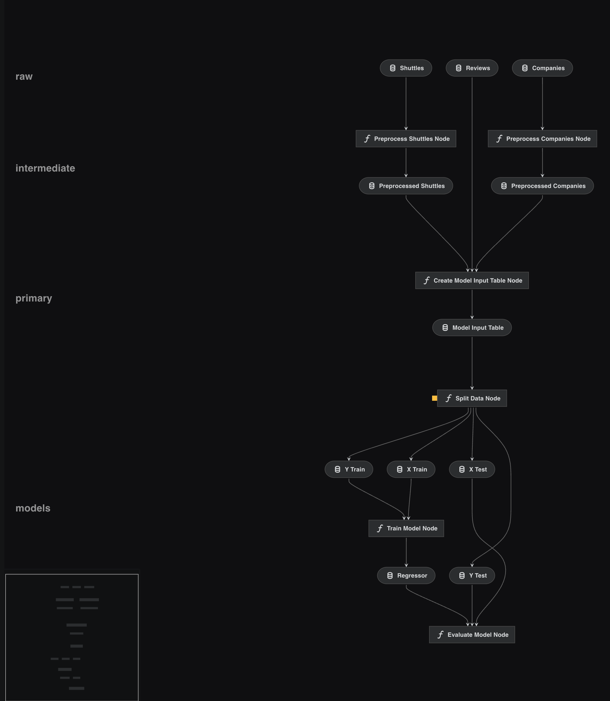

# Get started with Kedro-Viz

This page assumes you are familiar with the basic Kedro concepts described in the [Spaceflights tutorial](../tutorial/spaceflights_tutorial.md). If you have not yet worked through the tutorial, you can generate the project with all the code in place by using the [Kedro starter for the spaceflights tutorial](https://github.com/kedro-org/kedro-starters/tree/main/spaceflights):

```
kedro new --starter=spaceflights
```

When prompted for a project name, you can enter any name, but we will assume `Kedro Tutorial` throughout this documentation. When your project is ready, navigate to the root directory of the project.


## Install Kedro-Viz and visualise the project

[Kedro-Viz](https://github.com/kedro-org/kedro-viz) displays data and machine-learning pipelines in an informative way, emphasising the connections between datasets and nodes. It shows the structure of your Kedro pipeline.

To install the dependencies for the project, including Kedro-Viz, type the following in your terminal, from the root of the project directory:

```bash
pip install -r src/requirements.txt
```

Next, type the following to run Kedro-Viz:

```bash
kedro viz
```

This command automatically opens a browser tab to serve the visualisation at http://127.0.0.1:4141/.

You should see the following:


If a visualisation panel opens up and a pipeline is not visible, then please check that your [pipeline definition](../tutorial/create_a_pipeline.md) is complete. All other errors can be logged as GitHub Issues on the [Kedro-Viz repository](https://github.com/kedro-org/kedro-viz).

### Exit an open visualisation
To exit the visualisation, close the browser tab. To regain control of the terminal, enter `Ctrl+C` or `Cmd+C`.

## Automatic visualisation updates

You can use the `--autoreload` flag to autoreload Kedro Viz when a `Python` or `YAML` file changes in the project.


Add the flag to the command you use to start Kedro-Viz:

```bash
kedro viz --autoreload
```

The `autoreload` flag reflects changes to the project as they happen. For example, commenting out `create_model_input_table_node` in `pipeline.py` will trigger a re-render of the pipeline:


## Visualise layers

By convention, a pipeline can be broken up into different layers according to how data is processed, which makes it easier to collaborate.

For example, the [data engineering convention](../faq/faq.md#what-is-data-engineering-convention) labels datasets according to the stage of the pipeline (e.g. whether the data has been cleaned).

You can add a `layer` attribute to the datasets in the Data Catalog, which is reflected in the Kedro-Viz visualisation.

Open `catalog.yml` for the completed spaceflights tutorial and replace the existing code with the following:

```yaml
companies:
  type: pandas.CSVDataSet
  filepath: data/01_raw/companies.csv
  layer: raw

reviews:
  type: pandas.CSVDataSet
  filepath: data/01_raw/reviews.csv
  layer: raw

shuttles:
  type: pandas.ExcelDataSet
  filepath: data/01_raw/shuttles.xlsx
  layer: raw

preprocessed_companies:
  type: pandas.ParquetDataSet
  filepath: data/02_intermediate/preprocessed_companies.pq
  layer: intermediate

preprocessed_shuttles:
  type: pandas.ParquetDataSet
  filepath: data/02_intermediate/preprocessed_shuttles.pq
  layer: intermediate

model_input_table:
  type: pandas.ParquetDataSet
  filepath: data/03_primary/model_input_table.pq
  layer: primary

regressor:
  type: pickle.PickleDataSet
  filepath: data/06_models/regressor.pickle
  versioned: true
  layer: models
```

Run Kedro-Viz again and observe how your visualisation has changed to include the layers:



## Share a pipeline

You can share a Kedro-Viz visualisation as a JSON file:

```bash
kedro viz --save-file my_shareable_pipeline.json
```

This command will save a visualisation of your primary `__default__` pipeline as a JSON file called `my_shareable_pipeline.json`.

To visualise the JSON file:

```bash
kedro viz --load-file my_shareable_pipeline.json
```
