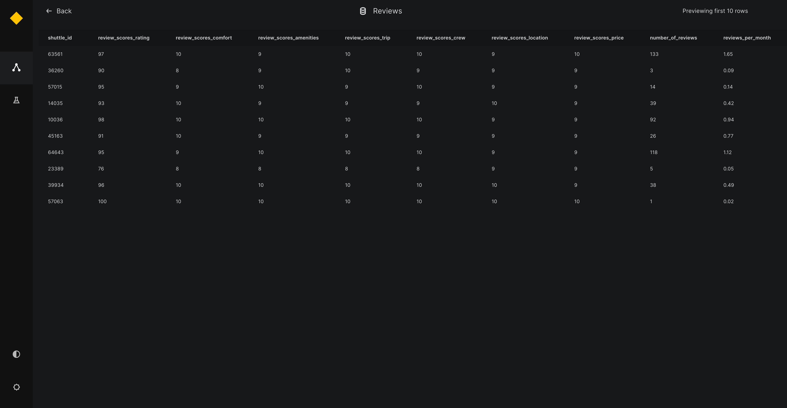

# Preview data in Kedro-Viz

This page describes how to preview data from different datasets in a Kedro project with Kedro-Viz. Dataset preview was introduced in Kedro-Viz version 6.3.0, which offers preview for `CSVDatasets` and `ExcelDatasets`.

We use the [spaceflights tutorial](../tutorial/spaceflights_tutorial.md) to demonstrate how to add data preview for the `customer`, `shuttle` and `reviews` datasets. Even if you have not yet worked through the tutorial, you can still follow this example; you'll need to use the [Kedro starter for the spaceflights tutorial](https://github.com/kedro-org/kedro-starters/tree/main/spaceflights-pandas) to generate a copy of the project with working code in place.

If you haven't installed Kedro [follow the documentation to get set up](../get_started/install.md).

Then, in your terminal window, navigate to the folder you want to store the project.

Generate a copy of the spaceflights tutorial project with all the code in place by using the [Kedro starter for the spaceflights tutorial](https://github.com/kedro-org/kedro-starters/tree/main/spaceflights-pandas):

```bash
kedro new --starter=spaceflights-pandas
```

When prompted for a project name, you can enter anything, but we will assume `Spaceflights` throughout.

When your project is ready, navigate to the root directory of the project.

## Configure the Data Catalog

Kedro-Viz version 6.3.0 currently supports preview of two types of datasets:

* `pandas.CSVDataset`
* `pandas.ExcelDataset`


To enable dataset preview, add the `preview_args` attribute to the kedro-viz configuration under the `metadata` section in the Data Catalog. Within preview_args, specify `nrows` as the number of rows to preview for the dataset.

```yaml
companies:
  type: pandas.CSVDataset
  filepath: data/01_raw/companies.csv
  metadata:
    kedro-viz:
      layer: raw
      preview_args:
          nrows: 5

reviews:
  type: pandas.CSVDataset
  filepath: data/01_raw/reviews.csv
  metadata:
    kedro-viz:
      layer: raw
      preview_args:
          nrows: 10

shuttles:
  type: pandas.ExcelDataset
  filepath: data/01_raw/shuttles.xlsx
  metadata:
    kedro-viz:
      layer: raw
      preview_args:
          nrows: 15
```


## Previewing Data on Kedro-viz

After you've configured the Data Catalog, you can preview the datasets on Kedro-Viz. Start Kedro-Viz by running the following command in your terminal:

```bash
kedro viz
```

The previews are shown as follows:

Click on each dataset node to see a small preview in the metadata panel:


View the larger preview of the dataset by clicking the `Expand Preview Table` button on the bottom of the metadata panel.



