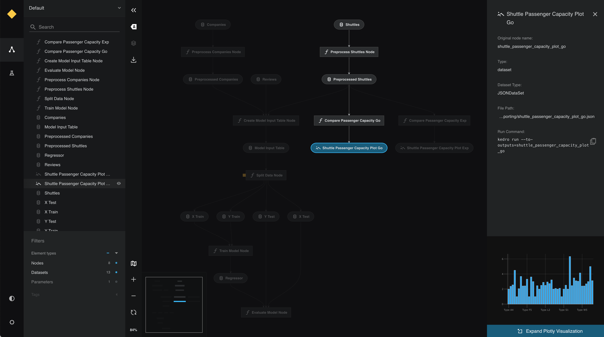

# Visualise charts in Kedro-Viz

This page describes how to make interactive visualisations of a Kedro project with Kedro-Viz, which supports integration with [Plotly](https://plotly.com/python/) and [Matplotlib](https://matplotlib.org/).

## Visualisation with Plotly

We use the [spaceflights tutorial](../tutorial/spaceflights_tutorial.md) and add a reporting pipeline that uses Plotly. Even if you have not yet worked through the tutorial, you can still follow this example; you'll need to use the [Kedro starter for the spaceflights tutorial](https://github.com/kedro-org/kedro-starters/tree/main/spaceflights-pandas) to generate a copy of the project with working code in place.

If you haven't installed Kedro [follow the documentation to get set up](../get_started/install.md).

Then, in your terminal window, navigate to the folder you want to store the project.

Generate a copy of the spaceflights tutorial project with all the code in place by using the [Kedro starter for the spaceflights tutorial](https://github.com/kedro-org/kedro-starters/tree/main/spaceflights-pandas):

```bash
kedro new --starter=spaceflights-pandas
```

When prompted for a project name, you can enter anything, but we will assume `Spaceflights` throughout.

When your project is ready, navigate to the root directory of the project.

### Update the dependencies

There are two types of Plotly datasets supported by Kedro:

* `plotly.PlotlyDataset` which only supports [Plotly Express](https://plotly.com/python/plotly-express)
* `plotly.JSONDataset` which supports Plotly Express and [Plotly Graph Objects](https://plotly.com/python/graph-objects/)

To use the Plotly datasets, you must update the `requirements.txt` file in the `src` folder of the Kedro project to add the following dependencies:


```text
kedro-datasets[pandas.CSVDataset, pandas.ExcelDataset, pandas.ParquetDataset]~=1.1
kedro-datasets[plotly.PlotlyDataset, plotly.JSONDataset]~=1.1
```

Navigate to the root directory of the project in your terminal and install the dependencies for the tutorial project:

```bash
pip install -r requirements.txt
```

### Configure the Data Catalog

To use the datasets, add them to the Data Catalog by updating `conf/base/catalog.yml`:

```yaml
shuttle_passenger_capacity_plot_exp:
  type: plotly.PlotlyDataset
  filepath: data/08_reporting/shuttle_passenger_capacity_plot_exp.json
  versioned: true
  plotly_args:
    type: bar
    fig:
      x: shuttle_type
      y: passenger_capacity
      orientation: h
    layout:
      xaxis_title: Shuttles
      yaxis_title: Average passenger capacity
      title: Shuttle Passenger capacity

shuttle_passenger_capacity_plot_go:
  type: plotly.JSONDataset
  filepath: data/08_reporting/shuttle_passenger_capacity_plot_go.json
  versioned: true
```


### Create the template reporting pipeline

In the terminal, run the following command to generate a template for the reporting pipeline:

```bash
kedro pipeline create reporting
```

### Add the Plotly reporting nodes

Add the following to `src/spaceflights/pipelines/reporting/nodes.py`:

```python
import plotly.express as px
import plotly.graph_objs as go
import pandas as pd

# This function uses plotly.express
def compare_passenger_capacity_exp(preprocessed_shuttles: pd.DataFrame):
    return (
        preprocessed_shuttles.groupby(["shuttle_type"])
        .mean(numeric_only=True)
        .reset_index()
    )


# This function uses plotly.graph_objects
def compare_passenger_capacity_go(preprocessed_shuttles: pd.DataFrame):

    data_frame = (
        preprocessed_shuttles.groupby(["shuttle_type"])
        .mean(numeric_only=True)
        .reset_index()
    )
    fig = go.Figure(
        [
            go.Bar(
                x=data_frame["shuttle_type"],
                y=data_frame["passenger_capacity"],
            )
        ]
    )

    return fig
```

### Update the reporting pipeline code

Update `src/spaceflights/pipelines/reporting/pipeline.py` to replace the existing code with the following:

```python
from kedro.pipeline import Pipeline, node, pipeline
from .nodes import compare_passenger_capacity_exp, compare_passenger_capacity_go


def create_pipeline(**kwargs) -> Pipeline:
    """This is a simple pipeline which generates a pair of plots"""
    return pipeline(
        [
            node(
                func=compare_passenger_capacity_exp,
                inputs="preprocessed_shuttles",
                outputs="shuttle_passenger_capacity_plot_exp",
            ),
            node(
                func=compare_passenger_capacity_go,
                inputs="preprocessed_shuttles",
                outputs="shuttle_passenger_capacity_plot_go",
            ),
        ]
    )
```


### Run the pipeline

Now run the pipelines:

```bash
kedro run
```

Then visualise with `kedro viz`

The generated charts are shown as follows:

.

Click on each of see a small preview in the metadata panel:



View the larger visualisation of the chart by clicking the 'Expand Plotly Visualisation' button on the bottom of the metadata panel.


## Visualisation with Matplotlib

Integrating Matplotlib into Kedro-Viz allows you to output charts as part of pipeline visualisation.

```{note}
The MatplotlibWriter dataset converts Matplotlib objects to image files. This means that Matplotlib charts within Kedro-Viz are static and not interactive, unlike the Plotly charts seen above.
```

You can view Matplotlib charts in Kedro-Viz when you use the [Kedro MatplotLibWriter dataset](/kedro_datasets.matplotlib.MatplotlibWriter).

### Update the dependencies

You must update the `requirements.txt` file in the Kedro project by adding the following dataset to enable Matplotlib for the project:

```bash
kedro-datasets[matplotlib.MatplotlibWriter]~=1.1
seaborn~=0.12.1
```

### Configure the Data Catalog
You must also specify the output type in the `catalog.yml` file for the Data Catalog:

```yaml
dummy_confusion_matrix:
  type: matplotlib.MatplotlibWriter
  filepath: data/08_reporting/dummy_confusion_matrix.png
  versioned: true
```

### Add another node
Add the following to `src/spaceflights/pipelines/reporting/nodes.py`:

```python
import matplotlib.pyplot as plt
import seaborn as sn

...


def create_confusion_matrix(companies: pd.DataFrame):
    actuals = [0, 1, 0, 0, 1, 1, 1, 0, 1, 0, 1]
    predicted = [1, 1, 0, 1, 0, 1, 0, 0, 0, 1, 1]
    data = {"y_Actual": actuals, "y_Predicted": predicted}
    df = pd.DataFrame(data, columns=["y_Actual", "y_Predicted"])
    confusion_matrix = pd.crosstab(
        df["y_Actual"], df["y_Predicted"], rownames=["Actual"], colnames=["Predicted"]
    )
    sn.heatmap(confusion_matrix, annot=True)
    return plt
```

### Update the pipeline

Update `src/spaceflights/pipelines/reporting/pipeline.py` to add the following to `create_pipeline`:

```python
from .nodes import create_confusion_matrix

...


def create_pipeline(**kwargs) -> Pipeline:
    """This is a simple pipeline which generates a plot"""
    return pipeline(
        [
            node(
                func=create_confusion_matrix,
                inputs="companies",
                outputs="dummy_confusion_matrix",
            ),
        ]
    )
```

### Run the pipeline

Run the pipelines with `kedro run` and then visualise the result with `kedro viz`.

Click to see a small preview of the Matplotlib image in the metadata panel.


View the larger visualisation of the chart by clicking the 'Expand Matplotlib Image' button on the bottom of the metadata panel.


