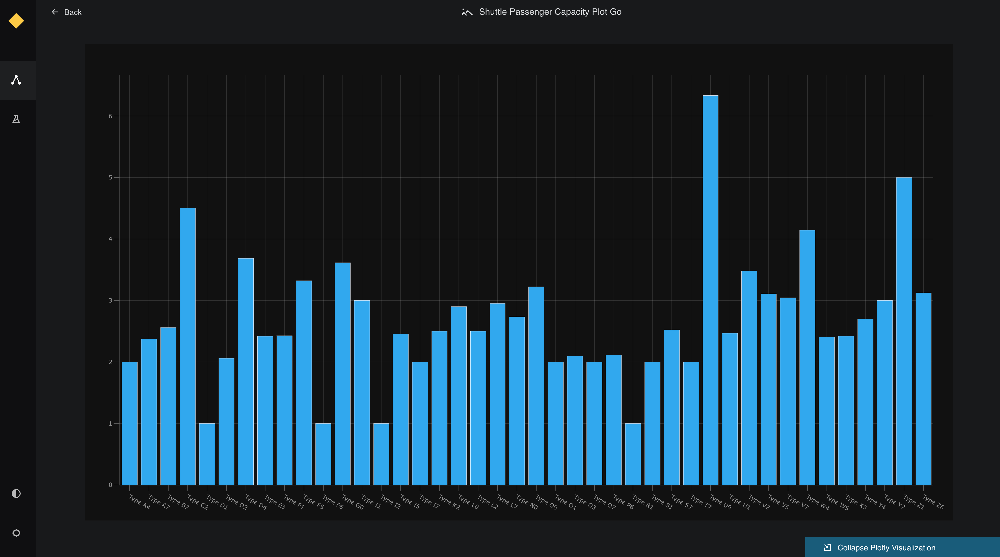

# Visualise charts in Kedro-Viz

This page describes how to make interactive visualisations of your Kedro projects with Kedro-Viz, which supports integration with [Plotly](https://plotly.com/python/) and [Matplotlib](https://matplotlib.org/).
 
## Visualisation with Plotly

We use the [spaceflights tutorial](../tutorial/spaceflights_tutorial.md) and add a reporting pipeline that uses Plotly. Even if you have not yet worked through the tutorial, you can still follow this example; you'll need to use the [Kedro starter for the spaceflights tutorial](https://github.com/kedro-org/kedro-starters/tree/main/spaceflights) to generate a copy of the project with working code in place:

From your terminal:

```bash
kedro new --starter=spaceflights
```

When prompted for a project name, you can enter any name, but we will assume `Kedro Tutorial` throughout. 

### Update the dependencies

There are two types of Plotly datasets supported by Kedro: 

* `plotly.PlotlyDataSet` which only supports [Plotly Express](https://plotly.com/python/plotly-express)
* `plotly.JSONDataSet` which supports Plotly Express and [Plotly Graph Objects](https://plotly.com/python/graph-objects/)

To use the Plotly datasets, you must update the `requirements.txt` file in the `src` folder of your Kedro project to add the following:

```text
kedro-datasets[plotly.PlotlyDataSet, plotly.JSONDataSet]~=1.0.0
```

Navigate to the root directory of the project in your terminal and install the dependencies for the tutorial project:

```bash
pip install -r src/requirements.txt
```

### Configure the Data Catalog

To use the datasets, add them to the Data Catalog by updating `conf/base/catalog.yml`:

```yaml
shuttle_passenger_capacity_plot:
  type: plotly.PlotlyDataSet
  filepath: data/08_reporting/shuttle_passenger_capacity_plot.json
  plotly_args:
    type: bar
    fig:
      x: shuttle_type
      y: passenger_capacity
      orientation: h
    layout:
      xaxis_title: Shuttles
      yaxis_title: Average passenger capacity
      title: Shuttle Passenger capacity

shuttle_passenger_capacity_plot:
  type: plotly.JSONDataSet
  filepath: data/08_reporting/shuttle_passenger_capacity_plot.json

```


### Create the template reporting pipeline 

In the terminal, run the following command to generate a template for the reporting pipeline:

```bash
kedro pipeline create reporting
```

### Add the Plotly reporting nodes

Add the following to `src/kedro_tutorial/pipelines/reporting/nodes.py`:

```python
import plotly.express as px
import plotly.graph_objs as go
import pandas as pd

def compare_passenger_capacity(preprocessed_shuttles: pd.DataFrame):
    return preprocessed_shuttles.groupby(["shuttle_type"]).mean().reset_index()


# This function uses plotly.express
def compare_passenger_capacity(preprocessed_shuttles: pd.DataFrame):
    fig = px.bar(
        data_frame=preprocessed_shuttles.groupby(["shuttle_type"]).mean().reset_index(),
        x="shuttle_type",
        y="passenger_capacity",
    )
    return fig


# This function uses plotly.graph_objects
def compare_passenger_capacity(preprocessed_shuttles: pd.DataFrame):
    data_frame = preprocessed_shuttles.groupby(["shuttle_type"]).mean().reset_index()
    fig = go.Figure(
        [
            go.Bar(
                x=data_frame["shuttle_type"],
                y=data_frame["passenger_capacity"],
            )
        ]
    )
    return fig
```

### Update the reporting pipeline code

Update `src/kedro_tutorial/pipelines/reporting/pipeline.py` to replace the existing code with the following:

```python

from kedro.pipeline import Pipeline, node, pipeline
from .nodes import compare_passenger_capacity

def create_pipeline(**kwargs) -> Pipeline:
    """This is a simple pipeline which generates a plot"""
    return pipeline(
        [
            node(
                func=compare_passenger_capacity,
                inputs="preprocessed_shuttles",
                outputs="shuttle_passenger_capacity_plot",
            ),
        ]
    )
```


### Run the pipeline

Now run the pipelines:

```bash
kedro run
``` 

Then visualise with `kedro viz`

You will see a new dataset type as an icon:

. 

Click on the node to see a small preview of your Plotly chart in the metadata panel.


You can view the larger visualisation of the chart by clicking the 'Expand Plotly Visualisation' button on the bottom of the metadata panel.




## Visualisation with Matplotlib

Integrating Matplotlib into Kedro-Viz allows you to output charts as part of your pipeline visualisation.

```{note}
The MatplotlibWriter dataset converts Matplotlib objects to image files. This means that Matplotlib charts within Kedro-Viz are static and not interactive, unlike the Plotly charts seen above.
```

You can view Matplotlib charts in Kedro-Viz when you use the [Kedro MatplotLibWriter dataset](/kedro.datasets.matplotlib.MatplotlibWriter). 

### Update the dependencies

You must update the `src/requirements.txt` file in your Kedro project by adding the following dataset to enable Matplotlib for your project:

```bash
kedro-datasets[matplotlib.MatplotlibWriter]~=1.0.0
```

### Configure the Data Catalog
You must also specify the output type in the `catalog.yml` file for the Data Catalog: 

```yaml
dummy_confusion_matrix:
  type: matplotlib.MatplotlibWriter
  filepath: data/08_reporting/dummy_confusion_matrix.png
  versioned: true
```

### Add another node
Add the following to `src/kedro_tutorial/pipelines/reporting/nodes.py`:

```python
import matplotlib.pyplot as plt
import seaborn as sn


def create_confusion_matrix(companies: pd.DataFrame):
    actuals = [0, 1, 0, 0, 1, 1, 1, 0, 1, 0, 1]
    predicted = [1, 1, 0, 1, 0, 1, 0, 0, 0, 1, 1]
    data = {"y_Actual": actuals, "y_Predicted": predicted}
    df = pd.DataFrame(data, columns=["y_Actual", "y_Predicted"])
    confusion_matrix = pd.crosstab(
        df["y_Actual"], df["y_Predicted"], rownames=["Actual"], colnames=["Predicted"]
    )
    sn.heatmap(confusion_matrix, annot=True)
    return plt
```

``` {note}
You might have to execute `pip install seaborn` if the [seaborn library](https://seaborn.pydata.org/) is not installed yet.
```

### Update the pipeline

Update `src/kedro_tutorial/pipelines/reporting/pipeline.py` to add the following to `create_pipeline`:

```python

from .nodes import create_confusion_matrix

def create_pipeline(**kwargs) -> Pipeline:
    """This is a simple pipeline which generates a plot"""
    return pipeline(
        [
            node(
                func=create_confusion_matrix,
                inputs="companies",
                outputs="dummy_confusion_matrix",
            ),
        ]
    )
```

### Run the pipeline

Run the pipelines with `kedro run` and then visualise the result with `kedro viz`.

Your Kedro-Viz pipeline will show a new dataset node with this icon 

. 

Click on the node to see a small preview of your Matplotlib image in the metadata panel.


You can view the larger visualisation of the chart by clicking the 'Expand Matplotlib Image' button on the bottom of the metadata panel.


