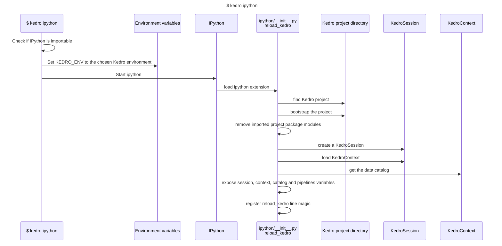

```mermaid
sequenceDiagram
    title $ kedro ipython

    participant cli as $ kedro ipython
    participant env as Environment variables
    participant ipython as IPython
    participant entrypoint as ipython/__init__.py <br> reload_kedro
    participant project as Kedro project directory
    participant session as KedroSession
    participant context as KedroContext

    cli->>cli: Check if IPython is importable
    cli->>env: Set KEDRO_ENV to the chosen Kedro environment
    cli->>ipython: Start ipython
    ipython->>entrypoint: load ipython extension
    entrypoint->>project: find Kedro project
    entrypoint->>project: bootstrap the project
    entrypoint->>entrypoint: remove imported project package modules
    entrypoint->>session: create a KedroSession
    entrypoint->>session: load KedroContext
    entrypoint->>context: get the data catalog
    entrypoint->>entrypoint: expose session, context, catalog and pipelines variables
    entrypoint->>entrypoint: register reload_kedro line magic
```
